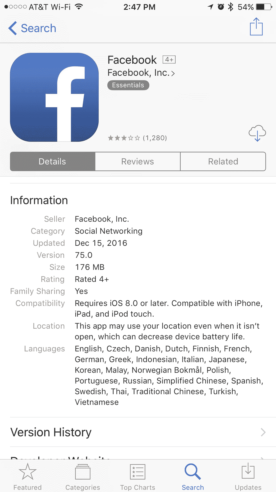
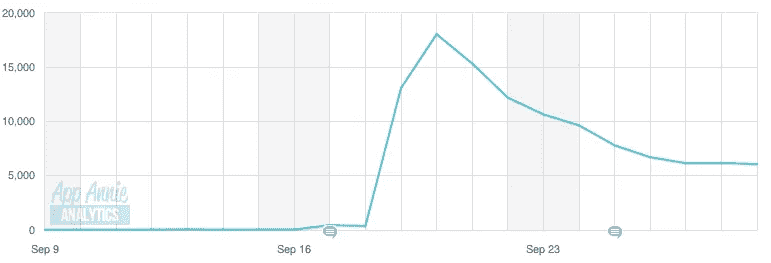
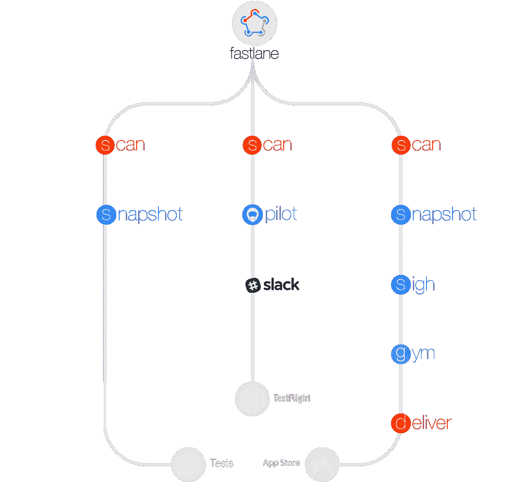
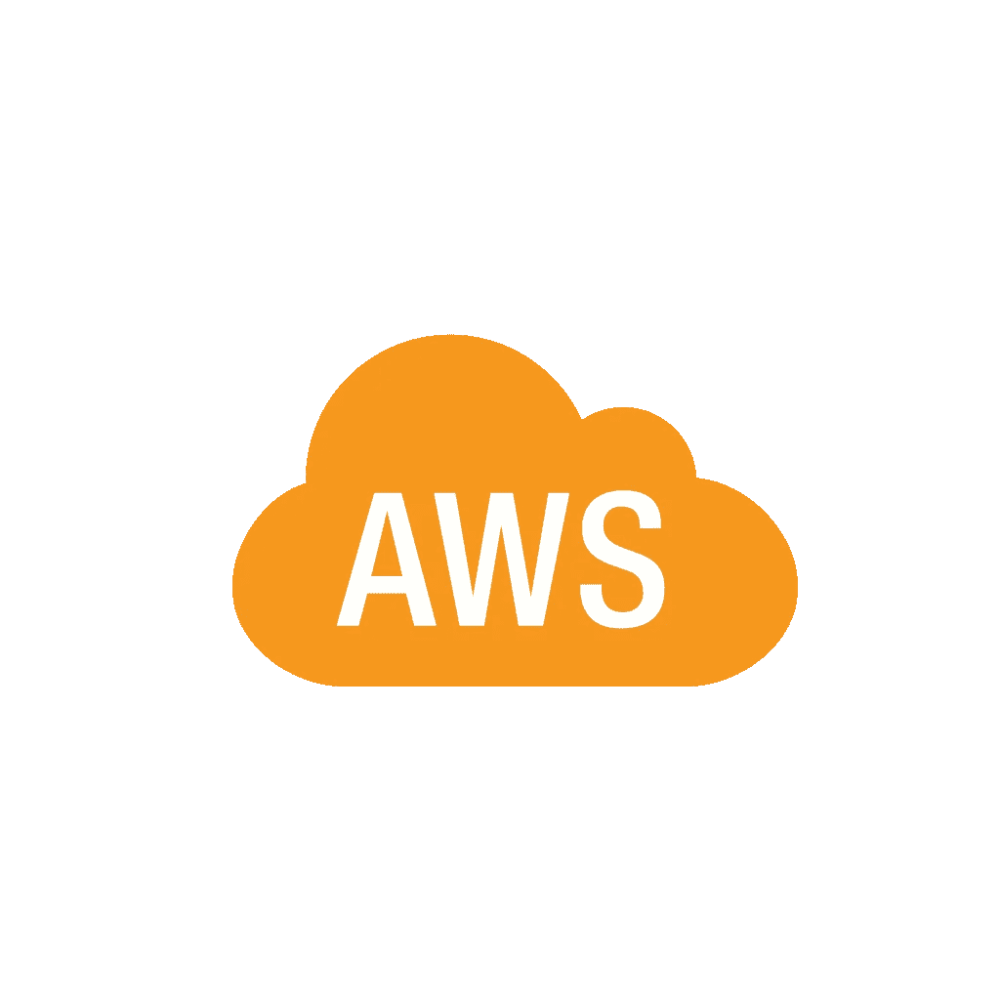

# iOS 和 Android 持续交付

> 原文：<https://medium.com/hackernoon/ios-android-continuous-delivery-da1366f7e6e5>

## 以前所未有的速度发布应用

随着我们进入 2017 年，谷歌 Play 商店将有超过 260 万个应用程序，iTunes 应用程序商店将有大约 200 万个。您的客户需要配备尖端功能并快速运行的应用程序。你的竞争对手如脸书和优步几乎每周都会发布更新

Facebook is on Version 75 as this post was published. Are you still shipping on 1.5?

移动产品需要一个持续交付(CD)管道，这样你的开发团队就可以专注于构建功能，而不用花太多时间去考虑如何更快地发布。

持续交付并不是一个新概念。CD 被 web 应用程序采用已经有很长时间了。2013 年，马丁·福勒发表了他开创性的 CD 帖子。

CD 要求您的团队停止手动构建源代码，并依靠完全自动化来将构建交付给 QA、beta 测试人员以及最终的应用商店。

**移动领域的持续交付挑战**

在应用程序部署方面，移动是一个完全不同的领域。网络应用不需要审批流程，你甚至可以向小批客户推出新功能，这样你就可以在你的整个用户群得到它之前测试一个功能是否有效。在 XCode 和 Android Studio 中，这种程度的实验和复杂性几乎不可能在具有开箱即用功能的移动设备上实现，但如果您希望您的业务完全敏捷地运行，这是绝对必要的。请记住，客户会受到“每周应用疲劳症”的困扰。一周前你还很热，一周后你就被下一个最好的东西取代了。你需要快速迭代功能、设计、用户体验和反馈，以跟上不断变化的消费者行为。

移动应用需要开发、测试、编译、打包、签名，然后手动提交到应用商店，这要求你在上线前填写表格。如果你的应用从开发到上线的周期时间超过 10 分钟，那你的速度就不够快。客户不会坐等新功能的出现。如果你没有吸引力，一般用户会在一天后从主屏幕上删除一个应用。

**浪子**

幸运的是，开源社区打造了一个名为浪子的工具，它可以帮助你自动化许多部署和配置任务，这些任务是以持续的方式发布一个应用所必需的。浪子允许您获取开发人员档案，签署应用程序，并链接到您的测试套件，这样您就可以在开发人员检入新代码的任何时候运行自动化测试。浪子需要专用的服务器、设置和配置，但这一投资对于提高开发人员的工作效率是非常值得的。

Tappforce 能够以光速为客户提供应用程序，因为我们已经建立了 fastlane CD 管道。我们能够专注于前沿功能和运行 A/B 测试，因此我们可以专注于用户体验，而不必担心部署。

[**你的云或者容器中的浪子**](https://www.tappforce.com/contact)

设置浪子、詹金斯和专用服务器是一个繁琐的过程。如果您的团队很小，或者现在没有时间投资连续交付，我们已经构建了一个运行在 AWS 或 Docker 上的全功能堆栈，因此您只需按一下按钮就可以开始使用浪子，无需手动设置。 [**报名访问**](https://www.tappforce.com/contact) **。**

> [黑客中午](http://bit.ly/Hackernoon)是黑客如何开始他们的下午。我们是阿妹家庭的一员。我们现在[接受投稿](http://bit.ly/hackernoonsubmission)并乐意[讨论广告&赞助](mailto:partners@amipublications.com)机会。
> 
> 如果你喜欢这个故事，我们推荐你阅读我们的[最新科技故事](http://bit.ly/hackernoonlatestt)和[趋势科技故事](https://hackernoon.com/trending)。直到下一次，不要把世界的现实想当然！

