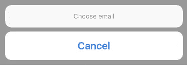
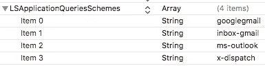
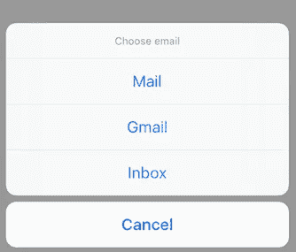

# EmailPresenter.swift

> 原文：<https://medium.com/hackernoon/ios-email-picker-99045d940a3d>

## 指向您已安装的电子邮件客户端的深层链接

我们需要在应用程序的多个地方向用户显示帮助选项列表。蒙佐和[斯莱克](https://hackernoon.com/tagged/slack)在过去已经很好地处理了这个问题，他们制作了一份已安装电子邮件客户端的行动表。

在这里，我们将创建一个类似的行动表，它将显示用户安装在手机上的电子邮件客户端，并让他们能够从我们的应用程序打开它们。

为此，我们需要做一些事情，我将一步一步地向您介绍我所采取的步骤。

在这里找到代码[和一个简单的示例项目。](https://github.com/harryblam/EmailActionSheetPresenter)

# 创建 UI 组件

在 WeVat，我们试图通过使用协议将应用程序“组件化”。感谢 Matthijs holle mans**和 [**机器人娜塔莎**](https://www.natashatherobot.com/updated-protocol-oriented-mvvm-in-swift-2-0/) 就这个主题发表的见解深刻的文章。**

**这部分功能非常适合“演示者”类型的组件。我将向您展示我们是如何实现这一目标的:**

## **创建演示者协议:**

**在这里我们:**

****1)定义我们将用于行动表**的 UIAlertController**

**2)定义设置功能，该功能将配置动作表。这将在稍后从 viewDidLoad 调用**

## **设置行动表**

**在我们协议的扩展中，我们定义了动作表所需的设置。目前，我们将只设置静态元素，即标题和取消按钮。**

## **符合我们的视图控制器中的协议**

**所以现在我们已经成功地在一个 presenter 类中设置了动作表，准备从任何一个视图控制器中显示出来！**

**运行该应用程序，您应该会看到如下所示的操作表**

****

**Empty Action Sheet**

# **获取已安装的电子邮件客户端列表**

**要在 iOS 中打开设备上的另一个应用程序，您需要使用 [iOS URL schemes](https://developer.apple.com/library/content/documentation/iPhone/Conceptual/iPhoneOSProgrammingGuide/Inter-AppCommunication/Inter-AppCommunication.html#//apple_ref/doc/uid/TP40007072-CH6-SW1) 。为清晰起见，我将再次将其分解为以下步骤:**

## ***定位所需应用程序的 URL 方案***

**也许我的谷歌搜索技术没有达到标准，但这是这个过程中最耗时的部分。在搜索了互联网的深处之后，我偶然发现了这篇 [reddit 帖子](https://www.reddit.com/r/workflow/comments/3mux7h/ios_url_schemes/)，它列出了 iOS 应用程序的 URL 方案列表(谢谢[/用户/meefmaster](https://www.reddit.com/r/workflow/comments/3mux7h/ios_url_schemes/cwdg8nl/) ！).**

**到目前为止，我们已经决定包括以下电子邮件客户端:邮件、调度、Outlook、Gmail 和收件箱。**

## **识别用户安装了哪些应用程序**

**UIApplication 上有一个实例方法，它将测试安装的应用程序是否可以打开 URL。这非常符合我们的需求，所以我们可以用下面的代码来实现:**

# **创建打开这些应用的操作**

**现在，我们可以知道用户在他们的设备上安装了哪些电子邮件客户端，我们可以继续将它们连接到行动表行动中！**

****1)创建 UIAlertAction****

**我们现在可以创建一个安全的方法来创建 UIAlertActions 来打开用户已经安装的电子邮件应用程序**

**请注意只针对 iOS 10 及以上版本用户的警告:[https://useyourloaf.com/blog/openurl-deprecated-in-ios10/](https://useyourloaf.com/blog/openurl-deprecated-in-ios10/)**

**将我们的行动添加到我们的行动表中(如果存在)**

**现在尝试在你的设备上运行这个应用程序(iOS 模拟器不支持 openURL 方案)。嘣！它不起作用。我们需要先确定一件事。您可能会在控制台中看到以下消息:**

****-canOpenURL:URL 失败:“Google Gmail:///”——错误:“本 app 不允许查询方案 Google Gmail:///”****

**这是因为我们需要明确地告诉我们的应用程序，我们打算访问哪些其他应用程序。**

****2)将该方案添加到您的信息列表中****

**我们可以通过 Info.plist 文件来做到这一点。添加一个名为 LSApplicationQueriesSchemes 的新键作为数组。然后，您可以在阵列中输入您的应用程序。邮件应用不需要放在这里，大概是因为它是一个苹果应用。您的条目应该如下所示。**

****

**Info.plist**

**如果您仍然看到该消息，请确保您的设备上确实安装了该应用程序😉**

**快跑，瞧！您应该会看到动作表如下所示:**

****

**点击一个动作，它会打开相应的电子邮件应用程序。**

# **给它一些背景！**

**点击邮件选项，你会发现它会打开电子邮件客户端。在我们的用例中，这是在用户想要通过电子邮件发送我们的帮助地址时点击的，因此主题和收件人将总是相同的。如果你看过一些 iOS URL 方案，你可能已经注意到了，你可以通过链接在应用中传递查询参数。**

**我们希望在构建警报动作时传递这些信息，因此我对此进行了重构，每个电子邮件都有自己的功能。**

**我们需要做的最后一件事是在将主题行传递到 URL 之前对其进行 URL 编码。我们可以通过调用字符串上的`subjectString?.addingPercentEncoding(withAllowedCharacters:NSCharacterSet.urlQueryAllowed)`来实现这一点。**

# **最后最后一件事…**

**总有可能我们的某个用户没有安装上面列出的应用程序，或者只是通过网络浏览器访问他们的电子邮件。在这种情况下，我们可以简单地让他们选择在 Safari 中打开。**

**我们可以稍微重构我们的代码，通过将我们的警告动作填充到一个临时数组中，然后仅当该数组为空时才使用 Safari 填充我们的 ActionSheet。**

**重构我们的设置函数，如下所示:**

# **包裹**

**所以我们差不多完成了。现在，只要您想向用户添加电子邮件选项，就可以重用这个逻辑。只要符合你的新演示者协议！**

**如果你想在除了电子邮件之外的不同类型的应用中重用这种呈现逻辑，那么你只需要找到你需要的 URL 方案，然后重复这个过程。简单！**

**谢谢你读到这里。如果您对这方面有任何想法，或者认为可以改进，请发表评论！**