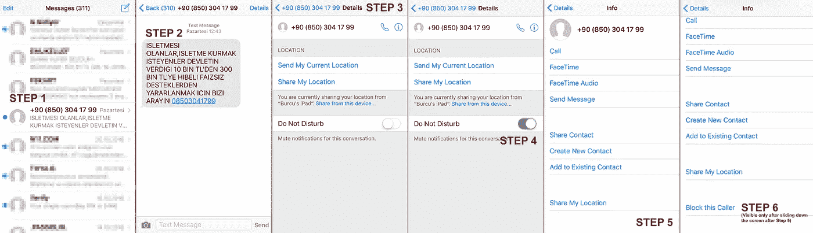
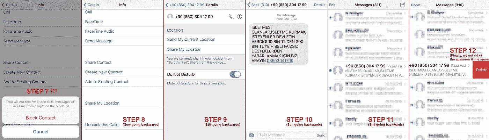
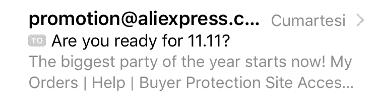
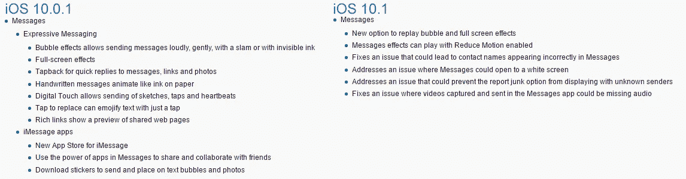
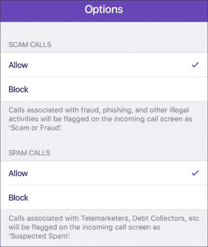

# iOS UX 缺陷:分手的借口

> 原文：<https://medium.com/hackernoon/ios-ux-defects-deleting-blocking-spam-messages-996b4e08b059>

## “无法忍受的删除和阻止垃圾邮件的痛苦”

我想我即将与苹果分手，我正在寻找证据——如果不是借口的话——来证明我的决定。我已经受够了苹果对我们开的精神玩笑，所以上周五我写了《*闪电阴谋》一文，严肃地指控[苹果](https://hackernoon.com/tagged/apple)真的应该回应。这种令人失望的经历就像当场抓住一个出轨的伴侣，而且肯定是一个爱情破坏者。*

**

*Love Breaker: Who Broke Apple? [[Photo Credit](http://sonnia.tistory.com/33)]*

*现在，每一个不完美——可能已经存在很久了——都开始让我烦恼。这里有一个:垃圾邮件挫败感*

> *“最终在 iOS 9.x 上删除并阻止不想要的短信的发送者需要——12—*(是的，12)*个步骤。这在 UX 土地上是无法忍受的。”*

****

*And we all thought geniuses working at “1 Infinite Loop. Cupertino, CA 95014, USA”*

# *10 大 OS 版本只为了得到泡泡效果？*

*我们现在被要求升级到 iOS 10.1，这么多年来，所有这些更新苹果[并不在乎解决这个](https://discussions.apple.com/thread/7694598?start=0&tstart=0)，事实上它们[恶化了这个过程](http://www.addictivetips.com/ios/how-to-block-a-number-from-messaging-you-in-ios-10/)。*

> *“如果我要屏蔽某个号码的垃圾邮件，我为什么还要添加它作为联系人呢？”*

*由于我拒绝升级到 iOS 10，我无法测试它现在需要多少步，(从下面的列表中我仍然估计有 12 步，大量的滚动和数据输入)。但是如果不愚蠢的话，只有在添加为联系人后才能阻止垃圾邮件发送者是坏的 UX。*

> *1.打开 Messages app，打开你要屏蔽的号码的消息线程【另类宇宙:向左滑动删除&屏蔽，一步魔术。]*
> 
> *2.将号码保存为联系人。如果该号码已经作为联系人存在，请继续下一步。如果您没有收到来自您想要阻止的号码的任何消息，请将其添加为新联系人。*
> 
> *3.打开设置应用程序并点击“信息”*
> 
> *4.向下滚动到“阻止”选项。*
> 
> *5.在屏蔽屏幕上，向下滚动到最底部，然后点击“添加新号码”[如果你有 500 个左右被屏蔽的号码，这需要很长时间的滚动。]*
> 
> *6.选择要阻止和保存的联系人*

*为什么苹果不用下面这个简单的邮件 app 方法，我不是很明白:*

**

*Blocking & deleting a text message should be as easy as sliding the message left or right*

*然而，在 Android 上几乎就像这样简单。*

## *最新消息应用程序更新:检查`‘`气泡效果`’`,如果你关心…*

**

# *坏主意:第三方垃圾邮件拦截应用*

*此外，据我们所知，随着最近 iOS 10 的发布，苹果公司允许使用第三方应用程序，如 Hiya，[联系你的联系人的能力&阻止不需要的来电者](http://www.macworld.com/article/3119736/ios/new-call-blocking-apps-in-ios-10-can-stop-spams-and-scams-before-they-reach-you.html)。因此，苹果将推出付费应用和/或服务，让你能够摆脱垃圾邮件。那是不能接受的。这应该是 iOS 中嵌入的一个主要功能，应该很容易完成。(*顺便说一句，目前还没有关于第三方消息删除/屏蔽应用的消息。*)*

****

# *帮助我们对抗手机垃圾邮件*

*我收到很多垃圾短信，尤其是来自——但不限于——非法博彩公司的。我不否认，至少在土耳其，移动运营商、监管机构以及全球的 [GSMA](http://www.gsma.com/managedservices/spam-management-prevention/mobile-spam/) 平台确实是未能打击手机垃圾邮件的主要原因:*

> *手机短信滥用问题是一个全球性的运营商间问题，需要整个行业采取全面的垃圾邮件缓解策略 GSMA 的参与也有助于垃圾邮件报告服务获得规模经济效益，并受益于[网络](https://hackernoon.com/tagged/network)效应，使其成为抵御垃圾短信的高效武器。— GSMA*

*但是苹果作为即将成为“我们生活中的终极用户界面”，本可以很容易地帮助 iOS 用户铺平这条崎岖的道路，至少在客户端是如此。*

*他们选择不这样做。也许，苹果爱我们是因为我们的钱(我们保持沉默是因为我们的长相)。既然他们认为自己已经吃得够多了，也许他们并不在乎。太可惜了。*

*卡洛斯·甘纳拉。-*

******

> *[黑客中午](http://bit.ly/Hackernoon)是黑客如何开始他们的下午。我们是 [@AMI](http://bit.ly/atAMIatAMI) 家庭的一员。我们现在[接受投稿](http://bit.ly/hackernoonsubmission)并乐意[讨论广告&赞助](mailto:partners@amipublications.com)机会。*
> 
> *如果你喜欢这个故事，我们推荐你阅读我们的[最新科技故事](http://bit.ly/hackernoonlatestt)和[趋势科技故事](https://hackernoon.com/trending)。直到下一次，不要把世界的现实想当然！*

**