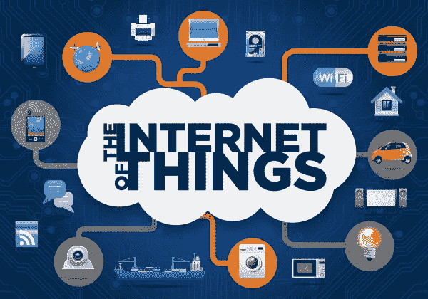

# 物联网和亚马逊的操作系统

> 原文：<https://medium.com/hackernoon/iot-and-amazons-operating-system-a44a6c6cfb1c>

我们听到很多关于**物联网和**它将如何成为下一件大事的说法。最近，[科技](https://hackernoon.com/tagged/technology)的领导者们把钱投在了作为设备通信未来的**物联网**上。亚马逊、英特尔、[谷歌](https://hackernoon.com/tagged/google)和苹果已经在**物联网**市场进行了巨额投资。

**物联网到底是什么？值得你花时间去看关于物联网的新闻吗？**

**物联网**或**物联网**简单来说就是设备*(也称为“连接设备”和“智能设备”*)、建筑和其他物品的互联网络，其中嵌入了电子设备、软件、传感器、执行器和网络连接，使这些物体能够收集和交换数据。

由于与云网络的连接，可以在世界上的任何地方访问这些相关的设备。物联网的一个经典例子是汽车网络相互通信，以帮助驾驶员做出决策。

****物联网*** *在未来的作用是巨大的，预计 2020 年将有 50 亿台联网设备。* ***物联网*** *在日常生活中的应用可以从自动贩卖的咖啡机到永不枯竭的水箱。**

*科技的进步的确增加了计算能力，而且可以放进口袋的覆盆子馅饼也成为可能。由于这些廉价而小巧的电脑，智能家居设备成为可能。*

*但华而不实、丑陋不堪的 **UI** 界面的要求让智能家电的发展举步维艰。为了解决这个问题**亚马逊**开发了一款名为**亚马逊** echo 的智能扬声器，它可以将你的声音转换成可以与你的家用电器通信的指令。*

**

*Amazon Echo Dot*

***亚马逊 Echo** 是购买最多的亚马逊产品，[**亚马逊 Alexa**](https://www.google.co.in/url?sa=t&rct=j&q=&esrc=s&source=web&cd=2&cad=rja&uact=8&ved=0ahUKEwjL18Po3cHTAhVIqo8KHRzVBjsQFghEMAE&url=http%3A%2F%2Falexa.amazon.com%2Fspa%2Findex.html&usg=AFQjCNF4E4R3u033SLqkpgJ15L6pZc3IRQ&sig2=nHa3kT1m8tQlEno0uFQXnA) 是该公司试图成为所谓物联网( **IoT** )的**操作系统(OS)** ，就像**谷歌 Android 和苹果 iOS** 对移动的影响一样。*

*亚马逊允许开发者为 [**Alexa**](https://www.google.co.in/url?sa=t&rct=j&q=&esrc=s&source=web&cd=1&cad=rja&uact=8&ved=0ahUKEwjL18Po3cHTAhVIqo8KHRzVBjsQFgg6MAA&url=https%3A%2F%2Fdeveloper.amazon.com%2Falexa&usg=AFQjCNFvxJty1YEvv2hYb19q_TGYEpwxUA&sig2=yKMssh3HBXP-R0vox31m8Q) 创建和发布技能。Alexa 技能是可以添加到 echo 设备的第三方功能。有**智能家居技能**可以控制你的智能家居设备，还有**自定义技能**比如使用 **UBER-API** 预约出租车。*

*亚马逊正在创建一个由亚马逊网络服务和 Alexa 技能集组成的开源生态系统，可以为未来数十亿台联网设备提供软件支持。随着超过 1100 万台 echo 设备的销售，Alexa 生态系统正在快速增长，远远领先于其竞争对手。你甚至可以用树莓派电脑和 Alexa 语音服务创建自己的 echo 设备。*

*[最好的兼容 alexa 的智能家居小工具是飞利浦 hue 白光 LED、墙壁智能照明中的 Lutron caseta 和 scout 家庭安全系统](https://www.cnet.com/topics/smart-home/best-smart-home-devices/best-alexa-compatible-smart-home-gadgets-of-2016/)。Alexa 还兼容智能家居解决方案，如我有机会工作的 [*AMIE*](http://amieconnect.com) 。*

*AMIE 是一个完全由语音控制的智能家居解决方案，价格适中。*

*无论亚马逊能否推动 Alexa 成为下一个 Android，物联网设备的潜力都不容忽视。*

******

> *[黑客中午](http://bit.ly/Hackernoon)是黑客如何开始他们的下午。我们是 [@AMI](http://bit.ly/atAMIatAMI) 家庭的一员。我们现在[接受投稿](http://bit.ly/hackernoonsubmission)，并乐意[讨论广告&赞助](mailto:partners@amipublications.com)机会。*
> 
> *如果你喜欢这个故事，我们推荐你阅读我们的[最新科技故事](http://bit.ly/hackernoonlatestt)和[趋势科技故事](https://hackernoon.com/trending)。直到下一次，不要把世界的现实想当然！*

**