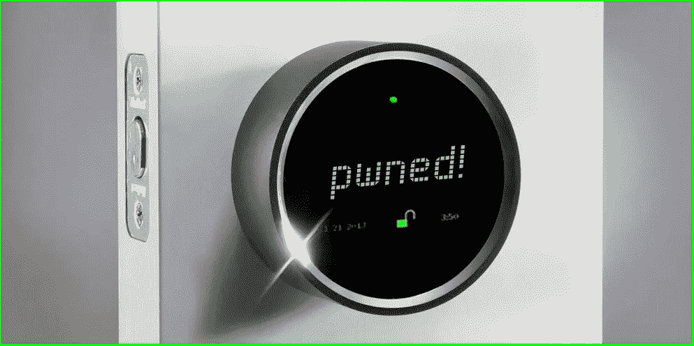

# 物联网黑客和漏洞

> 原文：<https://medium.com/hackernoon/iot-hacks-and-vulnerabilities-347dbe2ef98c>

我们都很幸运地生活在一个充满互联设备的世界，这当然很酷也很方便，因为无论你在哪里，都可以很容易地将远程事物放在你的指尖。这种技术复杂性的另一面是，任何连接到互联网的东西都有潜在的脆弱性。网络犯罪分子正忙于寻找攻破各种智能设备的方法，并且已经取得了相当大的成功。事实证明，物联网对于威胁行为者来说是唾手可得的果实。下面的黑客场景可能看起来像科幻小说，但它们在今天绝对是真实的。

## **你的咖啡机坏了？可能是一个危险信号**

不，不是因为你连接的咖啡机或者智能水壶的发热元件坏了。是因为有人远程黑了。当你打开它时，它会自动打开一个容易受到攻击的非加密热点。结果，攻击者可以获得您整个家庭无线网络的 SSID 和密码，其后果可能比咖啡机显示屏上的奇怪信息更糟糕。不幸的是，这些设备的制造商[不太关心如何保护它们免受黑客攻击。如果一个关键的基础设施实体通过这种平淡无奇的技术受到攻击，事情会变得更加可怕。](https://securityaffairs.co/wordpress/41857/hacking/coffee-machines-hacking.html)

为了避免这种类型的妥协，请不要在物联网设备上保留出厂设置。此外，在设置无线家庭网络时，请更改默认路由器密码。

## **父母控制系统也很脆弱**

迪士尼是一款受欢迎的父母控制和网络过滤产品，[有许多薄弱的](https://threatpost.com/popular-circle-with-disney-parental-control-system-riddled-with-23-vulnerabilities/128711/)链接，暴露出巨大的安全漏洞，并允许黑客入侵。通过攻击该设备，攻击者可以远程运行任意恶意代码、注入命令、修改网络流量、安装后门以及做更多邪恶的事情。易受攻击的设备可被用作影响家庭无线网络其他组件的入口点。

类似地，[通过损害亚马逊的智能个人助理 Alexa](https://www.infosecurity-magazine.com/news/alexa-hack-allows-continuous/) ，对手获得了足够的窃听特权。具体来说，他们可以记录对话，并窃取用户的亚马逊凭据。

为了避开这种巧妙的攻击，请不要使用默认的路由器密码，并对不同的连接设备使用不同的密码。

## **智能锁怎么样？**

当你不在的时候，能够为快递员打开门送包裹，这绝对是非常方便的。Amazon Key 是一款奇特的产品，可以让你远程操作，并用摄像机记录下你的访问。[根据安全研究人员](https://blog.malwarebytes.com/security-world/2017/10/please-dont-buy-this-smart-locks/)的说法，使用这些智能锁是一种滑坡，因为它们的安全实施很差，而且供应商根本没有推出固件更新。因此，新的攻击媒介的出现可能会成为拥有这些设备的人的一个严重问题。

## **手机语音助手也没安全多少**

一个代号为[海豚攻击](https://www.voicebot.ai/2017/09/06/siri-google-assistant-alexa-hacked-high-frequency-dolphin-attack/)的全新概念验证妥协矢量展示了绕过 iPhone 语音助手 Siri 以及谷歌 Android 和上述 Alexa 服务的对等物的安全性是多么容易。事实证明，以人类听不见的超声波频率产生的命令可以被语音助手用来执行各种任务，例如，打电话，访问某个网站或指示智能家居设备做一些淘气的事情。

## **你的工作电脑被锁定了**

这很可能是一个勒索软件场景，其中一个实施程序，如 [Bad Rabbit](https://blog.malwarebytes.com/cybercrime/2017/10/badrabbit-ransomware-strikes-eastern-europe/) ，已经渗透到您的计算机中，并破坏了它的主引导记录(MBR)。更糟糕的是，有毒的坏人会在几分钟内传遍整个企业网络。这就是 2017 年 10 月下旬发生在东欧众多政府机构、新闻媒体甚至一个机场的事情。传染的切入点是一个流氓闪存更新。接下来你知道的是，电脑屏幕被一封勒索信锁定，信中要求用比特币找回电脑。

## **你最喜欢的新闻网站关闭了**

虽然这可能意味着定期维护中断，但也可能是僵尸网络在起作用。网络黑客扫描互联网，寻找保护不力的物联网设备，然后入侵并利用它们对热门网站实施大规模 DDoS 攻击。当大量连接的智能设备试图同时访问某个网站时，它无法处理带宽，就会宕机。罪犯的动机可以是任何事情，从政治到勒索。为了防止您的设备被以这种方式利用，请确保退出默认访问凭据，并应用可用的安全补丁。

## **在你的 iPhone 上使用优步可能会有危险**

据报道，苹果公司已经[授予优步访问 iPhone 屏幕的权限，即使该应用程序已经关闭。此权限范围可能会将敏感的用户数据暴露给中间人攻击。所以，如果你是 iPhone 用户，打电话给优步之前要三思。](https://www.independent.co.uk/life-style/gadgets-and-tech/apple-uber-unprecedented-access-iphones-cybersecurity-expert-will-strafach-a7987586.html)

## **约会服务充满了骗子**

当你在 Tinder 或其他聊天服务上聊天的人给你发来一条带有超链接的信息时，是时候开启你天生的偏执了。这很可能是一个网络钓鱼骗局，旨在杜平你访问一个流氓登录页面，并输入您的访问凭据。如果你最终按照威胁演员的指示，你的帐户将受到威胁。为了避免这种类型的欺诈，永远不要点击通过社交媒体和交友网站收到的消息中的链接，除非你确定对方是谁。

## **智能家居是一个脆弱的家，句号**

如果智能家居中至少有一个相连的组件遭到黑客攻击，那么不会有火箭科学家来破坏智能家居中的自动化系统。攻击者可以通过智能恒温器远程调高温度，改变灯光亮度，将音乐音量调到最大，以及做许多其他类似的你不会喜欢的事情。这方面的一个重要建议是建立一个没有单点故障的系统。

## **即使是下一个大事件——特斯拉汽车，也是可以破解的**

一组中国研究人员[在 2016 年进行了一次 PoC 黑客](https://www.theguardian.com/technology/2016/sep/20/tesla-model-s-chinese-hack-remote-control-brakes)，他们能够侵入特斯拉 Model S 的电子系统。虽然白帽黑客距离智能汽车 12 英里，但他们可以通过无线方式干预它的刹车、仪表盘电脑屏幕、门锁和其他系统。想象一下现实世界中的网络车通过类似的技术能对这种高端汽车做些什么。

不管你以前是否听说过“物联网”这个术语，你的智能设备让你成为这个互联世界的一部分。尽管物联网拥有诸多优势，但它也充满了危险。为了提高攻击者的门槛，请为您的设备使用强密码，并在发布后应用固件安全补丁。