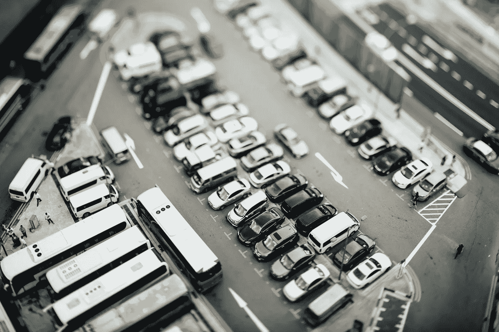
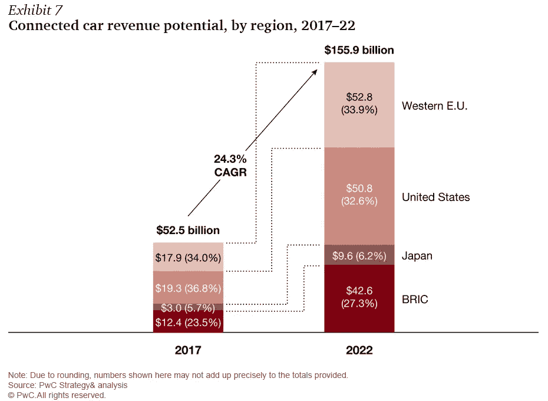
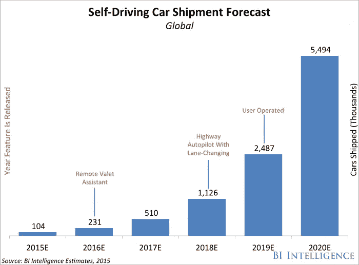

# 快车道上的物联网:联网汽车改变我们的购买、销售和驾驶方式

> 原文：<https://medium.com/hackernoon/iot-in-the-fast-lane-connected-cars-changing-the-way-we-buy-sell-and-drive-5fe4c5124fa2>

你认为现在的孩子会在 10 到 15 年后学习驾驶吗？或者，联网汽车和自动驾驶技术会不会把这种曾经标准的成人仪式变成一种过去的仪式？

物联网(IoT)的爆炸，加上联网汽车技术的重大进步，将驾驶世界带到了一个全新的水平，汽车行业正在与技术创新者合作，竞相将最新功能推向市场。这一驱动力是由重大的收入机会推动的，据普华永道称，这一机会将在短短五年内从 2017 年的 525 亿美元飙升至 1559 亿美元。

令人难以置信的是，许多曾经被归入未来电影的功能现在已经出现在商用车辆上，例如后置摄像头、显示汽车速度的挡风玻璃平视显示器、GPS 导航方向等，以及能够在没有任何人工干预的情况下改变车道和执行其他复杂驾驶任务的驾驶员辅助系统。我们生活在一个非常令人兴奋的交通时代，因为我们的车辆与它们的前辈越来越不相似。

特斯拉的自动驾驶功能是市场上最先进的驾驶辅助系统之一。消费者的观点大相径庭，既有对完全自动驾驶汽车未来的兴奋预期，也有对信任计算机导航道路的想法感到恐惧，而坐在后座上专注于完全不同的事情，如工作、看电影，甚至是补觉。

几乎所有汽车行业的专家都预测未来 5 到 15 年将发生彻底的变化，技术研究公司 Gartner 预测，到 2020 年，道路上的联网汽车市场将达到 2.5 亿辆。事实是，这种增长很大一部分将是新的数据服务和新产品，而不是汽车本身的实际金属和橡胶的变化。物联网是这场技术革命的一个关键方面，预计联网汽车数据将产生大量新的商业模式。事实上，咨询公司麦肯锡估计，到 2030 年，联网汽车数据的价值将达到惊人的每年 1.5 万亿美元。

汽车行业的这些新技术影响着购买、销售和驾驶汽车的方方面面，从轰鸣和 Beepi 等在线二手车公司的出现，到 Carvana 等其他创新者的推出，以及全自动投币式汽车自动售货机。最近按需交通工具的爆炸式增长如何，比如优步和 Lyft？这些进步已经对消费者看待汽车的方式产生了深远的影响，他们将注意力从拥有汽车转移到便利和先进的技术功能上。

据我们所知，未来五年汽车工业将会发生根本性的转变。虽然没有人能绝对肯定地预测每个细节，但不可能否认即将发生的巨大变化。

我想这是系好安全带享受旅程的最佳时机。

*由* [*DataArt*](https://www.dataart.com/industry/iot-and-m2m-solutions?utm_source=medium&utm_medium=social&utm_campaign=i-spring-2018) *物联网负责人伊洛宁撰写。*