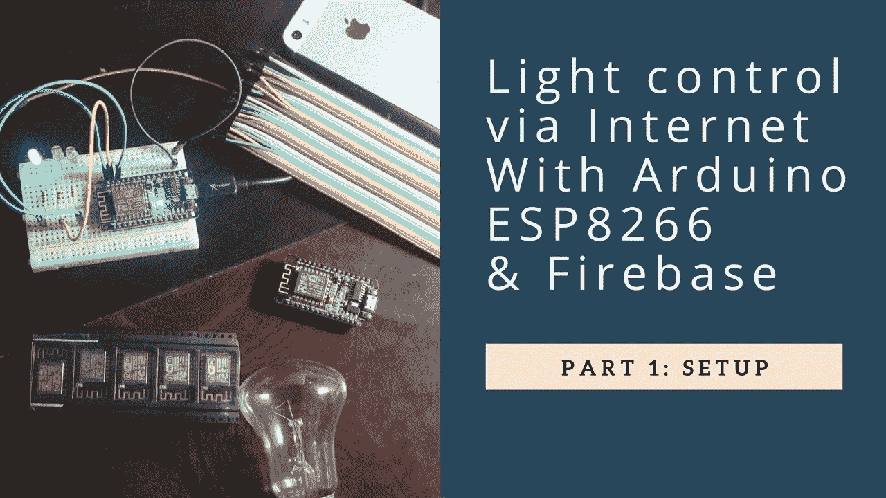

# IOT:使用 ESP8266 和 Arduino 实现互联网照明控制

> 原文：<https://medium.com/hackernoon/iot-internet-lighting-control-use-esp8266-arduino-45a722473227>

# 第 1 部分:设置

# 第 2 部分:将 ESP 连接到 wifi 和 Firebase

# 第 3 部分:创建 IOS 应用程序

# 第 4 部分:IOS 和 Firebase 中的用户认证

# 第 5 部分:添加按钮手动开关灯

谢谢你看了我的故事。祝您愉快！

github:[https://github.com/tabvn/arduino-lighting-control](https://github.com/tabvn/arduino-lighting-control)