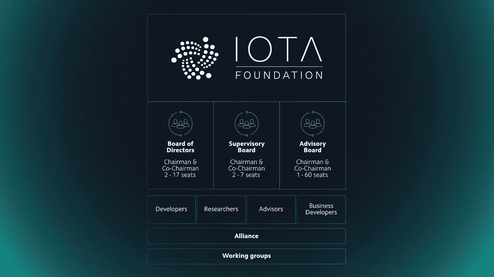

# IOTA 基金会关注亚洲和欧洲

> 原文：<https://medium.com/hackernoon/iota-foundation-is-focusing-on-asia-and-europe-8434d8fdd6dc>

(本文表达的每一个观点都是我自己的)

# 介绍

IOTA 基金会是一家**在德国注册的非营利性实体**。他们是一个由经验丰富的**开发人员、研究人员、顾问和业务开发人员**组成的团队，他们早在 2011 年就已经进入了加密领域。IOTA 基金会中最著名的名字是首席开发者 **Sergey Ivancheglo** ，这位天才的白俄罗斯开发者在 2014 年发明了**利害关系的充分证明**。

IOTA 基金会在**有向无环图** (DAG) **分布式账本技术** (DLT)方面有绝对的先发优势。依我拙见，DAG 将使区块链过时，并在不久的将来成为 DLT 的不二之选。

# 欧洲

欧盟可以说是地球上最进步和科技友好的地区。许多国家都在积极开发监管框架，以支持加密货币和 DLT，德国是先锋力量之一。因此，在美洲和亚洲监管不确定的情况下，欧盟是 IOTA 开发和实施 DLT 的完美栖息地。

在最近的一次行动中，白俄罗斯总统亚历山大·卢卡申科签署了一项法令，将加密货币、初始硬币发行(ico)和智能合约合法化。所有加密交易和相关收入，包括采矿收入，在未来五年内都将免税。

白俄罗斯是谢尔盖·伊万格洛的祖国，他已经在 IOTA 的 Slack 频道上证实，他将“告诉他们使用 IOTA”。这是众多例子中的一个，展示了 IOTA 如何在欧洲取得**实际采用进展**，这要归功于该地区**对加密友好的氛围**。

# 亚洲

当前金融市场动荡的核心是转型中的全球经济——一个失衡的世界正在寻找新的平衡。日本之后的亚洲，凭借其庞大的规模、年轻的人口和金融资源，对全球经济的新平衡至关重要。

[总体而言，预计 2017 年亚洲新兴市场(东南亚、中国和印度)的增长将保持强劲。](https://www.oecd.org/dev/SAEO2018_Preliminary_version.pdf) [从中期来看(2018 年至 2022 年)，该地区的增长预计将保持强劲。](https://www.statista.com/statistics/369274/gdp-growth-forecast-asia-vs-major-economies/)尽管中国的增长率正在放缓，但预计印度的增长将保持强劲。东南亚将保持增长势头，2018 年至 2022 年平均每年增长 5.2%，这得益于强劲的国内私人支出和计划中的基础设施项目的实施。

尽管亚洲有巨大的增长潜力，但它的**基础设施**仍然严重欠发达**。未来 5 年，价值数万亿美元的资金将被投入到亚洲的基础设施建设中，用物联网拥抱数字世界。任何能够利用这一巨大机遇并保持领先地位的 DLT 项目都将有机会垄断并得到该地区新建基础设施的支持。**

****

**专注于物联网的 IOTA 正在这样做。IOTA 基金会正在采取积极的步骤与亚洲政府/公司进行谈判，并雇佣具有国际经验的开发人员，尤其是懂亚洲语言的开发人员。IOTA 令牌目前在三大交易所上市(Bitfinex、币安、Coinone)，所有这些交易所的**总部都在亚洲**(香港和韩国)。**

**虽然美国仍然是 IOTA 不可避免的兴趣领域，但毫无疑问，IOTA 基金会目前的重点是欧洲和亚洲。**