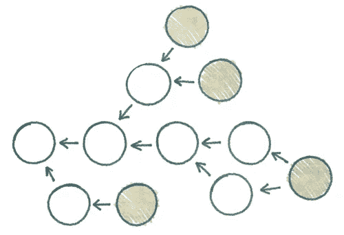
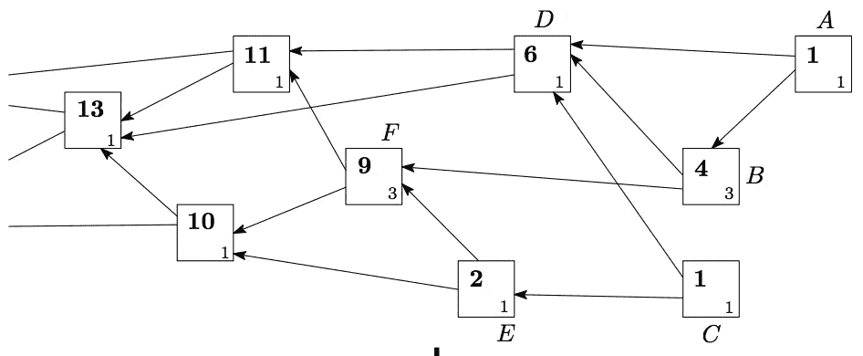
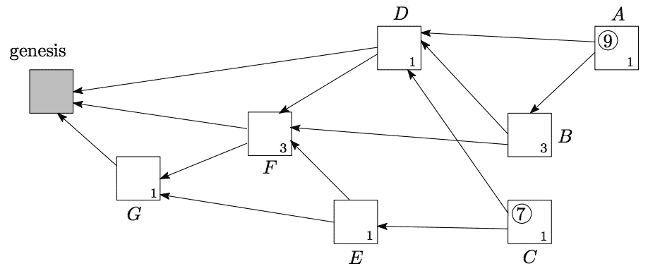
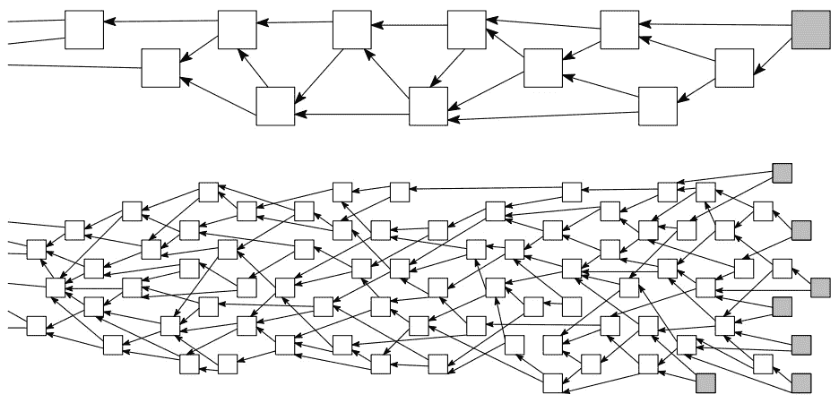
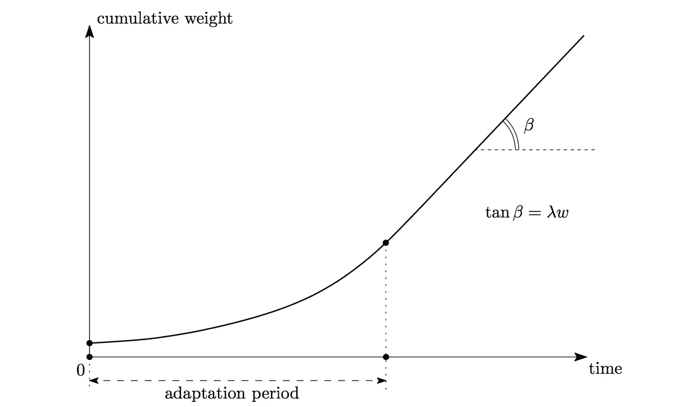

# IOTA Tangle:初学者白皮书的介绍性概述

> 原文：<https://medium.com/hackernoon/iota-tangle-introductory-overview-of-white-paper-for-beginners-df9b14882b64>

IOTA Tangle Graph from [http://www.tangleblog.com](http://www.tangleblog.com)

# 欢迎

你好，区块链者！今天的话题是[区块链](https://hackernoon.com/tagged/blockchain)的强化突变 IOTA 的纠结。

> 这篇文章是对拥有[第九大市值](https://coinmarketcap.com/)、[第一大市值](https://iota.org/)的密码的初级概述。所有的图表和内容都完全归功于 IOTA 的白皮书。

## 更新:

我和我的两个朋友(Alan Yip 和 Martin Shin)发表的主题为 *IOTA Tangle 和加密漏洞*的演讲已经在 Youtube 上准备好了: [IOTA Tangle 和加密漏洞](http://IOTA Tangle and Cryptographic Vulnerabilities)

# 为什么 IOTA？

由于 [**【物联网】**](http://internetofthingsagenda.techtarget.com/definition/Internet-of-Things-IoT) 的快速增长，对 [**微支付**](http://www.investopedia.com/terms/m/micropayment.asp) 的需求不可避免地提振起来。你可能还记得，比特币的设计目标是解决微支付的需求，但事实证明这是不可行的，原因有二:

1.  **高额费用**:随着支付金额的减少，相对费用率上升。
2.  **角色分离:**比特币需要两类用户:交易验证者(矿工)和交易发行者(普通用户)。角色之间缺乏同质性，冲突的可能性仍然很高，浪费了每个人解决冲突的资源。

而 IOTA Tangle 提出了一个更好的解决方案。

它用一个 [DAG(有向无环图)](https://en.wikipedia.org/wiki/Directed_acyclic_graph)代替了区块链，叫做 Tangle。图 1 显示了一个典型的 DAG。

Figure 1: Directed Acyclic Graph (from [http://ericsink.com/](http://ericsink.com/))

# 什么是纠结？

Tangle 由站点和节点组成:

*   **站点:**图表上表示的交易。
*   **节点:**交易的发卡行。

站点是纠结图的一部分，包含一个或一些相关的事务。节点是 IOTA 的用户，他们有资格发布事务。

> **关键规则:**新发布的交易有义务批准**两个**旧交易。是的，两个。

批准新交易的责任属于每个人，特别是交易发布者。它去除了矿工的特殊角色，给所有用户带来了平等。不再有矿工了！

# 交易之间的关系

交易 A 被交易 b 审批有两种方式，一种是交易 A 直接**被交易 b**审批

Figure 2: Direct Approval of Transaction

第二种方式允许一些交易(如 X，Y)介于两者之间，连接 A 和 B 的**间接**关系如下:

Figure 3: Indirect Approval of Transaction

# 谁开始纠结了？

**Genesis 事务**是 Tangle 中的第一个事务:

*   它由所有其他交易直接/间接批准。
*   它从“包含所有令牌的地址”向其他“创建者地址”发送令牌。

# 如何选择要审批的交易？

在早期，选择要批准的交易没有这样的规则。假设节点遵循一些参考规则，因为它们通常是属于相同区域的本地设备。

# 什么是小费？

**提示**是一个新发布的交易，没有得到任何审批。一种称为**尖端选择算法**的算法用于解决冲突。它运行多次，以检查两个冲突事务中的哪个事务更有可能被选定的 tip 批准。

# 纠结是异步的

Tangle 可以容忍异步弹出的冲突事务。它认为，随着 Tangle 的不断增长，任何不正确的事务都会被自动孤立或删除。

# 节点的传播激励

当一个节点表现出对传播事务的懒惰时，它将被它的邻居丢弃。这种激励使所有节点保持工作，尽管它们不会频繁地发出事务。

# 重要的术语

以下所有术语都被定义为交易的基本属性。姑且称之为*交易 A* 。

**权重(自身权重):***交易 A* 的权重与其发行方投入的努力成正比，可以假设为 3^n.

**累计权重:** *交易 A* 自身权重+后续所有直接/间接审核*交易 A* 的交易自身权重之和。(例如，在图 4 中，交易 D 的自身权重为 1，累积权重为 6 = D 的自身权重+ A 的自身权重+ B 的自身权重+ C 的自身权重= 1 + 1 + 3 + 1。)

Figure 4: Weights (from IOTA white paper). Own weights at right-bottom. Cumulative weights at left-top, as bold.

**得分:** *交易 A* 自身权重+*交易 A* 审核通过的历次交易自身权重之和。(例如，在图 5 中，交易 A 的得分为 9 = A 自身的权重+ B 自身的权重+ D 自身的权重+ F 自身的权重+ G 自身的权重= 1 + 3 + 1 + 3 + 1。)

Figure 5: Score (from IOTA white paper). Score at left-top, in the circle.

**高度:**到创世纪的最长定向路径的长度。

**深度:**到某些尖端的最长反向路径的长度。

比如图 5 中，D 的高度是 3 (D → F → G → genesis)，D 的深度是 2 (D ← B ← A)。

# 什么是割集？

让我们假设发出一个交易的平均时间是时间 h。

**割集**是一组在**时间 t** 和**时间 t +时间 H** 之间的时间跨度内存在的提示，定义如下:

*   从新事务到 genesis 的任何路径都必须经过割集。
*   规模越小，新交易获得批准的几率就越高。换句话说，新交易的竞争者更少。
*   它用作 DAG 修剪和其他控制 Tangle 增长的操作的检查点。

# **选择交易的策略**

1.  **随机:**不好，因为它不鼓励批准小费。
2.  **随机中间顶段(靠近尖端的段):**好。小费有更高的概率被选中和批准。

# 低负载和高负载

Tangle 的负载决定了它的效率，可行性，以及[安全性](https://hackernoon.com/tagged/security)。

**低负荷:**

*   小部分小费，通常是 1 或 2。
*   交易量的微弱流入。
*   **发生在:**网络延迟低，计算能力大。

**高负荷:**

*   大量的提示。取决于选择交易的策略。
*   交易的大量流入。
*   **发生在:**高网络延迟和低计算能力，迫使几个新的事务转向批准相同的提示。
*   缺点:有些交易可能需要等待很长时间才能被批准。

Figure 6: Low Load and High Load (from IOTA white paper).

# 高负荷问题

在高负载下，未批准的交易可能会被遗漏，并且不再有机会被批准。

*   **伟大的解决方案(** [**白皮书 v1.2**](https://www.docdroid.net/mWTNlgd/iota1-2.pdf) **):** 交易的拥有者可以重新附加或转播交易，知道在交易被批准之前不会发送令牌。通过重新附加/转播的任何重复副本将在以后被丢弃。[ [来源](https://www.reddit.com/r/Iota/comments/6ouvbb/frequently_asked_iota_questions/) 2.6]
*   **大解(** [**白皮书 v0.6**](https://iota.org/IOTA_Whitepaper.pdf) **):** 交易的拥有者参照错过的交易发布新的空交易，以帮助其获得批准。
*   **OK solution:** 随机挑选一些提示，批准最上面的提示，这样错过的交易可能很快就会被批准。

# 缠结生长得有多快？

可以在两种不同的负载环境中检查给定事务的累积权重的增长速度:

*   **低负荷:**匀速增长。
*   **高负荷:**在适应期内以递增的速度增长，过了适应期后恢复恒速。因为所有新的交易将被保证间接批准该交易。如图 7 所示。

Figure 7: Growth speed of cumulative weight for a transaction in high load environment (From IOTA white paper).

# 攻击和对策

敬请期待！这一部分将在下一篇文章中讨论。:)

# 结论

从白皮书中可以看出，IOTA Tangle 偏离了区块链，创造了自己的选择和批准交易的方式。不再有矿工，也不再有街区。作为 DAG 实现，节点可以计算许多有趣的统计数据，从而对其邻居和网络本身有更多的了解。

除了 IOTA 的优点和缺点，还有更多关于可能推翻美好前景的潜在威胁，以及可能将它从废墟中拯救出来的可能对策的讨论。尽管如此，IOTA 的发明仍然证明了它的价值。

要深入研究细节和数学，IOTA [白皮书](https://iota.org/IOTA_Whitepaper.pdf)在此提供帮助！

# 谢谢！！

感谢您的宝贵时间！如果你喜欢这个帖子，请留下一些掌声。；p

如果我做错了什么，请随时纠正我。留下你的评论吧~