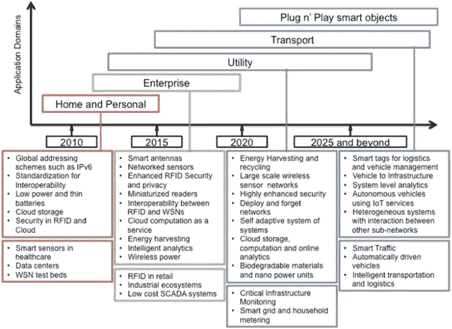
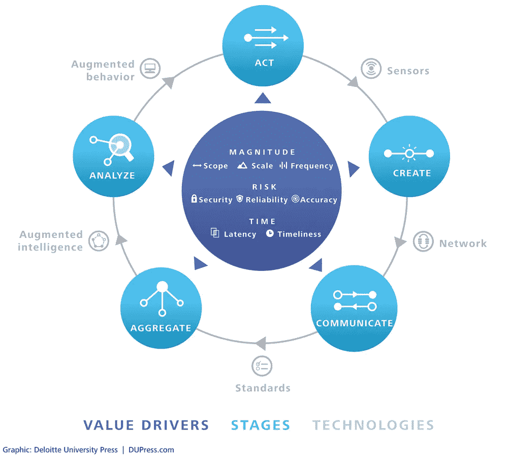
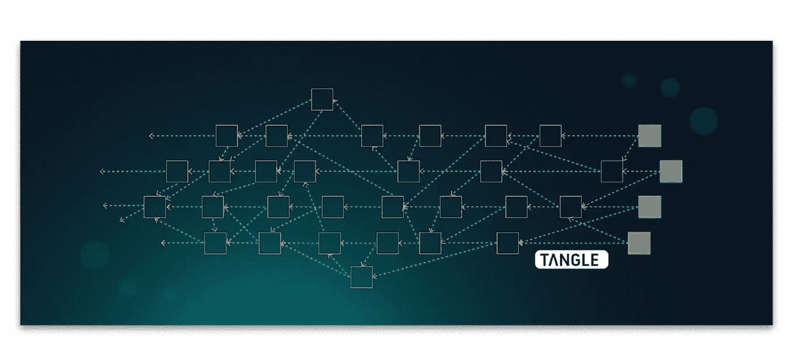
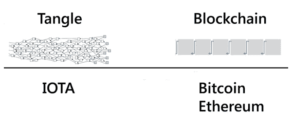
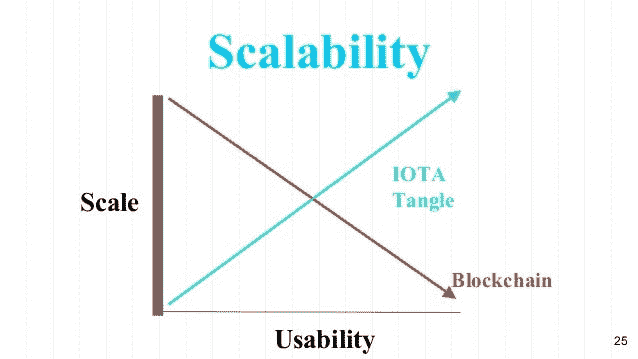
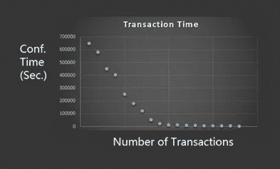

# IOTA &纠结:物联网的未来主干

> 原文：<https://medium.com/hackernoon/iota-the-tangle-the-future-backbone-of-the-iot-e7e417d5d86b>

在推动加密货币和区块链技术进步的所有革命性想法中，没有比 IOTA 项目更宏大的愿景了。

许多对未来的憧憬描绘了一幅世界图景，在那里一切都是相互联系的；一个数据存储和共享自动化成为日常生活一部分的世界。

这种未来主义的概念被称为物联网，虽然在推进其采用和使用能力方面取得了稳步进展，但它仍然面临许多挑战。

让我们回顾一下物联网的整体愿景、未来面临的挑战以及 IOTA 在未来将扮演的角色。

## 物联网愿景:

虽然有人可能会说，物联网在一定程度上已经通过 RFID 和机器对机器服务实现了，但大多数人不明白的是，这些部署充其量只是物联网的属性。

物联网，取决于你的观点，要么是无所不包的物联网的唯一元素，要么是一个替代模型；在这两种情况下，它都利用了类似的技术系统，但由于缺乏互操作性和对完全连接设备的支持而受到限制。

一个真正的物联网将要求即使是最小的设备也要有 IP:允许它们监视和控制现实世界的物体。此外，通过真正的互联互通，来自这些设备的服务和数据将更加开放地供应用程序使用。这种对标准 IP 和 Web 技术的利用将确保降低设备成本，并显著简化应用程序的开发和使用。

如下面的时间表所示，物联网的最终目标是拥有即插即用的智能物体，这些智能物体可以部署在任何环境中，具有可互操作的互联**主干**，允许它们与周围的其他智能物体**融合和交互，而不需要人为干预**。

下图显示了物联网关键研究发展的路线图，包括未来 10 年的技术驱动因素和关键应用成果。

*(来源:Elsevier B.V. A .，2013，* [***物联网(IoT):一个愿景、架构元素、未来方向***](https://dx.doi.org/10.1016/j.future.2013.01.010) *)*

## 物联网的挑战:

互联设备数量的指数级增长，以及实时物联网应用的预期增长，将极大地提高当今网络的性能。

为了在物联网用户中提供高质量的体验，大幅降低机器对机器交易中的端到端延迟势在必行。

除了当前的网络限制，物联网还面临着众多挑战，其中包括:参与式审查、隐私、数据分析和云计算。除此之外，无线网络问题还包括:架构、能效、安全性、协议等等。

因此，很容易看出，在物联网变得更加全面的道路上存在许多障碍。

多年来，来自世界各地的计算机工程师和程序员一直专注于推动物联网的发展，但缺乏安全、可互操作和方便的网络主干一直阻碍着它的发展。

直到现在。

## IOTA 介绍:物联网的未来**主干**

IOTA 是一种加密货币，但当然不是任何一种加密货币。

IOTA 的目标是将自己打造成物联网不可或缺的支柱。

它主要关注机器对机器的交易，并通过利用所谓的有向无环图而不是区块链，将自己与所有其他加密货币区分开来。

正是这一核心创新让 IOTA 实现了加密货币领域前所未有的三大里程碑:零成本交易、离线交易和无限可扩展性。

让我们回顾一下这些因素，因为它们将让我们真正考虑 IOTA 是否会成为将物联网带入生活的技术。

**交易费用:**

IOTA 是第一种不使用区块链的加密货币。它的主要创新是 Tangle，使用有向无环图来执行点对点数据共享和微交易，完全免费。

你可能会问，这是怎么做到的？

你看，在传统的区块链中，当矿工核实捆绑在一个区块内的交易时，工作证明就完成了。相比之下，Tangle 使用了不同的协议:其中每个事务形成一个全新的块，并在本质上验证自己。为了成功地完成 Tangle 上的一个事务，必须首先验证另外两个未决事务，允许发生一个极其简单的工作证明版本。

Tangle Visualization

Tangle vs Blockchain

**可扩展性:**

在传统的区块链中，随着越来越多的人在特定的区块链内执行交易，可伸缩性会受到阻碍。然而，由于每个事务都验证另外两个挂起的事务，可伸缩性随着采用而提高。换句话说，随着越来越多的用户在网络上进行交易，结算时间变得更快:允许一个真正的全球网络的崛起。

Tangle vs Blockchain Scalability

Tangle Transaction Time Scalability Chart

**线下交易:**

通过使用随后与主缠结交织在一起的子缠结，IOTA 用户有机会执行离线交易:这是一个迄今为止闻所未闻的特性。虽然许多人争论它的可用性，IOTA 的 tangle 的离线交易功能为许多行业的未来应用提供了很大的希望。

核心 IOTA 开发者 carsten strcker 告诉 Cointelegraph，“IOTA 是第一个实现了**可扩展性**的**无许可**分布式账本，使物联网的机器对机器支付成为可能。”

## 结论

总的来说，可以清楚地看到 IOTA 项目的确是一个雄心勃勃的项目。尽管它的使用案例对一些人来说似乎有些古怪，但这是意料之中的，因为许多人并没有真正理解物联网将如何将自己融入日常生活。我相信，IOTA 是一种加密货币，可以彻底改变分布式分类账网络的主流采用方式。虽然它的时间表似乎很遥远，但我们必须记住，联网设备的数量每年都在呈指数级增长，随着这种增长，一个强大的中央网络主干变得绝对必要。

我希望您喜欢阅读这篇文章，它让您对 IOTA 项目的愿景和计划有了更深入的了解。

如果你从这篇文章中获得了任何价值，请随意分享，这样其他人也可以阅读它！

在所有社交媒体平台上关注@ TheCoinEconomy，了解加密货币市场和区块链科技发展的最新动态。( [TradingView](https://www.tradingview.com/u/thecoineconomy/) ， [Twitter](https://twitter.com/thecoineconomy) ， [Instagram](https://www.instagram.com/thecoineconomy/) ，[脸书](https://www.facebook.com/Thecoineconomy-353316841786257/)， [StockTwits](https://stocktwits.com/TheCoinEconomy) 。)

(**免责声明**:虽然这篇文章并不鼓励购买 IOTA 代币，但我要说的是，我自己确实拥有一些代币，而且我已经将它们加入了我的长期投资组合。我这样做是因为我相信 IOTA 会有一个光明的未来，我当然想成为其中的一员。)