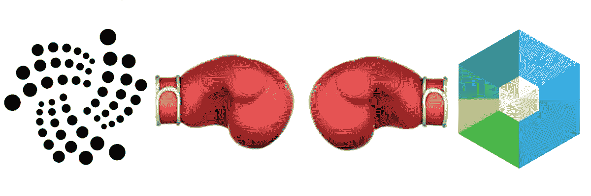
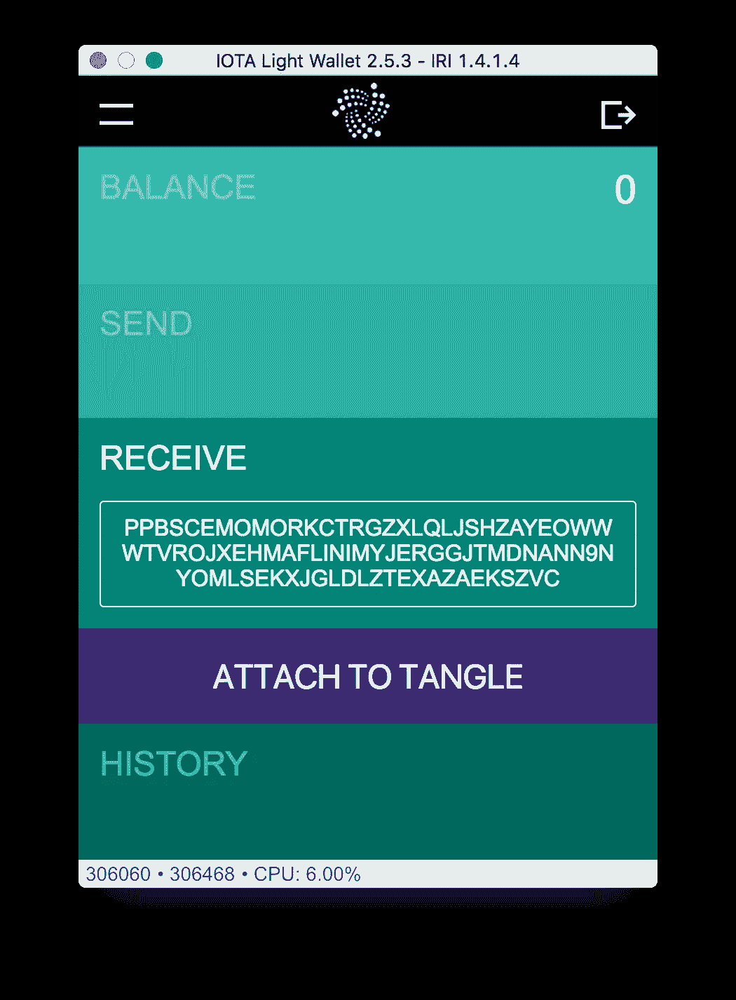
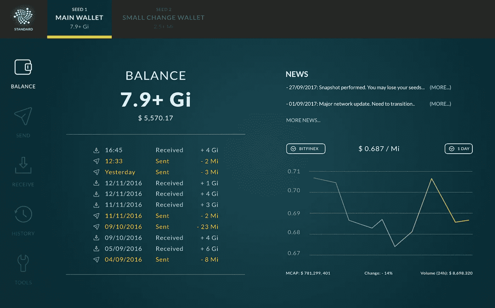
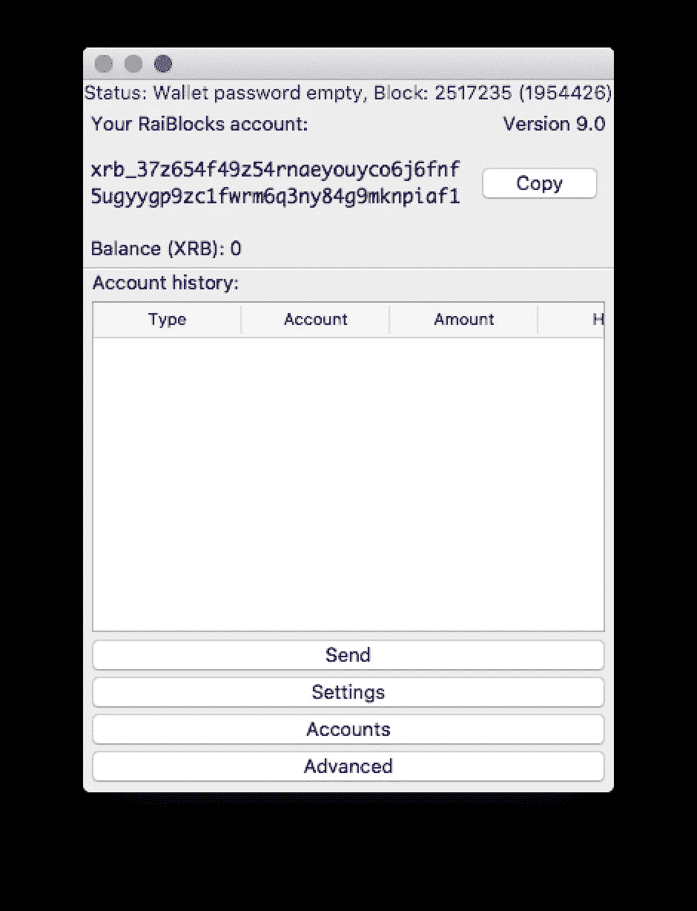
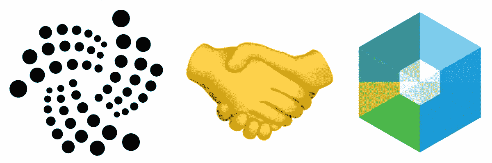

# IOTA vs NANO (RaiBlocks)

> 原文：<https://medium.com/hackernoon/iota-vs-raiblocks-413679bb4c3e>

*2018 年 2 月 2 日更新:本文写于* [*RaiBlocks 更名为纳米*](https://hackernoon.com/nano-rebrand-announcement-9101528a7b76) *之前。我离开 RaiBlocks 事件的历史目的。无论你在哪里看到 RaiBlocks，你都可以用* [*NANO*](https://nano.org/) *来代替。*

新一代加密货币越来越受欢迎；即快速、无感觉、无矿物的加密货币(从现在开始，我将使用 FFM 来表示快速、无感觉、无矿物)。目前，只有几个名字，而 [IOTA](https://iota.org/) 和 [RaiBlocks](https://raiblocks.net/) 是目前最突出的两个。他们在实现 FFM 的方式上有很大的不同。这意味着它们在性能、复杂性和健壮性方面有不同的特征。我将在接下来的部分中讨论这些。

总的来说，我认为这些发明非常棒，我们需要在 FFM 密码领域进行更多的竞争和研究。一些竞争者和模仿者已经开始出现，例如 [Radix](https://www.radix.global/) ，听起来很有趣，但仍在开发中。很难说是否会有“一个人统治所有人”，因为这些不同的密码执行不同，并专注于不同的用例。

# 采矿的问题是

随着人们对其将如何影响[能源需求](http://www.newsweek.com/bitcoin-mining-track-consume-worlds-energy-2020-744036)和[全球变暖](http://www.independent.co.uk/life-style/gadgets-and-tech/news/bitcoin-environment-green-energy-power-global-warming-climate-change-a8094661.html)进行计算，采矿业最近受到了很多抨击。下面是安德烈亚斯·m·安东诺普洛斯在 YouTube 上的一个有趣的反驳。他提出了许多好的观点，但他没有完全说服我。

当存在花费难以置信的能量来发送交易(尤其是微交易)的动机时，你就有了一个[低效、不可持续的系统](https://digiconomist.net/bitcoin-energy-consumption)并且很难修复。(如今比特币的交易费用约为 30 美元。)已经存在的矿工不希望他们昂贵的蚂蚁矿工、GPU 和 CPU 被浪费掉。因此，这些投资者将会反对部署以太坊的股权证明模型。话虽如此，我确实认为他们的利害关系证明是朝着正确方向迈出的一步。让这些矿商转型将非常具有挑战性，会扼杀他们原有的商业模式和投资。

有“第二层”方法来对抗这种低效率，如比特币的[闪电网络](https://lightning.network/)和以太坊的[雷电网络](https://raiden.network/)。甚至 IOTA 也有自己的第二层，叫做 [Flash Channels](https://blog.iota.org/instant-feeless-flash-channels-88572d9a4385) ，因为快还不够快。但是这些仍然存在一些问题。最简单的反驳是，你将需要有人来主持、维护和促进这第二层，这引入了费用。理论上，这一费用低于第 1 层的正常交易费用。但这仍然是一笔费用，这让我们又回到了签证王国。另一个问题是，它侵蚀了这些硬币的分散操作。当大型企业拥有自己的 Lightning/Raiden/Flash 频道时，就腐败、黑客和简单的管理不善而言，现在存在一个故障点。我认为这将需要很多努力，不仅要完全实现这些系统，还要使它们健壮、安全和可维护。

另一个问题是，采矿似乎正在导致散列权力的集中。出于某种原因，我们在这一领域没有看到人们所希望的那么多竞争。基本上，[中国生产了世界上绝大多数的比特币挖矿力量](/@homakov/stop-calling-bitcoin-decentralized-cb703d69dc27)，如果这些公司串通起来，最终可能会导致对比特币的双重攻击。我不想抨击中国，但他们也没有良好的记录，政府经常深入商业和个人事务，特别是在加密货币领域，威胁禁止 ICO 和加密交易所。

# 这些密码是如何工作的？

为了通过 IOTA 网络发送事务，您(客户端)必须对网络中的两个先前的事务执行最低限度的繁重计算。这些计算需要几秒到几分钟的时间，这取决于您的 GPU 的能力(IOTA 中的工作验证算法是 GPU 优化的)和您的运气。一旦您成功地执行了所需的工作证明，您的数据束就会通过 IOTA 网络进行广播，在那里等待未来事务的确认。这是一种先付后付的系统。一旦您的交易从其他人的交易中获得足够多的确认，您的交易将被视为完全确认。

理论上，网络上发生的交易越多，你的交易得到确认的速度就越快。在 IOTA 的早期，这只需要几分钟，如果。现在，存在拥塞问题，导致确认率和时间的延迟。这似乎是矛盾的，因为“[无限可伸缩性](https://iotasupport.com/whatisiota.shtml)”正在 IOTA 上推广。但是，在我看来，作为一名开发人员和节点操作人员，从节点代码本身来看，有很多优化可以加快这个过程。我在操作我的节点时经历了许多 CPU 峰值和内存泄漏(我已经在他们的 [GitHub 问题](https://github.com/iotaledger/iri/issues)中发布了其中一些)，但我相信这些只是技术问题，可以用几百个工程小时来修复。(*更新，2017 年 12 月 23 日，自从最近更新节点和钱包*以来，IOTA 网络和拥塞问题已经得到改善)

一个巨大的改进领域是将节点代码从 Java 移植到 Rust ( [performance stats](https://benchmarksgame.alioth.debian.org/u64q/rust.html) )或另一种高级、高性能、可移植的编程语言。Java 非常容易学习，作为一种高级的面向对象编程语言，它有许多好的特性。但是它必须通过 JVM(允许代码在地球上任何一台计算机上执行的虚拟机)来运行，这是以牺牲性能为代价的。

RaiBlocks 运行在一个他们称之为“block lattice”的加密架构上。他们提供了一个漂亮的[维基页面](https://github.com/clemahieu/raiblocks/wiki/Block-lattice)，在那里他们描述了这是如何工作的。要点是 RaiBlocks 不只是一个长区块链，像比特币或以太坊；这是一个区块链的数据库，每个用户(或地址)都有自己的区块链，只有他们可以添加。用户通过创建两个块来发送资金:一个发送块在他们的个人区块链上，另一个接收块在收款人的区块链上。用户通过将任何未完成的接收块“装入”他们的个人区块链来接收资金。用户不一定要在线才能收到资金(这是一个关于 RaiBlocks 新颖的“口袋”系统的常见问题)。每当用户决定访问他们的资金，钱包本身将自动“口袋”任何未支付的资金。将资金装入口袋实质上意味着用您的私钥签署接收块，以便可以将它添加到您的个人区块链中。

# 一致性算法

在 IOTA 中，事务被附加到“tangle”上，这是一种有向无环图( [DAG](https://en.wikipedia.org/wiki/Directed_acyclic_graph) )数据结构。( [Git](https://git-scm.com/) 使用相同的数据结构工作！)随着越来越多的事务被添加到混乱中，一个“权重”被添加到附加的祖先事务中。当交易具有足够的权重时，交易将呈现“已确认”状态。原则上，当网络上有足够的交易流时，这种确认可以快至几秒钟。

在 RaiBlocks 中，有一个基于“代表”的不同的[确认系统](https://github.com/clemahieu/raiblocks/wiki/Double-spending-and-confirmation)。一般来说，所需要的就是你在“发送”和“接收”块上的加密签名。当节点同步时，它运行分类帐以确保签名是可信的。

为了防止双重花费攻击，RaiBlocks 有一个“[代表系统](https://github.com/clemahieu/raiblocks/wiki/Representatives-and-decentralization)”。体制内的代表，基本上就是一个有很多钱的地址。该代表充当哪个双失效块通过并在系统中传播的仲裁器。在本文的后面，我将详细阐述潜在的攻击媒介。

# 运行完整节点的激励

关于这些 FFM 密码，一个常见的问题是:“谁将为运行完整的节点付费？”这是一个非常好的问题。在大多数其他加密技术中，如比特币和以太坊，矿工有动力运行完整的节点，因为他们可以通过这样做收取利润丰厚的采矿费。但是 IOTA 和 RaiBlocks 都没有矿工。

这个问题有很多答案，根据您运行的是 IOTA 节点、RaiBlocks 节点还是其他 cryptos，答案会略有不同。

对于那些不熟悉加密货币的人来说，节点基本上是一台计算机，可以促进全球网络的交易。互联网上的任何人都可以随时添加或删除节点，加密货币作为一个整体将继续发挥作用。密码往往需要最少数量的节点来防止网络攻击，但这是另一个话题。

## 让我们做一些计算，看看这些网络是否能够自我维持

每个交易所都需要托管自己的节点作为取款和存款点。假设每个交换机平均需要 5 个节点来实现负载平衡和升级。(根据交通情况，他们可能需要更多或更少的钱，但 5 英镑是一个不错的保守估计。)现在让我们来计算一下，一旦这些硬币变得流行起来，它们将会在全世界大约 100 个交易所出售。这还是一个保守的估计，因为世界上有数百个受欢迎的交易所，新的交易所不断涌现。一旦 IOTA 和 RaiBlocks 在交换行业中被广泛采用，我们将拥有 500 个节点。

也有运行节点的商业需求。大大小小的企业都在加入加密货币领域(我和我的公司 [P Rizz Ventures LLC](https://www.prizzventuresllc.com/) 也是如此)，我们需要托管节点来提供服务。让我们假设在线商店、市场和服务的数量是交易所的三倍。我认为这是相当保守的，因为网上商店的数量远远多于网上交易的数量。让我们假设他们每个人平均只需要三个节点，因为他们可能比一个非常受欢迎的交换有更少的流量。**这给了我们商业领域总共 900 个节点。**

未来我们还会有很多智能设备。[福布斯引用了一篇预测到 2025 年将有 750 亿台物联网设备的论文](https://www.forbes.com/sites/louiscolumbus/2016/11/27/roundup-of-internet-of-things-forecasts-and-market-estimates-2016/)。假设这些设备中只有 0.001%需要运行完整的节点才能实现高质量的服务。**网络上运行着 75 万个完整的节点。**

因此，结合所有这些行业，在任何给定的时间，肯定会有一个强大的节点基线。随着 IOTA 和 RaiBlocks 越来越受欢迎，我预计在未来几年，它们的节点数量将会逐渐增加。

# 适合开发人员

IOTA 提供了官方的 [Javascript](https://github.com/iotaledger/iota.lib.js) 、 [Python](https://github.com/iotaledger/iota.lib.py) 、 [C#](https://github.com/iotaledger/iota.lib.csharp) 、 [Java](https://github.com/iotaledger/iota.lib.java) 和 [Golang](https://github.com/iotaledger/iota.lib.go) 库，用于与网络协同工作。他们还提供了他们的工作证明库，他们称之为 curl，或现在的 [kerl](https://github.com/iotaledger/kerl) ，它作为一个 [C 库](https://github.com/iotaledger/ccurl)可用，并可在带有 WebGL2 的 web 浏览器中使用[。他们提供了他们的节点实现版本，称为 IOTA Reference Implementation，或 IRI，用 Java 语言编写，并计划将其移植到 C++、Rust 和 Golang(T21)上。在我看来，我对他们用 C++实现它犹豫不决，原因有很多，其中最主要的是](https://github.com/iotaledger/curl.lib.js)[更有可能出现错误和漏洞](https://www.viva64.com/en/a/0079/)。C++为高性能的应用程序和操作系统内核留有一席之地，但我认为这不是一个好的决定。我们可以辩论，但那是另一回事了。

API 对 RaiBlocks 的支持也非常好。他们有 RPC 库，用于与 [Javascript](https://github.com/SergiySW/RaiBlocksJS) 、 [Python](https://github.com/AuliaYF/easyraikit-python) 、 [PHP](https://github.com/mikerow/easyraikitphp) 和 [Elixir](https://github.com/willHol/rai_ex) 中的节点进行交互。我不太清楚这些是否是经过 RaiBlocks 组织审查的官方图书馆。(如果 RaiBlocks 团队有人能澄清一下，那就太好了！)无论哪种方式，它们都被认可并发布在它们的 [devtools 网站](https://raiblocks.net/page/resources.php#devtools)上。还有一个用于在 web 浏览器中执行工作证明的库，用 [WebAssembly](https://github.com/jaimehgb/RaiBlocksWebAssemblyPoW) 编写。他们还有另外一些与协议交互的工具和一个 Fedora 包。

总的来说，这两个项目都为开发人员提供了很好的支持，让他们可以开始构建这些密码，并将它们集成到自己的项目和业务中。

# 适用于 IOT

这两种密码都为物联网领域的微交易提供了很好的用例。如果我们想让我们的机器快速自主地与货币互动，我们肯定需要利用 FFM 密码。让我们从几个不同的角度来看这两者。

## 数据流

IOTA 中的事务允许附加大约 1 千字节的任意数据。1 千字节听起来不是很多，但它为 tangle 上的数据传输开辟了一个可能性的领域。(这就是我的基于 IOTA 的聊天室应用程序 [Chatangle](https://www.chatangle.com/) 的工作方式。) [IOTA 的数据市场](https://data.iota.org/)也将充分利用这种数据附件来促进设备和市场本身之间的数据传输。这是第 1 层的一个重要特性。

RaiBlocks 没有内置的第 1 层数据传输机制。我和 redditor 的同事就这个话题进行了一次有趣的对话，他提出了 T2 隐写术的想法，你可以在价值交易本身中编码数据，因为 RaiBlocks 每笔交易使用 128 位。原则上，您可以使用底部的 64 或 32 位来创建和提取小消息。除此之外，RaiBlocks 可以非常简单地实现第 2 层方法:如果一个人已经可以与其他物联网设备通信，他就可以将该通道用于数据层。因此，在我看来，这不是 RaiBlocks 的主要障碍。

## 外链交易

IOTA 有一个独一无二的特性，那就是可以离线创建事务，并在以后将它们附加到 tangle 上。物联网设备可能能够在离线时相互交互，然后在重新连接到网络时传播它们的事务。但这回避了这样一个问题，即在被整个网络实际确认之前，接收方是否会“相信”该交易，以及它是否不是双重花费。只要设备能够合理地相互信任，这就成了一个争论点。然而，这是一个理论上的反驳这些外链交易的好处。

使用 RaiBlocks，不可能进行链外交易。发送方必须在线并连接到网络以促进交易。同样，我不认为这是一个大问题，因为如果它有这个特性，仍然会有信任问题。除此之外，如今大多数智能设备和智能消费电子产品都可以接入互联网。

## 长期采用

我们将遇到的一个问题是，当加密货币有足够多的用户和客户时，我们必须开始问自己，有足够多的用户和客户吗？最重要的是，当我们处理物联网时，机器将相互发送小额货币，我们需要确保这些小额货币从长远来看不会变得过于昂贵。

IOTA 和 RaiBlocks 实际上都是“预先开采的”，这意味着它们的分类账一开始就有一定数量的加密货币，永远不会改变。随着时间的推移，这些令牌随着 ico 和水龙头被买卖和移动，增加了一般用户对这些密码的掌握程度。

[**IOTA 的最大供给量为 2779530283277761 IOTA**](https://iotasupport.com/whatisiota.shtml)**(或大致为 28000 万亿 IOTA)**。(作为比较，比特币将达到大约 2.1 万亿次的最大值[。)](https://en.bitcoin.it/wiki/Satoshi_(unit))

RaiBlocks 的最大供应量约为 2 ⁸ ~ 340e36，或 340 十亿分之一。这种高上限的原因是他们利用 128 位整数来表示余额。(后面我会论证为什么这是好事。) [**他们的实际最大供应量约为 133，248，290 MXRB**](https://coinmarketcap.com/currencies/raiblocks/) ，其中 1 [MXRB](https://github.com/clemahieu/raiblocks/wiki/Distribution,-Mining-and-Units#divider) 代表 10 个⁰(或 1 [非百万](https://en.wikipedia.org/wiki/Names_of_large_numbers))原始 RaiBlock 单位。**最大供应量大致可表示为 133e36，或 133** [**十一进制**](https://en.wikipedia.org/wiki/Names_of_large_numbers) **原始 RaiBlocks。他们的 wiki 也表示了一些基于 SI 系统的帮助单位来帮助使用这些高数字。**这里是原始单位的最大供应量，仅供参考:133248290000000000000000000000000000**。那是 39 位数！作为比较，这意味着**有大约 48 个** [**六进制**](https://en.wikipedia.org/wiki/Names_of_large_numbers) **原始 RaiBlocks，用于曾经可能存在的每一个 IOTA**。比例相当啊！**

让我们描绘一下[到 2025 年](https://www.forbes.com/sites/louiscolumbus/2016/11/27/roundup-of-internet-of-things-forecasts-and-market-estimates-2016/#66811ec1292d)物联网设备达到 750 亿台的场景。让我们忘记，为了简单起见，到 2025 年将有数十亿人拥有加密货币。因此，我们也假设这些物联网设备拥有所有的密码(天网！？).现在，我们来做几个计算。**在这些未来的 750 亿个设备之间共享的平均加密量将在 3.7 万 IOTA(或 37** [**基奥塔**](https://iotasupport.com/whatisiota.shtml) **)或 1.78** [**十亿个**](https://en.wikipedia.org/wiki/Names_of_large_numbers) **原始 RaiBlocks(或 1.78**[**kXRB**](https://github.com/clemahieu/raiblocks/wiki/Distribution,-Mining-and-Units#divider)**)的数量级。** **由此我们可以看出，RaiBlocks 在事务意义上要比 IOTA 灵活得多。这让我认为 RaiBlocks 在未来几年很可能主宰物联网领域，除非 IOTA 升级他们的协议，以增加最大供应量或允许可分割的 IOTA。**

# 可量测性

就可伸缩性而言，我们可以查看一些不同的指标。

## 交易速度

在 IOTA 中，随着越来越多的交易通过网络发送，理论上确认时间会减少。最近几周，我们已经看到一些问题导致人们的交易被延迟确认，有时需要几天时间。但正如我之前解释的，我认为这些是技术问题。一旦节点性能和垃圾邮件问题得到缓解，我们应该会看到一个反弹，以更好的确认率和时间。

在 RaiBlocks 中，您作为用户，通过签署您的事务来执行确认。这个过程只需要很少的时间。一般来说，您的交易在几秒钟内就能得到完全确认和处理。大部分时间花在执行工作证明上，这是减轻未经检查的垃圾邮件攻击所必需的。

## 分类帐大小

IOTA 有一种机制，可以在称为快照的过程中调整分类帐大小。到目前为止，我们已经有了许多由 IOTA 团队手动执行的快照。(我所经历的最大分类帐大小约为每月 5–10gb 的交易量)创建快照后，分类帐的大小会减少到现有的非零地址和这些地址的余额。从那以后，泰戈又像正常人一样工作了。目前，这个计划还存在一些问题。一个问题是，人们需要再次手动地将他们的地址“附加”到缠结上，以正确地查看他们钱包中的余额。(这可能会让许多人在打开钱包看到余额为零时心脏病发作)新的 [UCL 钱包](/iota-ucl/wallet-refresh-the-case-for-a-desktop-app-8aebaf19520a)将自动完成这一过程。我相信我们可以期待他们在这个月或下个月发布一个 alpha。另一个问题是，节点操作员必须手动进入他们的服务器，清除存储事务的旧数据库。我相信这只是一个技术问题，但会得到解决。有计划在[他们的路线图](https://blog.iota.org/iota-development-roadmap-74741f37ed01)上完全自动化这些快照。

在 RaiBlocks 中，当前完整的分类帐大小约为 3 GB。对于两年的交易来说还不错。诚然，RaiBlocks 还没有 IOTA 受欢迎，所以我们还没有看到它在极端负载下的表现。随着时间的推移，规模肯定会成为一个问题。有修剪数据库的计划，因为一致性所需要的是每个块格区块链的总平衡。这种修剪是[在他们的路线图](https://github.com/clemahieu/raiblocks/wiki/Roadmap)上。

# 分散

IOTA 一直被指责其协议没有完全去中心化。我倾向于同意这种观点，但我相信他们也在尽可能快地工作，在没有协调人的情况下实现完全的权力下放。(我将在下面的“攻击可能性”一节中详细说明协调器)我们仍在等待一份分析或一份何时实现的估计。我大胆猜测，协调员将在 2018 年的某个时候被免职。

另一个问题是对等。直到最近，节点运营商还不得不手动联系其他运营商，将彼此的 IP 地址和端口添加到他们的 IRI 配置中。但是，我很高兴地说，最近有了一个新的发展，叫做 [Nelson](/deviota/carriota-nelson-in-a-nutshell-1ee5317d8f19) ，它有效地解决了这个问题，并允许网络上的完全自动对等。现在，这是 IOTA 节点上的一个包装器，但是我希望他们最终在节点本身中实现一个完全烘焙的解决方案。

RaiBlocks 没有管理网络交易的中央机构，自 2015 年 9 月发布以来一直拥有自动对等功能。因此，我们可以认为它是分散的。我认为唯一有点问题的地方是他们的代表制度。这是一个潜在的攻击媒介，恶意实体可以借此购买价值数百万美元的 XRB，并执行投票攻击。这个场景在他们的[攻击维基](https://github.com/clemahieu/raiblocks/wiki/Attacks)上有概述。诚然，这是“低”风险，因为恶意方将不得不放弃大量资金来实施这种攻击，在撰写本文时，大约数亿美元或大约 50%的市值。

# 交易所(如何购买？)

IOTA 可以在许多主要的交易所使用，包括 [Bitfinex](https://www.bitfinex.com/) 和[币安](https://www.binance.com/)，并且[计划在不久的将来加入更多的交易所](https://twitter.com/DavidSonstebo/status/938087727509188608)。你可以在这里找到他们最活跃的市场。

相比之下，RaiBlocks 还没有在任何主要交易所上市。与 IOTA 的约 5 亿美元相比，它的交易额约为 500 万至 1000 万美元。他们的主要交易所 [BitGrail](https://bitgrail.com/) 和 [Mercatox](https://mercatox.com/) 最近遭遇了性能问题，原因是流量增加，以及[DOS 攻击的传言](https://www.reddit.com/r/RaiBlocks/comments/7jq9d1/people_invested_in_coins_above_xrb_have_incentive/)。不幸的是，鉴于这些不稳定的交易和供应的缺乏，目前很难获得 RaiBlocks。你可以在这里跟踪他们的交流。

2018 年 2 月 23 日更新:NANO，原名 RaiBlocks，现已在币安和 Kucoin 等许多受欢迎且更可靠的交易所上市。 [*我不得不建议不要使用 BitGrail，因为他们最近卷入了一场黑客攻击，现在已经资不抵债。*](/@nanocurrency/bitgrail-insolvency-update-2-11-18-9349c9fe1281)

# 路线图

IOTA 和 RaiBlocks 目前都在大力开发中。目前， [IOTA 团队](https://iotasupport.com/foundation.shtml)的规模比 RaiBlocks 团队大，大约有 30 名开发人员，而 RaiBlocks 团队只有 5 名开发人员。IOTA 还培养了大量的企业合作伙伴，帮助他们发展生态系统，包括大众和博世。

至于公布的路线图，这是 IOTA 的博客文章，这是 wiki 页面，这是 RaiBlocks 的信息图表。

**这两种令牌都有很好的路线图，但 IOTA 的更有趣，因为它们试图在 IOTA 的基础上实现私人交易、智能合同、数据市场等等！**

RaiBlocks 的口头禅是“做一件事，并把它做好。”因为他们专注于制造最好的 FFM 令牌，所以他们很难将这个令牌扩展为私有的，拥有智能合同等等。(也许有人可以用这些功能做一把像样的叉子，然后变得超级有钱？？？编辑:注意:目前有一些可疑的项目声称正在尝试实现这一点。警惕这些项目；很多都是骗局，从来不发货。

# 用户友好性

普通用户的主要交互点是钱包。

Official IOTA Wallet

对于 IOTA 来说，他们目前的钱包在用户友好性方面相当光秃秃。它能完成任务。它更像是一个仍处于测试阶段的产品的开发者钱包。我在 reddit 上看到许多帖子，询问他们是否应该重新附加或转播他们的交易。在我看来，这些深奥的选项应该完全从用户那里抽象出来。*编辑:IOTA 团队最近增加了另一个名为“* [*交易推广*](https://twitter.com/iotatoken/status/943111784214523904) *”的功能，我要再说一遍，这应该是完全从用户中抽象出来的。*

谢天谢地，多亏了 UCL 的团队，他们确实有了更好的钱包。这款钱包应该可以解决当前钱包体验中的许多令人头疼的问题。他们还致力于发布面向大众消费的移动钱包，因为他们的 iOS 钱包目前正在进行公开发布前的 beta 测试。

Screenshot of the [upcoming IOTA wallet from UCL](/iota-ucl/wallet-refresh-the-case-for-a-desktop-app-8aebaf19520a)

IOTA 协议的另一个问题是所谓的“[地址重用](https://iotasupport.com/how-addresses-are-used-in-IOTA.shtml)问题。实际上，每次您从一个地址消费时，该地址的私有签名密钥都会部分泄露。如果您多次从同一个地址消费，攻击者可以重构原始签名密钥，从该地址窃取资金。这一过程被有效地融入 IOTA 协议，也是[实现他们的“量子电阻”的原因。](https://www.tangleblog.com/2017/01/25/the-tech-behind-iota-explained/)这种抗量子算法被称为 Winternitz 一次性签名方案。([在这里阅读更多关于一次性签名方案的信息](https://en.wikipedia.org/wiki/Lamport_signature))。)尽管如此，很难对新用户进行这方面的培训，他们习惯于发送和接收比特币、以太坊和基本上所有其他硬币。

当您从 IOTA 钱包中消费时，交易中的任何剩余资金都会自动发送到您拥有的另一个地址。(每个种子可以“拥有”大量的个人地址)新版本的钱包会警告你试图向一个已经发送资金的地址发送资金，这是朝着正确方向迈出的一步。你仍然必须小心发送快照，因为我不相信钱包和节点可以检测到这一点。(如果我说错了请指正。)

Official RaiBlocks Wallet

RaiBlocks 现在的钱包也是开发者的钱包。所有东西都是黑色、白色和灰色的，字体很小，导航界面很简单。它能完成任务。目前还不支持 lite wallet，因此用户必须同步整个分类帐，才能正确地与网络交互。说来有趣，目前同步时间相当糟糕；我花了几十个小时试图让我的钱包同步。值得庆幸的是，有一种替代方式可以缓慢地完全同步你的节点:[你可以在这里下载完整的账本](https://www.reddit.com/r/RaiBlocks/wiki/index)。

同样，根据他们的路线图，新的和改进的桌面和移动钱包目前正在开发中！

*2018 . 2 . 23 更新:NANO 钱包* *新版* [*10.0.1 能够在分钟量级(网速快)完全下载账本，并在几个小时内与网络完全同步！干得好，纳米团队！*](https://github.com/nanocurrency/raiblocks/releases)

RaiBlocks 也遵循从相同地址发送和接收 OK 的一般惯例；这里没有地址重用问题。

基本上，目前这两种密码的钱包体验都很缺乏。但是，我们可以期待他们在不久的将来会推出新的钱包！

# 增长潜力

IOTA 仍然有很大的增长空间，我在我的文章 [IOTA 价格分析和预测](/@peterryszkiewicz/iota-price-analysis-and-predictions-1a5855a7c36)中对此进行了阐述。TLDR 是指 **IOTA 在他们的路线图上有** [**许多项目**](https://blog.iota.org/iota-development-roadmap-74741f37ed01) **以及更多要添加的交易所，在我看来，这将把价格提高到 141 美元/米的水平，而目前的价格大约为 3.8 美元。这是预期的 37 倍收益。请对此半信半疑。**

RaiBlocks 在最近几周从默默无闻中崛起，从 11 月 24 日市值约 2000 万美元(约排名 200)，到 12 月 14 日市值约 5.3 亿美元(约排名 40)。仅 3 周就增长了 26.5 倍！！！没有人知道这种增长何时会停止。我的假设是，过去几周，RaiBlocks 一直在乘着资金流入 IOTA 和其他相关的下一代加密货币的浪潮。随着越来越多的人研究这项技术，测试钱包，看看它是否真的有效，越来越多的人会被这项很酷的新技术吸引。**我预测 RaiBlocks 将在一年后成为十大加密软件，因为他们的技术快速、简单、有效！他们还有一个[漫长的路线图要走](https://www.reddit.com/r/RaiBlocks/comments/7jr9gr/raiblocks_roadmap/)，但我相信他们会实现。如果 RaiBlocks 真的成为十大加密公司，他们的市值将达到约 50 亿美元，这意味着一年的收益约为 9.4 倍。从现在起一年后，进入前 10 名所需的市值可能会更高，因此这一增长可能会更高。**

# 攻击潜力

如果我们想要相信这些加密货币的长期可行性，我们必须问自己几个问题。如何攻击这些密码？这些袭击的可能性有多大？这些攻击的严重程度如何？

IOTA 有一些潜在的攻击媒介。其中一种最近被执行的攻击叫做垃圾邮件攻击。在这里，攻击者向网络发送虚假交易，扰乱确认提示选择算法，导致确认延迟，有时会将有价值的交易丢弃数天或数周。基金会非常清楚这些问题，我们目前正在等待一个更强大的版本。*编辑 2017 年 12 月 20 日:*[*【IRI】*](https://github.com/iotaledger/iri/releases)*(v 1 . 4 . 1 . 4)和* [*钱包*](https://github.com/iotaledger/wallet/releases) *(v2.5.5)的新版本已经发布，他们声称这些问题中的许多问题已经解决。有趣的是，我看到许多人在 Reddit 和 IOTA Slack 上说，他们的确认现在发生得更快了。*

人们认为 IOTA 还没有去中心化，因为部署了一个叫做协调器的东西。这基本上是 IOTA 网络的“训练轮”，用于缓解 51%的攻击等。大多数区块链，包括比特币，在早期都有类似的机制。但我们仍在等待官方的度量标准或时间表，这将被删除。链接早些时候说它会在夏天变成“可选的”(这篇文章看起来过时了，所以我想它指的是 2017 年夏天？).理论上，我相信协调器是可选的，但是在实践中，我非常怀疑人们是以一种没有协调器的方式运行他们的节点；如果我在这里弄错了，请让我知道。我仍然相信，一旦 IRI 自动工程和邻居完全实现，网络将足够强大，能够独立存在；这些特性都在[的路线图上](https://blog.iota.org/iota-development-roadmap-74741f37ed01)。([这里有一个很好的 IOTA 反 FUD 反驳的小仓库](https://github.com/eukaryote31/iota-antifud)，包括关于协调者的信息。)只是为了比较，RaiBlocks 没有协调器的概念，自发布以来，自动对等一直是完整节点和钱包的标准功能。

IOTA 协议还有其他潜在的攻击媒介，你可以在他们的[白皮书](https://iota.org/IOTA_Whitepaper.pdf)中读到更多。**总的来说，IOTA 目前的攻击风险较低。**

RaiBlocks 是区块链的新成员(双关语)。因此，它没有像其他密码一样得到同等程度的强化和改进。随着最近价格的飙升，我们可以肯定攻击者将开始试图破坏甚至中断服务。时间会证明当前的实现是否足够强大来承受这些。我建议由安全团队、分析师和一般开发人员社区进行代码审查和审计，特别是因为主节点软件是用 C++ *shivers*编写的[。我只是粗略地看了一下他们的代码，看到许多函数和文件太长(](https://github.com/clemahieu/raiblocks)[例子](https://github.com/clemahieu/raiblocks/blob/master/rai/node/bootstrap.cpp#L308))和嵌套地狱([例子](https://github.com/clemahieu/raiblocks/blob/master/rai/node/common.cpp#L79))。[这是一个守卫语句重构的完美案例](https://github.com/clemahieu/raiblocks/blob/master/rai/node/rpc.cpp#L389)；-)我并不想抨击 RaiBlocks、[Colin lema hieu](https://twitter.com/ColinLeMahieu)(rai blocks 的创造者)或者他们的开发者，但是有很多代码味道在继续，还有很多改进的空间:-]

我鼓励社区开发者和成员为这个项目贡献他们的时间和才能，就像 IOTA 和其他 cryptos 一样。(为了保持平衡，[这里有一个在 IRI 深层筑巢的恶心例子](https://github.com/iotaledger/iri/blob/dev/src/main/java/com/iota/iri/LedgerValidator.java#L110)；大约 8 层深)我保证这里有缺陷，等待修复或利用。希望是前者。

此外， **RaiBlocks** 在他们的 wiki 页面上给出了许多不同攻击媒介及其严重性的简明描述。[看一看](https://github.com/clemahieu/raiblocks/wiki/Attacks)。TLDR 是**这些攻击媒介中的大部分都是低到中度风险，基本的防御机制要么已经理论化，要么已经实施。**这并不是一份全面的课程清单；我预测有一些未知的攻击媒介和利用，我们会及时看到。

# 资源

[IOTA 主页](https://iota.org/)； [IOTA 白皮书](https://iota.org/IOTA_Whitepaper.pdf)； [IOTA 透明概要](https://blog.iota.org/the-transparency-compendium-26aa5bb8e260)

[RaiBlocks 主页](https://raiblocks.net/)； [RaiBlocks 白皮书](https://raiblocks.net/media/RaiBlocks_Whitepaper__English.pdf)； [RaiBlocks 维基](https://github.com/clemahieu/raiblocks/wiki)

# 结论

IOTA 和 RaiBlocks 在功能和用例方面肯定是重叠的。每个人都有自己的理论来解释为什么他们会成为未来流行的 FFM 硬币。我们真的不知道一方是否会“赢”，或者双方是否会以各自的方式蓬勃发展。它们都有许多令人兴奋的特性、产品和改进有待发布。两者都不能完美地解决所有的用例。可能永远不会有一枚“完美”的硬币来统治它们。

话虽如此，**我认为这两种硬币在未来几年都将是加密货币领域非常强大的玩家。将会有新的玩家试图进入这个拥挤、竞争激烈的领域。我们不仅应该竞争，还应该共同努力，为这两个隐姓埋名的人和即将到来的新 FFM 隐姓埋名的人创造更美好的未来。竞争和合作都会促进创新！**

随着大量新开发的发生，我们对这些密码有一个非常有趣的未来。我非常期待看到会发生什么！

2017 年 12 月 20 日编辑:我最初说过有 10-12 名开发人员在开发 RaiBlocks。这是不准确的。实际上有 [*5 个开发者*](https://raiblocks.net/page/aboutus.php) *。*

2017 年 12 月 24 日编辑:我弄错了流通中的 RaiBlocks 的数量。我曾假设交易所以 10 个⁴原料 RaiBlocks 为单位出售，而事实上，他们以 10 个⁰原料 RaiBlocks 为单位出售，也就是[*mxrb*](https://github.com/clemahieu/raiblocks/wiki/Distribution,-Mining-and-Units)*。所有后续计算都已更新。*

你可以在 [Twitter](https://twitter.com/pryszkie) 、 [Medium](/@peterryszkiewicz) 、[脸书](https://www.facebook.com/PRizzVenturesLLC/)和 [LinkedIn](https://www.linkedin.com/company/p-rizz-ventures-llc/) 上关注我和我的公司 [P Rizz Ventures LLC](https://www.prizzventuresllc.com/) 。