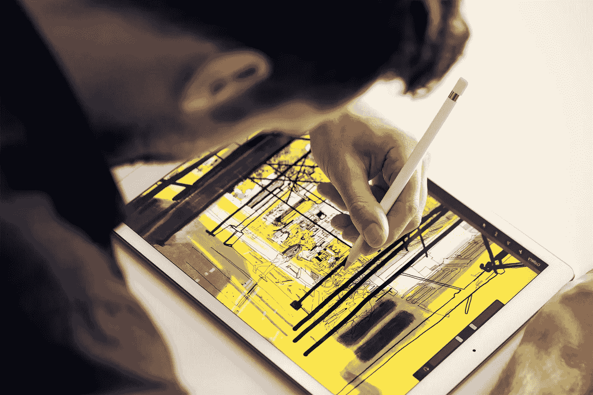

# iPad 的潜力

> 原文：<https://medium.com/hackernoon/ipads-potential-332294340d2a>

Marco Arment [问道，如果 iPad 不是计算机的未来会怎样？](https://marco.org/2017/01/31/the-wrong-future)

我认为，当[苹果](https://hackernoon.com/tagged/apple)正在扼杀它的软件故事时，很难看到 [iPad](https://hackernoon.com/tagged/ipad) 会有什么潜力。

# 第三方

第三方开发者势头在 iPad 上很尴尬。通过通用应用程序的支持通常是事后的想法，通过 Xcode 最低限度地添加，并作为害群之马与 iPhone 体验一起发布。

在过去的几年里，随着淘金热消退为对稀有黄金碎片的疯狂淘金，独立的 iPhone 应用程序开发者已经失去了信心。

随着 iPhone 应用程序开发变得越来越不可行，iPad 在世界各地的优先列表中被进一步降级。

# iPad 上的 iOS

iPad 操作系统的用户体验是一个延伸的范例。同样，iPhone 的传统不能传到更小的 Apple Watch 上，iPad 也不能简单乐观地借鉴其成功的表亲。

iPad 主屏幕和应用程序切换体验需要重新思考。需要有更好的方式来编排应用程序之间的信息。

# iPad 的市场

iPad 有两个主要用途:作为生活消费设备，以及作为专业的小众优化设备。iPad Pro 系列一直是苹果对后者的回答。

苹果需要展示这些专业人士如何利用笔记本电脑完成目前的工作，并在 iPad 上完成大部分工作。当前的故事过于小众和可爱，更多的是为了给人留下深刻印象，而不是让人们认为“这对我来说是可行的”

# 网页浏览

与我的 iPhone 6s 和 Mac Book Pro 相比，我的 iPad mini 2 上的网络浏览器体验更差。它试图拥有 Mac Safari 的持久标签体验，同时实际上提供了 iPhone 的脆弱体验。

为了工作，我需要知道我的选项卡将保持打开和登录。让它们重新加载、丢失进度或需要重新认证对于完成工作来说是不可接受的。

# 更大胆的赌注

iPad 需要对其软件采取更积极的态度。Mac 的桌面同步等功能感觉太迎合过去的惯例了。它需要发明自己的东西，让 Mac 和 iPhone 在不牺牲那些可靠体验的情况下扮演更多次要角色。

iPad 首先需要云和协作。为工作而增强的 iMessage 将创造奇迹，击败 Mac 成为首选工具。将消息传递、文档共享和评论与深入的操作系统支持相集成，您将拥有杀手级的体验。

当然，来自 Slack 和 Dropbox Paper 的竞争会很激烈，但我认为 iPad 将极大地受益于其自身的原生体验。

iPad 的大屏幕需要让你的双手投入工作。太多的应用程序坚持手机的拇指优先体验。触控文本编辑体验需要尽可能接近 Mac。智能键盘需要和笔记本电脑一样好。

需要优先考虑低着头、没有干扰的工作流程，而不是太容易采用 iPhone 的通知密集型体验。如果有必要，把工作效率游戏化，就像手表一样——苹果知道你用的是什么设备和应用程序，所以完成不分心的工作会得到奖励。

简而言之，iPad 一直是基于比手机或笔记本电脑更适合完成任务的理论而生存下来的。尽管这些任务对工作来说是至关重要的，但第三方开发人员可以从中受益。

它需要更积极地利用自己相对于其他设备的优势。与手机相比，它需要利用更大的屏幕。它需要比传统的 Mac 更具协作性和云聚焦性。那么 iPad 可能会发挥出它的潜力。

*最初发表于*[*【burntcaramel.com】*](https://burntcaramel.com/blog/2017/ipad-potential/)*。*

> [黑客中午](http://bit.ly/Hackernoon)是黑客如何开始他们的下午。我们是 [@AMI](http://bit.ly/atAMIatAMI) 家庭的一员。我们现在[接受投稿](http://bit.ly/hackernoonsubmission)并乐意[讨论广告&赞助](mailto:partners@amipublications.com)机会。
> 
> 如果你喜欢这个故事，我们推荐你阅读我们的[最新科技故事](http://bit.ly/hackernoonlatestt)和[趋势科技故事](https://hackernoon.com/trending)。直到下一次，不要把世界的现实想当然！

