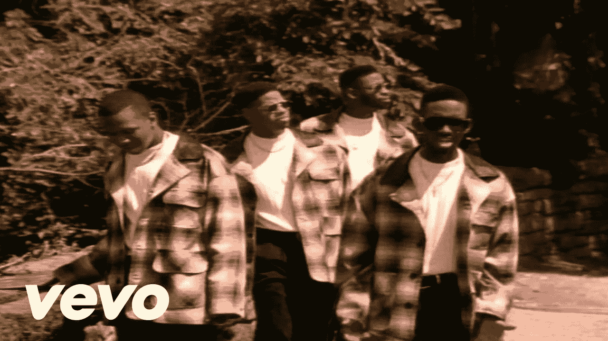

# 2016 年是创投之路的终点吗？

> 原文：<https://medium.com/hackernoon/is-2016-the-end-of-the-venture-capital-road-7c7ab0456023>

新年有了一个吉祥的开始。公共股票市场继续大幅抛售，石油价格已经十多年没有这么便宜了。尽管美国经济依然稳健，但风险投资者开始担忧。

来自各种渠道的大量数据表明，风险投资已经达到顶峰，现在开始降温。显而易见的影响是，风险投资的回报更低，初创企业获得资金的难度加大，它们将首当其冲感受到痛苦。创业公司将被迫为了更小的回合规模而相互进行饥饿游戏，获胜的一方将承受越来越大的压力，以越来越快的速度产生结果。

我认为，依赖传统本垒打模式的基金在未来几年将继续面临压力。私募市场，独角兽的估值并没有在公开市场得到证实。风险投资者已经做好了准备，一旦他们的亿万身家暴露在光天化日之下，他们将进行大规模的裁员。这是假设一家公司能做到这一步。IPO 越来越不可能成为流动性事件。

笼罩市场的不确定性代表着拥有差异化模式的小型风投公司大放异彩的机会。规模较小的风投公司应该过渡到一种模式，让它们能够从较低的进入估值和对公开退出的较少依赖中受益。此外，真正的动手方法为凳子增加了另一条腿。

旧的风险投资模式开始显示出它的时代。[路](https://hackernoon.com/tagged/road)仍然开放，但是高速公路开始变窄成一条单车道的乡村道路。

> [黑客中午](http://bit.ly/Hackernoon)是黑客如何开始他们的下午。我们是 [@AMI](http://bit.ly/atAMIatAMI) 家庭的一员。我们现在[接受投稿](http://bit.ly/hackernoonsubmission)并乐意[讨论广告&赞助](mailto:partners@amipublications.com)机会。
> 
> 如果你喜欢这个故事，我们推荐你阅读我们的[最新科技故事](http://bit.ly/hackernoonlatestt)和[趋势科技故事](https://hackernoon.com/trending)。直到下一次，不要把世界的现实想当然！

