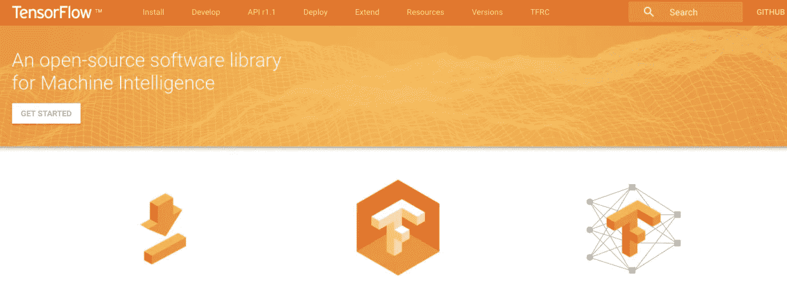

# AlphaGo 真的是 AI 吗？你的创业公司应该采用什么样的 AI 策略？

> 原文：<https://medium.com/hackernoon/is-alphago-really-ai-what-ai-strategy-should-your-startup-adopt-a818dbc25cc6>

Screenshot courtesy of Stanford CoreNLP — Core natural language software

加里·卡斯帕罗夫和深蓝之间的第一场 6 场比赛是在 1996 年，以卡斯帕罗夫 4-2 获胜而告终。在这些比赛之后，世界睡得更香了。但是我们对我们仍然拥有的对“计算机”的优势的喜悦是短暂的，因为仅仅一年后，深蓝以 3 . 5-2 . 5 的比分击败了卡斯帕罗夫。似乎我们对机器的服从是不可避免的。

但我们的机器人征服从未到来。由于技术的进步，我们在 1996/1997 年获得了

*   无线互联网:虽然开放频谱的决定是在 1985 年做出的，但直到 1997 年委员会才就基本的 Wi-Fi 规范达成一致。它允许每秒 2 兆位的数据传输速率，使用两种扩频技术中的任何一种，跳频或直接序列传输 “标准无线互联网技术的事情确实有所好转，我们今天认为这是理所当然的。
*   [**虚拟现实疗法**](https://www.ncbi.nlm.nih.gov/pubmed/10175343):1997 年开始的完全改变感官知觉疗法。
*   **多莉羊:震撼世界的克隆体**
*   **[**推力 SSC**](https://en.wikipedia.org/wiki/ThrustSSC) :至今保持陆地速度纪录的喷气式超跑。**

**这些发明都是“*惊人”*和*“下一件伟大的事情”*和其他最高级的东西，但它们现在在 CRISPr、自动驾驶汽车和机器学习的世界里没有那么惊人了。有些让我们害怕，还记得对多莉的狂热，但是我们仍然活着，发展技术来解决我们的问题。他们中的一些人就像今天的艾一样让我们害怕。但是我们生存，因为当我们的技术进步时，这就是我们所做的；我们继续解决我们的问题。**

## **人工智能和今天让我们害怕的东西**

**我最近与一位软件开发人员合作，他认为人工智能“接管”是不可避免的。像在他之前的每一个狂热者一样，他相信他们宗教中的某些事件是不可避免的，他认为这是时候了。他还认为只有像他这样聪明的人才能生存和发展。但是我不同意他的观点，我在下面分享。**

**一些人认为 [AlphaGo 不是人工智能](http://spectrum.ieee.org/automaton/robotics/artificial-intelligence/why-alphago-is-not-ai)，一些人认为科技巨头(和他们的投资者)正在炒作[技术，他们中的大多数人声称这项技术是他们战略未来的核心](http://amzn.to/2qnf8cB) ( [谷歌](https://www.nytimes.com/2016/12/14/magazine/the-great-ai-awakening.html?_r=0)，[脸书](https://www.wired.com/2017/04/facebooks-augmented-reality-engine-brings-ai-right-phone/)，[亚马逊](https://aws.amazon.com/amazon-ai/)和[微软](http://mashable.com/2017/05/07/microsoft-ai-strategy/))。我属于这样一类人，他们认为我们的技术正在取得巨大进步，但是，借用丹·艾瑞里的话来说，**

> ***[*此时的艾就像十几岁的性；每个人都在谈论它，没有人真正知道如何去做，每个人都认为其他人都在做，所以每个人都声称自己在做*](https://twitter.com/danariely/status/287952257926971392?lang=en)*……”****

***虽然我们在[机器学习和神经网络](http://aiplaybook.a16z.com)方面达到了前所未有的先进水平，但我们仅仅处于[人工通用智能](http://waitbutwhy.com/2015/01/artificial-intelligence-revolution-1.html)(全面与人类一样聪明的计算机)时代的尖端。 [AlphaGo 赢柯洁](https://www.nytimes.com/2017/05/25/technology/daily-report-alphago-wins-again.html)不代表 AlphaGo 比柯洁聪明。只是意味着 AlphaGo 在围棋上能赢柯洁。AlphaGo 无法像柯洁一样感受和表情。我们离机器人变得比我们更聪明、更像人类的日子还有很长的路要走……而正是这种人性将成为利用人工智能满足我们需求的制胜策略。***

## ***你的 AI 策略是什么？***

***根据凯利兄弟的《创新的信心》,每一项创新都需要生存能力、可行性和可取性。有了人工智能***

*   ***我们了解到这项技术是可行的***
*   ***对于人工智能的许多用例来说，我们正接近于可行性***
*   ***我们失败的地方在于让它成为所有商业人士都可以达到和想要的 T2。***

***因为某件事可行、可行并不能让它的成功成为必然。这是因为人的欲望因素。现在对人工智能的叙述让世界上其他人感到害怕，他们不太明白它是什么，以及它会产生什么影响。尤其是那些没有能力开发自己的系统的小企业。值得庆幸的是，谷歌(拥有 [Tensorflow](https://www.tensorflow.org/) )和亚马逊(拥有 [AML](https://aws.amazon.com/machine-learning/?tag=vglnkc6499-20) )是面向所有渴望者的开源技术。下一步将是让一些创业型开发人员开发服务于中小型企业的产品。***

******

***Tensorflow.org***

***如果你是一家小型企业，你想知道如何使用机器学习/人工智能，该怎么办？如果您想"[在您的业务中使用智能软件代理来接收来自环境的感知并采取影响该环境的行动](http://amzn.to/2r5maWQ)"该怎么办？围绕以下内容提出的最佳问题***

1.  *****要不要** [**用 AI 辅助(改善你目前做的事情)**](https://www.strategy-business.com/article/A-Strategists-Guide-to-Artificial-Intelligence?gko=0abb5) **？**这种方法非常适合希望提高效率或降低当前业务运营成本的企业。企业可以将人工智能的这种使用更多地视为内部用例，客户可能不知道它是人工智能，但它将改善公司的业务方式。***
2.  ***你想使用人工智能来扩大你的业务(做你以前不能做的事情)吗？您的企业需要新技术吗？人工智能的这个用例更适合于开发新产品/技术来为客户服务。它可以被认为是帮助公司创新地解决客户问题的面向外部的用例。***
3.  ***还是你想用人工智能来自动化你的业务(创造会思考和自主行动的机器)？这是突破性的战略方法，对大多数小企业来说也是更难的方法。考虑到大型公司在这方面投入的工作和资源，小型企业最好利用上面提到的一些开源平台。***

***没人说你不能混合搭配这些方法。关键是专注于最有利的目标，并以此推动您寻找合作伙伴，帮助您构建最能满足您业务需求的解决方案。***

***柯洁输给了 AlphaGo，验尸将在接下来的几天/几周内进行。每个人都会宣称人类的末日即将来临。但我会建议，现在是我们把注意力从人工智能比人类好多少上转移开的时候了，并开始做工作(大规模地)以确保人类在人工智能方面变得更好。是时候让构建这些伟大工具的技术人员(例如)与卡车司机一起进行 24 小时驾驶，以确保我们开发的自动驾驶汽车软件在某种程度上增强卡车司机的能力。现在是时候让开发人员在编写一行代码之前，与电话呼叫中心的员工坐在一起，过一天他/她的生活，而不是构建完全取代呼叫中心员工的软件。这种方法会带来一些同理心，并改变我们构建的产品。***

***否则，作为商业人士，我们将继续让技术的前提吓住我们，不让我们从它们那里获得我们所能获得的好处。作为技术人员，坐在商业人士的另一边，我们只是把我们的沉默转移到我们的人工智能上。***

***这将是非常愚蠢的。***

****如果你喜欢这本书，你应该看看《我在 2017 年读过的 40 本书的 10 个***》和《 [*9 本书，以增进你对技术系统*](https://hackernoon.com/9-books-to-help-you-understand-technology-and-systems-bb3f4d2d9dda) *》的理解。******

****如果你喜欢这篇文章，请点赞、发微博、分享并用心阅读。报名参加我的《博学月刊》 [*这里*](http://www.getrevue.co/profile/seyifabo?utm_campaign=Issue&utm_content=forwarded&utm_medium=email&utm_source=Seyi+Fabode) *，你会喜欢的。另外，查看* [*哈珀雅各布*](http://HarperJacobs.com) *进行引人注目的内容创作&* [*Asha Labs 进行创新/战略咨询*](http://www.asha-labs.com/bio/) *。*****

************************

> ****[黑客中午](http://bit.ly/Hackernoon)是黑客如何开始他们的下午。我们是 [@AMI](http://bit.ly/atAMIatAMI) 家庭的一员。我们现在[接受投稿](http://bit.ly/hackernoonsubmission)，并乐意[讨论广告&赞助](mailto:partners@amipublications.com)机会。****
> 
> ****如果你喜欢这个故事，我们推荐你阅读我们的[最新科技故事](http://bit.ly/hackernoonlatestt)和[趋势科技故事](https://hackernoon.com/trending)。直到下一次，不要把世界的现实想当然！****

********