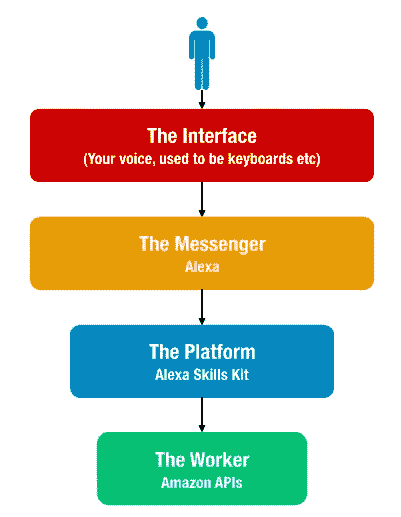
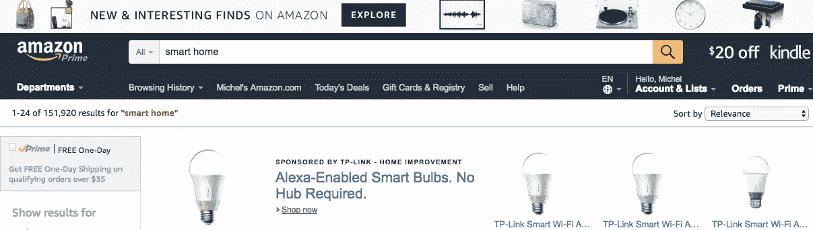
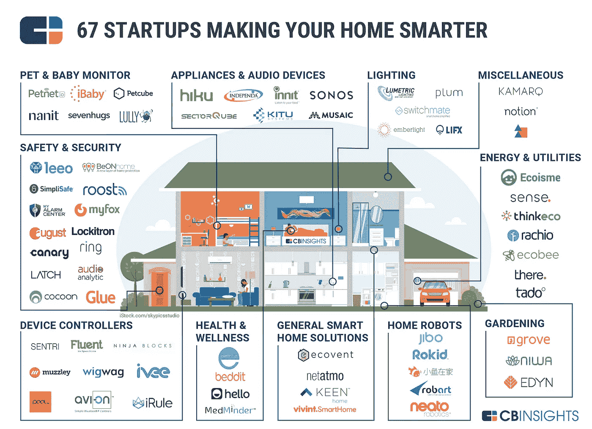

# 亚马逊的 Echo Show (Cortana +一个 iPad)有创新性吗？

> 原文：<https://medium.com/hackernoon/is-amazons-echo-show-cortana-an-ipad-innovative-cd92414f37a0>

[Image Courtesy of Amazon](https://www.amazon.com/gp/product/B01J24C0TI?ie=UTF8)

## 亚马逊回声秀的问题

当我第一次看到亚马逊回声秀时，我有两种(负面的)本能反应

1.  **这不是创新！我希望这个炸弹爆炸，因为它只是一个黑盒子上有语音控制的 IPad。如果创新是' [***有影响的不一样的东西'***](http://amzn.to/2pKModM) ，那么亚马逊发布 Echo Show 错过了备忘录。但我们趋之若鹜，因为这是亚马逊。[据我们所知，技术人员会将质量归因于](/chris-messina/amazon-echo-show-354b93b448b5)产品，而这并不是制造产品时考虑的一部分。一个朋友在 2014 年提出了这个想法，我记得有几个投资者表示，这个想法要么没有必要，要么可以被任何大公司复制。现在我们都为之激动不已…**
2.  **亚马逊的 Echo Show 与客户需求无关！？！！这只是又一个让家里变得杂乱的设备。我已经可以用 Facetime 给家人打电话了！！那我为什么需要回声秀呢？对话式用户界面( *Alexa play 埃斯波兰萨·斯伯丁’*)非常棒，除非你需要输入组成技能的指令或序列(夜间模式:关灯、启用安全等)。亚马逊只是试图让家庭中的一个设备通过苹果/安卓设备绕过语音输入 Alexa(目前已经完成)。这能改善我的生活吗？**

正如我在即将出版的新书《[反脆弱网格](https://www.amazon.com/dp/B072875DFJ)》(预购)中所建议的那样，智能家居——一个贴满各种物联网设备的家居，这些设备将信息传递给某处基于云的服务提供商——是捕捉上下文、注意力和意图的下一个平台。就像互联网电脑和之前的智能手机一样，智能家居让科技公司能够利用所有关于你我的信息，卖给出价最高的买家(或者就亚马逊而言，让我们购买更多产品)。我们知道，谁拥有了顾客(家)，谁就赢得了奖品。亚马逊凭借其所有的智能家居产品，试图通过专注于便利性来占领家庭。但是为什么呢？首先，我们必须了解智能家居中可能创造价值的领域。

## 那么智能家居实际上是做什么的呢？

在“家”这个词前面加上“连接的”或“智能的”这两个词，掩盖了这样一个事实，即在这些家庭中，对我们来说真正重要的东西是

*   安全
*   舒适
*   便利

为我们的家庭提供智能安全的竞争非常激烈；[戒指](http://amzn.to/2qgwd90)、[八月](http://amzn.to/2qDyuOC)、[窝保](http://amzn.to/2rc3gu2)等一系列产品正在一决雌雄。舒适，一个更模糊的概念，正在通过像 Cree 的可调光智能灯泡(和其他智能灯泡)、Sonos 扬声器(等等)等设备来提供。便利性是亚马逊找到了自己的定位，并带着 [Echo](http://amzn.to/2pJiPsQ) (及其所有变体)偷偷溜了进来。尽管我们可以通过物联网技术实现所有这些事情，但我们发现自己所处的不幸局面是，这些设备现在似乎正在造成更多混乱，而不是解决我们的需求。在我们现在生活的世界里，在亚马逊上搜索“智能家居”会得到 152，000 条结果。

More Smart Home Devices Than We Need!!

对于亚马逊来说，在这份清单上再增加一款轻薄无创新的产品，就不仅仅是推动另一种设备上的微薄利润了。或者是？这里的重点是什么？[亚马逊是一家已经一次又一次证明了它拥有长期商业战略的公司。所以这里有些东西](https://www.linkedin.com/pulse/why-companies-like-lyft-uber-postmates-instacart-etc-never-fabode) …

[Smart Home startups, courtesy of CBInsights](https://www.cbinsights.com/blog/smart-home-market-map-company-list/)

## 还是策略？

最好的策略简单明了。但只是在事后。亚马逊的策略可能有两种。当故事被讲述时，任何一个人都可能表现出明显而令人印象深刻的聪明。

1.  转移注意力:对家庭来说，语音控制辅助是亚马逊的事情。当 Echo 推出时，还不清楚采用率会不会像现在这样高。现在每个人都在制造自己的设备。[100%的市场份额，现在更像是 70%](https://techcrunch.com/2017/05/08/amazon-to-control-70-percent-of-the-voice-controlled-speaker-market-this-year/) 。了解杰夫·贝索斯对待竞争的方式，他不喜欢这样。[削弱你的竞争对手的一个很好的方法是采取行动](http://amzn.to/2rfqbFW)，从表面上看，似乎是为了占领一个新的市场，但实际上是为了增加你的竞争对手的竞争成本。尤其是如果你是某个领域的市场领导者。Echo Show 是一种转移注意力的策略，目的是让亚马逊的竞争对手(谷歌、微软和苹果)承担成本，这些竞争对手都在发布与最初的 Echo 直接竞争的产品。
2.  平台与产品:技术发展的速度比以往任何时候都快，产品和服务过时的速度也比以往任何时候都快。如果 Echo Show 不是亚马逊更广泛的平台战略的一部分，它就会像大多数其他产品一样遭受这种命运。成功的平台成为标准。如果继续沿着和其他人一样的路走下去，将会引发一场声控设备价格战。在一个仍处于早期阶段的市场，没有人能赢得价格战。在语音激活设备的生命周期中，打价格战还为时过早。为拥有该平台而进行价格战并非不可能，但这会侵蚀利润率，而利润率仍足够强劲，足以让每个人获得稳定的利润。

我对这里的战略知之甚少，我不在亚马逊领导层，也不认识任何人，但我知道的是，这与竞争战略的关系比改变游戏规则的技术创新更大。因为亚马逊的 Echo Show 真的只是一个带语音控制的 iPad。亚马逊的 Look 和 [Dash](http://amzn.to/2pJtfYA) 也可以这么说。以亚马逊过去几个月的速度发布这些产品肯定有战略原因。

我知道的另一件事是，尽管我有上述抗议，我可能会在我的家里结束[回声秀](http://amzn.to/2qd8use)。就像我和回声一起结束一样…

*如果你喜欢这本书，你应该看看《我在 2017 年读过的 40 本书的 10 个* [*启动课程*](https://artplusmarketing.com/i-read-40-books-this-year-heres-what-i-learned-aka-10-lessons-for-2017-b7d7eabc5079) *】、* [*9 本书来增进你对技术系统的理解*](https://hackernoon.com/9-books-to-help-you-understand-technology-and-systems-bb3f4d2d9dda) *和我的书* [*40 个半显而易见的启动课程*](http://amzn.to/2paQw6t) *。*

如果你喜欢这篇文章，请点赞、发微博、分享并用心阅读。报名参加我的博学月刊 [*这里*](http://www.getrevue.co/profile/seyifabo?utm_campaign=Issue&utm_content=forwarded&utm_medium=email&utm_source=Seyi+Fabode) *，你会喜欢的。另外，查看*[*Harper Jacobs*](http://HarperJacobs.com)*进行引人注目的内容创作&* [*Asha Labs 进行创新/战略咨询*](http://www.asha-labs.com/bio/) *。*

> [黑客中午](http://bit.ly/Hackernoon)是黑客如何开始他们的下午。我们是 [@AMI](http://bit.ly/atAMIatAMI) 家庭的一员。我们现在[接受投稿](http://bit.ly/hackernoonsubmission)并乐意[讨论广告&赞助](mailto:partners@amipublications.com)机会。
> 
> 如果你喜欢这个故事，我们推荐你阅读我们的[最新科技故事](http://bit.ly/hackernoonlatestt)和[趋势科技故事](https://hackernoon.com/trending)。直到下一次，不要把世界的现实想当然！

