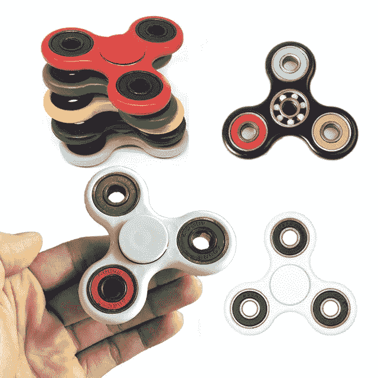
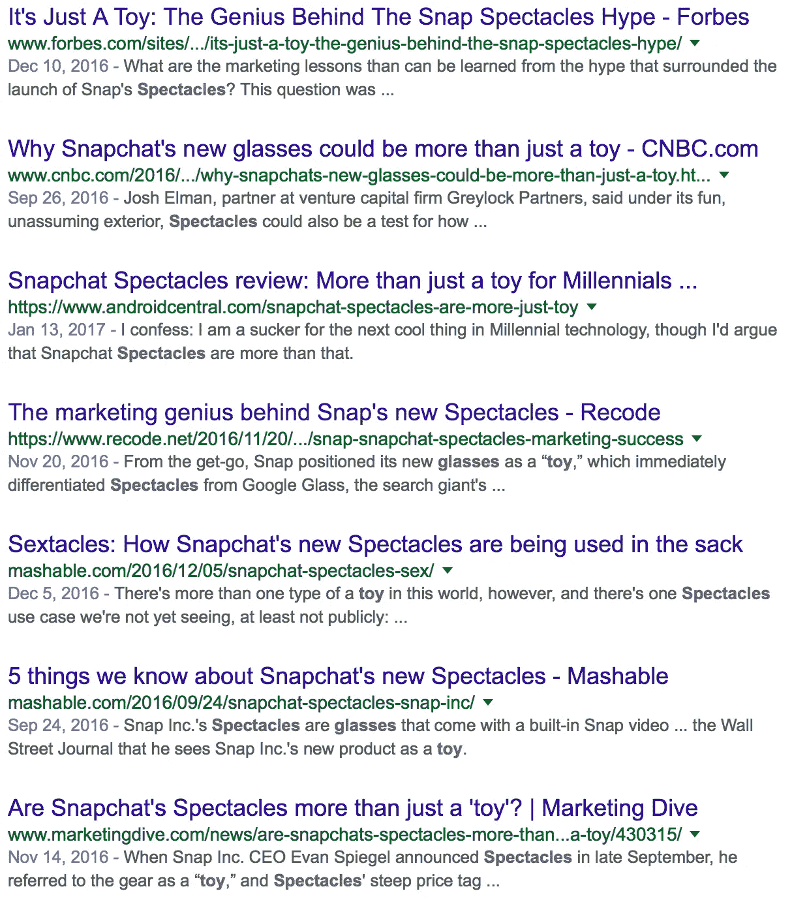
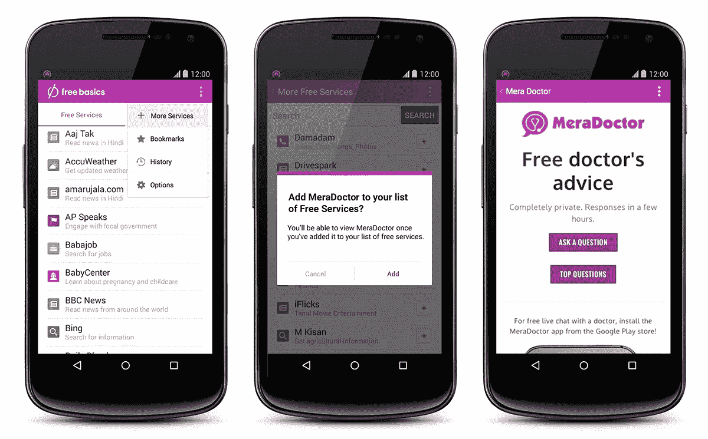

# 有人对没有相机的“相机公司”不卖相机感到惊讶吗？

> 原文：<https://medium.com/hackernoon/is-anyone-surprised-the-camera-company-without-cameras-didnt-sell-their-camera-154922b255a0>

记得坐立不安纺纱？

今年 5 月，12 岁以下的孩子不可能拥有太多各种形状、大小和颜色的玩具。在你当地的 7-11，它们的起价约为 2.99 美元，不知何故涨到了 8.99 美元，这是为了那些带有 K-Mart 品牌滑板轴承的蹩脚塑料鞋。

然后，为了降低生产成本，他们开始将边缘的三个轴承取出，用圆形金属片代替，只留下中间的一个。这些东西在 YouTube 上被播放，它们是由碳化钛、精金以及任何耶稣的凉鞋的材料制成的。

直到九月，现在它们和 dab 一起被藏在一个盒子里。

这是一个趋势的 4 个月的荣耀，这个趋势比 Slinky 或余淼更让年轻一代着迷。你现在可以发现它们挂在便利店的收银台旁边，售价 1 美元，仓库里堆满了它们，等待着融入接下来的时尚。

就像 Snapchat Spectacles。

这不是我们第一次看到“VIP 专属”的交付方式适得其反，也不会是最后一次。Snap 和他们的独家奇观投放网站让 SnapFans 排队成为潮流引领者，让那些长着臭虫眼睛的混球看起来很成功。

每一个技术网站都有大量关于这将如何超越我们进入可穿戴设备的文章，参与这场活动的每个人都是天才！

直到人们用过一次后说，“嗯，这些东西会爆炸。”

埃文·斯皮格尔在一开始就说它们是“一个玩具”，现在看来，这似乎是对随后发生的营销大火的某种预见。

眼镜花了五个多月的时间才被普通的卑鄙小人得到，他们碰巧不够酷，不能早点拿到手，而且没有真正的名人戴过一次以上。最重要的是，从来没有任何内容被认为是有趣或“好”的。

那么，既然脸书抄袭了 Snapchat 做的每一件事，并加入 Instagram，为什么我们没有看到眼镜被敲掉呢？

那里有更大的用户群，他们有能力大规模生产成品，但脸书一直更关注用户数量，而不是与产品本身相关的硬件。

脸书一直在推出他们的“免费基础”计划，虽然在一些地方没有被完全接受，但实际上允许 50 多个国家的任何人通过移动浏览器为 Instagram 创建内容。

这比 28 个人戴着愚蠢的眼镜看起来好多了。

Snapchat 仍然是 Z 一代在消息和日常使用方面的绝对首选，但当 Snap 更关心他们认为用户希望他们成为什么样的人，而不是从用户群实际上已经让他们成为什么样的人开始增长时，这种情况会持续多久？