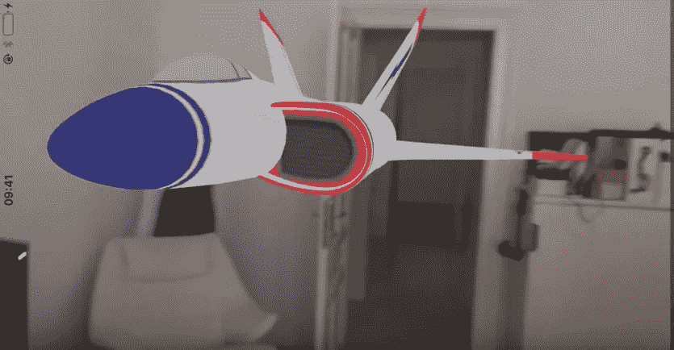
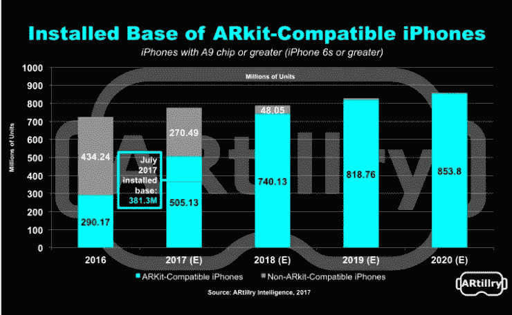

# 增强现实是否处于临界点？电话会议-美国东部时间 8 月 8 日下午 2 点至 3 点

> 原文：<https://medium.com/hackernoon/is-augmented-reality-at-a-tipping-point-conference-call-august-8-2pm-3pm-est-f44d19bfa568>

iew with Apple’s ARKit

以下是电话录音:

2013 年，谷歌眼镜以 1500 美元的价格上市时，受到了粉丝的热烈欢迎。[传奇的](https://hackernoon.com/tagged/legendary)科技博主 [Robert Scoble](https://goo.gl/WXm6ya) 成为 AR 的公众形象，因为他把自己的个人资料照片改成了他戴着谷歌眼镜洗澡的照片。

我们都知道那是怎么结束的。谷歌眼镜的销售于 2015 年 1 月停止，AR 炒作也逐渐消退。虽然 ar 技术取得了很多进展，但直到 2016 年 7 月 Pokemon Go 起飞，世界才听到太多关于 AR 的消息。虽然口袋妖怪 Go 热潮已经消退，但每月仍有 6500 万活跃用户。

在过去的几个月里，我们已经看到了来自[脸书](https://techcrunch.com/2017/04/18/facebook-camera-effects-platform/)和[谷歌](http://www.businessinsider.com/google-tango-2017-5/#tango-wont-work-on-just-any-phone-it-requires-a-lot-of-processing-power-and-an-array-of-special-cameras-and-sensors-1)的有意义的消费者 AR 公告，以及[谷歌眼镜在企业](https://techcrunch.com/2017/07/18/google-glass-is-back-with-hardware-focused-on-the-enterprise/)的重新出现。但 AR 领域最近最大的新闻是苹果在 6 月份推出了 ARKit。据估计，当今世界上有超过 3.8 亿部 iPhone 采用了 A9(或更强大的)芯片，包括所有兼容 ARKit 技术的 iPhone 6s 或更高版本。这个数字预计将在 2020 年增长到超过 8 . 5 亿。

以下是一段 4 分钟的视频，讲述了 ARKit 的 10 种酷体验:

通过过去几个月的所有活动，我们终于到了 AR 拐点了吗？AR 终于准备好迎接黄金时代了吗？AR 真的会像 Digi-Capital 预测的那样，在 2020 年成为 800 亿美元的产业吗？哪些行业最有可能在近期受到 ar 的影响？会出现哪些新的行业？

为了回答这些问题以及其他问题，我们召集了一个由行业思想领袖组成的伟大小组，他们都从不同的角度来看待 AR，他们将分享他们对 AR 的现状以及未来几年的发展趋势的看法:

长达一小时的电话会议将在结束时留出 20 分钟供观众提问。

*点击* [*此处*](https://attendee.gotowebinar.com/register/2360770596101238019) *在 GoToWebinar* 登记呼叫

扬声器 Bios:

**Robert Scoble——转型集团**、**、**的合伙人，该集团致力于帮助品牌制定其混合现实战略。罗伯特最近也发表了《第四次转型 AR 和 AI 将如何改变一切》。

**弗雷德·戴维斯—** 是一位经验丰富的企业家、技术先锋、媒体专业人士和公共演说家。他在技术行业已经工作了 30 多年，并因开拓和预测许多创新和行业趋势而被誉为技术梦想家。VR 布道者 20+年，AR 4 年。

**Adam Kaplan—****edgy bees 的联合创始人兼首席执行官，**该公司为任何高速移动的物体提供 AR 体验，包括无人机、汽车、火车和可穿戴设备，用于[消费者](https://www.youtube.com/watch?v=ccgJVkgxxdY)和商业应用。

**Don Stein-Candela Paramount 的联合创始人&董事总经理，**一家专注于开发 AR/VR 技术的风险投资公司。

*点击* [*此处*](https://goo.gl/SqRNdf) *在 GoToWebinar* 登记呼叫

*如果你喜欢这篇文章，请点击💚这样其他人就可以在媒体上看到它了！*