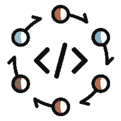
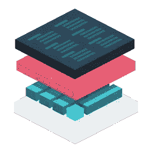

# AWS CodeStar 对我的创业公司有威胁吗？

> 原文：<https://medium.com/hackernoon/is-aws-codestar-a-threat-to-my-startup-cbc7e4de71f3>

亚马逊最近[发布了他们最新的产品](https://aws.amazon.com/blogs/aws/new-aws-codestar/)，旨在缩短网络应用的上市时间。 [AWS CodeStar](https://aws.amazon.com/codestar/) 为部署到 AWS 的 web 开发者简化了应用创建和[部署](https://hackernoon.com/tagged/deployment)流程。

我的许多朋友和同事都知道，我在平台即服务(PaaS)行业度过了 7 年时光。在过去的两年里，我一直在参与构建 [Nanobox](https://nanobox.io) ，这是一个微型 PaaS ( [μPaaS](https://hackernoon.com/what-is-micro-paas-and-why-its-the-future-of-app-development-3aa30d086703) )，允许您轻松地启动本地开发环境并将应用部署到生产中。随着人们听到关于 CodeStar 的消息，我不止一次被问到——“这是否意味着 Nanobox 已经完成了？”

**TL；博士** —哈哈，绝对不是。

# 竞争是健康的

任何经济学家都会告诉你，竞争不仅是健康的，而且是推动一个行业发展的关键。它推动公司创新；在特定市场中寻找竞争优势；在他们的问题空间中找到更好的解决方案。

如果微软在 90 年代对消费电脑行业的统治没有迫使他们创新，苹果会年复一年地被评为最具创新力的公司吗？如果市场主导地位没有向有利于苹果的方向转变，微软会推出自己生产的新硬件吗？我会说，“不。”

为什么你总能在距离家得宝不远的地方找到一家[劳氏](https://www.lowes.com/)？为什么任何麦当劳似乎都伴随着汉堡王或肯德基。

我在美国。这些比较可能不适用于你居住的地方。)

答案很简单——这种“共处一地”对每个人都有好处；无论是供应商还是客户。客户有选项，可以根据自己的经验和/或研究进行选择。如果供应商不能满足客户的特定需求，竞争对手就在身边。这是双赢。

Nanobox 和 CodeStar 也是如此。我们都在试图解决许多相同的问题，但方式不同。

# 确认

当像亚马逊这样的大公司推出一种产品或服务来解决你正在试图解决的相同问题时，它就证明了你存在的全部理由。如果亚马逊愿意投入时间和金钱来解决这个问题，那么这真的是一个问题。

## 亚马逊改变了话题

亚马逊不仅验证了我们用 Nanobox 解决的问题，还完全改变了围绕这些问题的对话。如果我用一句话概括了 Nanobox 功能，那就是:

> Nanobox 自动执行通常由 DevOps 工程师执行的任务。

这本质上假设由 DevOps 工程师执行的任务能够并且应该是自动化的。我应该澄清，我和 Nanobox 都没有声称自己是“DevOps 杀手”，我相信 CodeStar 背后的人也会这么说。但是，我们希望让它变得更简单。

作为一个小的创业公司，说服行业我们有一个地方一直具有挑战性，特别是在 DevOps 社区(可以理解)。但是，当亚马逊出现并“说”了我们一直在说的同样的话——这些任务可以而且应该自动化——它们的“重量”一夜之间改变了对话。

以下是黑客新闻上 [CodeStar 公告线程的一些引用:](https://news.ycombinator.com/item?id=14149570)

> 你听到的声音是成千上万的操作工程师的未来前景越来越成问题。
> 
> 我越来越难以证明留在“DevOps”领域是正确的，因为 AWS 经常推出这样令人惊叹的解决方案…这很难，因为我可以看到这确实推动了行业的发展，但它也否定了我十多年来努力培养的技能的必要性。我猜这就是 100 年前马车制造者的感觉。
> 
> -黑客新闻上的 AlexB138
> 
> 这可能也意味着我再也不用碰 devops 了。我可能永远也不会用到 Terraform、Kubernetes、Docker、CoreOS 和所有其他的东西…
> 
> -黑客新闻上的内森 _f77
> 
> 对于大多数中小型网站来说，直到有人将所有的复杂性隐藏在一个漂亮、智能的界面后面，留给人们做的事情很少，这难道不是一个时间问题吗？
> 
> -佩特拉在黑客新闻上

但是，我实际上同意 ShakataGaNai:

> 如果有的话，我认为这对 DevOps 有好处。CodeStar 可能意味着更少的乱码。所以当真正的 DevOps 被雇用时，清理和 unf'k 更少。
> 
> 黑客新闻上的 ShakataGaNai

随着亚马逊全力支持 Nanobox 试图解决的问题，让用户相信我们有一席之地变得容易得多，这对我们来说很好。

# 挑战

老实说，我对 CodeStar 公告唯一担心的是确保 [Nanobox](https://nanobox.io) 出现在对话中，并且区别很明显。我们是一个手段有限的小团队，但这并不意味着我们不能成为 CodeStar 的“麦当劳”中的“汉堡王”。如果我们参与对话，会有收获。

但是，我想这是任何创业公司面临的挑战。

> [黑客中午](http://bit.ly/Hackernoon)是黑客如何开始他们的下午。我们是 [@AMI](http://bit.ly/atAMIatAMI) 家庭的一员。我们现在[接受投稿](http://bit.ly/hackernoonsubmission)并乐意[讨论广告&赞助](mailto:partners@amipublications.com)机会。
> 
> 如果你喜欢这个故事，我们推荐你阅读我们的[最新科技故事](http://bit.ly/hackernoonlatestt)和[趋势科技故事](https://hackernoon.com/trending)。直到下一次，不要把世界的现实想当然！

