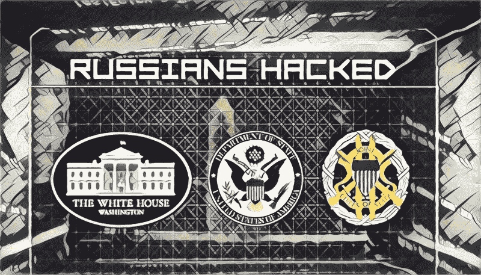
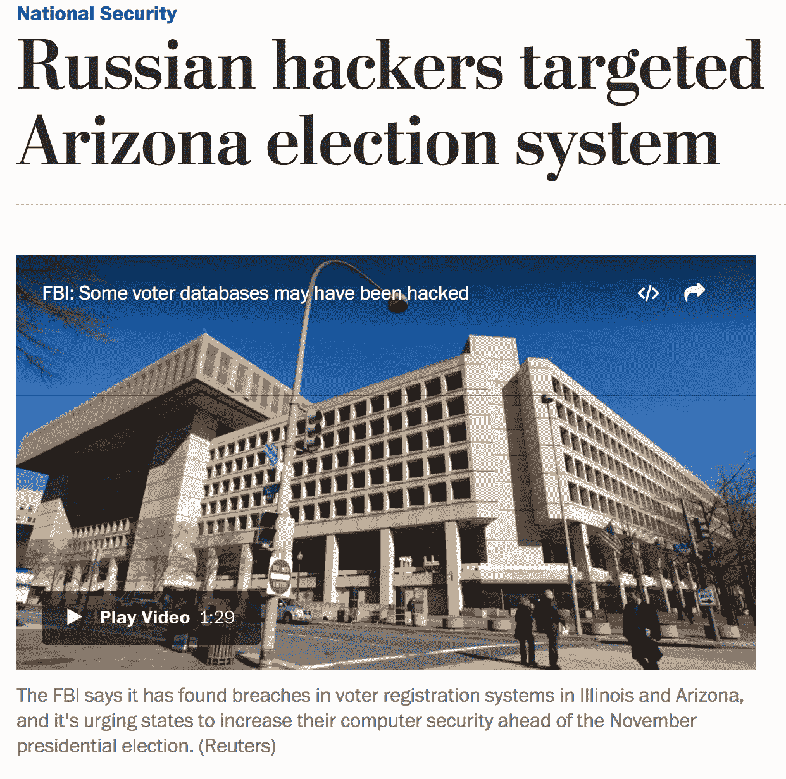
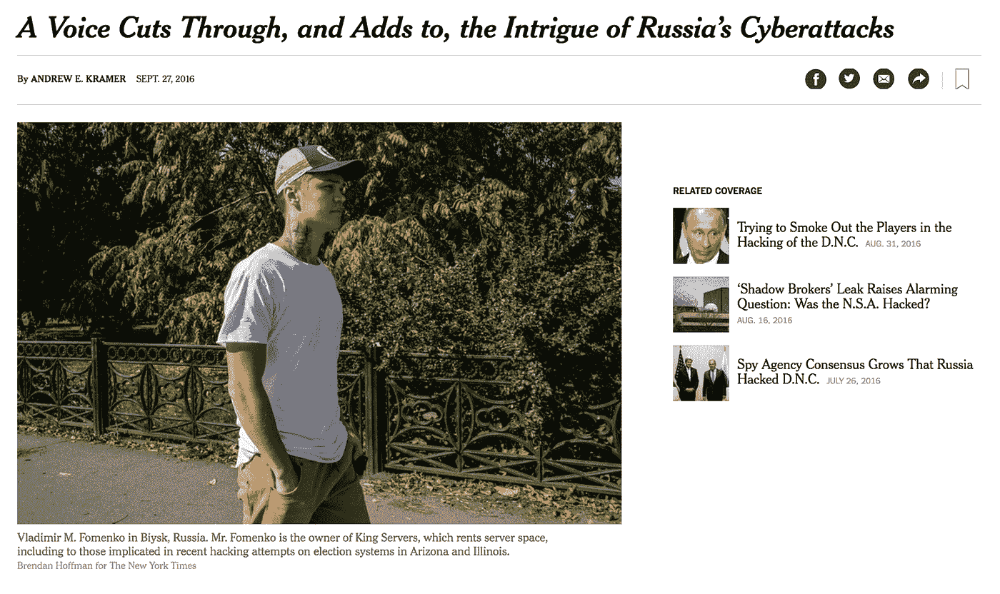
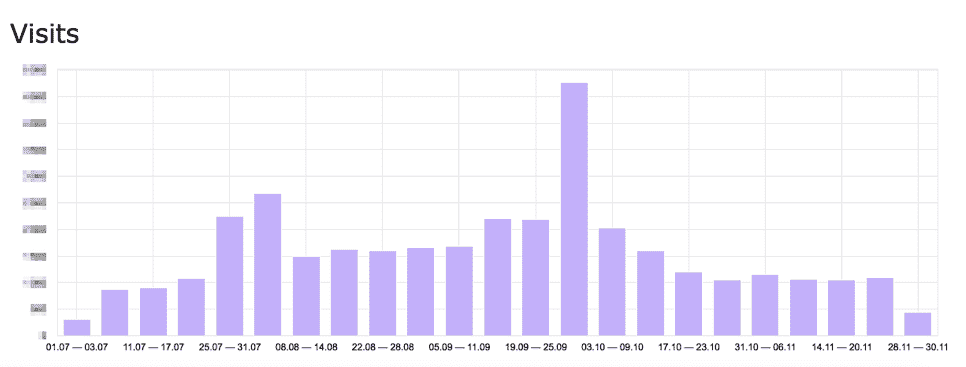
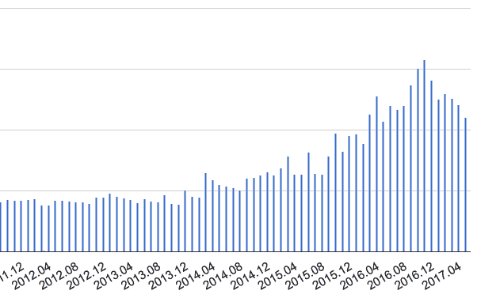
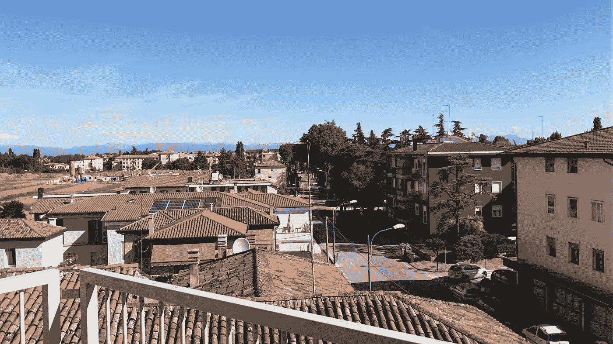

# 黑公关真的不好吗？黑客丑闻的内幕以及如何从中获益

> 原文：<https://medium.com/hackernoon/is-black-pr-really-bad-inside-a-hacker-scandal-and-how-to-benefit-from-it-283a63a93cf8>

2016 年夏天美国总统竞选期间爆发间谍和黑客丑闻。出乎意料的是，我们的公司 [KingServers](https://www.king-servers.com/) 也参与其中。今天，我将谈谈我们是如何克服这种局面的，我们采取了什么措施，我们学到了什么。

# **简介**

我们的公司 KingServers 是一家托管公司，为我们的客户提供单机服务器租赁和 VPS，我们还保护他们免受 DDoS 攻击。我们的设备分布在不同的国家:东欧、荷兰和美国。我们已经上市好几年了，现在我们进展良好。此外，我们从未遇到过任何特殊问题，直到 2016 年夏天才出现在新闻头条中。

我们一直非常关注客户的反馈，并通过设置特殊的谷歌过滤器，不断监控不同互联网资源上对我们公司的任何提及。去年 8 月 29 日，我们(出乎意料地)得知《华盛顿邮报》的一篇文章提到了 KingServers。

这篇文章被放在“国家安全”部分，内容是关于一个州的选举系统遭到黑客攻击。此外，该文章的作者声称，攻击是由“俄罗斯黑客”进行的，他们使用了我们公司的设备。记者引用了私人信息安全分析师的数据。

后来发生的事情可以用一个简单的词来形容——一波。很快就很明显，这个消息传播得非常快，引起了很多人的兴趣。我们没想到我们的公司会卷入一场国际间谍和黑客丑闻。我们必须决定采取什么措施。

# **进攻是最好的防守**

起初，这种情况并不令人愉快。我们的服务提供给在不同领域工作的客户，我们被怀疑与黑客打交道，这些黑客由俄罗斯特种部队控制，然后攻击美国总统选举系统，这一事实对我们的声誉不是很好。

另一方面，我们意识到我们没有真正的罪恶感。此外，美国情报部门没有打扰我们进行任何调查。另外，黑客攻击发生在夏天，当时我正在泰国度假，没有人试图逮捕我，甚至审问我。

冷静了一点后，我们下定决心要从这种情况中获益。不用说，我们没有任何与媒体合作的经验，所以我们凭直觉行事。我们决定使用一个同样强大和知名的媒体，类似于华盛顿邮报，作为回应。

我们与《纽约时报》的编辑取得了联系，并提出告诉他我们对形势的看法。两天后,《纽约时报》的一名记者来到我们的小镇(俄罗斯比斯克)采访了我。

这篇文章起到了推波助澜的作用，但实际上我们无法影响世界各地出版物的总体走向。记者和博客作者并不想仔细研究我们的案例。结果，他们的文章被夸大了，而且不准确。有时他们只是出版他们的小说。

例如，有人从《纽约时报》发表的照片中研究了我的纹身，然后得出结论，我的一个纹身类似于网络组织“匿名”的标志，并声称这间接证实了我是这些网络攻击的组织者。其他人关注我住的地方，声称“他住在蒙古边境附近，显然，他选择了这个地方，这样他就可以逃跑，以防被发现”。几乎每个记者都写道，我和我的公司被美国当局指控从事黑客活动。然而，我们没有收到美国当局或特别服务机构的任何请求或指控。

其中一份报纸提到了我们设备所在的数据中心。当我们的合作伙伴问记者为什么对我们的案例感兴趣时，他们诚实地回答说，“它给了我们很多点击”。热门话题意味着广告的流量和增长。因此，我们可以说，通过发布不准确的信息，报纸和博客解决了他们的业务问题。

这种情况非常令人担忧，因为我们不知道客户在网上看到我们公司连续不断的负面信息会有什么反应。

# 除了死亡日记之外的任何东西

媒体的歇斯底里对我们公司的运营没有影响。我们继续做我们的生意。我们没有想到媒体上的黑色公关会强烈影响我们的团队，因为我们真诚地讨论了一切，我们非常清楚情况被夸大了。

*Our company’s website traffic diagram*

令人惊喜的是，这丝毫没有让我们的客户感到困惑。好的，他们中的一些人提出了问题，他们对公司的前景感兴趣——我们给了他们我们的意见。然而，没有太多的询问，许多顾客只是忽略了这种情况。

尽管如此，我们也设法接待了许多新顾客。随着更多的文章出现在各种媒体上，这增加了人们对我们公司的兴趣。我们也接待了在新闻中了解到我们的新客户(尽管我们通常与 B2B 部门合作)。

*After the hacker scandal our profits increased despite the negativity in the media*

在我们卷入黑客丑闻的几个星期后，很明显我们实际上从负面宣传中受益了。这是事件发生后的六个多月，尽管 sсeptics 预测我们会失去所有的客户，但我们看到，恰恰相反，我们的客户越来越多。

我们还没有收到其他国家当局和安全部门的任何询问。我最近刚从欧洲回来，就当局和调查而言，我对那里不感兴趣。

*I have recently visited Italy.*

# 如何在突如其来的丑闻中幸存下来:五个实用技巧

最后，我想分享一下我们对这个故事的看法——也许，我们的经历会帮助一些人体面地、毫无损失地克服突如其来的丑闻。

*   **不要准备** —有许多公司正在制定各种公关规定，包括负反馈最小化。我们认为不可能对这篇文章中描述的丑闻有所准备。
*   **如果丑闻来了，你需要了解你的内疚程度**——如果你真的做错了什么，那是一回事。但意外卷入一桩丑闻，最终证明是有益的(就像我们的情况一样)，则是另一回事。
*   **首先创建一个开放的公司更有用**——在这场媒体雨之后，有一个巨大的诱惑来了，那就是关闭并完全不回应任何媒体上的出版物。然而，这只会吓跑你的客户。所以无论如何你都需要一些反馈。
*   媒体不会公正行事——媒体有他们自己的事业。黄色标题的点击量更大，广告销量也更高。这意味着你卷入了一桩丑闻，这件事会被大大地曝光。记者和博客作者通常不急于找出谁对谁错，并在他们的文章中写出真相。
*   **糟糕的公关不仅仅是一个不利因素** —我们的情况在道德上并不令人愉快，但它并没有在财务上损害我们的业务。事实上，它甚至有助于吸引新客户，增加我们的利润。所以，不要害怕丑闻。