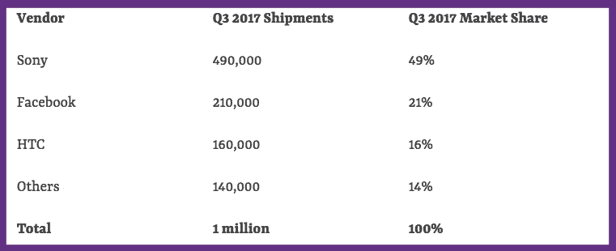

# 成本是比我们想象的更重要的因素吗？

> 原文：<https://medium.com/hackernoon/is-cost-a-bigger-factor-than-we-thought-f5851848de5>

质疑为什么虚拟现实的采用比预期的要慢的文章层出不穷。**许多** [**人猜测**](https://virtualrealitytimes.com/2017/02/15/will-vr-die-again-before-a-killer-app-is-found/) **虚拟现实仍然需要一个“杀手级应用”**，这种属性将像口袋妖怪 Go 为 AR 打开大门一样吸引人们。它不必完美(口袋妖怪 Go 肯定有它的缺陷！)但它必须足够吸引公众意识，以至于如果没有得到它的人会感到被冷落。

当然，这不是一个完美的比喻，因为 Pokemon Go 需要零买入费——只需下载应用程序并开始即可。即使用户的手机不支持游戏的 AR 方面，他们也可以玩游戏，享受基本相同的乐趣。自从电子邮件把我们带到了家用电脑前，就缺乏一个杀手级应用的明确例子，这让专家们开始质疑这是否是技术的工作方式。也许 VR [根本不需要杀手级 app](https://virtualrealitypop.com/vr-doesnt-need-a-killer-app-935935d18c5c) 。

好吧，但是有什么问题呢？我们问自己，抓耳挠腮。也许是因为耳机还没有我们想要的那样舒适和凉爽。毕竟，**没有人希望他们最后的浏览器会话在一个小时内印在他们的脸上**，而那些早期的耳机(Oculus 和 Vive)因在一个小时的游戏后留下痕迹而臭名昭著。诚然，新型号越来越舒适(索尼将 waves 作为迄今为止最舒适的型号之一)，但它们看起来仍然有点傻。除了，还记得这个吗？

这些东西看起来非常可笑，但这并没有阻止每个人想要自己的东西。当然，考虑到它们的主要销售特点是便携性，一旦它们小到可以实际携带，它们就真的起飞了。但虚拟现实的主要卖点是沉浸感，为此，他们正在做这项工作。因此，外表似乎不太可能对销售有那么大的影响。不仅如此，耳机看起来也不像人们一开始声称的那样傻。

所以，如果不是外表，也不是缺乏内容，那还有什么呢？我们不能忘记这个老生常谈:技术根本[还没准备好](https://www.extremetech.com/gaming/230448-nintendo-of-americas-ceo-claims-that-vr-isnt-ready-for-mainstream-adoption)。这里要提出一些论点。从虚拟现实中得病的人的比例仍然比我们希望从一项即将接管的技术中看到的要高。想象一下，用虚拟现实取代你办公室里所有的电脑，并且不得不解雇 40%的员工，因为这会让他们生病！此外，还有孤立的问题，虚拟现实通过引入社交元素来解决这个问题。

但是，坐在某人旁边的办公桌前工作，而不是转身问他们一个问题，你打开你的社交虚拟现实应用程序并在线 ping 他们，这将是很奇怪的。*诚然，这种情况已经在 Slack* (在 Hammer & Tusk 的同桌之间有过许多无声的办公室交流)中发生过，所以也许这并不那么牵强。这个论点的问题是，虽然虚拟现实的某些部分可能是一个问题(如运动)，但很容易找到一个适合每个人的应用程序。布道者可以告诉你，当你第一次使用真正有灵感的虚拟现实体验时，就没有回头路了。这项技术是革命性的。所以我们并不完全相信“还没准备好”的说法。

这真的只剩下一个大的，常见的抱怨:好的虚拟现实是昂贵的。这些成本开始下降，但对于尚未拥有昂贵游戏电脑的人来说，一些高端耳机仍有巨大的购买量。以美元计算，你看到的是支出:

> 索尼 PlayStation VR——358.98 美元(加上 PS4 的价格)
> 
> HTC Vive——599.00 美元(加上一台高端游戏电脑的成本)
> 
> oculus Rift——399.00 美元(加上一台高端游戏电脑的成本)
> 
> 宏碁混合现实耳机——399 美元
> 
> 三星混合现实耳机——499 美元

今年的黑色星期五销售额首次在一个季度内超过 100 万美元。似乎每个人都对这项技术感兴趣，但没有人愿意支付 400 美元(或者，如果你需要电脑，1400 美元)仅仅是为了站在这个计算新时代的前沿。不过，200 美元？放马过来。

索尼获得了最大份额的馅饼，这似乎不是巧合，因为它们也是最便宜的耳机(只要你已经拥有一台 PS4，大多数投资 VR 的游戏迷已经拥有了)。诚然，它只比 Oculus 便宜一点点，但 Oculus 的市场份额仍然位居第二。这可能是一个巧合，但似乎成本在购买决策中是一个比我们之前意识到的更大的因素。

我们不需要 VR 就能变好。我们只是需要它变得更便宜。

*由鹪鹩 Handman 为***所写。**