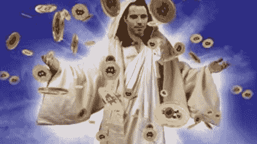
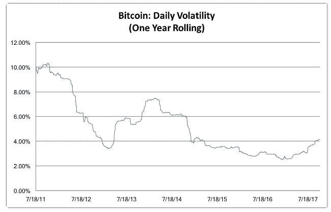
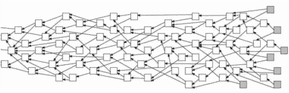
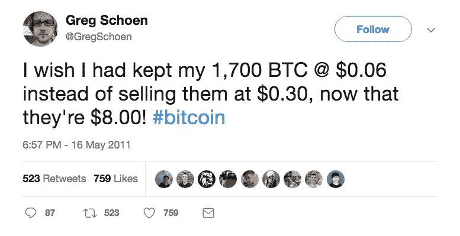

# Crypto(像)是一种宗教吗？& 6 其他隐秘的想法

> 原文：<https://medium.com/hackernoon/is-crypto-like-a-religion-6-other-crypto-thoughts-c12a1e7f0453>

大约四个月前，在我与四位加密思想领袖召开的电话会议上，我看到了加密之光。有些人把光称为去中心化。还有人称之为[区块链](https://hackernoon.com/tagged/blockchain)。我称之为[密码](https://hackernoon.com/tagged/crypto)。暗光如此闪亮，如此明亮，我无法转移视线。

在过去的四个月里，我遇到了数百名神奇的人，他们也看到了隐光。但是，即使比特币的市值达到 1000 亿美元，看到加密光的人还是少之又少。根据 2107 年 5 月发表的剑桥大学的这项研究，大约有 300 万到 600 万人拥有加密货币。他们中有多少人是真正的信徒？

Crypto 在美国消费者新闻与商业频道和彭博的磁带上也有亵渎神灵的异教徒:

但我并不是那些憎恨我的人的帮凶。我继续在媒体上发帖，召开[新的加密电话会议](https://hackernoon.com/how-to-value-cryptocurrency-2-0-conference-call-october-23rd-2-3pm-est-d2d55510b1c4)，召开[加密会议](https://www.meetup.com/New-York-Token-Economics-Meetup/)，作为我传播[加密福音](https://goo.gl/ga3oBd)的方式。我把我的时间花在学习，教学和帮助，密码转换。这是加密社区最高的投资回报率。我也花时间和好奇和开放的人在一起。但是每个人都必须在自己的道路上走向隐秘之光。我的意思是，你如何帮助人们认识到一个算法比他们的政府更值得信任？

那么 Crypto a 像宗教吗？嗯，一些用来描述密码的词确实有宗教含义。但是，对我来说，密码更像物理。区块链让信任成为可能(如果你没有那块手表的话[这个引人注目的 TED 演讲](https://goo.gl/oyWBXp)作者[贝蒂娜·沃伯格](https://medium.com/u/1f0df1cc1ac0?source=post_page-----c12a1e7f0453--------------------------------))。然后，区块链和加密货币结合起来，以前所未有的规模实现去中心化。所以对我来说，密码不是一种宗教。相反，加密是一种坚定的信念，因为这些技术，将会有大规模的破坏和财富创造(比互联网更大)，世界将会是一个更好的地方。如果那个信仰体系是一种宗教，那么我是一个快乐的秘密信徒。

## 2.加密何时会成为主流？

我被问得最多的问题是加密何时成为主流？我的父母、妻子或朋友什么时候才能不再认为我是投资郁金香的[白痴。他们会看到光明吗？](https://goo.gl/fe4mTH)

这个问题让我想起了安迪·萨姆伯格的 SNL 视频[慵懒的星期天。](https://www.youtube.com/watch?v=sRhTeaa_B98)

尽管在 2005 年 12 月，YouTube 是第二或第三大用户上传内容流，但它仍然很小。然后有人将*慵懒星期天*上传到 YouTube 上，那一天，YouTube 成为 Inernet 历史上发展最快的网站。

没人能预料到在 YouTube 上上传*懒惰的星期天*会有什么影响。那是瓶中的闪电。这是这些事情通常发生的方式。这就是 Crypto 将会发生的情况。

最后一点，我要提一下，2005 年，当 YouTube 从我们身边溜走时，我正在经营最大的 UGC 流媒体公司(Yashi)。五年后，当查德·赫利邀请我在 YouTube 上演讲时，我情不自禁。我笑着告诉查德，如果《懒惰的星期天》被上传到雅士上，我们就成了 YouTube 了。乍得笑了，告诉我，我是完全正确的，然后问“但为什么我哥哥会上传到雅士？”。

所以重点是，这是瓶中闪电。但是，我们工作越努力，我们工作得越聪明，我们一起工作得越多，我们就越有可能抓住那道闪光并成为主流。

## 3.治理和令牌经济学是最大的加密风险

两周前，我写了一篇文章,称加密货币面临的最大风险是监管。无论是 SegWit2x，还是正在展开的治理导致了 [Tezos 灾难](http://I was having dinner with a brain surgeon friend last night. When I suggested Bitcoin could became the global stored value of choice. Better than gold. Better then the dollar. He laughed at me. All believers have been laughed at. He asked how people could trust Bitcoin more than the U.S. government. To me, that was comical. Bitcoin is an immutable algorithm. What’s not to trust? I asked if he noticed who the President of the United States is?)，治理都是我们需要提高的一门学科。

不良代币经济学也是加密货币的一大风险。这是我目前正在深入研究的一个领域。如果你感兴趣，加入 [NYC Token Economics Meetup](https://www.meetup.com/New-York-Token-Economics-Meetup/) 。如果你是一个象征性的经济学专家，或者想在你所在的城市 LMK 开一个象征性的经济学会议，请通过这篇文章的评论。

代币经济学和治理也非常相关。不确定这是否完美地抓住了它，但我喜欢提供心理框架的图表:

An Actual Original Thought of Mine

## 4.随着波动性的降低，是时候让 HODL 氏症消失了吗？

[Chris Burniske](https://medium.com/u/619ea0a0ab22?source=post_page-----c12a1e7f0453--------------------------------) 在 Twitter 上发布了一张图表，展示了过去六年比特币每日波动性的长期下降趋势:

虽然“HODL ing”是描述如何应对比特币令人痛苦的波动性的一个很好的术语，但六年来，波动性在很大程度上一直在下降。此外，HODL 有负面的含义，我们这些试图推动行业前进的人应该努力摆脱。

我不是一个搞品牌的人，但我喜欢用“同路人”来形容同为密码爱好者的人。我们一起走在这条神奇的道路上，不知道它将走向何方，但我们坚信它会是一个更美好的世界。这个词的前身来自布尔什维克革命家托洛茨基，他在 20 世纪 20 年代创造了这个词来形容布尔什维克制度的知识分子支持者。在 40 和 50 年代的美国，这是一个贬义词，指在哲学上同情共产主义的人。我要用“同路人”，看看它是否流行。我还在做 [FAMGA。](https://goo.gl/eefqxh)

## 5.达格是一个东西

回到过去，大约两周前，我曾经认为区块链的连续性质是其不变性的关键。事实证明，块(即信息)不一定是连续的(在一个链中)。事实上，他们甚至不需要成为块。根据定义，串行会降低网络速度。因此 Dag 的机会来了。

DAG 代表“[分布式丙烯酸图形](https://goo.gl/zJDiwf)”，其块结构可以是这样的:

From The IOTA White Paper

最著名的 DAG 是 Tangle，这是 T2 IOTA T3 的 DAG 结构，这是一种市值 12 亿美元的加密货币，建立了一个机器对机器的小额支付系统。Dag 还处于早期阶段，加密留言板上充斥着反对者，但根据我本周与处于 Dag 前沿的实体进行的多次对话，我非常确定他们是一回事。

## 6.本周视频

上周，我写了关于[令人敬畏的瑞士瑞信银行密码交响乐团。](https://hackernoon.com/5-thoughts-following-credit-suisses-2017-blockchain-cryptocurrency-symposium-b6fb33e47f9e)你可以在这里看到 A16Z 的加密专家 Balaji Srinivasan 的数据填充开场主题演讲[的视频。](https://goo.gl/teQBpp)

## 7.本周推特

每当有人问我现在投资比特币是否为时已晚，我只会分享 2011 年的这条推文:

*如果你从这篇帖子* ***中获得了至少* 0.00000001 比特币*的价值，请在*** *下方“鼓掌”，这样其他人就会看到这篇帖子。*