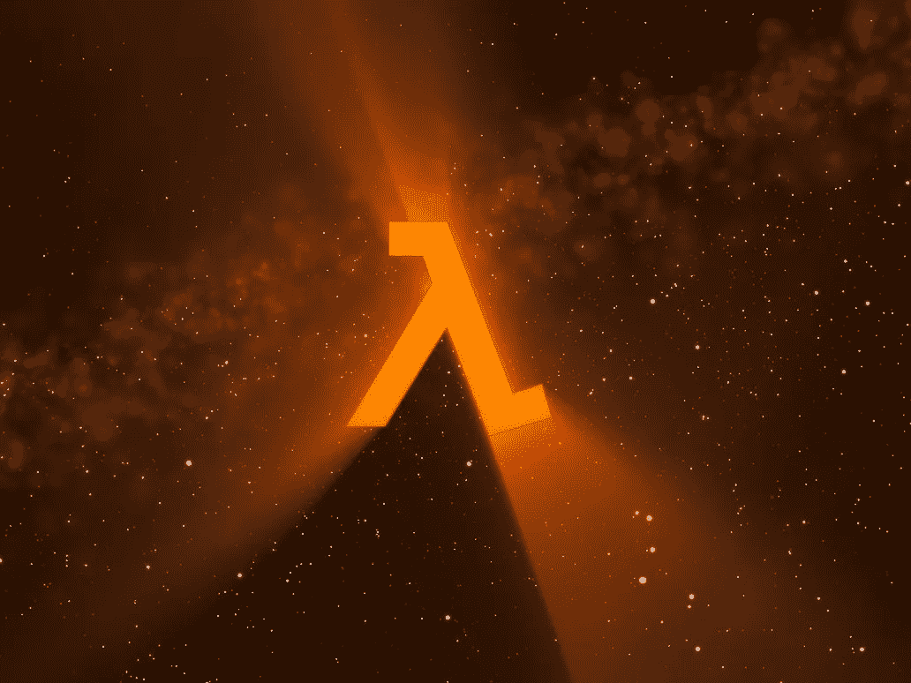

# 函数式编程正在取代 IT 行业吗？

> 原文：<https://medium.com/hackernoon/is-functional-programming-overtaking-the-it-industry-c0c5a535818a>

“Lambda” by xTom at DeviantArt

毫无疑问，近年来人们对函数式编程(或 FP)的兴趣已经显著增长。然而，这并不是 FP 倡导者一直宣称的功能复兴。让我们看看证据…

根据所有主要的语言排名，FP 语言总体上并没有变得流行。在 [TIOBE](http://www.tiobe.com/tiobe-index//) ，排名前 20 的语言没有一个是 FP。在 [Redmonk](http://redmonk.com/sogrady/2016/07/20/language-rankings-6-16/) ，哈斯克尔在#16，Clojure 在# 20；其他排名前 20 的语言都不是 FP。在 IEEE Spectrum 中，我们没有看到 FP 语言，直到 Haskell 排在第 25 位。PYPL 排名第八，哈斯克尔排名第二十。在 2016 年的 [StackOverflow 开发者调查中，最受欢迎的 12 项技术中没有一项是 FP。那么这些 FP 语言都在哪里呢？？？](https://stackoverflow.com/research/developer-survey-2016)

Scala 不是 FP 语言；它是多范例的，支持 FP 和 OOP。Scala 通过成为“更好的 Java”，而不是 FP，获得了一定程度的流行。

JavaScript 不是 FP 语言；它是一种**过程化**语言，对 FP 和对象原型有(弱)支持。它在 web 开发中惊人的受欢迎程度确实提升了 FP 的形象，但除此之外，这种范式很难风靡全球。

虽然几乎所有的主流语言(Java、Python、C#、C++、PHP、Ruby)都在它们的特性集中添加了一流的函数和闭包，但是没有人会以大量使用 FP 的方式使用这些语言。Lambdas 的存在是为了方便那些想写一些 FP 代码的人。

有多少学院和大学甚至教授 FP 语言？几十年来，麻省理工学院一直使用 Scheme(和 SICP)向新生教授编程，但除此之外，计算机科学课程中 FP 的证据很少。

事实上，函数式编程通常更难让人理解。对他们来说，很难理解他们世界中的一切都可以被建模为“函数”的概念。*究竟什么是函数？？？*函数是一组输入和一组允许输出之间的关系，具有每个输入恰好产生一个输出的性质。好的，我明白了……不是。

对于人们来说，将他们的世界建模为“对象”要直观得多每个人都知道物体是什么。你可以看着它，摸着它，指着它给别人看。幼儿园的孩子知道物体是什么。

尽管函数式编程有很多好处，但它并不是 FP 爱好者想让你相信的灵丹妙药。FP 和 OOP 仅仅是有其适当用途的工具。FP 不是万能的解决方案。它也不是没有缺点，例如，见[这个](http://flyingfrogblog.blogspot.ca/2016/05/disadvantages-of-purely-functional.html)和[这个](http://stackoverflow.com/questions/1786969/pitfalls-disadvantages-of-functional-programming)和[这个](https://www.quora.com/What-are-some-limitations-disadvantages-of-functional-programming)。

值得注意的是，Smalltalk 尽管是一种“纯”面向对象语言，却一直有 lambdas。Lambdas 与对象相结合，是 Smalltalk 成为如此强大和高效的语言的原因之一。没错，Smalltalk 不是通常意义上的 FP 语言，但是剥“函数式编程”这只猫的皮的方法不止一种。喵。

> [黑客中午](http://bit.ly/Hackernoon)是黑客如何开始他们的下午。我们是 [@AMI](http://bit.ly/atAMIatAMI) 家庭的一员。我们现在[接受投稿](http://bit.ly/hackernoonsubmission)并乐意[讨论广告&赞助](mailto:partners@amipublications.com)机会。
> 
> 如果你喜欢这个故事，我们推荐你阅读我们的[最新科技故事](http://bit.ly/hackernoonlatestt)和[趋势科技故事](https://hackernoon.com/trending)。直到下一次，不要把世界的现实想当然！

