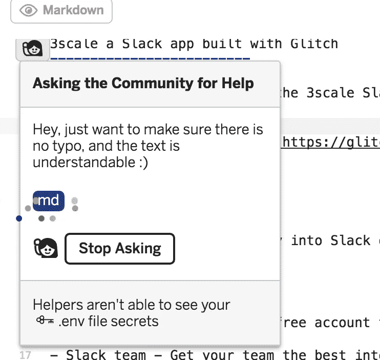
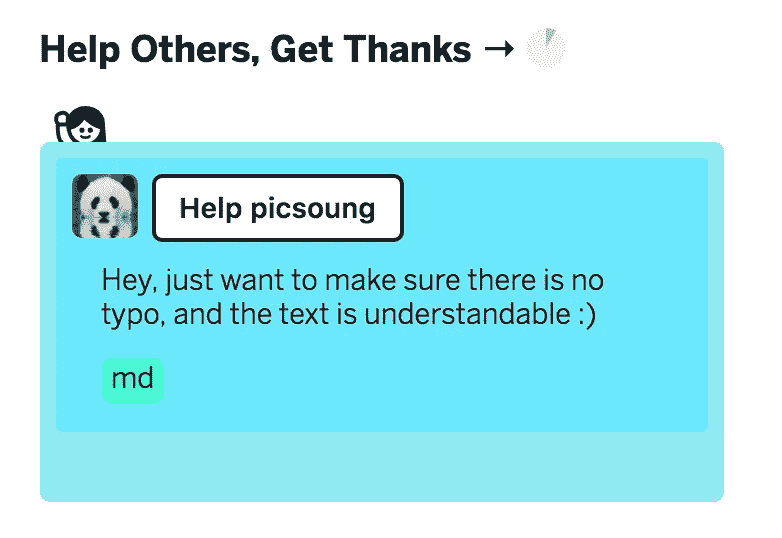

# Glitch 是开发者拥护者最好的朋友吗？

> 原文：<https://medium.com/hackernoon/is-glitch-developer-advocates-best-friend-b91af5b57656>

你听说过格林奇吗？我敢肯定你有，这是今年早些时候由[雾溪](http://www.fogcreek.com)、[栈溢出](http://stackoverflow.com)和[特雷罗](http://Trello.com)背后的公司推出的新产品。

简单来说:Glitch 是一个在线 IDE，混合了协作和社区功能，就像在 [Github](https://hackernoon.com/tagged/github) 中一样。

在使用它之后，我想分享一些关于开发者支持者如何使用这个工具的反馈和想法。

These are the Glitch fish. 🎏

# 啊哈时刻😲🎉

当他们的主页还叫 Gomix 的时候，我已经访问过无数次了。但是我从来没有真正明白使用 Glitch 的意义，直到几年前我在旧金山看到 [DevXcon](http://devxcon.com) 的 [Jenn Schiffer](https://twitter.com/jennschiffer) 和 [Anil Dash](https://twitter.com/anildash) 在舞台上做演示。

在演示期间，他们展示了一个名为**“寻求帮助”**的新功能，其想法是在您的代码中突出显示一个特定的行并寻求帮助。就像你在办公室里做的那样，轻拍你同事的肩膀，让他对你的问题有新的看法。

在这里，通过点击一个按钮，你可以要求社区来帮助你。如果你重新混合(克隆)了某人的项目，他们将会得到通知，并且也会发布在 Glitch 主页上。

How it looks from coder’s perspective

How people see it on front page glitch.com

当我试图寻求帮助时，我等了很长时间，尽管我是唯一一个寻求帮助的人。

这仍然是一个新功能和新产品，给它一些时间😉。

## 背景是关键

从帮助者的角度来看，这也是一个很好的工具，因为它为您提供了更多的问题背景。您会看到编码人员试图构建什么，并对可能出错的地方有一个总体的了解。

在在线论坛或堆栈溢出上很难有这样的上下文。

人们曾尝试使用类似 [Codepen](http://codepen.io) 或 [JSfiddle](https://jsfiddle.net) 的[工具](https://hackernoon.com/tagged/tools)，但确实仅限于前端代码。

有时人们会与支持团队分享他们的 github repo。理论上很棒的想法，但是调试并确保您拥有与他们相同的环境是一件痛苦的事情。

使用 Glitch，您可以确切地看到编码人员所看到的内容。你可以在评论和指导中提供更多帮助。

# 您如何将它用于您的 DevRel 工作呢？👩‍🔧👨‍🔧📣

在他们推出这个基于社区的“寻求帮助”功能之前，我真的看到 Glitch 是一个很好的在线 IDE，可以构建一些有趣的黑客。

现在，我真的看到了作为 API 提供商的全部潜力。它为你提供了与社区互动的新方式。

## 赋予您的编码样本生命🐛🦋

一般来说，API 提供者会提供一些关于如何在一个小应用程序的上下文中使用他们的 SDK 的代码示例。它通常位于 Github 回购协议上。有时会在某个地方提供一个实例的现场版本，这样人们就可以尝试了。但是在开发人员试图根据自己的需要部署他们自己的产品之前，仍然会有一些摩擦。

*分叉回购，本地克隆，安装所有依赖，更新框架版本，启动并测试。*

这可能是一个麻烦，也是你转换漏斗中的另一个漏网之鱼。

有了 Glitch，黑客可以“重新组合”你的例子，修改它，并在几秒钟内看到结果。你已经在你的*“你好世界时间”*中赢得了一些宝贵的时间。

## 内嵌支持💬

正如我们所看到的，有了新的帮助功能，如果有人寻求帮助，您将作为项目的所有者得到通知。这意味着你可以做出反应，迅速回答开发人员的问题，让他们“解脱”。它给人一种积极的体验。

你甚至可以按语言或框架来组织你的项目(到目前为止，只支持 Node)，你的语言专家会被特别通知。

## 品牌意识和社区回报🎁

Glitch 是真正以社区为中心的，有大量的项目有待发现。你可以根据自己的优势来使用它。你可以鼓励活跃的社区开发者在 Glitch 上发布他们的项目。这有助于他们被公认为伟大的黑客，也有助于您的社区获得更多可用的示例。

还有一些策划类别，如**精选**或**社区精选。让你的项目被选中将有助于接触到更多的开发者。**

## 这确实是为平台而设计的🔌🛠

看啊！他们有一个特殊的部分给我们:[平台故障](https://glitch.com/forplatforms)

# 下一步是什么？🎏

尝试一下，在那里开始一个新项目，并试验这如何改变开发人员的体验。

就我个人而言，我已经用它为 [3scale](http://3scale.net) 构建了一个 Slack bot。起初，我想我会做一些人们可以重复使用和适应的东西，但我也看到了一些“无服务器”替代方案的潜力。所以现在这个应用程序更复杂了，我将用它来分发我们的 Slack bot。那总是一个选择。

此处检查项目[。](http://glitch.com/edit/#!/horse-chatter)

我很想听听你对你的 DevRel reach 所使用的工具的想法。

> [黑客中午](http://bit.ly/Hackernoon)是黑客如何开始他们的下午。我们是 [@AMI](http://bit.ly/atAMIatAMI) 家庭的一员。我们现在[接受投稿](http://bit.ly/hackernoonsubmission)，并乐意[讨论广告&赞助](mailto:partners@amipublications.com)机会。
> 
> 如果你喜欢这个故事，我们推荐你阅读我们的[最新科技故事](http://bit.ly/hackernoonlatestt)和[趋势科技故事](https://hackernoon.com/trending)。直到下一次，不要把世界的现实想当然！

