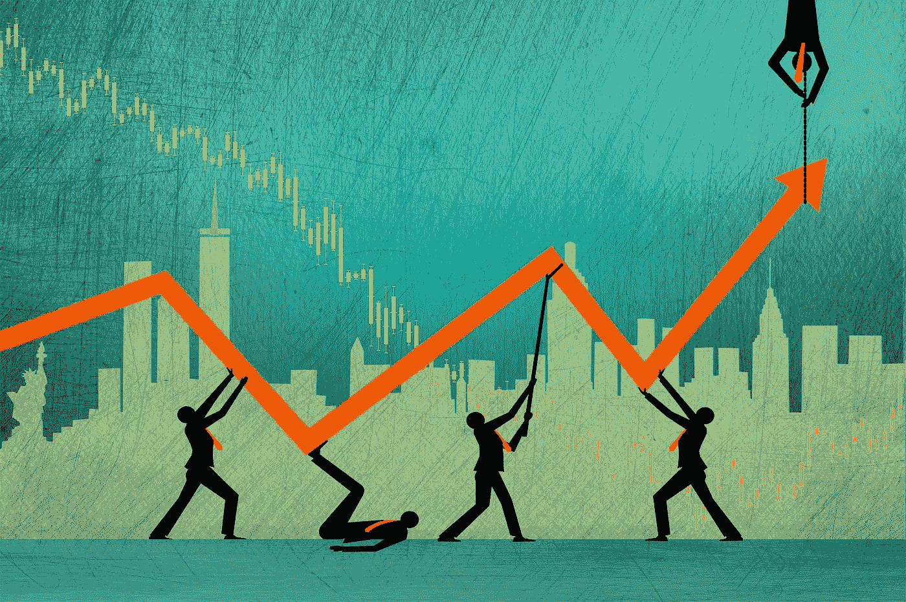
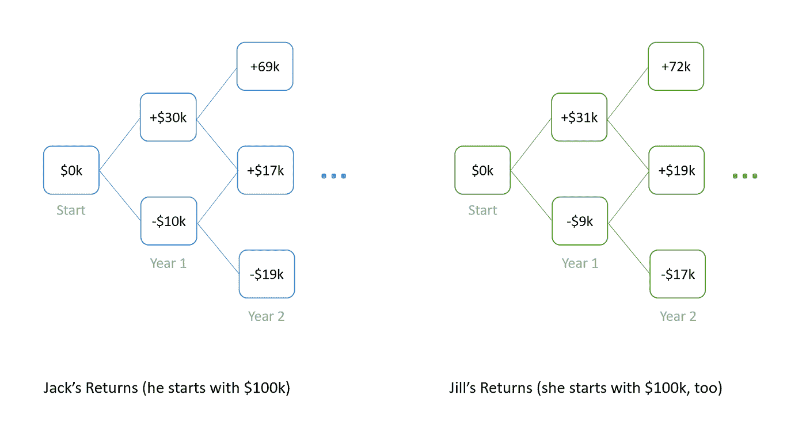
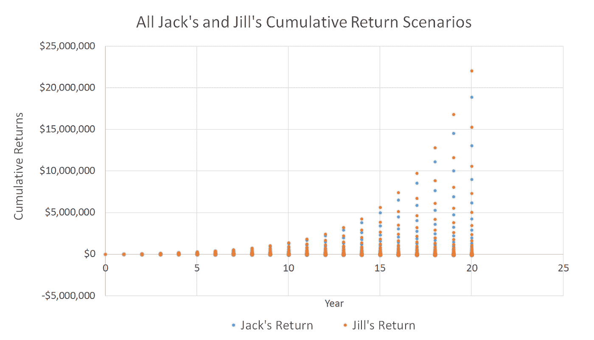
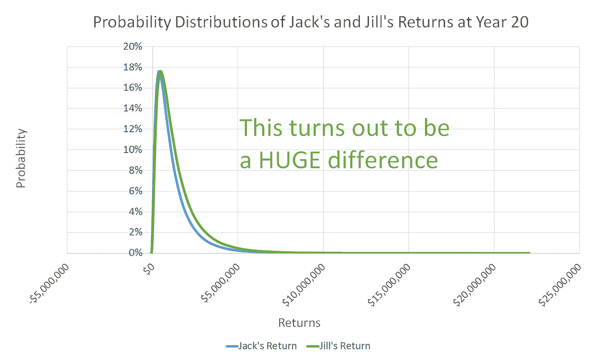
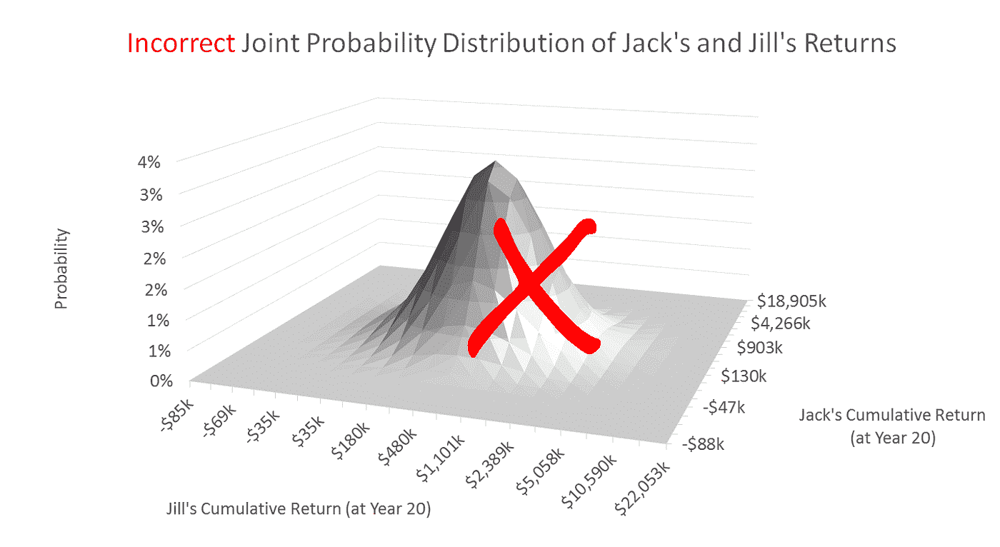
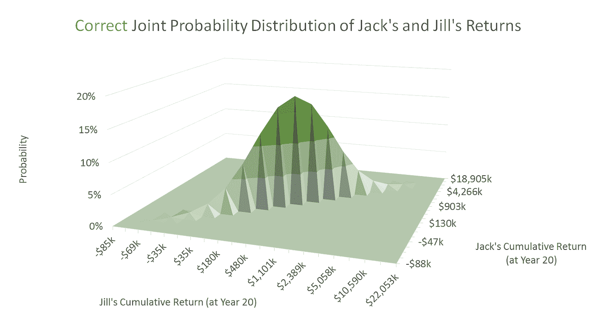
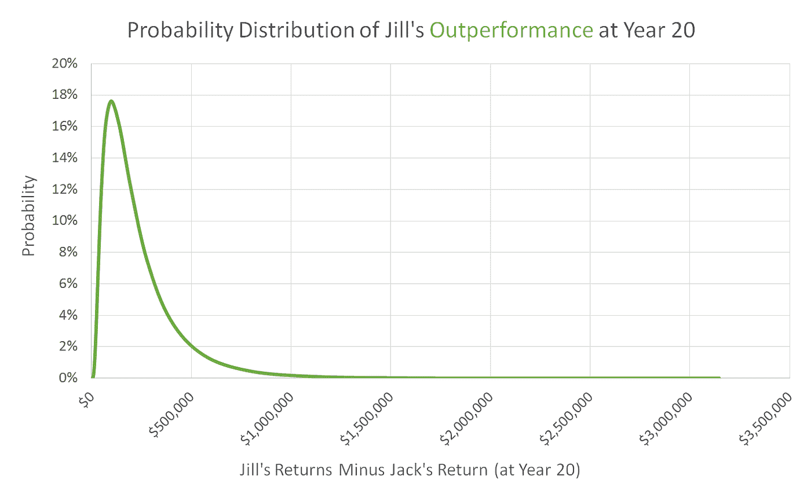

# 投资是运气多过技巧吗？错误的问题。

> 原文：<https://medium.com/hackernoon/is-investing-more-luck-than-skill-wrong-question-157e9542c517>

一篇名为[投资更多是运气而不是天赋](http://nautil.us/issue/44/luck/investing-is-more-luck-than-talent)的文章在著名的科技论坛黑客新闻中被选为第一名。*这从根本上说是错误的，这就是为什么它很重要。*

我的职业生涯经历了科技和对冲基金，所以当一篇投资相关的文章成为黑客新闻的头条时，我总是很感兴趣。金融界非常需要科技界的观点。那篇由一位商学院教授和知名学者撰写的文章提出了几个有趣的论点:

1.  极端的财富不平等是一个问题，有一些数学模型可能有助于解释这个问题。*这部分我大体同意。*
2.  根据一个简单的模型，观察到的财富不平等的分布暗示，富人之所以富有是因为运气，而不是技能。许多努力工作的人可能不同意这一点。
3.  即使投资者有一些技巧，也不会有什么不同。**这是错误的。**

***他的论点中的最后一个关键点被证明是逻辑上有缺陷的，导致对任何投资或正在考虑*** [***投资***](https://hackernoon.com/tagged/investing) ***的人产生危险的误导性结论。***

# **杰克和吉尔**

对于最后一点，文章提出了一个思想实验:

*   考虑两个投资者杰克和吉尔。杰克只是一个获得市场回报的普通人。吉尔是个投资奇才。
*   每年有两种情况:杰克要么 A)下跌 10%，要么 B)上涨 30%。这两种情况都有可能发生。这些情景大致符合+10%/年的长期股票回报和 20%的波动性。
*   因为吉尔是一个熟练的投资者，她每年有 1%的超额收益。因此，她的预测是 A)下降 9%或 B)上升 31%——两种可能性都一样。
*   杰克和吉尔都以 10 万美元开始投资。

作者总结道，经过 20 年漫长的投资，吉尔只能在 56%的时间里领先杰克，即使她有每年 1%的优势。这似乎是如此违反直觉。我的投资经验告诉我，小优势随着时间的推移会变得巨大。很自然地，我不得不埋头于电子表格来解决这个问题。

回报情景基本上是一棵树，它们的概率遵循二项分布。当我们将这一时间延长到 20 年，并以同样的尺度绘制结果时，我们会看到一幅有趣的画面:

很明显，随着时间的推移，有几个场景是杰克和吉尔都把*真的*做好了。事实上，到了 20 岁，他们总体上都表现得很好:

然而，我们正在调查的说法引用了杰克和吉尔的*相对*表现。这将涉及一个关于杰克和吉尔的场景如何相互关联的假设。这就是作者出轨的地方。他似乎认为杰克和吉尔的上升和下降场景是完全不相关的。这意味着 20 年期的联合回报分布如下所示:

果不其然，这与作者声称 Jill 只在 56%的情况下做得更好相一致。**不过，这很不对劲。事实上，杰克和吉尔的回报场景并不是完全*不相关*(就好像他们生活在平行的世界，或者不同的时代，或者暴露在完全不同的市场中)**。事实上，他们的回报情景是完全相关的，因为他们在同一时间投资，并暴露于同一市场。杰克投资于广阔的市场。Jill 接触到了同样广阔的市场，而且她有自己的秘方，这让她每年都能跑赢 1%。

如果我们正确地假设回报是相关的，回报的联合分布如下:

这种分布要“瘦”得多——杰克胜过吉尔的情况更少。事实上有*没有*这样的场景:

哇，作者结论是错误的——*事实是，正如他构思的那样，吉尔这位专业投资者每年在 100%的时间里都会跑赢大盘，因为她的跑赢表现超出了杰克经历的相同市场回报。* **事实上，她的平均表现是+133%(或约 133，000 美元)**，尽管可能低至+3%(约 3，000 美元)或高达+3，148%(或超过 300 万美元)。

这两种极端情况都不太可能发生，但事实上，它们都是积极的。同样值得注意的是，在 Jill 表现最出色的场景中，Jack 自己也做得很好，上涨了 189 倍(或上涨了近 1900 万美元)。同样，这种最极端的情况不太可能发生(0.0001%的可能性)。

这里的关键见解实际上是显而易见的，基于作者如何构建这个例子——不需要数学。不管市场是涨是跌，吉尔每年都做得更好。因此，如果不管市场状况如何，她每年都做得更好，她怎么可能会落后呢？

# **重要的是**

事实上，这些“某些”优势通常并不存在。然而也有不确定的因素，这些因素也会在很长的时间内累积起来(尽管它们可能不会让 Jill 100%地领先)。**我想这篇文章真正让我恼火的是它对投资不屑一顾的失败主义论调。**好像它在有效地说“这个系统是被操纵的，所以为什么还要尝试。”**然而，从他的例子中得出的更明显、更符合逻辑、更实用的结论是:**

1.  如果你早期投资，并持续投资，你就可以积累大量的财富 *无论你是有技能还是仅仅投资于 ETFs 指数。平均而言，杰克增长了+573%，吉尔增长了+706%*
2.  ***投资并非没有风险****——***但是如果你长期投资，你损失很多钱的情况就不太可能出现**
3.  *如果你碰巧有一技之长，看似很小的优势随着时间的推移会累积成巨大的优势*

*那么投资是“运气大于技巧”吗？错误的问题。正确的回答是“你的部分表现超出了你的控制——好吧——那么你应该投资吗？”正如这个例子所表明的，不管你有没有优势，答案都是响亮的“有”。**

*假设你已经还清了所有的信用卡债务、高息债务、有一笔应急基金、能够承受一些损失等等。这不是投资建议。*

*本文所表达的观点仅代表作者在撰写本文时的观点。作者不认可本出版物中的任何链接内容或任何其他内容。此通信仅用于讨论目的。过去的回报不能保证未来的结果。本通讯中的任何内容都不构成投资建议、出售要约或购买证券要约的请求。*

******

> *[黑客中午](http://bit.ly/Hackernoon)是黑客如何开始他们的下午。我们是 [@AMI](http://bit.ly/atAMIatAMI) 家庭的一员。我们现在[接受投稿](http://bit.ly/hackernoonsubmission)，并乐意[讨论广告&赞助](mailto:partners@amipublications.com)机会。*
> 
> *如果你喜欢这个故事，我们推荐你阅读我们的[最新科技故事](http://bit.ly/hackernoonlatestt)和[趋势科技故事](https://hackernoon.com/trending)。直到下一次，不要把世界的现实想当然！*

**