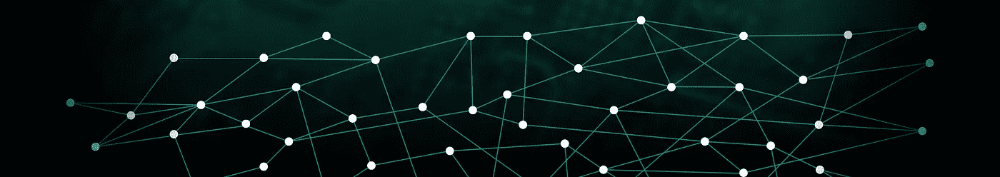

# IOTA 是不是火到小跑区块链了？

> 原文：<https://medium.com/hackernoon/is-iota-too-hot-to-trot-blockchain-a73d562e2091>

Source: [https://insights.ubuntu.com/2017/02/20/iota-iot-revolutionized-with-a-ledger/](https://insights.ubuntu.com/2017/02/20/iota-iot-revolutionized-with-a-ledger/)

让我们一起从基础开始，我保证在这篇文章结束时，你可以自己决定 IOTA 是否有潜力破坏[区块链](https://hackernoon.com/tagged/blockchain)的开创性[技术](https://hackernoon.com/tagged/technology)！

> **什么是 IOTA？而为什么会被营销为“第三代加密货币”？**

IOTA 基本上是纳米交易的加密货币，它使交易能够以闪电般的速度发生。这个最酷的部分是它绝对不收*交易费*(或气)，最酷的部分是它能*抵抗量子威胁*！这里没有智能合同或 dApp 这样的东西。IOTA 在 2017 年 6 月成功进入 Bitfinex。IOTA 令人吃惊的部分是它使用区块链技术。它基于一种新的分布式分类账，叫做— **Tangle。** Tangle 有无限的可扩展性，不像区块链根本没有可扩展性。随着纠纷的增加，越来越多的参与者进行交易，整个系统变得越来越安全和快速，确认时间/交易最终性下降。

This is what Tangle’s design looks like. Source: [http://iota.org/](http://iota.org/)

因为 IOTA 支持纳米事务，所以它是为满足 IOT 设备内的事务需求而特制的。这意味着像人类一样使用以太坊，或者比特币；IOT 机器将使用 IOTA。想象一下，一台智能冰箱代表你订购鸡蛋并为其付款！这种交易不仅仅限于机器对供应商，也包括机器对机器。想象一下，一个机器人付钱给另一个机器人，因为它提供了服务。(就像我们在餐厅给服务员小费一样。)这一切的发生，都是因为 IOTA。机器+人工智能已经够吓人了，现在又要变成机器+人工智能+钱了。

# IOTA 将会创造一个全新的事物经济！

> **IOTA(Tangle)和区块链有什么不同？**

Tangle 克服了当前区块链设计的低效率，并引入了一种在去中心化的对等系统中达成共识的新方法。Tangle 和 Blockchain 是两种完全不同的架构，恰好建立在相同的原则上。

谈 IOTA 的数据结构:Tangle 不是遵循顺序块链的结构，而是基于有向无环图(DAG)。通过这一点，IOTA 能够实现高交易吞吐量(通过并行验证)并且没有交易费用。

> **是什么让 IOTA 量子证明？**

IOTA 使用基于哈希的签名(https://www.imperialviolet.org/2013/07/18/hashsig.html)，而不是椭圆曲线加密(ECC)。基于散列的签名不仅比 ECC 快得多，而且还大大简化了整个协议(签名和验证)。真正使 IOTA 量子安全的是我们使用 Winternitz 签名的事实。IOTA 的三元哈希函数叫做 Curl。

目前的区块链是**而不是**量子验证的。很可能在 20-30 年后，量子计算机将被制造出来，它们可以强行进入你的以太坊或比特币钱包，整个 IT 安全可能面临巨大的打击！

> **为什么没有交易费？**

这是通过 IOTA 达成共识的独特方法实现的。IOTA 中没有挖掘器/验证器。tangle 网络中的相邻节点是验证事务的节点。

在区块链中达成共识的方式是通过一种非常严格的机制，这需要多方相互“竞赛”，试图将下一个区块添加到区块链中，并获得区块奖励/交易费。

> 【IOTA 主要用例:

首要关注领域显然是物联网，尤其是在智能城市、基础设施和智能电网、供应链、交通和移动等领域。除此之外，IOTA 还可以作为任何对等交易结算需求的主干，例如网络支付甚至汇款。

所以我们已经看到 IOTA 克服了区块链目前的劣势。现在，可以肯定地说 IOTA 有潜力颠覆区块链！