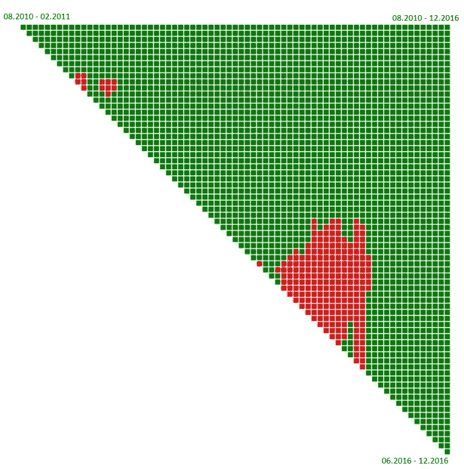

# 现在是买比特币的好时机吗？满足 DCA 战略(2018 年更新)|隐薯

> 原文：<https://medium.com/hackernoon/is-it-good-time-to-buy-bitcoin-meet-the-dca-strategy-2018-update-cryptopotato-65124980cf5d>

2016 年，在所有其他法定货币中，比特币为投资者创造了最高的回报。根据这一统计，最近许多人问我是否购买比特币，以及现在是否是加入这一行列的好时机。首先，我从不向任何人推荐任何投资，只是因为当他们不得不在更糟糕的情况下获利或减少损失时，我不会再在那里。另一方面，作为一个旨在成为加密世界专业资源的网站，我觉得有义务回答这个关于购买比特币的流行问题。

在我写这几行的时候，比特币巩固了大约 1000 美元的水平。从现在开始是涨还是跌？世事难料。我的答案是一样的，即使这个问题是在今年早些时候比特币价格为 400 美元时提出的。

**更新 2018** —我们处于更高的数字，但结论保持不变。

# 满足美元成本平均战略

美元成本平均(DCA)交易策略是我们实际上将购买量平均分成小部分，每部分将在一致的时间间隔内购买。这些间隔可以是每周一次、每天一次或每季度一次。使用这种方法购买有明显的心理优势，因为我们不太担心我们的购买价格。DCA 以长期投资为目标，强烈推荐安心投资比特币等波动性较大的资产。这种方法的另一个好处是非常适合支付投资，比如我们工资的一部分。不需要大量的资金投入，不是每个人都有的。

DCA 方法的缺点是在牛市中利润没有最大化。然而，纵观历史，在某些时期，DCA 在美国证券交易所的投资比一次性投资获得了更高的利润。另一个缺点是需要坚持购买固定的数量，即使你感觉情绪低落，很想买更多，反之亦然。

# 2010 年以来比特币的 DCA:惊人的投资回报率，相对较低的风险

与 Bitrated 的 Nadav Ivgi 共同进行的比特币历史数据分析得出了一些有趣的结论。该分析提到了自 2010 年以来比特币的交易数据，当时比特币价值几美元，直到 2016 年底。我们有意忽略了 2009 年比特币价值几分钱的数据。

该分析基于通过 DCA 投资的模型，即每天购买固定数量的比特币。有趣的是，该系统在大多数进入点和退出点都产生了正 ROI，事实上，投资 DCA 至少 2.5 年可确保 100%的正 ROI。即使是对于那些在 2013 年末 1160 美元左右的历史高点加入比特币的人来说。顺便说一下，令人惊讶的是，那些从 2010 年 8 月到 2016 年 12 月坚持使用 DCA 的人获得了令人难以置信的 58，685%的投资回报。

# 对上图进行解释

图表中的每个方块代表从 2010 年 8 月到 2016 年 12 月的投资期，最短期限为 6 个月。正方形的颜色代表 ROI:绿色代表正回报，红色代表负回报。最上面一行最左边的方块代表测得的第一期(2010 年 8 月至 2011 年 2 月，每天投资固定金额)。

每条线开始于新的一个月，而更远处的每个方块代表另一个月。例如，顶行左侧第二个方块代表从 2010 年 8 月到 2011 年 3 月的返回。第二行左边的第一个方块代表 2010 年 9 月到 2011 年 3 月之间的返回。

红色方块的集中发生在 2013 年末和 2014 年初，大约是比特币首次达到历史最高水平的时候。这一级别的第二次访问发生在一个多月前，即 2017 年初。

# 收场白

总之，DCA 投资方法非常适合长期比特币投资。人们认为，由于供应有限，比特币将随着时间的推移继续上涨。然而，没有人知道现在是否是加入的好时机，或者价格是否太高。DCA 投资方法是这方面的理想选择。

# 完整的图表，包括投资周期和投资回报率

*原载于 2017 年 2 月 18 日*[*【cryptopotato.com】*](https://cryptopotato.com/time-buy-bitcoin-meet-dca/)*。*