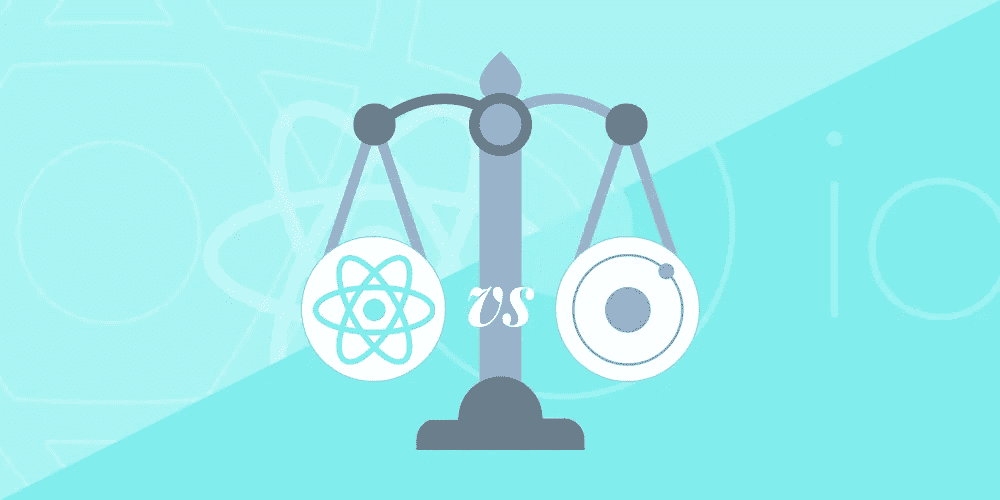

# 构建应用程序:反应本地与离子

> 原文：<https://medium.com/hackernoon/is-it-possible-to-save-money-and-still-deliver-good-experience-to-a-user-45ea2bae1f83>

有没有可能既省钱又能给用户带来好的体验？这个问题在任何商业领域都是可行的，包括生产和服务。当一个要求很高的客户希望尽快收到他的产品，同时又希望该产品质量上乘时，这一点尤其正确。当然，他想确保他的钱用在最有效率的地方。在大量的开发公司中，不断向用户提供好的体验是一个底线。您的竞争优势可以是您使用的创新技术，这有助于您优化开发过程。

当你开始使用新技术时，你不能确定它是最好的解决方案。在大多数情况下，一些问题渴望通过时间周期和项目数量。在本文中，我们将根据我们在前端开发中的实时经验，对 React Native 和 Ionic 这两个框架进行比较。

无论是为我们自己还是为客户开发各种产品时，总有一个问题让我们感兴趣:我们如何减少产品开发的时间和成本。

Android，尤其是 iOS 开发者一直都很受重视，成本也很高，当开发两个平台时，一个人要花两倍的钱。

在某个时候，我们在用科尔多瓦做实验，但感觉好像我们不能从中获得什么有价值的东西。

然后我们注意到了爱奥尼亚。从工程师的角度来看，这正是我们所需要的——现代的框架，专注于移动应用程序和看似简单。

我们在几个应用中使用这个框架作为组件，并在这个框架上创建了十几个应用。

然而，随着时间的推移，我们开始注意到一些警钟。项目不能按时完成，有时调试花费太多时间。我们认为所有这些问题都可以通过改进我们的实践，对设计和架构改进给予更多的关注来解决。然而，实际上问题不在于过程，而在于技术。

因为我们想给你两个框架的比较，我们决定列出我们遇到的主要离子问题:

***** **反应时间。**即使使用了一些技术手段，它仍然很棒；

***** **配合滑出式键盘，整体输入。**这导致了很多问题，在大量设备上保持这种状态真的很难；

***** **，**调试，特别是使用 ngCordova 硬件特性的项目。

我们与您分享了我们使用 Ionic 的经验，并确定了我们工作中出现的主要问题。现在，我们将为您提供详细的框架比较，并向您解释为什么 React Native 是我们开发人员的更好解决方案。

我们总是试图获得不同技术的更多专业知识，并在实践中使用它们，以便定义最佳解决方案。这就是为什么在 Angular 项目的同时，我们开始使用 React，随着时间的推移，社区引入生态系统的想法对我们的项目变得如此明显有用，以至于 Angular 慢慢被从技术解决方案中挤出来。你可以在我们的 Angular vs React 文章中了解更多细节。

从脸书宣布支持 Android 的那一刻起，我们就在关注 React Native，并开始做一些尝试。我们还继续观看 Ioinc2，它被认为是一项创新，可以解决我们在使用 io Inc 1 时遇到的许多问题。

给定框架的方法非常不同，但对我们来说，React Native 是最终的赢家。

我们选择的**主要反应本地优势**相对于 Ionic1/2 更胜一筹:

*   可与本地应用相比的响应时间。
*   能够重用桌面(web 应用程序)和移动(移动应用程序)甚至服务器的代码部分(不是所有代码)。(:-))
*   开发人员非常方便的工具链，允许快速开发和调试应用程序。
*   大量来自脸书的精致组件。
*   来自社区的更多组件。
*   能够在开发中实现函数式编程的思想，这确保了应用程序的高度稳定性和可靠性，以及相对简单的扩展。

然而，我们在这里并没有指出 React Native 是 100%完美的。我们还选择了一些**反应原生劣势**对比原生应用:

*   那些与硬件解决方案、相机、外部库集成等相关联的代码部分仍然在本机部分中完成。
*   javascript 和 native part 的接口没那么简单(但不比 cordova 复杂)。
*   ReactNative 不是“写一次就可以在任何地方运行”,它是一个需要探索的独立故事。

那么什么时候可以使用 ionic/2 呢？我们自己选择了**两种最适合的情况**来使用给定的框架:

***** 当你已经有一个写在 ionic/angular 上的 app

***** 当你的应用高度依赖现成代码时，Ionic 将是最佳选择(与我们使用 MathJax 和 mathquill 显示和输入数学表达式的情况相同)。

当你谈论你使用的工具时，你不能保持客观。总有一个是你更喜欢的。这个选择取决于你的项目，你的团队和你的需求。我们刚刚与你分享了我们的经验。选择最适合你的选项。

[*安东·沙列尼科夫*写的](https://www.linkedin.com/in/anton-shaleynikov-45812a1/)

*想了解更多？* [*点击这里查看*](https://dashbouquet.com/blog)

> [黑客中午](http://bit.ly/Hackernoon)是黑客如何开始他们的下午。我们是阿妹家庭的一员。我们现在[接受投稿](http://bit.ly/hackernoonsubmission)并乐意[讨论广告&赞助](mailto:partners@amipublications.com)机会。
> 
> 如果你喜欢这个故事，我们推荐你阅读我们的[最新科技故事](http://bit.ly/hackernoonlatestt)和[趋势科技故事](https://hackernoon.com/trending)。直到下一次，不要把世界的现实想当然！

