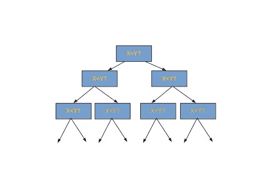

# 有可能比 O(n*log(n))时间更快地对数组排序吗？

> 原文：<https://medium.com/hackernoon/is-it-possible-to-sort-an-array-faster-than-o-n-log-n-time-a053b942c5fe>

这个问题可能出现在每个曾经接触过**算法设计和分析的人的脑海中。**通常我们假设对 n 元素数组进行排序的最佳时间是 O(n*log(n))，事实证明这个假设也是可以证明的。

事实证明，当我们将自己限制在基于比较数组元素的**排序算法时，这**是不可能的**。
时间复杂度的下限可以通过将排序视为一个**过程**来证明，其中数组中两个元素的每次比较都会给出更多关于其内容的[信息](https://hackernoon.com/tagged/information)。我们可以把这个过程想象成一个树形结构的子过程链。**

让我们假设“x < y ?” means that some elements x and y in the array are compared. This expression if true evaluates that the process continues to the left, and otherwise to the right. The results of the process are the possible ways to sort the array and this amounts to n! possible ways.

1+ 2+ 3+ 4+ 5+……+n sub-processes = n! ways.

Now, taking log2 on both the sides-

**log2(1)+ log2(2)+ log2(3)+..+ log2(n) = log2(n！)**

现在我们选择最后的 n/2 个元素，并将每个元素的值修改为 log2(n /2 ),因此我们可以将上面的表达式写成
**log2(n！)≥ (n /2) * log2(n /2)**

所以树的高度和最坏情况下排序算法中的最小可能步骤数至少是 n *log(n)。

因此，我们以简化的方式将上述计算总结如下

我们有一个高度为 log(n)的流程树，由于总数组大小为 n，因此在每一层我们至少要做 n 项工作。将这两者结合起来，我们可以得到对数组排序的总 n*log(n)步数。

参考:竞技程序员[手册](https://hackernoon.com/tagged/handbook)

> [黑客中午](http://bit.ly/Hackernoon)是黑客如何开始他们的下午。我们是 T21 家庭的一员。我们现在[接受投稿](http://bit.ly/hackernoonsubmission)并乐意[讨论广告&赞助](mailto:partners@amipublications.com)机会。
> 
> 如果你喜欢这个故事，我们推荐你阅读我们的[最新科技故事](http://bit.ly/hackernoonlatestt)和[趋势科技故事](https://hackernoon.com/trending)。直到下一次，不要把世界的现实想当然！

