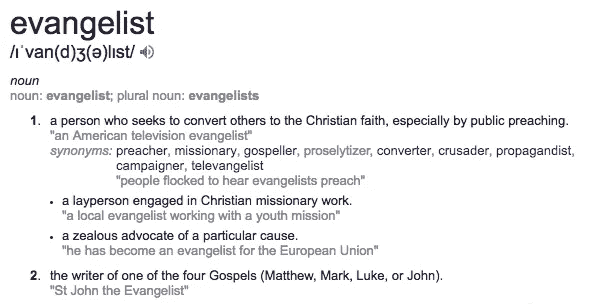
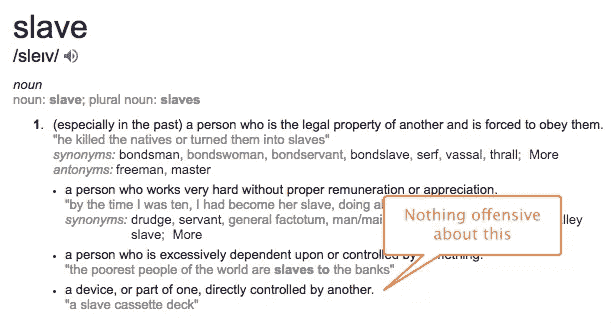
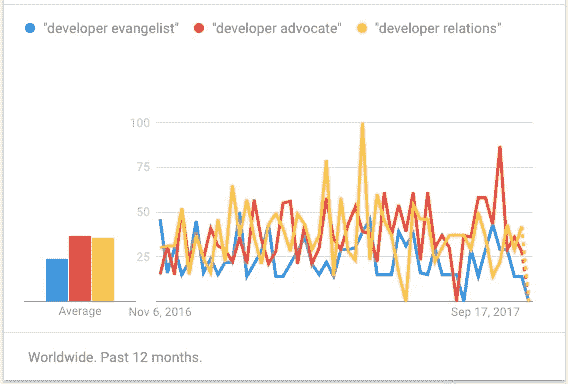

# 是时候停止称自己为开发者传道者了吗？

> 原文：<https://medium.com/hackernoon/is-it-time-stop-calling-yourself-a-developer-evangelist-a56a66ae06ed>

我们最近[开始在 Ably](http://jobs.ably.io/o/developer-advocate-in-london-part-remote) 招聘一名开发者布道者，每当我写下*布道者*这个词时，我都忍不住感到有些不舒服。

作为一名无神论者，母亲是犹太人，父亲是天主教神父，生活在一个似乎被宗教问题困扰的世界里，我意识到自己可能对带有宗教内涵的词语有点敏感。然而，这里存在一个问题。人们，你的员工或同事，可能对你用来描述他们潜在工作角色的词语很敏感，我们都应该注意这一点。

在《哈佛商业评论》的一篇关于[反思政治正确性](https://hbr.org/2006/09/rethinking-political-correctness)的文章中，作者谈到了一名员工抱怨他们不满意的事情的问题，因为他们可能认为这是对他人的偏见。通过在职位名称中使用“传道者”这个词，这个问题很可能适用于那些可能是你产品的有力倡导者，但由于他们的宗教信仰，不愿意称自己为你商业产品的传道者的人。让我们看一下福音传道者的定义来理解为什么:

因此，我们可以看到，福音主要是关于宗教信仰系统，但也包括“一个特定事业的热心倡导者。”

> 没错，那么根据那个定义，可以用福音传道者这个词吗？

当然，如果你不在乎人们对你使用的词语的感受，而不在乎他们认可的定义是什么。

以臭名昭著的 Django Github 关于主/从术语使用的问题为例。在短短两周多的时间里，在收到来自社区的近千条评论后，这个问题最终被锁定，以防止任何进一步的评论。这里有两件事需要注意，虽然这与我对开发者福音传道者的想法有关:

1.  **奴隶*这个词从技术上来说并不具有攻击性***

因此，问题不在于这些词在技术上是否正确，而在于它是否对那些对这些词有负面含义的人不敏感。

**2。这个问题被合并了，所以社区(或者至少是维护者)同意是时候抛弃旧的潜在的攻击性术语了**

> 好的，但是我不明白，据我所知，福音传道者并没有负面含义，所以你为什么建议我们停止使用它？

很好，你可能是大多数人的一部分。但是这些示例人物角色很可能不同意:

莎拉牧师
她将自己的一生奉献给了一项她认为远远超越任何世俗生活目标的事业。她利用业余时间传播基督教信仰，并认为她的人生目标是帮助人们发现基督教。她还喜欢编程、与人交往以及所有与科技相关的事情，并希望成为一家很酷的新科技企业的倡导者。她发现称自己为 Acme 和上帝的传道者是令人不快的，因为这破坏了她基督教信仰体系的重要性。Acme 提供了一份工作(她喜欢)，但上帝是为了生活。

**无神论者马特** 嗯，这只是我的看法，我不相信上帝，但我仍然对什么是福音传道者有自己的看法，这是一个宗教观点。我是[干练](https://www.ably.io)的首席执行官，也是我们[实时数据平台](https://www.ably.io/platform)的强烈拥护者。我相信这将改变世界，我是其中的一员。但我很现实，10 年后可能会出现，也可能不会，有一天我可能会像在 Econsultancy 工作了 15 年一样继续前进(Econsultancy 是我之前参与创办的一家公司，也是它的大力支持者)。我是一个强烈的倡导者，但我不是一个布道者。Ably 不是一个事业或宗教，相反，我相信它是一个伟大的产品，可以帮助社区，我想大声宣扬它。

我们是技术社区的一部分，这个社区在政治上是正确的，对影响少数民族的问题非常敏感。我提议做一个小小的改变，但这个改变可能会让每个人都感觉更舒服，所以我主张我们在商业机构前进的工作角色中停止使用*布道者*这个词。

> 有道理，但我到底该怎么称呼它呢？

对于开发者福音传播者来说，最常用的角色描述是:

*   开发商代言人
*   开发者关系

幸运的是，似乎后两者正在赢得这场比赛。让我们帮助取得令人信服的胜利。

**延伸阅读:**

*   [如果你感兴趣的话，我们正在招募一名 e̶v̶a̶n̶g̶e̶l̶i̶s̶t̶开发者代言人](http://jobs.ably.io/o/developer-advocate-in-london-part-remote)
*   [道格拉斯·克洛克福特和政治正确性走得太远](/the-mission/pr-nightmares-when-political-correctness-goes-too-far-829674495114)
*   [编程语言的宗教战争](http://uk.businessinsider.com/why-coders-get-into-religious-wars-over-programming-languages-2015-6?r=US&IR=T)，r [eligion 毁灭程序员](https://simpleprogrammer.com/2013/07/08/how-religion-destroys-programmers/)，[避免编程中的宗教](http://skilldrick.co.uk/2010/08/avoiding-religion-in-programming/)和[软件开发是宗教](https://blog.codinghorror.com/software-development-its-a-religion/)
*   [开发者福音手册](http://developer-evangelism.com/)

Matthew O’Riordan, CEO, [Ably](https://www.ably.io)