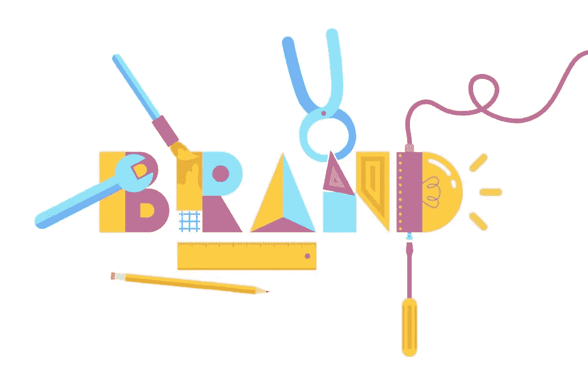

# 是时候为你的创业公司定义一个新的类别了吗？

> 原文：<https://medium.com/hackernoon/is-it-time-to-define-a-new-category-55460d3518ac>

Defining your brand category

# 作为参考框架的品牌类别

一个品牌的参照系是其定位的基础。它将决定品牌必须达到的对等点，以被视为合法的参与者，并强调差异化的机会。因此，你的品牌需要符合人们理解和联系的品牌类别框架，才能真正“理解”你的品牌。正如加州大学伯克利分校教授乔治·莱考夫解释的那样，参照系是绝对必要的，如果弄错了，你的差异可能会被忽略:“框架提供了一种心理结构，塑造了我们看待世界的方式。如果一个强有力的框架不符合事实，事实就会被忽略。”

想要将事物归入一个类别是人的天性。你的产品越有创新性和颠覆性，就越需要一个能引起人们共鸣的框架。如果你的品牌不容易被定义，人们通常会把它推到边缘，让它留在那里。这是因为它的复杂性更容易被忽略，而不是弄清楚。

人们紧紧抓住他们对一个类别是什么和它能提供什么的既定理解。选择正确的类别是关于定义或框定人们正在购买的东西，以这样一种方式来展示你的价值。目标是确定最佳类别，帮助您的客户“获得”您的价值，并使其与他们相关，同时使您的竞争对手处于劣势。

# 当你的品牌类别不适合你的品牌时

如果你想发展你的品牌，确保你的品牌类别仍然适合这个品牌。对于一些品牌来说，他们最初定位的类别不再满足他们的需求。如果你符合下面的任何一个标准，也许是时候脱离你现在的类别了。

*   您的类别正处于危机或已失宠。
*   你目前的类别阻止了你的关键差异脱颖而出，成为“必备”
*   你正在改变你的战略方向，你的商业模式也在转变。
*   你创造了重大的创新或专利优势。
*   竞争扼杀了你的成长能力。
*   您已经准备好将您的品牌扩展到当前客户群之外。

# 是时候创建一个新的品牌类别了

创建一个新的品牌类别可能是定位你的品牌取得成功的最佳方式。但是，创建一个新的类别是非常困难的。对于大多数公司来说，很难解释你的产品是做什么的，以及它与你的竞争对手有什么不同。对于许多公司来说，解释和维护一个新产品类别的任务可能太多了。

然而，创建一个新类别的回报是巨大的。[从 2009 年到 2011 年，创造了自己类别的快速增长公司占据了 74%的市场资本增量](https://hbr.org/2013/03/why-it-pays-to-be-a-category-creator)。与只向市场提供增量创新的公司相比，类别创造者经历了更快的增长，并从投资者那里获得了更高的估值。

在创建新的类别之前，请考虑您的企业是否有可用的资源和时间。不只是为你的品牌定义一个新的类别，而是给类别本身打上品牌。最后，如果你做得好，创造一个新的品类可以改变你的品牌和业务。

在我们即将发布的帖子中，寻找定义新类别的最佳实践以及应该避免的错误。

Emotive Brand 是一家旧金山品牌战略公司。

*原载于 2016 年 7 月 18 日*[*【www.emotivebrand.com*](http://www.emotivebrand.com/brand-category/)*。*

> [黑客中午](http://bit.ly/Hackernoon)是黑客如何开始他们的下午。我们是阿妹家庭的一员。我们现在[接受投稿](http://bit.ly/hackernoonsubmission)并乐意[讨论广告&赞助](mailto:partners@amipublications.com)机会。
> 
> 如果你喜欢这个故事，我们推荐你阅读我们的[最新科技故事](http://bit.ly/hackernoonlatestt)和[趋势科技故事](https://hackernoon.com/trending)。直到下一次，不要把世界的现实想当然！

