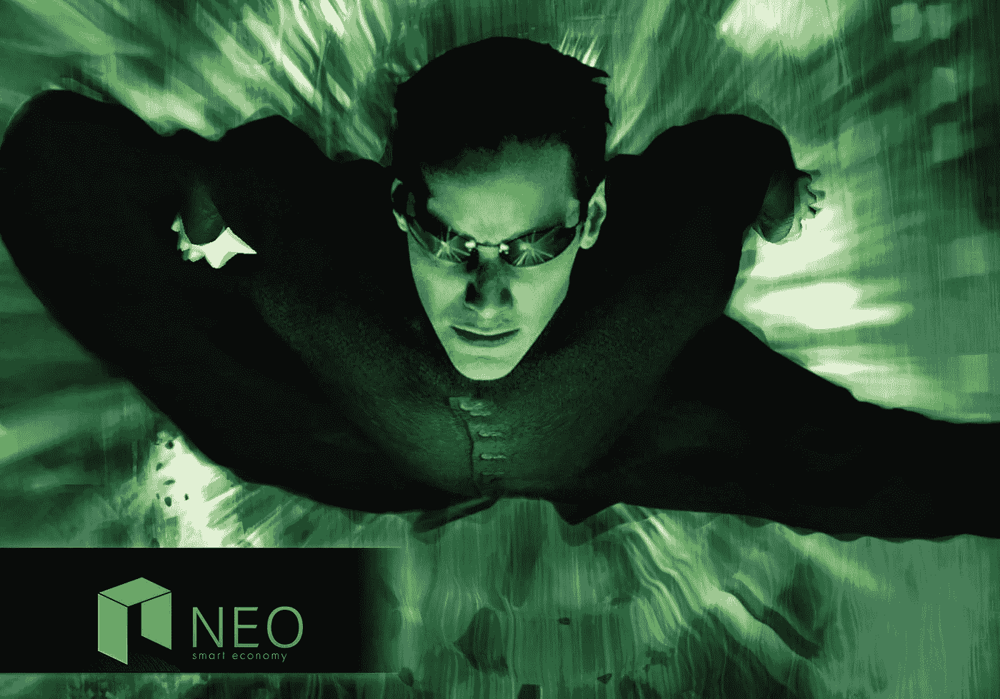

# 尼奥是你的真命天子吗？

> 原文：<https://medium.com/hackernoon/is-neo-the-one-67799886b78f>

有一个新的加密平台出现了，而且是一鸣惊人。

见见尼奥。

被称为“中国以太坊”的“T1”仅在上周就上涨了 400%以上。它一飞冲天，进入了[硬币市值](https://coinmarketcap.com/)的前五名，超过了老牌的莱特币。

投资人恋爱了。新闻媒体也是。一场[般的故事狂潮](https://cointelegraph.com/news/suddenly-nem-aka-chinese-ethereum-is-up-376-percent-reasons-trends)在[流行媒体](https://www.forbes.com/sites/nikolaikuznetsov/2017/08/10/neo-co-founder-banks-on-blockchain-to-build-a-smart-economy/#6af70f21d267)报道了它的迅速崛起。《赫夫邮报》滔滔不绝地说“[NEO 能成为世界上最大的密码吗？](https://www.reddit.com/r/CryptoCurrency/comments/6taay5/can_neo_become_the_largest_cryptocurrency_in_the/)”

当你以一个密码的身份出现在 Huff 的帖子上时，可以肯定地说你已经突破了。他们不是硬币报道的中心。

但是 NEO 是我们一直在等待的平台吗？它会改变全球金融格局并永远重塑矩阵吗？

我翻遍了公司背景、网站和[白皮书](http://docs.neo.org/en-us/index.html)一探究竟。

# 营销闪电战

是什么让 NEO 的硬币在交易市场上着火了？

事实证明这是一场聪明的营销闪电战。

尼奥其实并不新鲜。它自 2014 年以来一直存在，有一个不幸的名字“Antshares”。因为没人喜欢虫子(除了我)，他们明智地把这个可怕的名字改成了在北京微软总部的一场声势浩大的活动。

是的，他们选择这个名字是因为它参考了《黑客帝国》,因为它在希腊语中的意思是“新的，年轻的”。

那么他们到底是做什么的呢？他们为了区块链的 Mozilla moment 开发了世界上最伟大的 iPhone 应用程序吗？他们有一种神奇的新加密货币吗？

不完全是。

事实上，他们使用的是非常古老的一篮子货币。它叫菲亚特。

来自他们的白皮书:“NEO 将使用菲亚特作为其内部货币。”

是的，我说的是美元、人民币、日元等。

这到底是怎么回事？结果证明了很多。这是他们白皮书中许多惊喜的第一个，有些好，有些不太好。

# 集中式去中心化的区块链？

尼奥对区块链采取了一种非常不同的方式，一些人会喜欢，另一些人会绝对讨厌。

首先，它没有真正的加密硬币。他们努力成为旧金融系统的桥梁，拥有智能合同、证书、身份和法律合规性。

那么，在交易所交易的让每个人都赚了这么多钱的硬币是什么呢？

这是新硬币，但它不是推动区块链前进的引擎，就像以太坊为以太坊网络提供动力一样。相反，新硬币基本上是一种传统的证券。它就像是运营平台的公司的股份。许多新硬币在早期的 ICO 中出售，并赠送给早期的捐赠者。其余由公司自己持有，多达或超过 50%:

> “NEO 团队持有的剩余 50%的 NEO 股份将在 NEO net 使用 NEO smart 合同后锁定 1 年。1 年锁定期，这部分 Neo 将用于维持 NEO 的长期发展。”

他们甚至称之为“股票”，就像传统的交易证券一样。

这几乎是我见过的最适合[豪威测试](http://consumer.findlaw.com/securities-law/what-is-the-howey-test.html)的了。但当然，这是一家中国公司，所以不受美国证券交易委员会的规则约束。

像以太坊一样，他们确实使用“天然气”来运行平台，但购买天然气来执行智能合同的是菲亚特。他们专注于一个经典的观点，即货币需要成为“稳定的价值储存手段”保罗·克鲁格曼(Paul Krugman)等中间派、大政府、喜欢官僚主义的经济学家总是用这句话来质疑比特币和其他密码:“它不是稳定的价值储存手段。”比特币和其他货币波动剧烈。

尼奥对这个问题的解决方法很简单。不要使用密码。就用菲亚特吧。

嘭！

他们通过利用一个已经存在的(菲亚特)创造了一个稳定的价值储存库，并在一个单一的镜头中桥接了新旧金融系统。使用菲亚特可以让传统的金融巨头使用智能合约这一革命性的新技术，这一技术将改变我们在世界各地的经营方式。

但是什么是智能合同呢？

这是“代码即法律”

基本上它是一个作为程序执行的法律文件。现在你可能认为将法律文件转化为代码是不可能的，因为考虑到国会的一些法案有《战争与和平》、《指环王》、《T2》和《冰与火之歌》、《T4》和《T5》之和那么大。但是如果你仔细想想，法律文件看起来已经很像代码了。它们有" [if/then](https://rosettacode.org/wiki/Conditional_structures) "语句、循环和变量。

当我经营自己的公司时，我必须处理合同和大量的法律费用。但是在看了我的律师从一个法律资料库下载了一个模板，填写空白并修改了几行之后，我想，“我也可以这样做。”早在我听说智能合同之前，我的工程师的大脑就说“那看起来像代码。”那些填空的是变量。XYZ 控股公司(“业主”)。在文件的其余部分，所有者被替换为 XYZ 控股公司。

合同实际上只是一堆条件。如果这种情况发生，那么这种情况就会发生。如果某某在公司干了三年，他或她会得到这么多股份。如果有人违反这一规定，这就是惩罚。

所以法律框架变成实际的代码并不奇怪。智能合约仍然有些原始，但在未来几年，它们的复杂性和实用性将会激增。

想象一下，一份智能合同可以充当最后的遗嘱。这些硬币在区块链自行保管，然后定期发放给受益人。我母亲在她的遗嘱中规定，如果我想取出一大笔钱，我姐姐和我都必须同意。妈妈认为我姐姐或我会跑去买一些疯狂的东西，而没有检查我们邪恶的力量。天啊。谢谢妈妈。信任你的孩子！

有了一份正规的书面合同，我姐姐和我就可以利用这个系统了。我们可能会聚在一起，付钱给监督遗嘱支出的律师，让他对该条款睁一只眼闭一只眼，这样我们就可以随时取钱了。但是一份聪明的合同阻止了这种情况的发生。我姐姐和我会拿着私人钥匙，我们必须同时打开它们来释放现金。

这样的合同将在几年内成为标准，到我足够老的时候，纸质遗嘱将看起来像一部旋转式电话。

NEO 希望提高智能合同的水平，以减少和取代整个商业世界的复杂合同。他们想让像[供应链资产](https://www.forbes.com/sites/joemckendrick/2017/04/21/why-blockchain-may-be-your-next-supply-chain/)这样的财产跟踪变得容易和自动化。事实上，从 T2 猪排到债券和花生酱，区块链是追踪一切的更好方法。这就是为什么 T4 纳斯达克在区块链花了这么多钱，也是为什么美国商业中心特拉华州通过了进步的区块链立法。

本质上，NEO 想要主宰未来的电子合同。他们希望通过在这一领域的努力创新，他们可以让今天的公司更容易在区块链做生意。

这是一出聪明的戏。

对于那些认为密码货币是一群疯狂疯狂的郁金香的人，比如[这个白痴](http://splinternews.com/all-this-bitcoin-stuff-is-fake-1797714696)和[这个白痴](/@hapsam/i-cant-help-but-put-cryptocurrency-in-the-same-bucket-as-tulips-f7b67d701984)，我很抱歉，但你大错特错了。你不明白这不仅仅是网络呆子的钱，这是一个全新的金融技术浪潮。

哦，我会把我的预测记录与一周中任何一天的记录进行对比。作为一名工程师和科幻作家，二十年来我一直靠预测未来赚钱。

作为一名系统架构师，我已经提前几年帮助公司发现趋势。在大多数人对 Docker 容器、深度学习和软件消费模式一无所知之前，我就开始宣扬它们了。当我还是个孩子的时候，当我的招聘人员告诉我把所有的时间都花在学习 Solaris 上的时候，我告诉他们在我致力于这个叫做 Linux 的新东西的时候，去跳进湖里。我在 2004 年投了一张[人工智能卡](https://hackernoon.com/steal-this-idea-and-make-a-billion-dollars-ai-video-game-accelerator-cards-cf5f09fd84e8)，大约在英伟达开始研发它的十年前。

# 尼奥:好的，坏的和丑陋的

但并不是所有的玫瑰与 NEO。白皮书中有些东西我也不喜欢。

除了智能合同，他们还希望将区块链世界中两种相互竞争的理念结合起来:链上交易和链外交易。

如今，在比特币和以太坊等加密货币中，链上交易是大多数货币的流动方式。当我把比特币发给某人时，它会向全网广播。矿工会核实交易，一旦他们确定我没有试图在某个地方重复花费我的硬币，他们就会把它放在一个街区。但是，链上交易有一些严重的瓶颈，正如关于比特币 1 MB 区块限制的持续争论所展示的那样。

像[闪电网络](https://lightning.network/)这样的链外解决方案提出，通过在链外完成大部分交易，并仅在一段时间后或在发生争议时将大量小交易的捆绑结果刷新到主链，来大幅加快传输速度。这使得公众区块链成为争端的最终仲裁者，但大多数日常行动发生的外链系统。

NEO 将这两个概念结合到一个平台中。他们称之为“联合会计”模式。企业可以在主链之外进行交易，使用自己的验证方法，然后将交易推送到主链。这与 Ripple 和 Bitshares 等其他平台处理资产转移的方式形成了鲜明对比。

来自白皮书:

> “Ripple、BitShares、NXT 等都是分散功能的区块链，但没有分层设计。区块链本身充当分类账和交易匹配器。在这样的区块链中，挂单、撤单、撮合等操作都记录在区块链上。”
> 
> “虽然 NEO 支持链上的资产交换，但区块链本身并不通过一种称为‘超导’的机制提供订单簿和订单匹配功能。”
> 
> 在超导交易下，交易双方不需要将财产托管给中介(传统交易所)。用户只需要向交易所发送用他们的私钥签名的订单。在交换匹配买方和卖方订单并广播交易之后，交易完成。自始至终，财产没有离开使用者的控制，杜绝了传统的道德风险。超导交易机制下的交易所只起到信息匹配的作用。"

从表面上看，这很棒。企业可以使用自己的规则转移资产。他们甚至可以记录传统金融支付和转移的结果，如使用信用卡为工厂购买一些螺丝钉。然后，他们可以将销售结果推送给主链。

不幸的是，这为各种欺诈敞开了大门。由于用户和/或公司完全控制了他们私人链上的交易，他们可以很容易地将订单翻倍，并篡改系统。白皮书建议通过“交易所将用户列入黑名单，作为一种惩罚和威慑的方式”来解决这一问题

我不确定这是否足够。NEO 将有许多早期的挑战需要克服。不是说做不到，而是他们已经打开了潘多拉的盒子。

# 遗产持续很长时间

我不喜欢 NEO 的另一点是使用集中证书在网络上充当 id。

> “个人用户和组织可以通过政府授权的 CA 认证机构进行认证。链链上的股权登记由实名认证的公司进行电子签名。股份的转让和交易由转让人、受让人和公司进行。在三方签署之前，公司有义务保证股份的转让和交易符合《公司法》的规定，即需要获得原股东的同意、原股东的认购权和股东人数的限制。股权转让和交易的性质是当事人进行电子签名的电子合同。"

从表面上看，这是另一个奇妙的想法。通过允许公司证明其资产，他们可以在完全控制的情况下为其公司发行股票，同时轻松遵守现有的 KYC(“了解您的客户”)法律和反洗钱法律。这是件好事。

它还利用了一个我们已经使用了很长时间的系统，即中央认证机构。

问题是集中式证书并不那么可信。他们[密谋监视每个人](https://arstechnica.com/information-technology/2010/03/govts-certificate-authorities-conspire-to-spy-on-ssl-users/)，发布[假证书](https://www.schneier.com/blog/archives/2011/03/comodo_group_is.html)并被黑客攻击。我们需要一个[信任网](https://en.wikipedia.org/wiki/Web_of_trust)来真正使证书对攻击具有鲁棒性和弹性。

值得称赞的是，NEO 认识到了这一挑战。他们计划“利用区块链维护证书撤销列表，逐步形成一套基于区块链技术的数字证书系统和身份认证方案。”

但是，传统技术往往会比设计者希望的时间长得多。问问微软就知道了。他们所做的决定困扰了他们几十年。我们仍然有一个 programs (x86)目录(尽管大多数人除了 64 位处理器已经用了很多年了)和一个臃肿的二进制注册表。他们没有确保用户在操作系统上以很少的特权运行，而是让每个人都以管理员身份运行，然后试图在此基础上改进安全性。没用。这就是为什么 Windows 仍然是各种病毒和其他恶性动物的磁石。

即使 NEO 设法逐步淘汰集中颁发的证书，他们也必须年复一年地支持它们，因为与它们一起颁发的所有旧合同仍然需要执行。

更糟糕的是，通过选择法定货币作为主要货币，私人链来验证交易/防止欺诈，以及集中控制的 ID 数字证书机构，NEO 平台对集中化做出了大量妥协。称之为[带有去中心化特征的](http://newlearningonline.com/new-learning/chapter-4/deng-xiaoping-socialism-with-chinese-characteristics)。不难想象，在一个系统中，区块链只不过是当前金融系统的数据库，充斥着浪费、欺诈和巨额合规成本。他们可能最终锁定网络的割据，并以更快的速度迎来[分裂的互联网](https://en.wikipedia.org/wiki/Splinternet)，而不是联合世界和[锁定开放的](https://techcrunch.com/2016/10/09/a-decentralized-web-would-give-power-back-to-the-people-online/)。

有点糟糕。区块链技术为我们提供了一种升级世界金融和信任系统的方法，而不仅仅是将旧问题嫁接到新系统上，同时我们给它涂上一层新的油漆。

我可能过于苛刻了。NEO 背后显然有一群聪明的人。

澄清一下:我非常喜欢他们所做的事情。

他们不只是做了一个品牌重塑，他们完全修改了他们的理念和架构，以适应当今金融世界的现代现实。虽然以太坊和其他公司坚定地致力于改革金融，但他们专注于迭代和进化。

几乎在每一个方面，他们都绝对实现了他们设定的目标，那就是“建立一个能够弥合与现实世界资产差距的金融体系。”

他们巧妙地找到了一种方法，将未来技术与传统系统融合成一个优雅的混合系统。

从长远来看，它可能不是我们改变世界所需的系统。

但这可能正是我们现在需要的系统*。*

*##########################################*

*注意:NEO 在我发表这篇文章后三天左右更改了他们的白皮书，所以许多引用现在都不见了。原来的链接断了。我已经更新了新白皮书的链接。在新的报纸中，对菲亚特的引用以及其他一些东西都消失了，但我的分析在很大程度上保持不变，这是基于我对新报纸的阅读。他们只是清理了一下，让它更有针对性。*

*############################################*

*如果你喜欢我的作品**，请考虑在我的个人主页****上捐赠，因为这是我们改变未来的方式。帮助我脱离黑客帝国，我会百倍地回报你的慷慨，把我所有的时间和精力集中在写作、研究和为你和世界提供令人惊叹的内容上。***

***###########################################***

## ***如果你和我一样热爱加密领域，那就来吧，加入 [DecStack，这是一个虚拟的加密货币和分散式应用项目的合作场所](http://decstack.com/)，在这里你可以接触到这个领域的多个项目。永远完全免费。只是进来和社交，一起工作，分享代码和想法。通过反馈让你的想法更好。寻找新朋友。见见你的新家人。***

## ***如果 NEO 团队的任何人想要来和我聊天/辩论或分享其他项目，请务必来 DecStack.com。你会发现那里有几十个项目。我们现在比大多数项目的 Slack 都要大。***

***############################################***

*****如果你喜欢这篇文章，我很乐意你能打小心脏推荐给别人。之后，请随时将文章通过电子邮件发送给朋友！非常感谢。*****

***###########################################***

******

***[Photo credit](https://extranewsfeed.com/the-winds-of-world-war-iii-8bc369584f67)***

***关于我:我是一名作家、工程师和连续创业者。在过去的二十年中，我涉及了从 Linux 到虚拟化和容器的广泛技术。***

****你可以看看我的最新小说，* [***一部史诗般的中国科幻内战传奇***](http://amzn.to/2gAg249) *在这部小说中，中国挣脱了共产主义的枷锁，成为世界上第一个直接民主国家，运行着一个高度先进、人工智能的去中心化应用平台，没有领导人。****

## ***当你加入我的读者群，你可以免费得到一本我的第一部小说《蝎子游戏》。读者称之为“神经癌的第一次严重竞争”和“黑色侦探会见约翰尼记忆术。”***

## ***你也可以查看一下基于书中想法的[蝉开源项目](http://iamcicada.com/),这本书概述了如何立即将该技术变为现实，你也可以参与其中。***

## ***最后，你可以[加入我的私人脸书小组，Nanopunk Posthuman 刺客](https://www.facebook.com/groups/1736763229929363/)，在这里我们讨论所有的科技、科幻、幻想等等。***