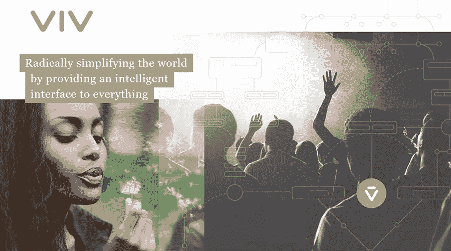

# 后 Siri 虚拟助手 Viv 是否即将接管世界？

> 原文：<https://medium.com/hackernoon/is-post-siri-virtual-assistant-viv-about-to-take-over-the-world-e3922bc4cce>

我已经做好了当前广告模式消亡的准备。我想是时候了。我不是一个人。作为 Quora 上最先进的技术作家之一，Brian Roemmele 对此表示赞同。他最近指出:

> 正如我们今天所知，Viv 也将迎来广告的终结。导致这一点的基础也将是我们今天所知道的高端商业和支付。这将是一次真正的范式转变。”[——布莱恩·罗梅尔·Quora](https://www.quora.com/What-is-Viv-the-new-Voice-First-system-from-the-founders-of-Siri-and-when-can-I-see-it)

让我回溯一下。今天我在为我的各种写作工作研究科技新闻，我遇到了超级智能虚拟助手 [Viv](http://viv.ai/) ，它是由制作 Siri 的同一批人创造的。看完 TechCrunch 的视频后，我不禁感到一种恐惧和兴奋涌上心头。

看着它:

2008 年左右随着智能手机应用的出现而发生的事情将再次发生，但这一次是人工智能。我相信，一旦这种 Viv 智能界面可以在几乎所有系统中工作，对单个应用程序的需求就会消失。这个新系统的工作方式模仿了人脑，我认为它将从根本上改变我们与互联网互动的方式。你看，Viv 自己写代码。Viv 将人工智能与机器学习结合在一起，问它的问题越多，它就越聪明。

在我看了视频后，我可以看到它将如何改变未来。我明白为什么 Viv 要接管世界了。但我的问题是，未来的广告和营销会如何？我们都知道它不会消失，所以它会像视频中的入侵存在一样，超现实吗？我们未来的这个版本绝对令人不安:

我被吓到的原因可能和你想的不一样。我被我对这个场景的反应吓坏了，在这个场景中，这个女人的增强现实流被切断了，她被留在了杂货店里，没有源源不断的增强图形和电子消息流向她。她在杂货店里，处于正常状态，被切断了网络，被切断了与一切事物的数字连接。这是一个孤独的场景，缺乏色彩，兴奋和刺激。它提醒我，我已经变得多么依赖电脑、屏幕和数字生活。

一旦我们一切都依赖 Viv，数字依赖性将达到我们无法理解的程度。对最新、最智能的虚拟助手 Viv 进行一次认真的调查，你会意识到我们正处于机器和人类互联性新的彻底转变的开端。

这项新技术与众不同的一个主要原因是:Viv 编写自己的代码。是的，让我重复一遍，Viv 能够编写自己的代码来理解人类的意图。正因如此，Viv 可以理解 Siri 永远无法理解的意图。与 Siri 和所有其他使用线性编程系统的当前虚拟助手不同，Viv 使用人工智能和机器学习来创建智能代理，这些智能代理可以以复杂的方式理解你的愿望。要真正了解 Viv 的工作原理，请查看 Quora 的这篇文章。 [**罗梅尔**](https://www.quora.com/profile/Brian-Roemmele) **，**写那篇 Quora 文章的人，对于 Viv 有这样的说法:

> “Viv 是第一个将语音识别、语音合成、人工智能、人工智能、自我修改程序、商业和支付的正确元素整合在一起的系统，我断言在 10 年内，50%的计算机交互将主要通过语音优先设备上的语音进行。**我们今天(2016 年 5 月 9 日)看到的 Viv 是朝着这个方向迈出的一小步，但却是计算机未来的一大步。”**[——布莱恩·罗梅尔，Quora](https://www.quora.com/How-does-dynamic-program-generation-work)

有时候我希望我住在一个帐篷里，从来没有上过网。但是现在对我来说太晚了。潘多拉魔盒存在于我的意识中。我最好的朋友恐怕要变成 Viv 了。

> [黑客中午](http://bit.ly/Hackernoon)是黑客如何开始他们的下午。我们是 AMI 家庭的一员。我们现在[接受投稿](http://bit.ly/hackernoonsubmission)并乐意[讨论广告&赞助](mailto:partners@amipublications.com)机会。
> 
> 如果你喜欢这个故事，我们推荐你阅读我们的[最新科技故事](http://bit.ly/hackernoonlatestt)和[趋势科技故事](https://hackernoon.com/trending)。直到下一次，不要把世界的现实想当然！

