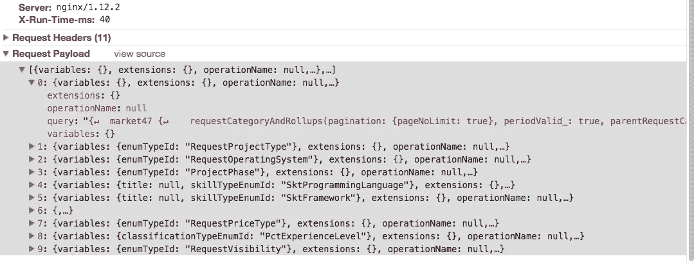

# 服务器端渲染是 React 应用的好选择吗

> 原文：<https://medium.com/hackernoon/is-server-side-rendering-a-good-choice-for-react-application-f6975755f555>

像 [react](https://hackernoon.com/tagged/react) 这样的单页面应用提供了极好的用户体验，然而，它也带来了两个问题:

1.  对于第一次访问网站的用户来说，浏览器中没有 [javascript](https://hackernoon.com/tagged/javascript) 的缓存，如果 react 应用庞大，下载 javascript 并执行可能需要很长时间。那么第一次渲染的时间就很长。
2.  html 是通过运行 react 应用的 javascript 在浏览器中生成的，那么 SEO 就成问题了。

服务器端渲染(SSR)的出现解决了上述问题。在服务器上运行 react 应用程序并将渲染后的 html 返回给客户端听起来很棒，然后当客户端在后台运行 react 应用程序时，客户端可以直接渲染 html，但不会重新渲染，因为生成的 DOM 树是相同的。然后搜索引擎会看到网页的 html。在过去的一年里，我写了 [nashorn-polyfill](https://www.npmjs.com/nashorn-polyfill) 在 JVM 中运行 SSR。但这也带来了一些问题:

1.  在服务器端渲染 react 应用程序甚至需要更长的时间。通常它通过两个过程进行渲染:第一个过程是运行所有需要的 API 来收集数据(例如`react-apollo`中的`getDataFromTree`，第二个过程是生成 html 的渲染。对于复杂的应用程序，生成 html 可能需要 1 秒以上的时间，并发性能可能是 5 页/秒。(存在等待 API 返回数据的空闲时间，该时间用于呈现其他请求)。这意味着它需要大量的服务器来满足高流量的请求。
2.  每次页面访问都会触发服务器端渲染，即使浏览器缓存了 react 应用程序的 javascript。当没有缓存时，它可能会减少首次渲染的时间，但如果有缓存，实际上会增加首次渲染的时间。假设页面有两个 API 调用`A`和`B`，但是它们应该顺序运行。当它在服务器上运行时，服务器不会渲染生成 html 的第二遍，直到它们都被解析，但当它在浏览器中运行时，它运行`A`并在`A`解析时渲染任何可以渲染的内容，然后运行`B`并在`B`解析时再次渲染。由于这一根本差异，首次渲染可能总是需要更长的时间。

如果 SEO 对你的应用不是那么重要，那么做 SSR 的最大需求就没有了。如果很重要，最好只对搜索引擎做 SSR，而不是对人类。它可以通过基于用户代理的 web 代理重定向请求(我没有这样做过，理想情况下应该可以)。

(**更新**:对于已认证的内容，没有必要做 SSR，因为搜索引擎无法抓取。那么 SSR 只适用于未认证/公开的内容，这意味着每个人看到的都一样，除了那些基于匿名 cookie 的内容。可以在 SSR 服务器前面建立一个`squid`服务器，以便缓存和提供每个唯一 url 的输出，并且可以显著减少 SSR 服务器上的负载。)

当只在浏览器中渲染时，有一些方法可以提高首次渲染的性能和时间。

在复杂的应用程序中，一个页面可能需要生成 10 多个 API 请求。这不仅增加了服务器处理请求的负担，而且对客户端也有不利影响，即每个解析的 API 调用都将触发重新呈现，并且大的网络延迟对性能的影响更大。

在我的例子中，我使用 GraphQL 而不是 RESTful API，并且我使用了`apollo-client`，它有一个很好的特性，可以在一个请求中批处理多个 GraphQL 调用。

您可能注意到`X-Run-Time-ms`对于 10 个 GraphQL 查询只有`40`毫秒(这是本地开发环境)。通常，后端服务器需要对每个请求进行身份验证。有 10 个请求意味着后端服务器需要经历 10 次认证，而在一个请求中批量处理它们只需要一次。

对于 React 应用中需要认证的页面，通常是先调用 API 获取用户信息，然后根据用户信息显示菜单和内容。这导致了顺序 API 调用模式:第一个 API 调用用于用户信息，第二个用于其他内容。

我们如何避免这种连续的 API 调用来获取用户信息？考虑一种类型的服务器端呈现，`rehydrate`SSR 返回存储的状态，客户端使用它作为初始状态来合并客户端存储(在这种情况下为`redux`)。通常，获取用户信息的 API 调用不依赖于任何东西，应该是相同的。如果我们总是在服务器上运行获取用户信息 API，而不是通过新的服务器端呈现方式，会怎么样呢？这可以通过传统的服务器渲染来完成。我们可以在`jsp`(Java 中)中服务 react 应用程序的`index.html`，调用 API 获取用户信息并作为`window.__INITIAL_STATE__`返回。

事实证明，我的 react 应用程序中的大多数页面只生成一个请求，这很好。