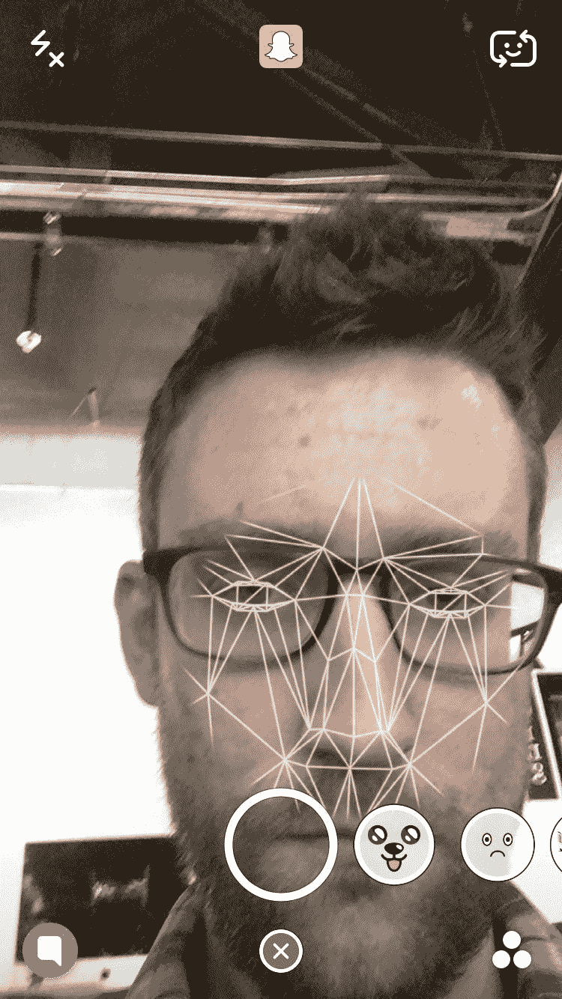
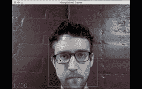
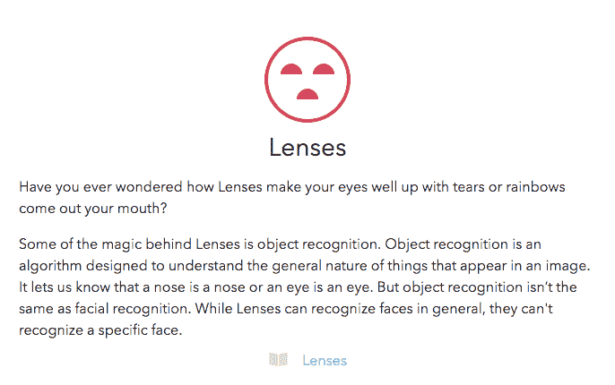

# Snap Inc .是在为 NSA 打造可穿戴的人脸识别设备吗？

> 原文：<https://medium.com/hackernoon/is-snap-inc-building-a-wearable-face-recognition-device-for-the-nsa-94bc12aef06e>

## 眼镜会是一种精心设计的干扰吗？

上周， [Snap](https://hackernoon.com/tagged/snap) Inc .的埃文·斯皮格尔向一些记者展示了他的首款[硬件](https://hackernoon.com/tagged/hardware)产品眼镜。《华尔街日报》作者 Seth Stevenson [回忆道](http://www.wsj.com/articles/snapchat-releases-first-hardware-product-spectacles-1474682719?mg=id-wsj)斯皮格尔邀请他进入“一个小会议室”，在那里他“把一条毛巾盖在桌子上的一个神秘物体上”，称斯皮格尔“急得神经过敏”。

或许“热切”这个形容词并不恰当。

因此，一家估值 200 亿美元、以消费者为中心的白热化公司，在一间狭小的会议室里，用一条毛巾展示了它有史以来第一个漂亮的小玩意。

多么完全和彻底的缺乏声势。

硅谷发生了什么变化？

那天帕洛阿尔托所有的舞台和会议厅都被预订了吗？

这是硅谷最热门实体之一的旗舰硬件发布会。毫无疑问，他们希望他们的新设备能引起轰动。

然而……没有聚光灯或烟雾机吗？没有音乐？没有人群？连黑色高领毛衣都没有？

看不到。

此外，Spiegel 称为“玩具”的产品似乎与 Snapchat 在 2014 年收购的 Vergence Labs 开发的视频记录眼镜没有明显的区别。

科技记者知道，Snap Inc .已经为一个秘密项目工作了几个月，可能几年，同时雇佣了业内所有最优秀的电子和机器人人才。这种巨大的努力最终导致了制造…一个玩具？

最近关于眼镜的新闻发布会是一次精心策划的转移注意力的活动吗？

# 收购、雇佣和专利

Snapchat 可能在 7 月份在美国专利商标局发布的[专利](http://patft.uspto.gov/netacgi/nph-Parser?Sect2=PTO1&Sect2=HITOFF&p=1&u=/netahtml/PTO/search-bool.html&r=1&f=G&l=50&d=PALL&RefSrch=yes&Query=PN/9396354)中表示，他们已经开发了面部识别设备，可以在面部扫描的几秒钟内显示个人信息。该专利详细描述了一种“对图像中的个人面部执行面部识别技术以获得识别的面部”的方法。

这项专利是在他们最近收购 Vergence Labs 之后获得的，Vergence Labs 以开发 Epiphany 眼镜而闻名，这是一种类似于谷歌眼镜的产品，以及在消费电子行业的一系列高调招聘。根据 CNET 三月份的一篇文章，这些新雇佣的硬件专家据说加入了一个秘密的研发实验室。根据最近[金融时报的一篇文章](http://www.ft.com/cms/s/0%2F749ef144-7306-11e6-bf48-b372cdb1043a.html#axzz4JcIdqiOQ)，他们之前的工作范围包括无线视频门铃、安全摄像头、机器人星球大战玩具、谷歌眼镜、GoPro 和 Oculus VR 耳机。

此外，他们报告称，Snap Inc .正在“寻找几乎所有拥有计算机视觉技能的 AR 初创公司”，将其作为可能的收购目标。

直到上周六，Snapchat 仍未公开宣布任何开发硬件的计划。在谣言开始流传之前根本没人调侃过。当[金融时报](http://www.ft.com/cms/s/0%2F749ef144-7306-11e6-bf48-b372cdb1043a.html#axzz4JcIdqiOQ)记者发现 Snap Inc .支付并加入蓝牙联盟的举动时，他们称之为开发硬件的“明确意图信号”,结论几乎是一个扣篮。

所以，如果媒体对他们秘密操作的报道是促使他们将 Spectacles 两年前的产品冒充为新产品的催化剂，那么他们真正在做的是什么呢？

# 用“镜头”功能收集面部轮廓？

为了使用 Snapchat 上的滑稽卡通脸“镜头”功能，界面指示用户点击他们的脸，启动面部扫描。这可以在一段时间内捕捉用户的面部表情，这样他们就可以随心所欲地使用愚蠢的狗耳朵和彩虹呕吐，并将其发送给他们的朋友。

Accessing “Lenses” Feature Initiates Facial Scan

# “透镜”如何训练系统识别人脸

Adam Geitgey 的媒体文章 [*深度学习的现代面部识别*](/@ageitgey/machine-learning-is-fun-part-4-modern-face-recognition-with-deep-learning-c3cffc121d78#.32cz46xel) 解释了准确的面部识别如何依赖于系统的能力“挑选出面部的独特特征，你可以用这些特征来区分它和其他人——比如眼睛有多大，脸有多长，等等”。该系统还必须能够“将这张脸的独特特征与你已经认识的所有人进行比较，以确定这个人的名字。”

人脸识别的一种方法是对系统进行编程，以比较明显的面部标志的测量值，如眼睛的外侧边缘或下巴到嘴的顶部等。但是让系统可靠地识别一张脸的最准确的方法是让它通过输入数百万张脸来决定哪些测量最重要。

确定这些神秘的测量值需要大量的资源，但却非常精确。幸运的是，像 [OpenFace](https://github.com/cmusatyalab/openface) 这样的服务已经处理了数以百万计的面部图像，这些图像对于发现 128 种有助于获得准确结果的独特测量方法是必要的。使用这样的服务，同一个人的任何 10 张不同的照片应该给出大致相同的尺寸。

在机器学习中，捕捉这些至关重要的 128 个面部测量值被称为“嵌入”。这些尺寸几乎对每个人都是独一无二的。

为了捕捉一个人的面部特征，算法必须首先使用一种称为 HOG(梯度方向直方图)的方法对他们的面部特征进行编码，这种方法输出一个简化的图像，该图像基本上是主体的主要面部特征的展平和居中集合。该输出然后通过神经网络传递，该神经网络知道进行哪 128 次测量并保存它们。

捕捉到我们的面部后，系统要识别某人所要做的就是将这些测量值与其他人的面部测量值进行比较，并找出哪个人的测量值最接近，从而找到匹配。

# 不管怎么说，我们就是这么做的。

Facial Recognition Training

在 [HiringSolved 的](https://hiringsolved.com/?code=medium) AR 技术的 Alpha 版本中，我们训练我们的机器通过告诉它我的名字来识别我，Christopher Murray，并随后捕捉我的 50 帧面部图像。这些图像使用 HOG 方法进行编码，输出通过一个神经网络，该网络捕获了唯一识别我的 128 个测量值。

通过捕捉这些测量值，我们成功地“嵌入”了我的面部签名，这样，如果发现另一张图像的测量值匹配，就可以在以后检索到它。

因为我们希望我们的技术最终能被实时使用，这样招聘人员就可以在会议上轻松识别人才，所以我们开发了一个应用程序，可以对来自摄像头的实时人脸进行编码，并将它们传递给神经网络。当系统找到匹配的测量值时，它不仅会检索该人的姓名，还会检索他们的工作经历、职称、证书和位置，并在扫描面部的几秒钟内实时覆盖这些信息！

Display in Real-Time — Taken Using Droid Turbo 2

# 眼镜优势

Spectacles 可能不是 Snap Inc .秘密电子项目的最终形式，但它确实揭示了一些优于智能手机摄像头的硬件优势。首先，通过制造自己的相机硬件，他们不再受三星或苹果的支配。眼镜的特殊镜头也可以捕捉更多的半径。

最重要的优势是能够克服从智能手机硬件进行面部扫描时出现的帧率问题。我们的工程师使用了一种变通方法来解决这个障碍，但是专门的硬件可以很容易地实现更平滑、更即时的面部扫描。

# Snapchat 声称他们无法“识别特定的面孔”

在 Snapchat 网站的[隐私中心](https://www.snapchat.com/privacy-center/our-approach)页面上，他们声称镜头功能使用了一种名为“物体识别”的东西，这“与面部识别不同”。尽管他们声称，他们的技术“让我们知道鼻子是鼻子，或者眼睛是眼睛”，与我们用来编码面部特征以供神经网络使用的 HOG 算法有着惊人的相似之处。

Snapchat’s Official Privacy Statement on “Lenses” Facial Data

虽然 Snapchat 给人的总体感觉是，他们对收集面部识别数据不感兴趣，但他们有过在适合自己的时候违背自己总体感觉的历史。当像“记忆”这样的功能使它们的数据保留变得明显时，在短暂的生命后删除照片的承诺是短暂的。

# 面部识别的其他挑战

虽然我们能够构建识别人脸的软件，但让它广泛可用的唯一方法是使用类似于“trainer”软件的东西从每个人那里收集面部签名，该软件捕捉了上面我面部的 50 帧图像。

我们怎么可能说服一个人接受这样的扫描呢？

要是有办法说服人们就好了。我们可以让它变得有趣。和社交。让人们邀请他们的朋友。展开它。让他们把愚蠢的卡通物品放在脸上。那你保证我们会全部删除。如果这种情况继续下去，我们将拥有世界上最有价值的个人信息。

> “在任何一天，美国 18-34 岁人群中有 41%的人使用这款应用程序”——[华尔街日报](http://www.wsj.com/articles/snapchat-releases-first-hardware-product-spectacles-1474682719?mg=id-wsj&mg=id-wsj)

# 被吸引进来

Snapchat 通过感知隐私来吸引用户。他们暗示你分享的一切都将从记录中删除。对用户来说似乎是这样，但当然事实并非如此。

Snapchat 的吸引力在于照片和视频会自毁。没有必要向潜在雇主解释你短暂的拉斯特法里教徒身份。如果你决定竞选市长，没有证据表明你让你的怪胎旗帜飘扬。你狂野的日子被隐藏了，就像你的权利一样。

Snap Inc .发现，人们非常愿意分享私密的事情——只要不是永久的。

# 收入

由于《华尔街日报》文章的评论区和社交媒体对 Spectacles 的反应冷淡，Snap Inc .的营收计划很难确定。

就连《华尔街日报》的文章也承认 Snap Inc .对收入的追求过去和现在都是不确定的。大量的日常用户并不能保证成功——问问 Twitter 就知道了。”

也许他们还有别的锦囊妙计。只是一个有趣的想法。

# 暗示和假设

当然，所有这些都只是猜测。也许眼镜有一个我完全不知道的重要用途。或许 Snapchat 的广告终端比我想象的要复杂得多。

但是，认为他们不是制造硬件来开发他们的面部识别能力的主要问题是**不是**这么做是多么愚蠢。

是的——他们并没有说他们打算这么做。同样，脸书从未提及他们会向广告商出售用户信息。

正如脸书利用用户自愿提供的个人信息数据库一样，Snapchat 也积累了一个与姓名相关的面部特征数据库。他们现在可以使用受监督的机器学习技术来索引用户的面部数据

即使他们还没有绘制人脸，他们也很容易做到。这只是在他们已经有的图像上运行算法，并通过神经网络处理编码数据的问题。

> [黑客中午](http://bit.ly/Hackernoon)是黑客如何开始他们的下午。我们是 [@AMI](http://bit.ly/atAMIatAMI) 家庭的一员。我们现在[接受投稿](http://bit.ly/hackernoonsubmission)并乐意[讨论广告&赞助](mailto:partners@amipublications.com)机会。
> 
> 如果你喜欢这个故事，我们推荐你阅读我们的[最新科技故事](http://bit.ly/hackernoonlatestt)和[趋势科技故事](https://hackernoon.com/trending)。直到下一次，不要把世界的现实想当然！

