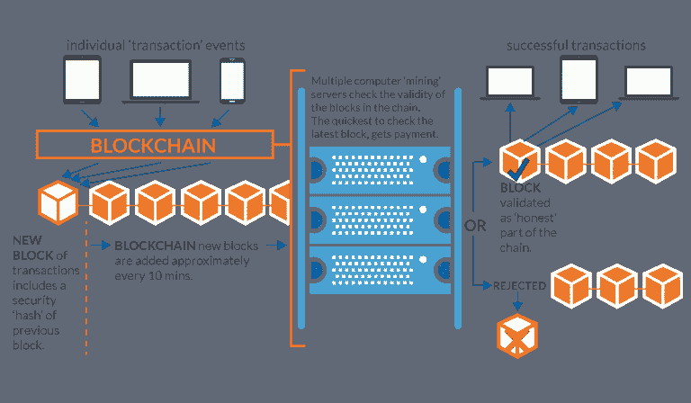

# 区块链比比特币大吗？

> 原文：<https://medium.com/hackernoon/is-the-blockchain-bigger-than-bitcoin-5815c4417770>

# 区块链有可能超越它的创造者吗？

随着比特币的市值迅速接近 2000 亿美元，不断有望超越 T2 比特币的区块链产业似乎仍然是承诺多于实质。

然而，区块链技术肯定会很快取代加密货币。对吗？

嗯，从 2012 年左右开始，在私营行业，分析师们开始痴迷于这个概念。对许多人来说，区块链*本身就是*创新，比特币是注定要失败的时尚，区块链将颠覆每个行业(至少根据一些人的说法)。

# 为什么会产生区块链？—双重花费解决方案

为了探索这是否确实是一个合乎逻辑的结论，让我们简单了解一下区块链的起源。

我相信你已经听说过区块链是如何被中本聪创造出来以解决“双重花费”问题的故事。即，防止单个实体在多个场合花费相同的硬币。区块链的创建是为了*消除*需要中介或权威机构在场来验证/批准资金从一方转移到另一方。

# 快速技术概述

从技术角度来看区块链(但没有深入细节)，区块链通过在网络上公开广播数字签名和编码(哈希)的交易，然后用预先存在的网络账本交叉检查有效性。然后，这些数字签名的事务与形成“块”的一组事务锁定在适当的位置，该“块”共同依赖于在它之前的每个事务(链)以及在它之后的每个事务。因为它仍然是完全开放的，所以如果不入侵整个网络并改变每台保存分类账副本的机器上发生的每笔交易，就不可能入侵(因为每个块都根据它保存的信息和前一个块产生一个新的散列)。这听起来令人困惑，实际上，这是一个非常漂亮复杂的解决方案，只有一个强大的结果。一个几乎无法破解、无法控制的开放分布式分类账。固有的信任和不变性作为一个包保证每个用户。

This nice illustration from Open University explains blockchain quite well. ImageCredit: [http://blockchain.open.ac.uk/](http://blockchain.open.ac.uk/)

# 区块链泡沫

正如你所看到的，毫无疑问，从 9 年前开始，区块链技术是一个非常值得称赞的创新。然而，这些天来，令人费解的注意力似乎被赋予了这种神秘的“超级技术”，它“支撑”着加密货币(唉)。在我看来，技术能力似乎与潜力不匹配，而这本身似乎正在形成(喘息！)一个泡沫。

不是任何泡沫，而是一个迅速膨胀的泡沫，可能会吞噬整个基于资产/令牌的 ICO 和仿 DAPP(去中心化应用程序)的生态系统，目前投资界正处于一种不受监管的狂热状态。在这个阶段还应该注意的是，这个泡沫并不局限于不受监管的加密货币领域，远非如此。

组织和金融机构正不知不觉地被欺骗，在任何与区块链相关的事情上投入大量资金，期待惊人的结果，而在现实中，区块链技术和私营企业的兼容性通常是完全一样的(不包括接受比特币支付，这是每个企业都应该做的)。

如果说历史教会了我们一件事，那就是当你有大笔投资、过高的估值和有限的现实效用时，你通常会面临现实核查(委婉的说法)，这只是在等待发生。是的，的确，对于那些等待区块链世界壮观的. com 式崩溃的人来说，区块链可能会崩溃，但可能不是以你预期的形式。比特币和真正的加密货币比私人区块链行业更有潜力公平竞争。

# 私有化区块链是一个矛盾

私营行业中的许多人可能没有理解的是，区块链的主要优势是*去中心化*。为了让这项技术真正发挥作用，人们需要放弃控制权，因为区块链的主要目的是建立信任*，而不需要集中所有权和/或中介授权——区块链赋予所有者对其货币的完全权利。一旦您移除了*去中心化的*网络并用一个机构或公司取而代之，您就移除了对区块链的需求，并返回到“*信任”*您的机构的数据库/服务器来验证交互。这当然更快，而且对于一个以利润为中心的公司目标来说，这是非常理想的设置。当然，它听起来不像“区块链”那样令人兴奋，但它实际上符合目的。*

相反，私有化的区块链就像局域网受限的智能手机一样有意义。对于大多数私有化行业来说，区块链是一个笨重的配件，实际上没有任何用途。区块链技术所强调的元素(去中心化、不变性、共识和信任)在本质上被私人区块链消除了。企业试图以某种方式从(本质上)刻意的*共产主义解决方案中打造一个有利可图的行业，往好了说是被误导了，往坏了说就是愚蠢透顶。去中心化是区块链的*和*颠覆性元素。*

# 卖投机？

然而，这并没有阻止许多处于有利位置的机会主义者编织一个令人信服但基本上是虚构的故事，这个故事完全基于 FOMO，并搭载了比特币的巨大成功。承诺的是复制这一成功，这(他们说)可以通过将区块链技术整合到过时的利润驱动的商业结构中来实现。结果不仅令人失望，如果在没有进行大量尽职调查的情况下应用，它们可能是危险的，并可能导致巨大的损失，特别是当区块链的*不可逆*流程管理不当时。想象一下，一家银行“意外”删除了一个库，导致 3 亿美元的客户资金被**永久**冻结，就像平价钱包发生的[一样。](https://cointelegraph.com/news/parity-multisig-wallet-hacked-or-how-come)

不可避免的是，似乎正在发生的是，许多组织和投资者可能会被骗走巨额资金，因为一项技术最终与他们的组织目标完全不相容。

# 那么，区块链的真正应用在哪里呢？

看来除了去中心化，区块链的应用非常有限。这是因为一个简单的原因。区块链安装缓慢且复杂(正确)。如果没有内在的激励(如采矿和交易费用)，它们也几乎不可能全部维持下去。一旦区块链中的“货币”方面被移除，你就有了一个依赖于自愿维护的分布式账本…祝你好运！

这可以从以太坊平台上可交易数字资产的主导地位中最深刻地看出。迄今为止构建的大多数应用程序要么是非常酷的*分散式*应用程序，要么只是在 ERC-20 平台上作为“子密码”运行。相比之下，另一个区块链开发平台 Hyperledger 在其多年的运营中似乎没有在私营部门产生任何重大变革。(在那一点上我愿意并且开放地被顺便纠正…评论下面！)

这就引出了一个问题:如果区块链对私营行业如此神奇，那么改变世界的应用在哪里？比特币在哪里打败了这项技术据称提供的创新？它存在吗，还是我们仍然忽略了区块链技术最重要的应用，因为它突破了深不可测的 10K 里程碑？

依我拙见，加密货币现在是，而且仍然是区块链最大、最明确有用的应用。比特币之所以有效，是因为它*将*区块链与众多其他核心技术(即加密签名、开源代码、通过协议达成共识的中立性、基于激励的参与等)相结合。)来创建一个完全不变的、信任固有的基于社区的平台。这就是它的区块链如此强大的原因。因此，声称区块链孤立地将以某种方式“超越”比特币(或加密货币)就像是暗示光纤将超越互联网。该工具很可能会找到其他应用，但就目前情况而言，主要用例显然是我们见过的最合适和最巧妙的区块链技术应用。