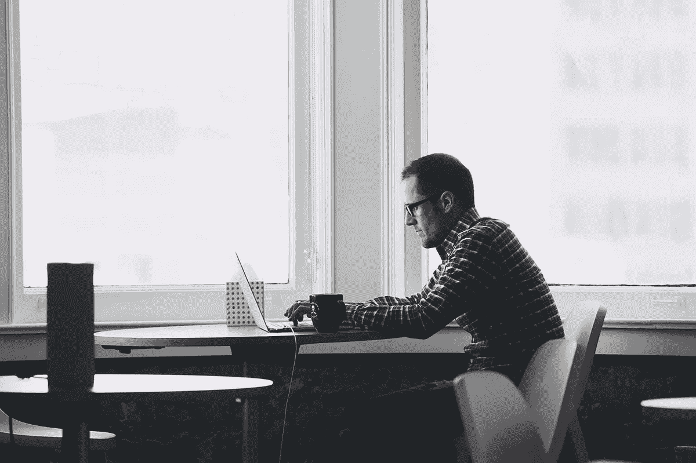

# 互联网坏了吗？

> 原文：<https://medium.com/hackernoon/is-the-internet-broken-a83ed0af23b3>

Ev Williams, co-founder of Twitter and Medium.

## *Medium 和 Twitter 的联合创始人在前进的道路上。*

“我认为互联网坏了，” [Ev Williams](https://medium.com/u/268314bb7e7e?source=post_page-----a83ed0af23b3--------------------------------) ， [Medium](https://medium.com/u/504c7870fdb6?source=post_page-----a83ed0af23b3--------------------------------) 的联合创始人兼首席执行官，Twitter 的联合创始人，在[纽约时报](https://mobile.nytimes.com/2017/05/20/technology/evan-williams-medium-twitter-internet.html)今天刊登的采访中说道。“对很多人来说，这显然是坏了。”

他补充道:“我认为一旦每个人都可以自由发言，交流信息和想法，这个世界自然会变得更好。”

> 我错了。

主要的问题是互联网“奖励极端”，这是他想要打破的模式，部分也是因为媒体正在采取的新方法。其中一个重点是他所谓的“互联网上内容创造、分配和货币化的架构”，以及这将如何影响新闻的未来。

媒体越来越受欢迎，但也存在一些问题。

今年 1 月，Ev 在 Medium 宣布了一项新举措，并对公司进行了重组，包括裁员和关闭位于纽约州和华盛顿州 DC 的办公室。不久之后，在 3 月，[平台推出了会员专属内容](https://blog.medium.com/our-approach-to-member-only-content-cfce188261d1)和订阅计划。

“免费和开放是蛋糕，”Ev 在他的帖子中写道。“许多人只是想分享他们的想法和知识，并没有金钱回报的期望。这是一件美好的事情——也是媒介的关键特征之一。它对数百万人产生了巨大的影响，并且没有改变。它将保持自由发布，并自由阅读那些自由发布的人的无限帖子。”

《纽约时报》的 David Streitfeld 强调了“随着新闻变得更加视觉化，网站(媒体)仍然专注于文字。它将继续努力争取尽可能广泛的影响，欢迎各种各样未经考验的作家，尽管这种情况可能会改变。”

就我个人而言，我喜欢 Medium，我支持 Ev 为了让它成为比现在更好的产品而尝试的方式。

虽然特朗普白宫在 Medium 上并不活跃，但政治和外交政策界非常喜欢这个平台，并为其作为一个讨论想法和挑战想法的伟大论坛的受欢迎程度做出了贡献。

唐纳德·特朗普总统与他的前任和奥巴马白宫不同，他正集中精力在推特上，或许为社交媒体平台的新势头和关注度的增加做出了贡献，以及特朗普、他的团队和政客们如何优先考虑它。

“我认为直接听取我们领导层的意见非常重要，”[杰克·多西](https://medium.com/u/ab69c5472679?source=post_page-----a83ed0af23b3--------------------------------)在接受 NBC 的威利·艾斯特采访时谈到川普时说。

> 我认为让他们承担责任很重要。重要的是公开进行这些对话，而不是关起门来。

多尔西补充道:“如果我们突然把这些平台拿走，它会去哪里？会发生什么？它在黑暗中进行，我认为这对任何人都没有好处。我宁愿我们都知道人们是如何看待事物的，即使我们不同意。”

Ev Williams 甚至走得更远，关于特朗普，他告诉《纽约时报》:“这是一件非常糟糕的事情，Twitter 在其中的作用。”

> 如果真的没有推特他就当不了总统，那么是的，对不起。

Ev 对互联网的看法是乌托邦吗？

“问题是，不是每个人都会变得很酷，因为人类就是人类，”他在采访中说。“晚上我们办公室和家里都有锁。互联网的诞生并没有预料到我们必须在网上做这件事。”

> [黑客中午](http://bit.ly/Hackernoon)是黑客如何开始他们的下午。我们是 [@AMI](http://bit.ly/atAMIatAMI) 家庭的一员。我们现在[接受投稿](http://bit.ly/hackernoonsubmission)并乐意[讨论广告&赞助](mailto:partners@amipublications.com)机会。
> 
> 如果你喜欢这个故事，我们推荐你阅读我们的[最新科技故事](http://bit.ly/hackernoonlatestt)和[趋势科技故事](https://hackernoon.com/trending)。直到下一次，不要把世界的现实想当然！

