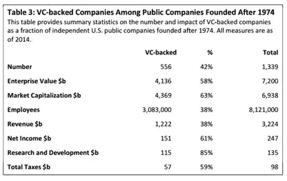
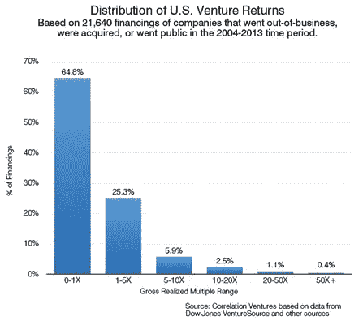

# 心疼风投支持的公司有新的开始吗？

> 原文：<https://medium.com/hackernoon/is-there-a-new-beginning-for-distressed-vc-backed-companies-437b852acc0d>

> 新的开始往往被伪装成痛苦的结局”——老子

[毕业](https://www.youtube.com/watch?v=BP2ItX1XxOM)。帽子被抛向空中。瓶塞被打开以示庆祝。眼泪已经在告别中流下。这个[神奇的一年](https://www.gsb.stanford.edu/programs/msx)已经结束，我怀着悲伤向 90 位已经变得像家人一样亲密的人说了再见**，也怀着**对他们将要做的伟大事情的期待**—[*改变生活、改变组织、改变世界*](https://www.gsb.stanford.edu/stanford-gsb-experience/impact) 。**

考虑到风险投资支持的公司对经济的影响，斯坦福 GSB 学院比任何其他商学院向这个创新生态系统输送更多的企业家就不足为奇了(15%的毕业班学生)。在他们 2015 年的论文《风险投资的经济影响》中，UBC 索德商学院的威尔·戈纳尔和斯坦福 GSB 大学的伊利亚·斯特雷布拉耶夫显示，美国历史上只有 0.9%的公司得到了风险投资的支持，但他们却占了 17%的上市公司和 44%的研发支出。看看现代(1974 年后)，数字更加惊人:

当你考虑到每年只有 0.31%的新企业获得[风投](https://hackernoon.com/tagged/venture)资金时，这一点尤其令人印象深刻:至少从总量上看，对于每年获得 600 亿美元风投资金的**来说，这是一个相当不错的 [ROI](https://hackernoon.com/tagged/roi) 。就像大多数统计分布一样，80/20 法则也适用于风投融资。根据哈佛商学院教授比尔·萨尔曼 2010 年关于风险投资的风险和回报的研究，这种巨大的经济成功是 15%的资金的结果！2014 年， [Correlation Ventures](http://correlationvc.com/) 对 10 年间风险回报的研究显示了回报是多么的不均衡(*承蒙* [*芬威克&西 LLP*](https://www.fenwick.com/publications/pages/silicon-valley-venture-survey-third-quarter-2014.aspx) ):**

****

**如果你想打出全垒打，你也要[打出很多](https://www.forbes.com/sites/robasghar/2014/06/17/permission-to-fail-leadership-lessons-from-babe-ruths-bat/#5f7a40544b26)——他们不会无缘无故地称之为*冒险*，就像期权交易**游戏的名字是** **风险**。虽然顶层 1%的人的诱惑吸引了梦想家，底层 1%的人的愤怒吸引了媒体的关注，正如托马斯·皮凯蒂在《21 世纪的资本》中所描述的那样，资本投资的激励意味着游戏就是这样玩的。**

**人类的自然倾向是判断。很容易列出一系列支持风险投资为什么好的理由，或者列出一系列反对的理由来攻击风险投资为什么不好。BHAG 对我来说更有趣的问题是**我们能做些什么来改善它？****

*   **那 70%陷入困境的公司还剩下多少价值？**
*   **他们为什么失败了？**
*   **他们会怎么样？**
*   **他们的成功标准是什么？**
*   **他们的燃烧率有多持续？**
*   **他们的跑道有多长？**
*   **如果不考虑风险融资的回报预期，有多少公司会在私人持股的情况下取得积极的成果？**

**我们能从痛苦的结局中找到新的开始吗？你要吻很多青蛙才能找到王子——你要吻多少青蛙才能找到铁匠和木匠？**

***本文为* [*原载于 2017 年 6 月 28 日*](https://www.linkedin.com/pulse/new-beginning-distressed-vc-backed-companies-jonathan-lu) *。***