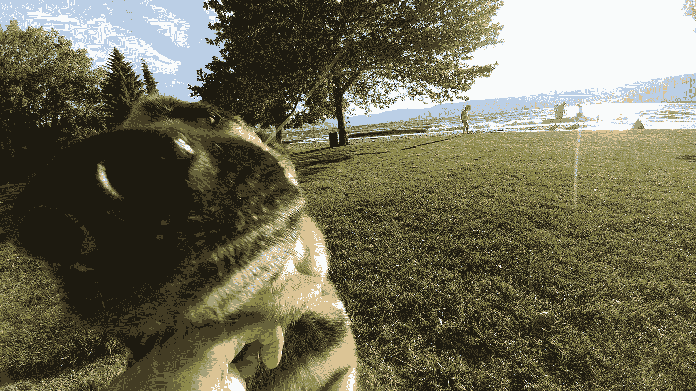

# 混账有一线希望吗？

> 原文：<https://medium.com/hackernoon/is-there-a-silver-lining-to-f-king-up-81dd9ad3627>

## 提醒我们，设计不仅仅是像素。

我前几天喝醉了。我变得邋遢和懒惰。我给其他人带来了一连串的问题。我对一位顾客的信任造成了小小的损害。

最糟糕的是，它让我放弃了比赛。我觉得我把冰球放进了自己的网里。第二天很难找回我的魔力，不管我有多承认自己的错误或道歉。

我绝不是产品设计的格雷茨基。我喜欢的任何成功都归功于我周围的团队和人们。幸运的是，我一定有适合我的东西，因为好人(包括顾客)一直选择和我一起工作。

我是一个优秀团队的一员。他们不会从一个事件来判断，而是从一种行为模式来判断。但这有点刺痛了我的自尊心，因为我认为自己是一个“专业人士”。

无论我的用户界面有多聪明，我的解决方案与客户的联系有多紧密，无论我的像素有多热……我在“屏幕外”做的很多事情都同样重要。

一般来说，我的“非像素”决策是有组织的，也是经过深思熟虑的。

*将数据转储到原型中。标记 PSD 层。分享一个模型。评论一些代码。组织设计报告。准备会议笔记。勾画想法。回复邮件。运行设计审查。填写 Git 问题。追踪时间。*所以。很多。决定。

**当我在玩游戏的时候，我会浏览一个小清单:**

***1。这对队友有什么影响？***

**2。如果客户看到了呢？**

***4。这在 6 个月后对任何人都有意义吗？***

我不喜欢死一般的迂腐过程，我喜欢开心。自我意识到我的“屏幕外”工作对项目(或企业)的影响和“屏幕上”工作对我的影响一样大。

嗯……直到我变得懒惰，做出了一个草率的决定，去做一个快速演示(一边喝啤酒一边笑)。

“啊，随便。要为一个 15 分钟的演示做好准备太难了。我会把它贴在这里，完成后再删除。”

我确实删除了它。在一位客户通过谷歌搜索找到它之后。一年后。

*您曾试图在谷歌中将页面排名靠前。很难，对吧？尝试从一个长期存在的深层域中取消索引。*

# **有什么好消息？**

**没有一个。我醒了。**

像素既便宜又容易。我通常可以修正一个糟糕的设计决定，然后继续前进。事实上，我经常为挑战而高兴。

纠正一种不良工作习惯的模式既不便宜也不容易。我做这个已经太久了，我已经想了很多次了。

除了演奏芝加哥 1982 年的经典作品《难以启齿的抱歉》作为惩罚之外，我还想听听其他人从职业挫折中恢复的故事。