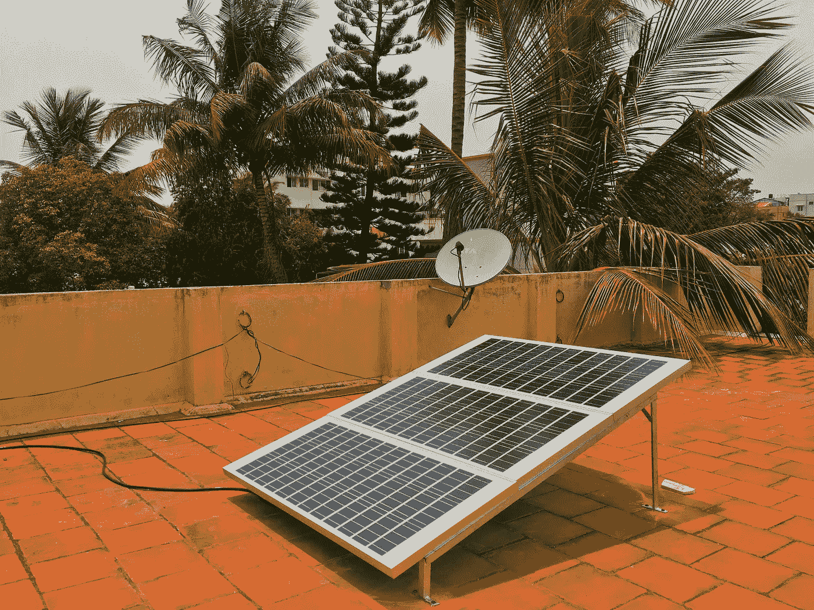
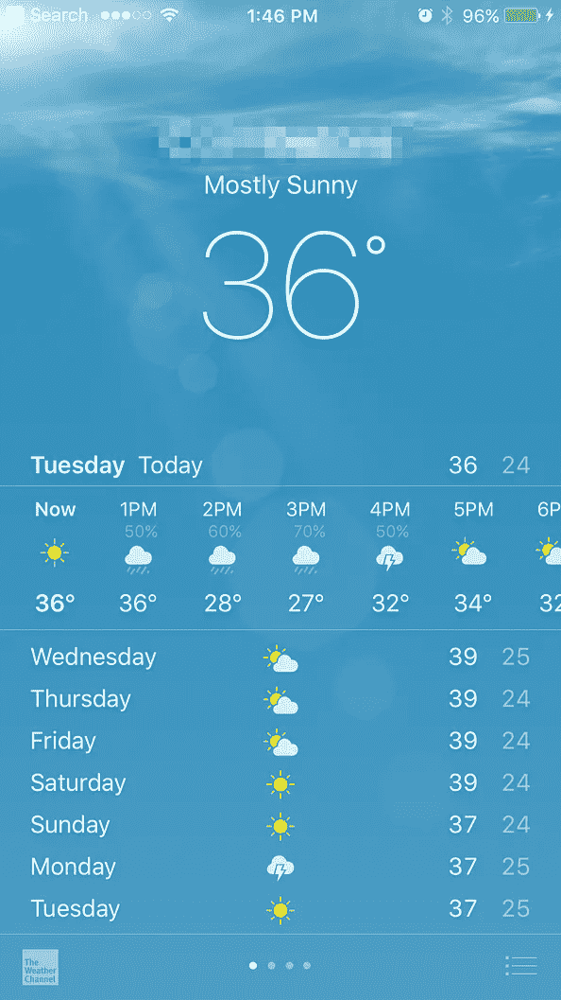
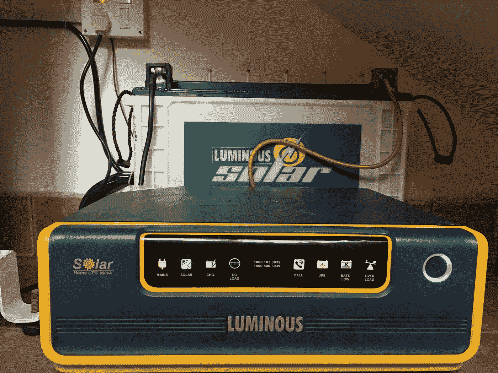
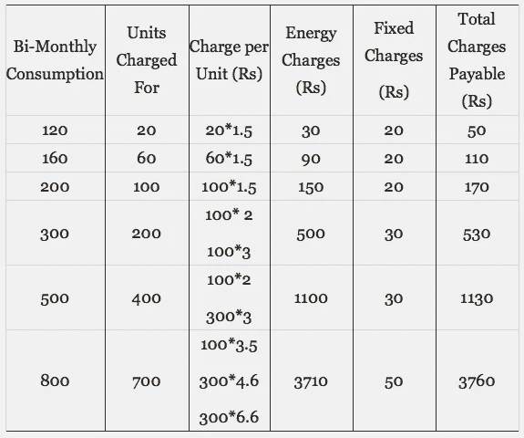
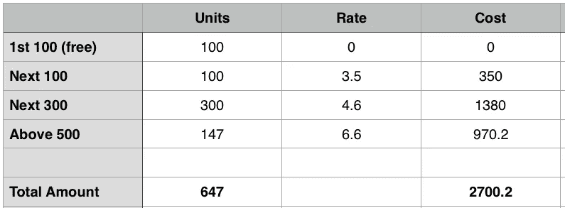
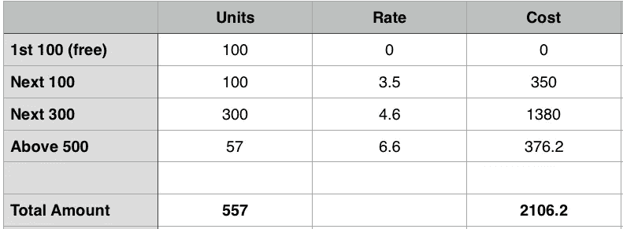
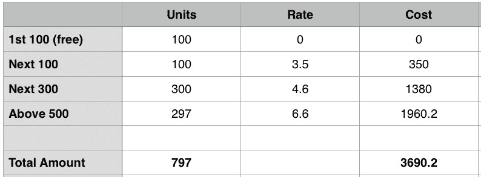
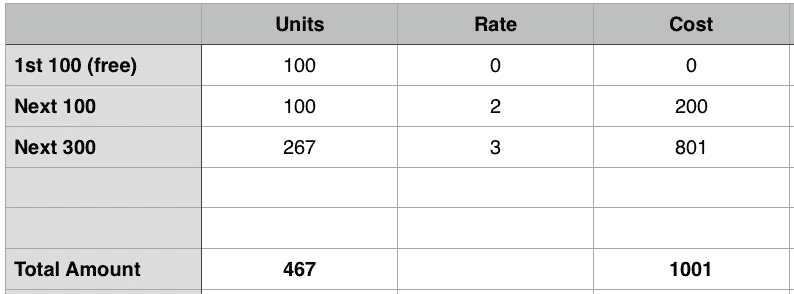
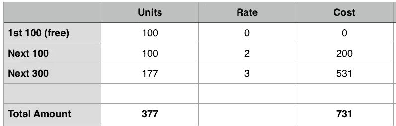
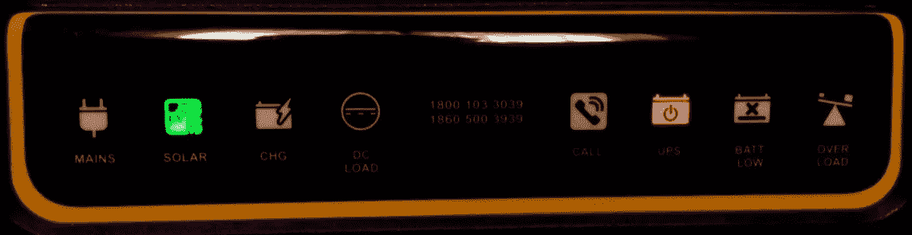

# 在印度，利用烈日给住宅降温可行吗？

> 原文：<https://medium.com/hackernoon/is-using-the-blazing-sun-to-cool-homes-viable-in-india-bf0c3adac799>

These three 100-watt solar panels (6 sq ft) easily run two fans, a TV and a computer during the day

印度又是一个酷热的夏天，现在甚至还不是盛夏。我所在的城市正遭受着 37 摄氏度(99 华氏度)的干热，但与其他一些印度城市相比，这算不了什么。一位住在马哈拉施特拉邦阿姆拉瓦蒂的朋友报告说，人们已经开始出现轻度中暑。我发现那里的平均气温为 44 摄氏度(111 华氏度)。问题是去年的季风降雨并没有出现，而且印度主要由水力发电大坝(由政府运营)提供电力。因此，正当我们需要电力来运转给我们家降温的电扇时，我们面临着“停电”的局面。

## 到处都是太阳，没有太阳

有如此多的阳光可用，用太阳能为家庭供电似乎是一件显而易见的事。问题是印度的太阳能系统太贵，不值得安装。

但这种情况可能正在改变。上周我在屋顶安装太阳能系统时做了一点研究。基本上有两种类型的太阳能系统。一种是减少对电网(干线)依赖的基本型，另一种是高级型，它可以发电并反馈回电网，以换取“零账单”

## 基本太阳能系统

我在家里安装了基本的太阳能装置。它通常使用太阳能给电池充电。但是如果有几天看不到太阳，比如在雨季，电池就从电网充电。

让我解释一下它是如何工作的。当太阳升起时，逆变器首先给电池充电。一旦电池充满电，它就把我的家和电网断开，靠电池运行。同时，太阳能电池板会给电池充电。实际上，这座房子将依靠太阳能发电。

傍晚太阳落山时，逆变器继续从电池供电。这种情况一直持续到电池达到储备水平，之后我的家又重新连接到电网。它继续在电网上运行，直到第二天早上太阳能电池板再次接管给电池充电的任务。从电网充电的唯一时间是当电池低于其储备水平时。

所有这些确保我尽可能少用电，并降低我的账单。

## 高级太阳能系统

这个系统的概念很简单。屋顶上太阳能电池板产生的电力被反馈回电网。在这之后，我就不太清楚细节了。但基本上，如果你输入系统的电力单位的数量多于你在同一时期消耗的单位，那么你的电力局会给你一张零账单。这个系统的优点是你可以运行像 ACs 这样的重载电器(它不能依靠太阳能工作),因为它是由市电供电的。

只有当你每个月都有一笔相对较大的账单时，这个系统才有财务意义。过去两个月，我在₹2700 的账单没有那么多。它通常要低得多，因为我们通常使用电风扇。但是极端的高温迫使上个月使用耗电的空调。

Seven months ago, that lake still had a bit of water - it has now completely dried up in the scorching summer heat.

## 两种太阳能系统的成本

***基本的太阳能系统*** 费用大约在₹36000(550 美元)左右。它有三个 100 瓦的太阳能电池板，通过逆变器(30 安培/12V 充电控制器)为 850 伏安的电池充电。它每天可以产生大约 1-3 个单位的电力。该系统没有任何主要的运行成本，除了每 6-7 年更换一次电池，成本约为₹15000(230 美元)。

该系统产生的电力足以让两个风扇、两盏灯和一台电脑运行大约 6-7 个小时。它不能运行高功率的东西，如空调，熨斗，冰箱，洗衣机，电饭锅和热水器，水泵，厨房混合，等等。

我看到的先进太阳能系统的价格大约在₹68000(1000 美元)左右，它有一个 750 瓦的太阳能电池板系统，三个 250 瓦的电池板为一个 1500 伏安的电池供电。

即使这个系统也无法运行高负载设备。然而，产生的多余能量被输入电网，给你一个“零账单”这样，只要没有停电，你就可以免费使用所有的电器。

## 太阳能经济学

我过去两个月的电费是₹2700。太阳能装置只会略微减少账单，因为我所有的重载电器仍将在电网上运行，尤其是那台贪婪的空调。此外，每 6-7 年，电池必须更换一次，费用为₹15000.简而言之，我投资的₹36000 似乎永远都无法收回。

那我为什么要安装太阳能装置呢？

## 作为游戏改变者的 UPS

大多数印度家庭都有 UPS(不间断电源),因为停电时间每天可长达 4 小时。基本上，它是一个电池组(带逆变器)，有电时就充电。当断电时，逆变器开始运转风扇，并通过电池供电照明。

The solar unit’s invertor and battery pack that give me uninterrupted power supply

我大约六年前为₹17000.买了现在的 UPS 这是由于更换成本₹16000.相反，我选择了太阳能装置。我将不得不在 6-7 年内更换太阳能装置的电池，但无论如何，这是我的 UPS 电池的现有费用。

所以我的太阳能装置的实际成本不是₹36000，而是₹20000.

## 该电板系统

印度的电力由政府生产。尽管这是基本需求，但印度仍有许多人负担不起高昂的电费。因此，政府设计了楼板系统，让穷人买得起。基本上，你消耗的电力越多，每单位的电费就越高。任何高于 500 单位的双月周期将把你放入最高的平板。下表显示了我居住的州的楼板系统。

***顶层板:*** 我当前的双月账单是₹2700，这使我处于顶层板。基于此，我算出了账单的电费明细。

My actual bi-monthly consumption without the solar unit for the last two months.

***太阳能的影响:*** 我目前在这个双月周期消耗 647 个单位。比方说，我的太阳能装置每天减少我 1.5 单位的电力消耗，或者两个月减少 90 单位。我的消耗量将下降到 557 单位。让我们计算一下这对我的双月账单有什么影响。

Projected bi-monthly consumption with the solar unit for the next two months.

## ***储蓄用太阳能***

我将每两个月拯救₹600 一次。由于太阳能装置的实际成本是₹20000，大约需要六年时间才能收回成本。

然而，我最近的双月账单反映了一个月的空调使用量。但是我的下一个双月账单会有两个月的交流电使用。假设我晚上用了 8 个小时的空调。最节能的空调每小时消耗约 1 单位。每晚 8 个单位，一个月总共 240 个单位。或者在下一个双月账单上多付 240 个单位。把这些算进我的双月账单，不管有没有太阳能，我仍然在₹600.省吃俭用

WITHOUT Solar: Bi-monthly consumption with AC for the next two months.

WITH Solar (less 90 units): Bi-monthly consumption with AC for the next two months.

***交流电是杀手:*** 一旦过两个月雨季开始，我就换回电风扇，而不是交流电。我相信呼吸新鲜空气更健康，而且还减少了电力消耗，保护了环境。一个风扇一个晚上最多消耗 1 个单位。或者两个月 60 台，而不是空调 480 台。我的消耗量将减少 420 单位。有太阳能和没有太阳能，我的账单会是什么样子？

WITHOUT Solar: Bi-monthly consumption without AC for the next two months.

WITH Solar: Bi-monthly consumption without AC for the next two months.

## 结论

在这两种情况下，消费将低于 500 单位，所以我会下降到一个较低的板坯和支付更少的单位。更重要的是，在“没有空调”的情况下，使用太阳能节省的电量几乎是每两个月₹270。按照这种速度，我在₹20000 的投资需要 12 年以上才能收回。

简而言之，太阳能对我来说在经济上是不可行的，因为我通常一个月用不到 500 个单位，而且住在一个更低的地方，可以获得更便宜的电力。

但是，如果你住在电费很高的顶层，选择“零账单”的先进太阳能装置确实是有意义的。就像如果你收到₹6000 的双月账单，你可以在不到两年的时间内收回₹68000。但是你可能要记住，技术正在快速发展。

## 我为什么选择太阳能？

如果不是为了省钱，那我为什么选择太阳能呢？

***再也没有汗流浃背的日子:*** 今天上午 9 点到下午 5 点全天“停电”。到下午 2 点，大多数房子里的 UPS 电池将会耗尽，因为它们最多只能维持 6 个小时。居民们将在酷热中汗流浃背。

但是家里的事情很酷。我的新太阳能装置直接运行我的基本灯和风扇，由太阳能电池板通过逆变器供电。储存的电池能量只有在太阳落山时才会被使用，这意味着如果停电持续下去，我的风扇可能会整夜运转。

My home running directly on solar power during a 10 hour power cut

***环保:*** 我喜欢这种为保护环境尽自己绵薄之力的感觉，在过去的五年里，我一直用电动滑板车在镇上跑来跑去。走向太阳能是朝着这个方向迈出的又一步。

***脱离电网独立:*** 在钦奈上次的洪灾中，唯一有电的房子就是那些有太阳能电池板的房子。因此，如果我的家乡长期停电，我将有电。

***低经费:*** ₹20000 不是一个小数目。但是我在像手机这样的小东西上花了更多的钱。所以如果有助于环境，我不介意拿那些钱去冒险。无论如何，我很可能会收回一大笔钱。几年后，我将用效率更高、价格更低的太阳能电池板取代目前的太阳能电池板，满足我所有的能源需求。我可能会回收目前的单位，用在其他地方，或者卖掉它，拿回我剩下的钱。但是即使我不这样做，我也不会为此感到太难过，因为我的花费不是很高。

***驾驭未来浪潮:*** 有了像特斯拉这样倡导太阳能和电池发电的创新公司，我相信技术会进步，成本会下降。我不想被过时的技术所困，所以在₹2000o 的投资是一个可以接受的妥协。此外，通过现在进入，我将更好地了解太阳系，并知道当我最终进入“零账单”安装时需要注意什么。

## 最后一件事

印度炎热气候的好的一面是几乎无限的太阳能供应，不利用它似乎是犯罪。

此外，我只是喜欢用太阳无情的炽热来冷却房子的讽刺。

在你的脸上，孙。

> [黑客中午](http://bit.ly/Hackernoon)是黑客如何开始他们的下午。我们是 [@AMI](http://bit.ly/atAMIatAMI) 家庭的一员。我们现在[接受投稿](http://bit.ly/hackernoonsubmission)，并乐意[讨论广告&赞助](mailto:partners@amipublications.com)机会。
> 
> 如果你喜欢这个故事，我们推荐你阅读我们的[最新科技故事](http://bit.ly/hackernoonlatestt)和[趋势科技故事](https://hackernoon.com/trending)。直到下一次，不要把世界的现实想当然！

