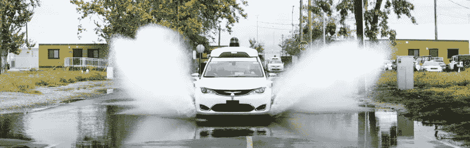
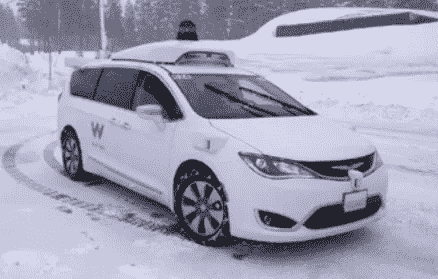

# Waymo 的无人驾驶汽车安全吗？

> 原文：<https://medium.com/hackernoon/is-waymos-driverless-car-safe-21b825dbf789>

## Waymo 的一份新安全报告和消费者教育活动充满了信心，但它们留下了许多未解之谜。

Waymo’s driverless car is being tested in California, Washington, Arizona, and Texas. *Image source: Waymo Safety Report*.

[无人驾驶](https://hackernoon.com/tagged/driverless) [汽车](https://hackernoon.com/tagged/cars)在拯救生命和改善交通安全方面有着巨大的潜力。但是要实现这一愿景还有很长的路要走。一路上，自动驾驶汽车的倡导者将不得不说服许多怀疑者，这项技术可以在现实世界中工作，而不仅仅是在受控的测试条件下。他们会成功吗？

## **脑子里肯定有一丝疑问**

怀疑者的名单很长。皮尤中心最近的一项民意调查发现，超过一半的美国人不想乘坐自动驾驶汽车，因为他们不信任这项技术。正如一位受访者所说:“如果汽车出现故障，会发生什么？所以我想我们都只是坠毁和死亡？”大多数人对机器做出安全关键决策的想法深感不安，非安全关键自动化的例子，如自动取款机或自动化呼叫中心，也不会让他们更舒服。

作为在开发 AVs 方面拥有最长([尽管不是最昂贵的](https://www.forbes.com/sites/alanohnsman/2017/09/15/at-1-1-billion-googles-self-driving-car-moonshot-looks-like-a-bargain/#2c1899f957bb))记录的公司，Waymo 敏锐地意识到了这些担忧。本月，它发起了一项与消费者交流技术的努力，名为[让我们谈谈自动驾驶](https://letstalkselfdriving.com/)。不幸的是，对于一家拥有 Waymo 资源的公司来说，令人惊讶的是，该活动的网站远没有给人留下深刻印象。无非就是各种机构“支持自动驾驶技术”的声明。虽然包括 MADD 和国家安全委员会在内的这些合作伙伴值得尊敬，但他们的支持非常模糊——国家安全委员会最多会说“尽管自动驾驶技术已经过测试和完善，但国家安全委员会致力于让今天的道路更加安全”。说说三心二意的支持吧！

> 大多数人对机器做出安全关键决策的想法深感不安，非安全关键自动化的例子，如自动取款机或自动化呼叫中心，也不会让他们更舒服。

自动驾驶技术的另一个重要怀疑者是美国国会。今年早些时候，关于安全的问题主导了国会听证会，美国参议员 T2 第一次亲身体验自动驾驶汽车并不顺利。(“他们说‘相信车辆’，当我们接近水泥墙时，我的本能无法抵抗，我抓住了方向盘，触动了刹车，并接管了手动控制，”参议员本·纳尔逊说。不出所料，确保安全是目前正在考虑中的[立法的关键部分。](/@cfmccormick/whats-in-the-self-drive-act-6c090e8a2e9a)

Waymo 当然意识到政策制定者的这种担忧，本月早些时候发布的[安全报告](https://waymo.com/safetyreport/)似乎部分旨在解决他们的问题。如果美国参议院正在辩论的立法获得通过，报告中的章节与“安全评估报告”中要求的章节惊人地相似。该报告包含许多有趣的内容，我将在下面详细介绍，但从高层次来看，它提出的新问题和它回答的一样多。尽管这显然是一份营销文件(正如大卫·西尔弗指出的那样)，但它似乎不太可能说服持怀疑态度的政策制定者，就像让我们谈谈自动驾驶运动可能说服持怀疑态度的公众一样。

## **五味安全**

报告里有什么？首先是一些发人深省的统计数据:全球每年有 120 万人死于车辆事故(美国有 37，000 人)，与车辆相关的伤亡造成的经济损失每年近 6，000 亿美元。这些数字令人震惊，但对关注这一领域的人来说并不新鲜。

该报告继续阐述了 Waymo 安全计划的五个领域。第一个区域叫做“**行为安全**”，大概是大多数人在考虑 AVs 是否安全时想到的。这是 AV 是否安全驾驶的问题，通过正确读取道路情况(包括感知其他汽车和行人)并就如何在这些条件下驾驶做出良好的决定。Waymo 似乎试图通过描述其技术如何工作来打消读者的疑虑，但这种描述远远超出了非技术读者的范围，对于技术读者来说也太简单了。最终，行为安全与操作设计领域(ODD)的概念紧密相连，但我们会回到这个话题。

> 全世界每年有 120 万人死于车辆事故(美国有 3.7 万人)，每年与车辆相关的人员伤亡造成的经济损失将近 6000 亿美元。这些数字令人震惊，但对关注这一领域的人来说并不新鲜。

第二个领域是“**功能安全**，关于子系统冗余。这不是一个非常性感的话题，没有工程思维的人可能不会想到，但它很重要。如果反病毒软件的机载计算机崩溃，在糟糕的事情发生之前，它可能没有时间重新启动。同样，如果前置摄像头或激光雷达出现故障，车辆可能无法使用其剩余的传感器安全导航，无论当时的路况如何。

报告称，Waymo 的所有 AVs 都配备了一台辅助计算机，如果主计算机出现故障，它可以操作车辆。这是一个显著的事实:即使辅助计算机的能力不如主计算机(即，它所能做的只是安全地将车辆操纵到交通中的停车点)，它仍然会给整个车辆增加大量成本。想象一下，为公司的每个人都买一台备用笔记本电脑，以防主电脑出现故障——你肯定不会受首席财务官的欢迎。

同样，每辆车上都有冗余动力系统。这些具体是如何工作的还不清楚，但它可能是某种形式的备用电池和电力电子设备，足以在主要故障时让车辆安全停下来。但是 AVs [使用大量的能量](http://www.autonews.com/article/20171011/MOBILITY/171019855/another-big-challenge-for-autonomous-car-engineers-energy-efficiency)，所以这种备份可能比 9V 电池复杂和昂贵得多。

> 想象一下，为公司的每个人都买一台备用笔记本电脑，以防主电脑出现故障——你肯定不会受首席财务官的欢迎。

第三个安全区域是“**碰撞安全**”。Waymo 似乎认为这与非 AVs 的物理碰撞安全基本相同:安全气囊、防撞缓冲区、安全带等问题。这有点太简单了，因为 AVs 将拥有比传统车辆更多的设备和复杂性。撞车时后备箱里的电脑或者车顶上的传感器会发生什么？它们会给乘客带来额外的安全风险吗？我们在这个问题上没有被这份报告所启发。

报告指出，Waymo 正在使用的基础车辆——2017 款克莱斯勒 Pacifica Hybrid min vans——经过制造商(FCA)认证，符合所有联邦车辆安全标准。Waymo 明确主张区分其责任领域(将传统车辆变成自动驾驶车辆的附加设备和软件)和车辆制造商的责任领域。这在法律上是否站得住脚还有待观察。毕竟，如果一家零部件供应商[宣布破产](https://www.bloomberg.com/news/articles/2017-06-25/takata-bankruptcy-poses-a-risk-to-auto-industry-s-biggest-recall)，当前的原始设备制造商在财务上并没有摆脱困境——类似的逻辑最终可能适用于 AVs。

还有车辆碰撞后的行为问题。在碰撞后，是否有任何程序要求反车辆执行，例如保存数据？如果车辆仍然有数据连接，通知当地执法部门和紧急服务部门怎么样？Waymo 目前正在[与一些执法机构和急救机构](https://www.recode.net/2017/10/15/16472896/alphabet-waymo-self-driving-law-enforcement-crashes-accidents)合作，训练他们在撞车后处理 AVs，但这只是一个开始。

我们确实在报告的后面部分了解到，如果发生撞车事故，Waymo 的人工控制中心将通过语音通信联系乘客，假设他们仍然工作。Waymo 还会派遣一个自己的团队前往事故现场。想想这有点令人惊讶——这就好像福特派遣了一个团队到 F150 撞上一辆轿车的现场。我甚至不确定这是否合法，而且这肯定不是目前[推荐给卷入碰撞的人](https://www.allstate.com/tools-and-resources/car-insurance/in-case-of-a-car-accident.aspx)做的事情。围绕这个话题有许多问题需要解决，但是没有。

> Waymo 明确主张区分其责任领域(将传统车辆变成自动驾驶车辆的附加设备和软件)和车辆制造商的责任领域。这在法律上是否站得住脚还有待观察。

第四个区域是“**操作安全**”，主要关注驾驶者和车辆之间的互动。它在报告的其余部分没有得到太多的关注，所以我不会在这里详述它。

第五个也是最后一个领域是“**非碰撞安全**”，这似乎是为了确保电气系统和传感器不会对技术人员、乘客、急救人员和旁观者造成任何直接危险。这在报告的其余部分也没有得到太多的关注，但有很多问题应该讨论。例如，消防和救援人员应该如何处理装载了额外传感器和计算设备的自动驾驶汽车？同样，如果多辆自动驾驶汽车在同一区域行驶，激光雷达或雷达等主动传感器是否会相互干扰？

## **无法逃避古怪的事情**

Weather conditions are one important dimension of the Operational Design Domain for AVs. Image source: Waymo Safety Report.

在阐明这五个领域之后，报告回到了**运营设计领域**(奇数)的概念。它指出，Waymo AVs 是地理围栏，这意味着自主功能将只在某些地区运行。这是有意义的，因为这是 ODD 中最容易实现和实施的方面。

有趣的是，报告指出速度是奇数的一个维度。据推测，这意味着如果车辆行驶太慢或太快，自动驾驶功能将不会运行——尽管如果自动驾驶系统一直有效运行，这些情况都不会发生。(这可能是为了限制已经超速的司机切换到自动驾驶模式。)

当然，ODD 的最大挑战([正如我在之前的文章](https://hackernoon.com/was-tesla-responsible-for-the-2016-autopilot-crash-ed84ddd3324a)中讨论的)是整合人类行为。对于 SAE 级和 3 级车辆，如果 AV 系统不能处理驾驶任务，人类需要对道路给予足够的关注，以便在短时间内接管驾驶。这是一个非常复杂和危险的要求，而且很大程度上超出了车辆设计者和制造商的控制范围。

> 如果允许人类直接控制驾驶，比如在已知的地图位置之外的地理区域导航，那么没有一辆车是“完全自动驾驶”的。

Waymo 明确指出了这些问题，以及他们对构成 2 级和 3 级 AVs 的他们所谓的“高级驾驶辅助技术”的早期体验。那次经历让他们知道“移交问题”有多困难，并导致 Waymo 决定只追求“完全自动驾驶”的车辆。当然，这一论断引发了许多问题。如果允许人类直接控制驾驶，比如在已知的地图位置之外的地理区域导航，那么没有一辆车是“完全自动驾驶”的。

该报告将 Waymo 车辆描述为 4 级，这样它可以在定义的地理区域(即地理围栏)内和定义的条件下(如天气、照明、交通等)执行所有驾驶任务。).据推测，这些条件不包括要求人类乘客注意或准备恢复控制。

但这仍然是一个非常棘手的问题。如果条件——天气、一天中的时间、意外的紧急情况或警察活动——发生变化，那么系统不再处于“定义的条件”之内，人类*预计会接管。这可能会很快发生，所以实际上这和 3 级差不多。人类在车辆中完全没有责任的想法和只有当条件不再处于操作设计领域时才负责的想法之间仍然没有完全清晰的界限，无论这些条件最终是什么或者它们变化得有多快。*

> 人类在车辆中完全没有责任的想法和只有当条件不再处于操作设计领域时才负责的想法之间仍然没有完全清晰的界限，无论这些条件最终是什么或者它们变化得有多快。

## **所有人都出了游泳池**

所有这些都回避了这样一个问题:如果汽车出于某种原因认为自己不正常，它应该怎么做。该报告解释说，这种后备行动，或“**最小风险条件**”，是为了到达一个安全地点并靠边停车。这当然比一些汽车制造商设计的要好(比如[在当前车道](https://www.forbes.com/sites/samabuelsamid/2017/07/21/nissan-propilot-assist-preview-its-automated-but-not-self-driving/#347429b568b6)完全停下来)。原则上，这是一个非常明智的想法，但显然对自主系统来说负担更重，因为它必须在超出其可接受的操作参数后做出关于改变车道和选择停车位置的决定。往好里说，这需要提前做很多计划，往坏里说，这太不现实了。

## 我告诉过你永远不要给我打电话

该报告继续指出，车辆上的安全关键系统——那些做出实际驾驶决策的系统，以及那些处理地图数据的系统——与无线通信系统隔离。这与 Waymo 首席执行官 John Krafcik [今年早些时候](https://www.technologyreview.com/s/603339/why-some-autonomous-cars-are-going-to-avoid-the-internet/)所说的一致，引用了对黑客攻击的担忧。虽然从网络安全的角度来看，这可能是最佳实践，但它在车辆软件可以(和应该)安全更新的确切时间和方式上造成了一些混乱。

如果 Waymo 的 AVs 主要作为车队的一部分运营(相对于个人所有权)，那么这可能意味着它们将在受信任的仓库/维护设施进行更新。这很好——但这会增加车辆的维护要求。然而，这种方法基本上排除了任何个人 AVs 的简单更新方法。你的家庭网络对软件更新是否足够安全，这些软件更新可能会撞毁你的车并杀死你？大概不会。那么你会把它带到你当地的反病毒经销商那里进行定期的软件更新吗？当然，在你更新了你的杀毒软件，为退休存更多的钱，并重新开始你谈论了多年的饮食之后。

值得注意的是，Waymo 的做法与特斯拉形成鲜明对比，特斯拉自 2015 年以来一直在使用[无线软件更新](https://www.tesla.com/support/software-updates)来更新自动驾驶套件的主要部分。与任何移动系统一样，无线更新意味着设备更有可能运行最新和最安全的软件，因此不会受到最近才发现或攻击的漏洞的攻击。但网络安全并不完美，通过无线方式更频繁地更新软件的优势需要仔细权衡。在这个问题上，Waymo 和特斯拉得出了根本相反的结论，这深刻地塑造了他们的安全政策。

## **模拟安全**

报告中有很大一部分讨论了 Waymo 如何使用模拟在数千种不同的困难道路场景中虚拟测试其车辆，并改善其软件处理这些场景的方式。这种模拟能力是 Waymo 给自动驾驶汽车游戏带来的强大优势，传统车企(福特、宝马等)很难想象。)建立类似的能力。虽然模拟里程在测试方面不如真实里程有价值，但它们对于在各种条件下验证软件性能仍然非常重要。

> 但网络安全并不完美，通过无线方式更频繁地更新软件的优势需要仔细权衡。在这个问题上，Waymo 和特斯拉得出了根本相反的结论，这深刻地塑造了他们的安全政策。

这一部分再次强调了 Waymo 和特斯拉在积累测试里程方面的巨大差异。众所周知，特斯拉已经通过自动驾驶仪积累了数亿英里的道路测试里程，利用了数万辆私人车辆的驾驶。这可能是 Waymo 的百倍于 T2，但并不是所有里程都是平等的。使用模拟来放大真实世界数据的价值是一种非常有效的策略，通过模拟来放大少量的高价值里程(由丰富的传感器数据在困难的条件下驱动)可能比积累大量的真实世界里程更成功，但传感器输入更粗糙且没有模拟组件。

那么，这一切给我们留下了什么？显然，Waymo 已经考虑了他们的安全策略，并希望说服怀疑者，自动驾驶汽车真的可以实现非常高的安全水平。不幸的是，他们还没有在清晰度和所需的技术细节之间找到正确的平衡——特别是因为这种平衡对于不同的受众来说几乎肯定是不同的。或许是偶然的，Waymo 已经成为自动驾驶汽车现在或很快就会变得非常安全这一命题的主要公众形象。让我们希望他们能找到一种方法，让这个案例在未来变得更有说服力。