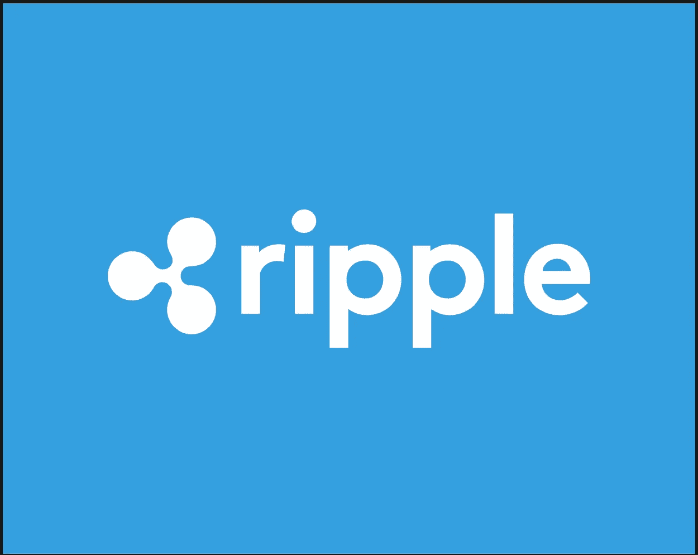
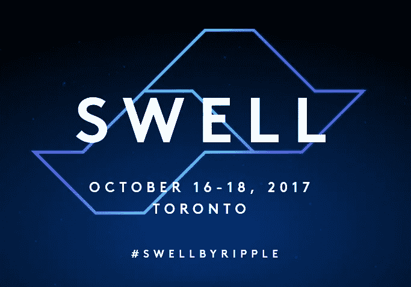
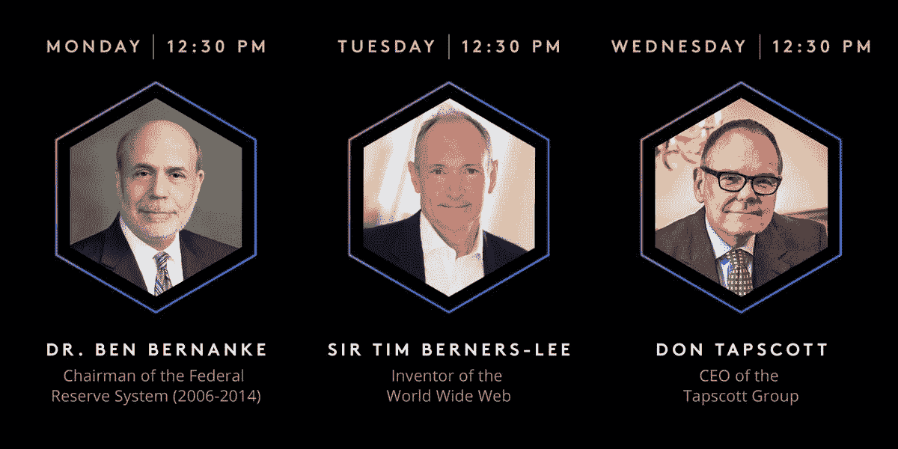
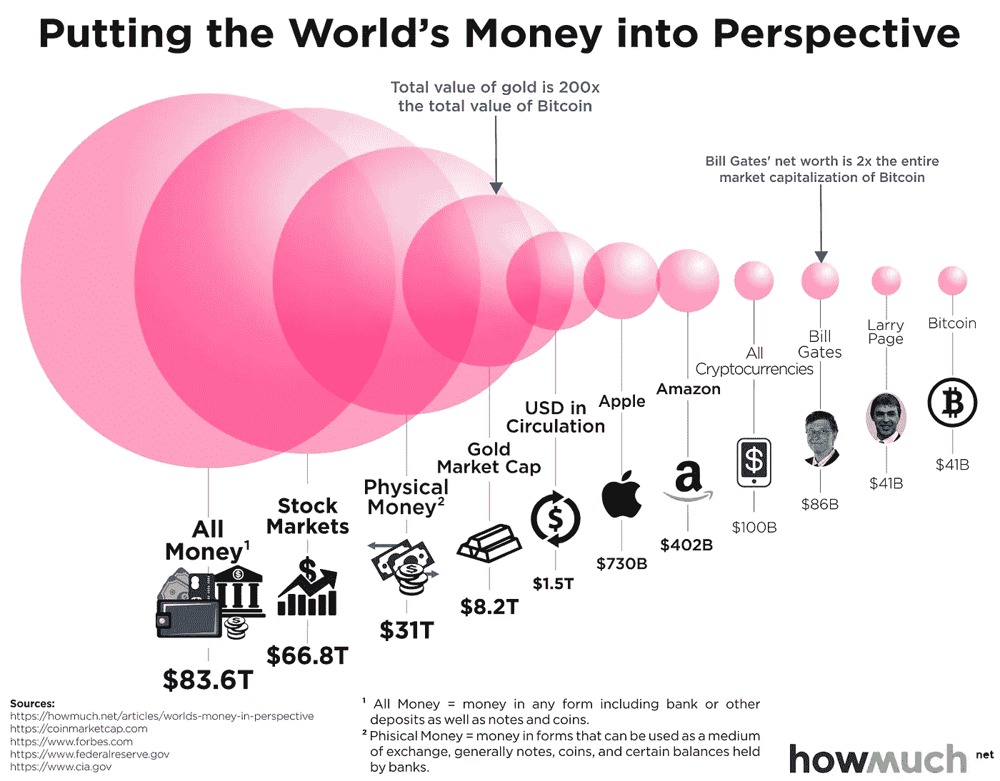

# XRP 即将成为主流吗？:基本面分析

> 原文：<https://medium.com/hackernoon/is-xrp-about-to-go-mainstream-fundamental-analysis-cec2a11a3aa6>

Ripple

如果你是 XRP 的所有者，你可能不会根据 Ripple 协议背后的先进技术，甚至是 Ripple 作为一家真正公司的合法性来做出投资决定；你可能是基于银行和金融机构对 XRP 效用的认知而做出这个决定的。要么是这样，要么是你看到了 2017 年价格的抛物线运动，并决定参与其中。

不管你的动机如何，可以肯定地说，你做出了明智的投资选择；Ripple 已经发展了相当长的一段时间，并朝着成为真正的“价值互联网”的目标稳步前进。

如果你像我一样是一个 XRP 爱好者，你可能也知道 XRP 社区正在努力追踪银行对 XRP 的首次主流使用。这是怎么做到的？它很简单:跟踪钱包，查看交易，并分析新建立账户的资金流动。不幸的是，到目前为止，还没有发现什么重大发现。然而，这并没有阻碍社区的乐观情绪，因为许多人仍然期待着真正的银行采用，他们相信这很快就会到来。

最重要的是，SWELL 即将到来，随着每一天离重大事件越来越近，社区的兴奋似乎越来越强烈。

SWELL Conference Flyer Sheet

SWELL Keynote Speakers

## 投资者和 XRP

整个 2017 年，XRP 的价格变动是巨大的。自今年年初以来，数字货币的价值已经上涨了近 7000%，这表明对该资产的需求远远超过了市场以支持利率供应硬币的能力。结果，由于这种市场行为，几十个新的百万富翁凭空产生了。

然而，与普遍的看法相反，这些“抛物线”价格运动并不是由于 Ripple 引人注目的新闻公告，更重要的是，与银行或金融机构对 XRP 的使用没有任何关联。相反，它们似乎完全是通过更大的市场力量自行发生的——包括我在内的绝大多数投资者和投机者仍然不太理解这些力量。

## 韩国

尽管零售投资者对加密货币的采用在 2017 年大幅增长，但与传统股票市场相比，它仍然微不足道。然而，如果有一个国家提供了一个可靠的例子，说明一旦加密货币进入西方，主流投资者的采纳情况会是什么样，那就是韩国。

至少可以说，韩国人对加密带来的高风险、高回报的价格行为有着巨大的胃口。事实上，从韩国交易所开始冲击市场的交易量一直持续到今天。

包括美国在内的大多数西方国家尚未经历投资者对加密货币的全面采用。尽管如此，最近的报告指出，大量货币退出传统市场，进入加密货币领域。因此，考虑到最近的价格波动，新投资者的资金正在稳步进入加密市场，这似乎几乎是显而易见的。

为了更好地理解这一点，下面的图表比较了几家公司和市场的资本总额，以及黄金和流通中的所有实物货币与加密货币的资本总额。

## 对冲基金

2016 年 9 月，美国区块链初创公司 R3 Cordia——由 80 家金融机构组成的财团——和 Ripple Labs 签订了一份期权合同，该合同将给予 R3**机会**以折扣价购买多达 50 亿 XRP。

然而，Ripple 的诉讼称，该公司终止了协议，因为 R3 未能履行他们的合作伙伴关系——包括访问其 80 多家银行和金融机构的网络。除此之外，Ripple 还声称 R3 掌握了他们的信息，因为他们从未被告知高盛和桑坦德银行已经自行取消了他们关于试验 Ripple 分布式账本协议的口头协议。

因此，Ripple 要求法院宣布这些协议现在无效，并命令 R3 支付赔偿金，金额将在审判中确定。

现在，话虽如此，有些事情还没有确定。

大约在 2016 年 R3 合同的同一时间，Ripple 宣布他们将把 600 亿 XRP 的非流通供应放在一个托管账户中，为期 4 年。然而，他们也注意到这 600 亿 XRP 将是“sans”(没有)R3 合同的 50 亿。因此，只有 550 亿 XRP 被锁入代管账户。

既然 R3 合作伙伴关系不再存在，并且假设未完成的合同仍然存在，比如说 10 亿 XRP，那么我们可以假设这些将不会包括在托管中。

那么剩下的 XRP 会怎么样呢？

在过去的一年中，几家大型对冲基金已经接触 Ripple，开始使用他们的数字资产作为投资者的工具。

然而，几乎可以肯定的是，Ripple 拒绝了这些请求，并命令他们“去普通市场”购买 XRP 产品。

除此之外，我们还可以实事求是地注意到，目前还没有对冲基金对 XRP 进行任何大宗购买。

因此，这对目前的 XRP 投资者来说是个好消息。上述两种情况都意味着，我们尚未看到对冲基金的购买量达到主流媒体如此公开宣布的水平。这很可能表明对冲基金仍在准备处理一种与以往大不相同的资产。

## 安全性

尽管 cryptos 承诺不变的安全性，但拥有加密货币肯定伴随着挑战——许多早期投资者可以证明这一点。例如，为了安全地处理他们的加密货币，人们必须首先了解钱包存储的基础知识，在某些情况下，这些钱包下面的代码，并时刻意识到可能的黑客攻击企图。

从这一点来看，很清楚为什么许多对冲基金在为安全处理一项极其独特的资产做准备时仍然耐心地保持观望。考虑到这些对冲基金将购买价值数百万美元的加密货币，在他们开始购买和存储之前，有很多事情需要考虑和考虑。

然而，在处理 XRP 问题上，对冲基金的担心要少得多。通常，许多加密货币利用匿名第三方或开源开发者创建的钱包平台。结果，这导致了很大的安全性不确定性，因为通常编写得很差的代码似乎总是会干扰。另一方面，Ripple 与最受尊敬和最先进的钱包开发公司之一 BitGo 签订了合同。BitGo 为自己创造了相当好的声誉，因为它成功地为比特币和以太坊创造了钱包，被高度认为是银行、金融机构和投资基金最安全的钱包。

## XRP 的真正价值

如前所述，XRP 是 Ripple 的分布式账本协议的原生资产，目标是成为世界上的下一个过渡货币。事实上，这说明了一些问题——因为 Ripple 能提供的比我们眼前的要多得多。我们谈论的是同一家自 2013 年末以来一直在崛起的公司，该公司已经实现了多个重大里程碑——其中一个是它创建了 interledger protocol (ILP)，这是支付信息在互联网上通信的国际标准。

这个标准来自于 Ripple 与 W3C 团体和其他行业资源的早期合作。最近，新闻头条报道了谷歌、微软、苹果和 Mozilla 这四大技术巨头之间的重大合作。

从这次合作中可以看出，处理在线供应商的网络支付请求的浏览器扩展正在进行中。以下是摘要的一部分:

*“该规范将 API 标准化，以允许商家(即，销售实物或数字商品的网站)利用一种或多种支付方法，并具有最小的集成。用户代理(例如，浏览器)促进了商家和用户之间的支付流程*

现在，你可能会问自己:但是这和 ILP 有什么关系呢？

好问题，简单回答:ILP 标准化了加密货币的支付和互联网上的其他方法。当运行这些大型浏览器的公司直接处理支付请求部分时，ILP 将被利用并集成到这个标准化的 API 扩展中。

这和涟漪有什么关系？

另一个简单的答案是:由于它与 ILP 的联系，Ripple 在这个标准的正确开发中有很大的利害关系。

## 这对 XRP 领养意味着什么？

到目前为止，有一点是清楚的:当世界上最大的浏览器供应商合作开发一个新的网络标准时，这是一个巨大的新闻。

由于目前的支付方式和网络插件已经可以流畅运行，所以需要注意的是，这种浏览器支付标准并不是直接面向主流用户的，至少现在还不是。

引用 W3C 浏览器支付 API 标准的开发负责人 Ian Jacobs 的话说:

*“这是人们开始编写基于区块链的支付方式描述并尝试测试 API 的绝佳机会。这就是我们所处的阶段，测试和互操作性开发阶段。”*

总的来说，这对于密码世界来说是一个好消息和令人兴奋的事情。这是区块链技术进步和采用的一个巨大飞跃，它清楚地表明了在请求支付时对标准化浏览器体验的普遍渴望。在完全确定的情况下，很容易说普通加密货币的零售采用正在大幅增长。

## **膨胀**

随着膨胀即将来临，来自世界各地的银行高管和金融领袖将最终被置于完全的日光之下。10 月 16 日至 18 日，Ripple 将在多伦多举办一场会议，与会者包括 100 多家主要金融机构。主题演讲人，如美联储前主席本·伯南克博士和万维网发明者蒂姆·伯纳斯·李爵士，将代表 Ripple 出席会议，努力说服这些机构加入 Ripple，参与我们今天开始经历的金融科技革命。

因此，尽管所有这些都是保密的，但仍然存在一个至关重要的问题:

当西方世界经历类似于朝鲜的散户投资者接纳时，会发生什么？

如果 XRP 成为即将到来的浏览器支付 API 标准的一部分，会发生什么？

我告诉你会发生什么…

🚀

## 结论

感谢你花时间阅读这篇文章，我希望你真的喜欢它。我要感谢 [Hodor 的 XRP 博客](https://xrphodor.wordpress.com/2017/09/21/is-xrp-about-to-go-mainstream/)在一篇漂亮的文章中提供并捆绑了可靠的信息。如果你喜欢读这篇文章，别忘了鼓掌表示你的支持！

在所有社交媒体平台上关注@ TheCoinEconomy，了解加密货币市场和区块链科技发展的最新动态。( [TradingView](https://www.tradingview.com/u/thecoineconomy/) ， [Twitter](https://twitter.com/thecoineconomy) ， [Instagram](https://www.instagram.com/thecoineconomy/) ，[脸书](https://www.facebook.com/Thecoineconomy-353316841786257/)，[stock wit](https://stocktwits.com/TheCoinEconomy)