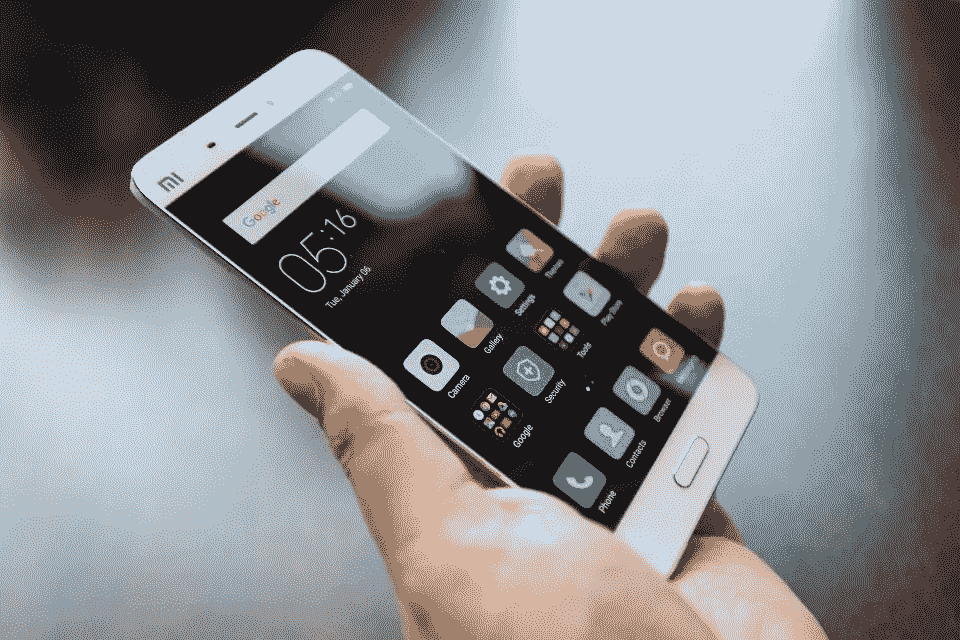
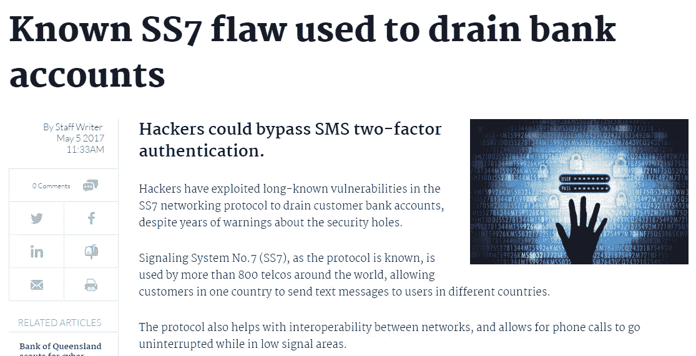
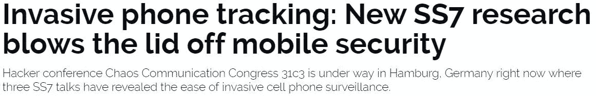

# 您的双因素认证是基于“小指发誓”和 90 年代后期的 IT 安全性吗？….

> 原文：<https://medium.com/hackernoon/is-your-2-factor-auth-based-on-a-pinky-swear-and-late-90s-it-security-859f50f25c8b>

# ….因为你的邻居 Wi-Fi 路由器使用了比你信任的电信运营商更强的通信协议加密。

两个截然不同的技术世界影响着我们的日常生活。电信和 IP 世界(又名在线，网络，IOT)。

Your smartphone is a IP/Telco hybrid that you care and love

IP/IOT/在线世界充满了如此多的威胁和危险，甚至普通的最终用户都知道网络钓鱼、暴力攻击、crytolocker、恶意机器人等术语，并且至少意识到拥有良好的 IT 安全系统的重要性。

Top security experts at work

毫无疑问，一个普通用户确信，他/她所依赖的电信世界并不是没有顶级的安全性，它是安全的，不会受到网络的攻击。

所以… **电信是一个高度安全的地方。**

**现实完全相反**。事实是，网络运营商已经外包了一切，并依赖于他们的设备供应商的所有技术问题，包括安全。

但是为什么七号信令如此不安全..它不是由电信专业人士构建的吗？是的，但是由于所有的传统协议都是在封闭网络中使用的，因此很少进行安全性研究来评估 SS7 的安全性。

安全研究人员根本无法访问 SS7 网络，服务提供商也没有兴趣关注这个话题，因为根本没有必要——这不像“网络”那样是蛮荒的西部。

> 在寻求更多利润的同时，网络提供商已经向第三方开放了他们的 SS7 网络，作为他们商业产品的一部分。

这为许多公司创造了机会，通过构建与流行的 IT 技术兼容的不同接口，使电信世界对开发人员更加友好，并使电信世界更接近普通软件工程师。

尽管开放 SS7 网络带来了许多好处，但它也极大地改变了信任和安全的概念，此前几位安全研究人员宣布了 SS7 协议中的主要漏洞，这些漏洞威胁到用户的隐私，并可能导致**用户位置跟踪、欺诈、拒绝服务，甚至电话和短信拦截**。

电信社区对此作出了反应，如果说没有人尝试使用 A5/1 或 A5/3 协议来加密流量是不公平的。

但是举例来说，A5/1 套件已经被破解，使用廉价的无线电拦截器来解密通过空中接口传输的呼叫是可能的。

> 实际上，破解普通的 WIFI 加密(WPA **256 位**加密)比破解两个移动蜂窝之间的空中通信(A5/1 **64 位**加密)更难

在过去的几十年里，电信网络中最基本的协议之一 7 号信令系统(SS7)的安全性完全基于互连运营商之间的相互信任。运营商(网络提供商)依赖于他们对其他运营商的信任来遵守规则——但游戏已经改变，如果移动运营商希望在未来几十年内与**相关，他们需要提升游戏水平，不仅考虑利润，还要投资于**安全——21 世纪的顶级商品之一**。**

************

> **[黑客中午](http://bit.ly/Hackernoon)是黑客如何开始他们的下午。我们是 [@AMI](http://bit.ly/atAMIatAMI) 家庭的一员。我们现在[接受投稿](http://bit.ly/hackernoonsubmission)并乐意[讨论广告&赞助](mailto:partners@amipublications.com)机会。**
> 
> **如果你喜欢这个故事，我们推荐你阅读我们的[最新科技故事](http://bit.ly/hackernoonlatestt)和[趋势科技故事](https://hackernoon.com/trending)。直到下一次，不要把世界的现实想当然！**

****