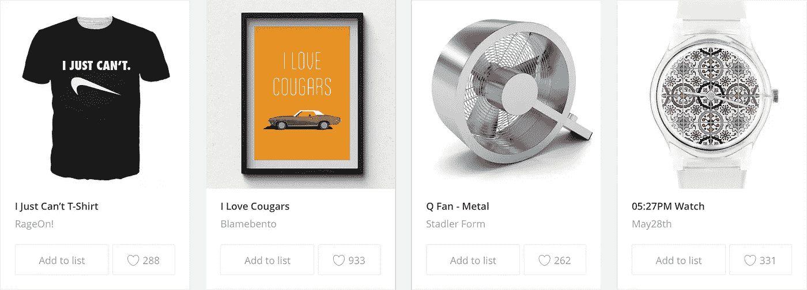
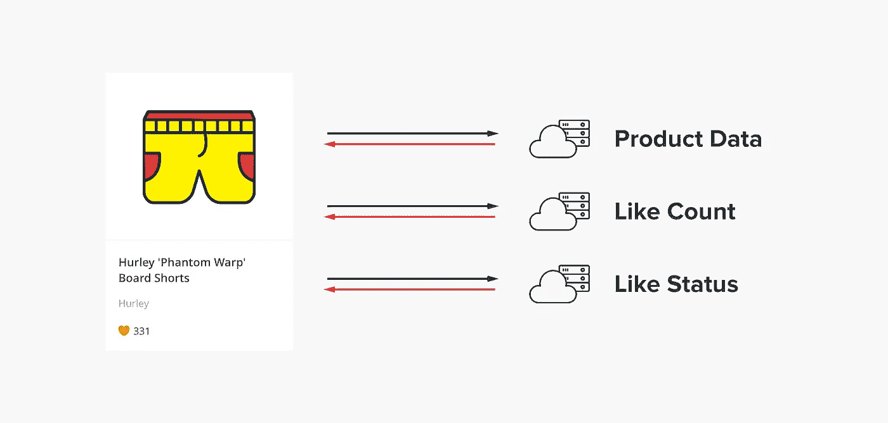
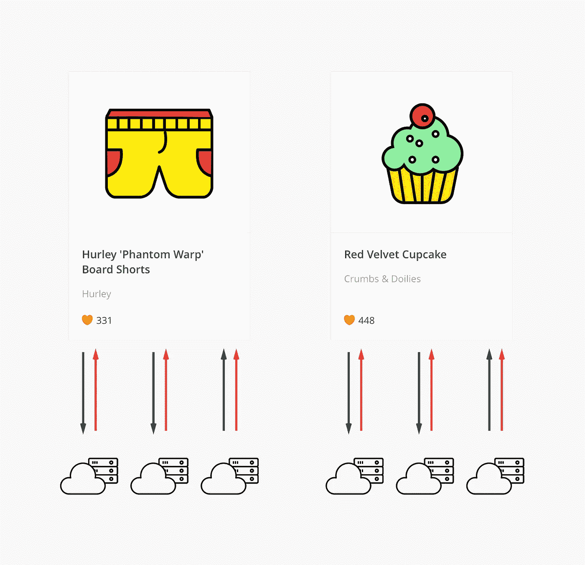
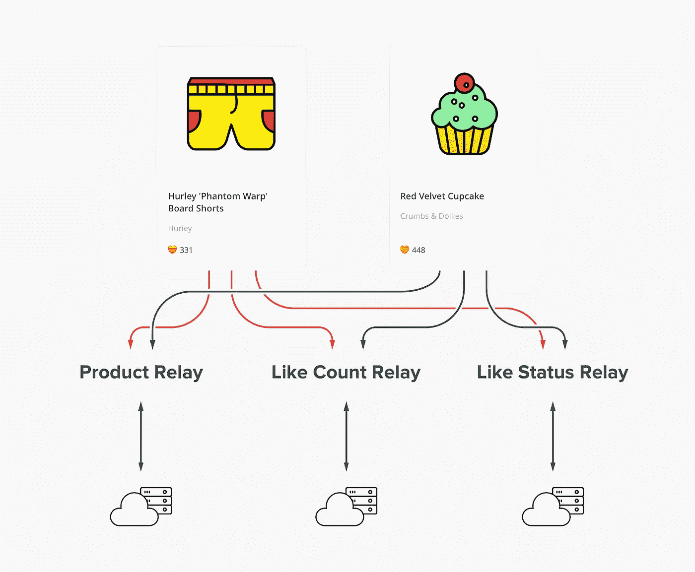

# 你的 Angular App 是纸牌屋吗？

> 原文：<https://medium.com/hackernoon/is-your-angular-app-a-house-of-cards-af1335ec03b6>

## 我们的是，我们的表现受到影响，我们做了一些事情

Hubba 有助于让商业世界运行得更快。我们联系品牌、零售商和有影响力的人，帮助他们发现新的业务关系。我们使用基于 Angular 1.5 的单页面应用程序来实现这一点，该应用程序可以在每个屏幕上显示大量与产品相关的信息。

如果您是 Angular 1.x 开发人员，您可能会问，

> 屏幕上有这么多数据，这对您的性能有什么影响？

嗯，没什么好事。这篇文章是关于一个强大的技术，我们用它将 Angular 1.5 打造成一个高性能的机器。

2016 年春末，我在 Hubba 开始了职业生涯。我是一名经验丰富的开发人员，刚刚离开一个团队，这个团队用了大半年的时间使用 React 来构建企业级应用程序。在此之前，我是一个团队的成员，使用 Backbone 和其他定制前端工具构建了一个媒体监控应用程序。不用说，走进一家棱角分明的商店是一种新鲜的体验，如果不是令人大开眼界的话。

# 纸牌搭的房子

在 Hubba，我们蝙蝠侠式的正义腰带中的一个工具就是卡片。卡片非常简单——它们是独立的代码片段，为我们网站的某些功能提供数据。我们有显示产品信息、用户和品牌简介、产品列表、博客文章等的卡片。

These are product cards. Their purpose is simple: [they pass product data](https://media.giphy.com/media/LSE9bqWzLiola/giphy.gif).

卡片很整洁。每一个都处理自己的小角落:它们加载自己的数据，呈现自己的 HTML，处理自己的用户交互，并让应用程序的其他部分与它们挂钩，以实现特定的业务目标。

我在 Hubba 的时间并不长，但很容易看到我们在应用程序中越来越多的地方使用卡片。为什么不呢——它们既方便又强大。指向数据库中一些 id 的一行 HTML 风格的代码就足以让开发人员立刻启动并运行满屏的卡片。

当我们开始向以前没有卡片的页面添加卡片，并构建依赖于卡片便利性的新功能时，我们开始注意到很多性能下降。起初，我认为性能问题与 DOM 有关。我推测在加载卡时访问每个数据的 DOM 会导致性能下降。我做了一些善意的调整来批量处理一些 DOM 处理，期望一举解决我们的大部分问题。

事实并非如此。

# 是时候开始了

我开始使用 Chrome 开发工具来更好地描述正在发生的事情。我能够识别出有大量的 XHR 调用用于获取数据。每张卡在其生命周期中执行约 3–5 次数据提取。

当我们有一页 10-20 张卡片，进行大约 30-50 次数据读取时，性能会受到严重影响。Chrome 会再吃几块美味的 RAM，然后最终从地上爬起来。我们开发人员所知道和喜爱的卡片的力量正把我们带入一个滑稽的堕落。

How cards loaded data in 2016

我们用 [InView](https://github.com/thenikso/angular-inview) 指令暂时解决了这种情况，防止卡片在真正出现在用户屏幕上之前做任何工作。它工作了一段时间，但当我们一次看到 5-10 张卡时，性能仍然会失控。对于普通用户来说，这不是一个有趣的体验，他们只想知道[火鸡包](https://www.hubba.com/products/true-liberty-bags-turkey-bags-1)的包装尺寸，或者从[熊&鼠](https://www.hubba.com/brand/the-bear-and-the-rat)那里找到最新口味的狗冰淇淋。

Many cards meant many data fetches. When there were 10+ cards things could get ugly.

我们需要一个解决方案来解决这个问题。我们需要即时数据，但它不能对现有卡的开发周期产生重大影响。由于我们运行的是 Angular 1.5，我们没有真正适合我们需求的好的数据存储选项。所以我们必须去定制，我有一个主意。

# 是时候挖出来了

第一个概念证明被固定在我们的产品卡上，这是 Hubba 业务的支柱。产品卡是我的想法的一个很好的测试平台。每个产品卡需要 3 条数据:

*   产品数据
*   该产品获得了多少赞
*   如果你是一个登录用户，我们还会显示你是否喜欢该产品。

第一个实现有点粗糙，但在性能上是一个巨大的胜利。它不仅解决了数据获取问题，而且页面的性能也明显提高了。在我的测试场景中，当超过 50 张产品卡被绘制到页面上时，没有出现巨大的滞后峰值。

我的想法是在卡本身和服务器之间设置某种层。卡仍然单独请求数据，然后该层等待一小段时间，将所有请求的 id 一起批处理，然后在一个请求中获取所有数据，同时仍然单独向每个卡返回数据。这样，每张卡都不会因为数据请求而直接污染浏览器，但是每张卡仍然可以得到它需要的东西。

How our relays changed things. Instead of the cards fetching their own data, relays now batch and handle it for them.

我记得我的老板在回顾拉动请求时说的话:“速度的圣母”。这标志着我发现的时刻，证明我是在正确的轨道上。我决定将这种模式命名为“接力”，从那以后，它们就成了我们每天都要依赖的自己的实体。这里的其他开发人员已经开始使用它们并添加到它们中，或者基于它们提供的灵活性开发特性。

继电器非常适合我们基于卡的应用。它们让我们避免了必须提前准备数据的步骤。我们可以在需要时随时高效地加载所有内容。它是一个工具，让我们更快地开发许多东西，甚至减轻了一些头痛。

从那时起，我们已经在所有的卡中实现了中继，并且中继基本上覆盖了我们所有的内部数据源。我们还添加了一些生活质量方面的东西，比如自动将获取的数据转换为数据模型，在数据到达时缓存数据，以及将请求批处理和排队到更小的集合中，以获得更好的性能。

接力赛只是我有机会在 Hubba 工作的一件很酷的事情，它产生了一些影响。我们总是在这里开发很酷的东西，并且喜欢听到关于我们做得如何的反馈——请随时联系我们！

亚当·哈钦森
高级前端家伙在[哈伯](http://hubba.com)T3[@ _ adamhutch](https://twitter.com/_adamhutch)

> [黑客中午](http://bit.ly/Hackernoon)是黑客如何开始他们的下午。我们是 [@AMI](http://bit.ly/atAMIatAMI) 家庭的一员。我们现在[接受投稿](http://bit.ly/hackernoonsubmission)并乐意[讨论广告&赞助](mailto:partners@amipublications.com)机会。
> 
> 如果你喜欢这个故事，我们推荐你阅读我们的[最新科技故事](http://bit.ly/hackernoonlatestt)和[趋势科技故事](https://hackernoon.com/trending)。直到下一次，不要把世界的现实想当然！

