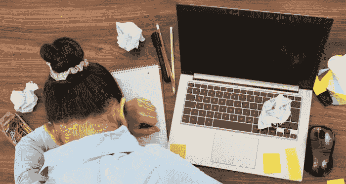

# 你的职业生涯是否因为睡眠障碍而受到影响？

> 原文：<https://medium.com/hackernoon/is-your-career-suffering-because-of-a-sleep-disorder-12829920bdb5>

漫长的一天过后，你的头撞到了枕头上，你发现自己盯着天花板无法入睡，而不是毫不费力地进入了梦乡。或者更糟的是，你闭上眼睛只是为了频繁地睁开眼睛查看时间。

临床研究表明，40%的人口有睡眠问题。我自己知道，通常需要 30 分钟才能入睡。时而又是不安分的睡眠。

当我年轻的时候，大约从我十几岁到三十多岁，我需要两个多小时才能入睡。成年后，我发现自己患有与体重相关的睡眠呼吸暂停症，并且已经达到了一个不健康的水平，好的睡眠对我来说成了一个问题。

此外，我多年的睡眠问题(加上遗传)最近导致了一次近乎致命的心脏病发作。这让我彻底研究了这个话题，并在本文中与您分享事实。

听起来可能很奇怪，睡眠是一个非常活跃的过程，它不仅仅是失眠。它涉及到由你的神经细胞(神经元)和大脑化学物质(神经递质)协调的复杂的生理、心理和行为状态。这是由你的中枢神经系统调节的。身体的每个器官都受到睡眠质量的影响。

# 睡眠的 5 个阶段

更进一步说，人类的睡眠分为五个阶段:

*   **第一阶段:**非常浅的、表面的睡眠。眼睛移动缓慢，肌肉活动很少。阶段 1 睡眠是不连续的，很容易醒来。这不是恢复或刷新。
*   **第二阶段:**通常是睡眠时间最长的阶段。眼球运动减慢，但仍然很容易醒来。老年人和慢性病患者晚上大部分时间可能处于第二阶段睡眠。
*   **第三阶段:**慢波睡眠的开始。身体的许多修复过程都发生在睡眠的深度阶段。更难醒来，醒来可能会导致混乱，迷失方向的感觉。
*   **阶段 4:** 非 REM 睡眠的最深阶段。神经递质和生长激素是合成的。慢波睡眠在儿童时期最突出和强烈，在青春期急剧下降，然后在生命的第二个和第三个十年缓慢下降。
*   第五阶段或 REM: (快速动眼期)大多数做梦都发生在这个阶段。呼吸变得更浅。血压和脉搏快速而不规则地上升，耗氧量增加，流向大脑的血流量增加。眼睛以抽搐的方式运动，但四肢会出现肌肉麻痹(以防止在梦或噩梦中出现)。

我最感兴趣的是睡眠和心脏病之间的关系。我发现挪威的一项很好的研究表明，失眠和心力衰竭风险增加之间有很强的联系。这引起了我的注意。在心力衰竭期间，心脏停止以正确的压力向全身泵送足够的血液。这通常是由于削弱了心脏肌肉或动脉硬化，削弱了心脏有效工作的能力。

挪威的研究是一项为期 11 年的研究，调查了超过 54，000 名年龄在 20 -89 岁的男女的失眠和心血管风险因素，这些人在研究开始时没有心力衰竭。结果显示，与那些没有失眠症状的人相比，那些报告失眠症状的人患心力衰竭的风险增加了三倍。即使在调整了年龄、性别、婚姻状况、吸烟和饮酒、抑郁和焦虑等因素后，情况依然如此。

研究人员得出结论，入睡困难或保持睡眠增加了患心血管疾病和/或死于心血管疾病的风险。

# 不健康的习惯

以下是一些导致睡眠问题的典型习惯，包括:

*   压力和过度担忧
*   有限的运动或不活动
*   不稳定的睡眠时间表
*   暴饮暴食和消化不良
*   过量的酒精、咖啡因和/或尼古丁
*   傍晚小睡(下午 3 点以后)
*   卧室干扰因素:强光、噪音、温度、电视
*   过度使用安眠药和/或其他处方药

挪威研究员 Borge Sversten 博士是卑尔根大学的临床心理学教授，他在研究中指出，睡眠问题已经成为一个经济噩梦，仅在美国，每年就有 2.53 亿天病假。越来越多的人认识到，失眠和睡眠呼吸暂停会导致缺勤，并可能导致严重的事故。

研究员罗纳德·c·凯斯勒博士在 2011 年进行的哈佛医学院睡眠研究发现，美国工人每年损失约 11 天，生产力损失约 2280 美元。这项研究还发现，在美国，睡眠剥夺的估计年度成本超过 630 亿美元

澳大利亚一项新的研究发现，由于各种睡眠障碍导致的病假，澳大利亚约有 2%的 GDP 损失。

例如，2012 年，威斯康星州的 Aurora Health Care 有 2600 多名员工参加了为失眠患者开设的为期 6 周的在线课程。这是在经理们推测睡眠不足是他们员工的一个问题之后。Aurora 的后续调查和观察表明，每位参与者每年平均节省了 672 美元。

# 在国际睡眠障碍分类(或 ICSD)中列出了大约 90 种睡眠障碍，这些睡眠障碍分为四类:

1.  睡眠障碍-一大类睡眠障碍，以嗜睡或失眠为特征。三个主要的亚类包括内在的(即，来自体内的)、外在的(继发于环境条件或各种病理条件)和昼夜节律的紊乱。多达 60%的人口患有这些类型的疾病。
2.  睡眠障碍-睡眠障碍的一个类别，涉及与睡眠有关的异常和不自然的运动、行为、情绪、感知和梦境。其中大多数在青年和青少年中更为明显，高达 20%的人口患有这些疾病，但在成年人中比例下降至约 4%。
3.  可能导致睡眠障碍(如精神分裂症)和情绪障碍(如抑郁和焦虑)的医学或精神疾病。获得这方面的数据是有问题的，因为抑郁和焦虑可能是由睡眠不足引起的，而不是相反。睡眠不足会导致很多精神疾病。
4.  昏睡病-一种寄生虫病，可由采采蝇传播。

# 根据疾病预防控制中心的数据，18-64 岁人群中休息或睡眠不足的比例一直保持在 25%左右，但 25-34 岁人群最差，接近 29%。

不足为奇的是，根据 CDC 的数据，有孩子的人或肥胖的人比他们的同龄人睡眠少 30%左右。有点令人惊讶的是，已婚夫妇比所有其他单身和夫妇的睡眠质量更好。

长期服用安眠药(处方药或非处方药)会降低药效。此外，对老年人的研究表明，长期的睡眠药物治疗可能会错误地表现为痴呆症的症状，包括说话缓慢和/或含糊不清，思维受损和记忆问题。

超过 20%的非慢性失眠患者报告说，在经历压力事件、婚姻困难、健康问题以及与孩子和亲戚的问题时，每年都会出现严重的睡眠问题。

# 移动应用补救措施

有了所有的健康应用和其他与健康相关的技术，我决定看看能否在我的 Android 手机上找到一些有用的东西。我发现的一切都是一些自然声音、白噪音或监控系统的变化，这些系统记录了我睡觉或醒来的频率。

这些都没有真正起作用，但后来我偶然发现了一个名为 [SleepSound](http://www.sleepsound.us.com/#sleep­specialists) 的全新应用。这个脱颖而出的原因是因为它是由两位行为医学专业的临床心理学家设计的。他们采取了完全不同的方法。

这个特殊的应用程序通过以一种基本上与你的脑电波同步的模式发出声音和光来工作，使大脑慢下来，直到你轻轻地进入睡眠状态。当我第一次尝试时，这是一种非常奇怪的感觉。一开始，我认为脉冲声和闪光不会让我平静下来。事实上，头一两分钟感觉很奇怪，然后突然我的大脑开始放松。我所知道的是，我在似乎比平时短得多的时间里睡着了。

该应用程序有一个可配置的开始和结束脉搏率，以及一个会话持续时间，以防你需要更长或更短的时间才能入睡。可调节的启动速度很重要，因为当你启动时，你或多或少会保持警觉。我尝试了一个更高的速率，开始变得焦躁不安，所以根据说明，我降低了启动速率。

如果你容易醒来，另一个很好的功能是，你可以再次使用该应用程序，调整时间和脉搏率，直到你能够重新入睡。该应用程序还允许背景声音，如海洋和风铃，或者根本没有声音。我非常渴望一种更好的入睡方式，我找到了。