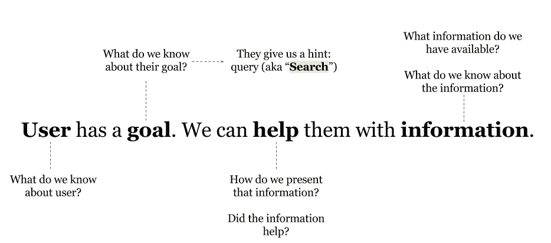
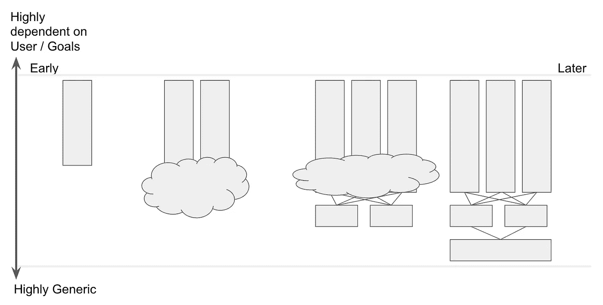

# 你的数据科学团队是孤岛吗？

> 原文：<https://medium.com/hackernoon/is-your-data-science-team-an-island-61d3f64fd397>

我认为在多产品 SaaS 提供商(我目前的产品领域)内部使用搜索来探索一些关于共享资源和复杂内部服务领域(如数据科学)的有趣主题可能会很有趣。在 MTP 2017 的对话中，这个话题出现了几次(特别是在提供复杂产品的公司中)，所以我想继续这个话题。

下面是我对搜索相关性和 UX 的简单概述。用户主动搜索提供了一个“提示”(并且有一些特定于搜索的挑战)，但这与其他数据科学问题非常相似。

在我目前的工作中，与其他内部团队一起寻找理解我们各种用户角色和他们的 T2 目标的合作伙伴。我们还与深入了解如何**帮助**用户在特定环境中实现目标，同时访问特定接触点(例如，网络小部件、移动 SDK、API 等)的人合作。)最后，我们与在某些类型的**信息**方面是专家的个人合作:比如支持票、聊天线程和知识内容。有时候——如果我们幸运的话——这种专长体现在一个人或一个团队身上。在其他情况下，我们需要在公司内部广撒网。

对于一个复杂的企业来说，这些区别至关重要。*产品(*甚至*多产品)*这个词太简单化了。一个用户角色可以在一天内访问多个接触点、多个目标和各种信息块。更多的是一种服务生态。

搜索团队(以及其他数据科学团队)不能作为偏远的热带岛屿存在。它们也不能仅仅通过吉拉的门票、可扩展平台的承诺、繁重的项目管理和规定的功能要求，作为与大陆相连的孤岛而存在。总会有一些技能——搜索就是一个很好的例子——无法雇佣专门的资源。但这并不排除团队在“任务”的整个过程中深入合作和嵌入……在某种程度上，在一段时间内只有一个大型的跨职能团队。归根结底，如果它触及到 UX 和用户，它不可能在真空中完成。

团队的深度整合降低了以下风险:

*   孤立地构建**闪亮的对象**,虽然闪亮并没有真正与完整的体验很好地集成(忽略好的 UX)和/或利用领域专业知识
*   一种**喷洒和祈祷**的方法，增加了许多花哨的功能，但引入了不可管理和不可持续的复杂性
*   为了“高效”和协调良好的(临时)项目，迫使**过早收敛**。从来没有真正移动过指针。一旦努力真正开始，团队就解散了

如果技术被我们的内部合作伙伴“抛在后面”,我们是幸运的，但是大多数数据科学团队维护某些工具、服务和基础架构，它们处于动态状态。有一个范围…一些服务非常非常特定于某些新兴/新颖的使用情形，其他服务是通用的，中间有许多东西。让事情变得更复杂的是，我们可能会与其他基础设施/数据工程团队合作来保持这艘船的航行。这里最大的危险是假设规模经济可能存在也可能不存在，或者假设技术堆栈(您的堆栈和扩展内部合作伙伴堆栈)是静态的。它不是。

> 这里最大的危险是假设规模经济可能存在也可能不存在，或者假设技术堆栈(您的堆栈和扩展内部合作伙伴堆栈)是静态的。它不是。

在最好的情况下，服务围绕实际问题有机地发展(通过定期重构):

对我个人来说，有趣的是，这种动态与我之前作为 UX 研究员的工作没有什么不同。UX 研究的诱惑是做大批量的前期研究，并把研究“放到”一个团队中。这真的行不通。我已经有了更好的结果，完全融入团队，并带着团队一起踏上旅程。通常，我们一开始认为是问题(或者将会解决问题)的东西，在全局中只起了很小的作用。你不能就这样跳槽。

所以一些提示:

*   制定一个内部融资模型，考虑 1)您维护的复杂性(不仅仅是“新东西”)；2)围绕规模经济的假设的脆弱性；3)您各种参与的成熟度；以及 4)您交付的实际价值与您的成本。
*   保持团队的高度流动性，抵制围绕结构或流程的预先优化。界限必须是灵活的。
*   关注实际问题而不是搭建平台。让平台作为一个训练有素的迭代循环的结果出现，聚合通用组件，解决新问题。
*   了解什么构成了你的问题空间，并确保你可以直接接触到领域专家(对我们来说是用户、目标、接触点和信息)。不要吝啬，在必要的时候引起他们的注意。
*   嵌入很深。把你和你的合作者看作一个团队。同时抵抗多任务和矩阵的拉力
*   避免过早融合或采用“检票员”/功能请求/团队俄罗斯方块。
*   尽可能把目标提高到最高水平。例如，搜索作为一个组件存在于界面中。问…“是什么让整个界面对用户和他们的目标有效(用可用的信息)？”您可能会发现甚至不需要高级数据科学方法。

> [黑客中午](http://bit.ly/Hackernoon)是黑客如何开始他们的下午。我们是 [@AMI](http://bit.ly/atAMIatAMI) 家庭的一员。我们现在[接受投稿](http://bit.ly/hackernoonsubmission)，并乐意[讨论广告&赞助](mailto:partners@amipublications.com)机会。
> 
> 如果你喜欢这个故事，我们推荐你阅读我们的[最新科技故事](http://bit.ly/hackernoonlatestt)和[趋势科技故事](https://hackernoon.com/trending)。直到下一次，不要把世界的现实想当然！

