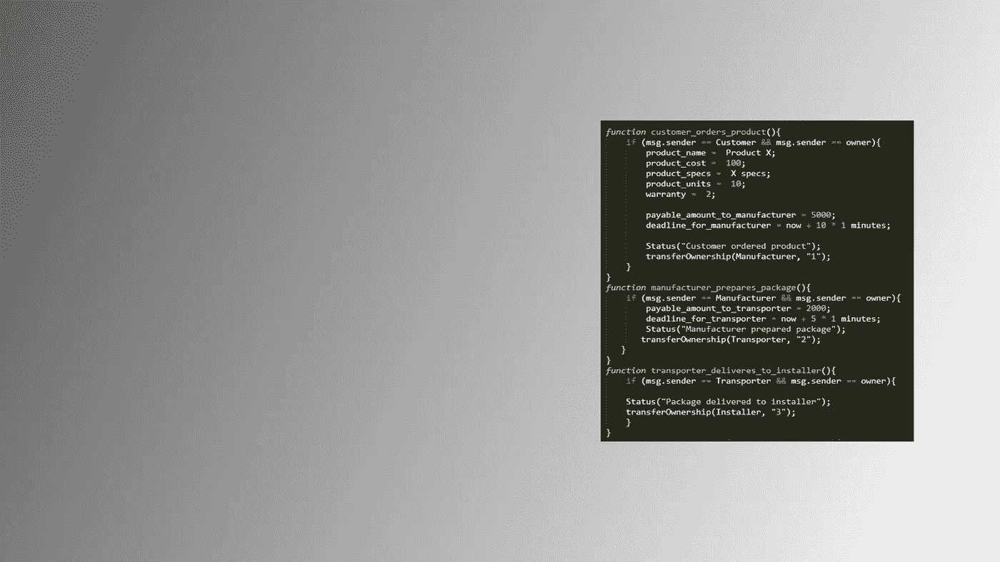
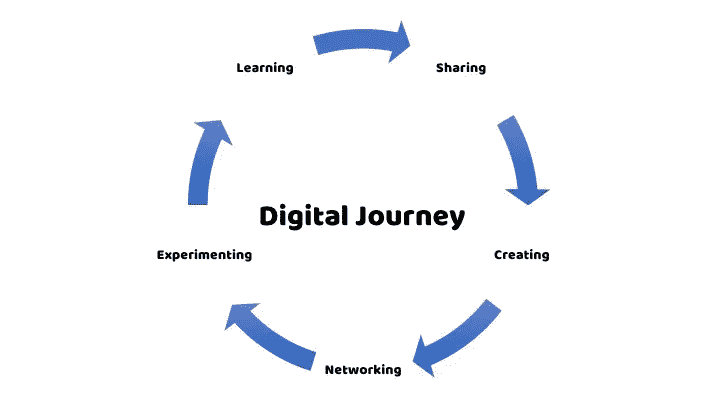

# 技术正在威胁我们的工作

> 原文：<https://medium.com/hackernoon/is-your-job-threatened-by-technology-3d63fe4c5c76>

## 如何在一个持续不确定的时代重塑自我

> 迷恋与恐惧，兴奋与怀疑。

以上是我思考工作的未来和技术对工作的影响时的感受。

但是，我也继续问我自己:**我们所知的世界*真的*在改变吗？**

似乎没有单一或直接的答案。

有时候我觉得现在下结论还为时过早。其他人告诉我最好抱着“等着瞧”的态度。只有当技术变得更加主流，更多的数据变得可用时，我们才会“知道”答案。

一些人声称自动化(和去中心化)都是炒作，制造了一个很快就会破裂的泡沫。“怀疑论者”经常将加密货币的当前定价作为一个主要例子。

但是，大多数时候我相信剧变即将到来。

我遇到并与之交谈的许多其他人似乎都同意人工智能、区块链技术和数据分析正在如何改变我们的工作。他们是真正的游戏规则改变者。

> **那么，我们应该如何为一个技术驱动的数字时代做准备呢？**
> 
> **对于一个“软件在‘吃世界’，‘AI 要吃软件’的不确定世界，我们能做些什么来“做好准备”？**

 [## 英伟达 CEO:“软件正在吃掉世界，但 AI 要吃掉软件”

### 科技公司和投资者最近一直在向人工智能领域投入大量资金——而且还在源源不断地注入…

www.technologyreview.com](https://www.technologyreview.com/s/607831/nvidia-ceo-software-is-eating-the-world-but-ai-is-going-to-eat-software/) 

# 什么对我有效

我一直对技术和创新很着迷。我一直是一个“技术乐观主义者”。我一直相信科技会解决大多数社会问题，改善我们的生活。

我一直认为我跟上了技术变革的步伐。但是，一年前，在 2016 年圣诞节期间，这一切都变了。

我喜欢一年中的这个时候，因为它让我摆脱了“一切照旧”的感觉。这给了我时间去思考已经发生的事情和未来的计划。我知道这是老生常谈，但它对我真的很有效。

去年圣诞节，我在阅读新技术。特别是区块链和智能合约的最新发展引起了我的注意。当然，我听说过它，知道它是比特币和其他加密货币的技术基础。

然而，我没有意识到的是，区块链技术的潜力要大得多，远远超出了加密货币。

> 我意识到还有更多的事情在发生，这些技术不应该被孤立地看待。

各种技术相互促进，通过合作可以产生令人兴奋的应用。特别是，区块链与其他技术(如人工智能和传感器)相结合的力量让我感兴趣和兴奋。

我和妻子讨论了“我的新发现”,觉得为了不在工作和教学中落后，我必须做好更充分的准备。我想了解正在发生的事情，以及这场技术革命将对我们共同的未来产生什么影响。

因此，我开始购买一些关于数字技术的畅销书，以便了解更多信息并做好准备。

> 但我很快意识到，这不仅仅是买书和看书的问题。

如果你想要最新的信息，“传统的”知识来源已经不够了。

所以，这里有五个步骤对我来说很有效，为一个新的技术和持续不确定的时代做好了准备。

以下是我为未来工作做准备的数字化之旅。

## #1 —学习

我接受了一种积极的自我导向的学习策略。

我在网络媒体上找到了文章和视频。可用材料的范围和深度确实令人震惊。我已经在另一个故事里提到过 [*未来主义*](https://futurism.com) 。我也开始看到新平台的力量，比如 *Medium* 。

我不断地消耗所有这些信息，但很快意识到我需要做更多的事情。自主学习本身不足以真正理解当今世界正在发生的事情。

## #2 —分享

我开始与同事分享这些信息，他们也对技术的指数增长感兴趣。

我们开始分享想法，提出新的潜在应用，并开始预测正在进行的数字革命将如何改变我们的生活、工作和学习方式。

我们互相帮助“策划”最好的文章和视频。

但我们也意识到，阅读、分享和讨论，无论多么有趣，都有其局限性。还需要更多。

## #3 —创建

为了充分了解新技术对我们工作的影响，它帮助我记录了我的经历，并变得更加“有创造力”。我开始写关于它的文章(学术文章和博客)和教授它(创造内容)。

在这方面，特别重要的是“共同创造”的努力。事实证明，写作和教学相结合对于充分理解我们当前数字化世界的挑战和机遇非常有用。

## #4 —网络

写作和教学还帮助创建了一个网络，并成为各种以技术为导向的社区的一部分，我以前甚至不知道这些社区的存在。

这些网络是在数字化旅途中接收最大输入和反馈所必需的。

这使我能够学得更快。与你不认识的人的对话和互动真的增加了一些体验，让我变得更加“聪明”。

人们是否同意我的观点并不重要。对话和他们的投入对于完善想法和论点具有极大的价值。

## # 5——尝试

学习、分享、创造和社交都是我成为“未来证明”的必要步骤。但是他们做的最好的事情是打开了继续实验的大门。

积极尝试提供了真正接触新兴技术的机会。实验让我发现问题，找到解决方案，并揭示新的机会。

我以前在[区块链](https://hackernoon.com/want-to-understand-blockchains-start-experimenting-bdc5aeaf2d07)的背景下写过这个。一个不断实验的过程对我很有效。但是，我的同事都有类似的经历。

当然，非常有趣的是，这些实验被用来启动新一轮的学习、分享、创造、交流和实验。

# 数字时代的“生活方式”

> 那么，我们应该如何为一个技术驱动的数字时代做准备呢？
> 
> 我们如何为明天的工作场所“证明”自己？

当然，你必须发现并拥抱你自己的数字化之旅。你需要让旅行成为你生活的一部分。你必须把它变成你的生活。

但是这五个步骤(学习、分享、创造、建立关系网和尝试)是每个人帮助改变你的生活方式并为数字时代的新工作机会做好准备的良好开端。

最后一个想法是:

> 有趣的是，这种方法不仅适用于个人，也适用于企业。

为了让企业保持或成为未来工作的创造者，有必要不断创新，并在数字时代保持相关性。而这五个步骤(“学习”、“分享”、“共同创造”、“联网”和“实验”)为发现新的数字化战略以实现这一目标提供了一个强大的模板。

*感谢您的阅读！请按住*👏*下面，还是留下评论吧。*

每周都有新的故事。因此，如果你关注我，你不会错过我关于数字时代如何改变我们生活和工作方式的最新见解。