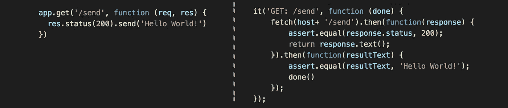
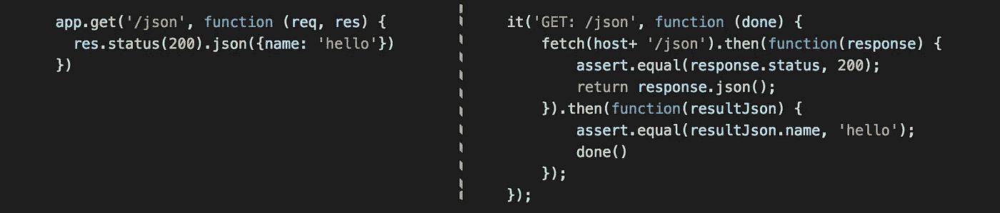
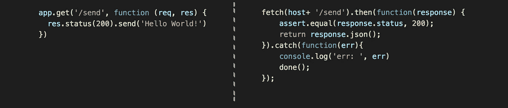
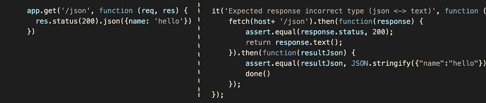

# [Nodejs][React]同构获取:可疑部分

> 原文：<https://medium.com/hackernoon/isomorphic-fetch-node-js-react-tutorial-example-error-timeout-handle-npm-1575752877b4>


Isomorphic-Fetch, write once use two sides

我相信每一个 ***【同构开发者】*** 都一定听说过*同构提取*这个神奇的功能，它是为 *Node.js* 和*浏览器*发送 API 请求的实现。

> 一次编写使用两端，服务器和浏览器

为了检验这些测试是如何实现的，请从 git 中克隆[库。](https://github.com/wahengchang/isomorphicfetch-must-know)

# 同构提取简介

## 安装

```
$ npm install --save **isomorphic-fetch es6-promise**
```

并导入到 *Node.js server* 的条目中

```
require('es6-promise').polyfill();
require('isomorphic-fetch');
```

正确的方法使用 fetch()，使用***respo SNE . text()***解析文本响应，使用***respo SNE . json()***解析来自服务器的 JSON 响应:



text response



json response

# 同构获取的棘手部分

根据我的经验，fetch()很容易使用，在构建同构网站时节省了我很多时间，但是当有错误或异常发生时，它太安静了，我花了很多时间来找出错误。

我试验 fetch()的方式是创建一个简单的 ***Express.js*** 服务器，有 5 种不同的情况:
1)响应**文本**带 **200** 状态码
2)响应 **json** 带 **200** 状态码
3)响应**文本**带 **400** 状态码

当我使用不正确的方法来处理这些情况时，找出 fetch()内部实际发生了什么。

## 1.通过 response.json()解析文本响应

*转到异常*



## 2.通过 response.text()解析 json 响应

它响应为*字符串类型*



## 3.无法进行超时处理

fetch()不支持超时处理，它可能会一直等到我们死亡而没有响应。绕过的方法是自己创建一个 timeoutPromise 包装器。

这是@ [alcat2008](https://github.com/alcat2008) 在 [*git 问题*](https://github.com/whatwg/fetch/issues/20) 中提出的解决方案:

```
var p = Promise.race([
  fetch('/resource-that-may-take-a-while'),
  new Promise(function (resolve, reject) {
    setTimeout(() => reject(new Error('request timeout')), 5000)
  })
])p.then(response => console.log(response))
p.catch(error => console.log(error))
```

喜欢这个故事？对别人有帮助吗？这有助于我知道你是否想看到更多关于他的主题，并帮助人们看到这个故事， ***当点击下面的心*** 。

## 参考:

[https://www.npmjs.com/package/isomorphic-fetch](https://www.npmjs.com/package/isomorphic-fetch)

【https://github.com/wahengchang/isomorphicfetch-must-know 号

[](http://bit.ly/HackernoonFB)[](https://goo.gl/k7XYbx)[](https://goo.gl/4ofytp)

> [黑客中午](http://bit.ly/Hackernoon)是黑客如何开始他们的下午。我们是 [@AMI](http://bit.ly/atAMIatAMI) 家庭的一员。我们现在[接受投稿](http://bit.ly/hackernoonsubmission)并乐意[讨论广告&赞助](mailto:partners@amipublications.com)机会。
> 
> 如果你喜欢这个故事，我们推荐你阅读我们的[最新科技故事](http://bit.ly/hackernoonlatestt)和[趋势科技故事](https://hackernoon.com/trending)。直到下一次，不要把世界的现实想当然！

