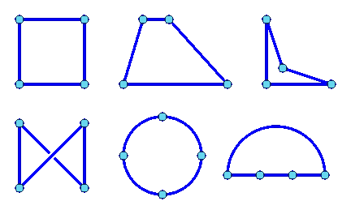

# 同构 Javascript，我们来简化一下。

> 原文：<https://medium.com/hackernoon/isomorphic-javascript-it-just-has-to-work-b9da5b0c8035>

**同构的**I so mor phic(ī'sə-môr'fĭk)具有相似的结构或外貌但却是不同的祖先。

自从发明了 [NodeJS](https://hackernoon.com/tagged/nodejs) 以来，人们就喜欢这样的想法，你可以在整个堆栈中“分享”你的 [JavaScript](https://hackernoon.com/tagged/javascript) 体验。这(理论上)有很多好处，包括语言之间的上下文切换更少，前端和后端之间的转换更容易，也许最有希望的好处是能够共享代码。今天我将向你展示我们已经走了多远，以及同构 JavaScript 的可能性。

好的，我们都知道在 [browserify](http://browserify.org/) 或 [webpac](https://webpack.github.io/) k 的帮助下，有可能普遍使用像 Lodash 这样的实用程序。[检查](https://github.com/matthew-andrews/isomorphic-fetch) —同构获取允许我们这样做。如何移动表单和文件？[检查](https://github.com/form-data/isomorphic-form-data) —同构表单数据与同构获取同样完美地工作！如果我需要能够检测我的环境呢；我不是用流星吗？！[盖好了](https://www.npmjs.com/package/isbrowser)。现在，在诸如 [React](https://facebook.github.io/react/) 、 [Deku](https://github.com/dekujs/deku) 和许多其他库中实现的“虚拟 DOM”的帮助下，甚至可以使 DOM 同构。你甚至可以选择完全退出虚拟 DOM，直接用诸如 [morphdom](https://github.com/patrick-steele-idem/morphdom) 、 [set-dom](https://github.com/DylanPiercey/set-dom) 和 [diffHTML](https://github.com/tbranyen/diffhtml) 之类的工具来编写简单的“静态”html。

This example, although simple, will batch send 100 emails at a time to a custom api and can work just fine in NodeJS or the browser.

这开始看起来很酷了。我现在可以编写一个应用程序，在节点和浏览器中使用相同的工具、ajax 和模板！嗯，我们还没到那一步。还是少了太多！我们需要路由(带重定向)、会话、cookies、状态管理等等来制作一个通用的应用程序！Node 允许我们将这些任务中的大部分委托给 Express 和 Koa 等框架，并允许轻松地将功能组织到中间件中。您可以隔离功能，我可以轻松地测试它们！这是一种简单的、自顶向下的、可插拔的构建 html 的方法——你可以很容易地在整个应用程序中跟踪一个请求(听起来像 flux anyone？).为什么我们不能以同样有组织的方式构建 DOM？React 拉近了我们的距离，但还是不够。React 路由器拉近了我们的距离，但它陌生而笨重。

好吧，我的朋友们，我一直在努力让同构 JavaScript 更有趣、更容易编写。更少的锅炉板，更少的从客户端到服务器的上下文切换，免费的渐进式增强，更快的加载时间，搜索引擎优化，最重要的是一种更简单的方式来思考 web 应用程序。现在有一种方法可以与 node 共享 90%的浏览器代码。这是一个已经开发了一年多的框架，部分原因是我在 [Tiller Digital](http://tillerdigital.ca/) 的亲切的雇主和无数其他致力于缩小同构工具差距的人。它的名字叫[小溪](https://github.com/rill-js/rill)。

# 太好了。另一个框架。它是做什么的？

Rill 是对我们最常用的节点部分的抽象，即 [HTTP](https://nodejs.org/api/http.html) 服务器。然而，由于 [@rill/http](https://github.com/rill-js/http) ，它以同构的方式公开了 http api。路由、重定向、cookies、会话、刷新、错误处理，甚至是像“用户代理”、“推荐者”和“地区”这样的常见标题。您最终可以从同一个 api、客户机或服务器访问关于用户或请求的所有数据，而这恰好与 Node 相同。

不过，Rill 不仅仅是这样， [@rill/http](https://github.com/rill-js/http) 只是一个模块。 [Rill](https://github.com/rill-js/rill) (主库)更类似于 [Express](https://github.com/strongloop/express) 或 [Koa](https://github.com/koajs/koa) ，共享一个相当相似的 api。它支持同构环境中的中间件，并为任何应用程序提供最终版本。数据流动的方式。你可以在这里查看[文档](https://github.com/rill-js/rill/tree/master/docs/api)。

就这样，索引页面现在完全可以由浏览器或节点服务器呈现了。但这并不令人印象深刻，导航呢？那么“/离开”呢？

现在你可以来回导航，浏览器会处理它。请随意关闭 JavaScript，因为您的服务器也完全有能力！没有尴尬的环境，没有“服务器代码”或“客户端代码”，只是渲染你的观点！

这可能很酷，但是如果我的页面只是静态内容，那么这就太过了(尽管它有一些好处)。我的 CRUD 应用程序呢？用户如何输入数据？好吧，答案只是另一个问题“如果没有前端 JavaScript，你会怎么做？”。Rill 让你假装你的浏览器是一个完全有能力的节点服务器，它甚至可以处理表单提交！让我们添加一个表单！

这太棒了，它可以在 Node 和浏览器中完美运行。我们可以像在 Node 中一样编程，当浏览器接管时，渐进增强变得很容易。需要一个可以在你打字时搜索的搜索输入吗？只需使用 React 来触发提交按钮“onClick”。它会正常工作，和手动操作一样快。额外的好处是，如果 JavaScript 失败，您的服务器完全知道如何“反应”！

这只是冰山一角。这种开发风格的模块仍在工作，尚未达到极限。我个人认为像“[节点画布](https://github.com/Automattic/node-canvas)”和“[节点文件 API](https://github.com/node-file-api/file-api) ”这样的工具可以逐步增强图像操作。对于当前兼容 Rill 的中间件列表，只需[点击此处](https://github.com/rill-js/rill/wiki)，或[点击此处](https://www.npmjs.com/search?q=rill)。

就这样。您可以获得以前习惯的“仅服务器”解决方案的表现力和简单性，并能够在可用时将大量逻辑卸载到前端。有很多东西需要理解，这当然是构建前端应用程序的一种不同方式，但也很熟悉。编写您可爱的节点代码，并让它在两个地方都能工作。在服务器中快速初始渲染，在浏览器中快速重新渲染。两全其美，JavaScript web 开发的顶点，圣杯。

*如果您对 Rill、同构/通用 JavaScript 或如何以这种方式构建真正的应用程序有任何疑问，请访问* [*gitter 页面*](https://gitter.im/rill-js/rill) *。*

> [黑客中午](http://bit.ly/Hackernoon)是黑客如何开始他们的下午。我们是 [@AMI](http://bit.ly/atAMIatAMI) 家庭的一员。我们现在[接受投稿](http://bit.ly/hackernoonsubmission)并乐意[讨论广告&赞助](mailto:partners@amipublications.com)机会。
> 
> 如果你喜欢这个故事，我们推荐你阅读我们的[最新科技故事](http://bit.ly/hackernoonlatestt)和[趋势科技故事](https://hackernoon.com/trending)。直到下一次，不要把世界的现实想当然！

