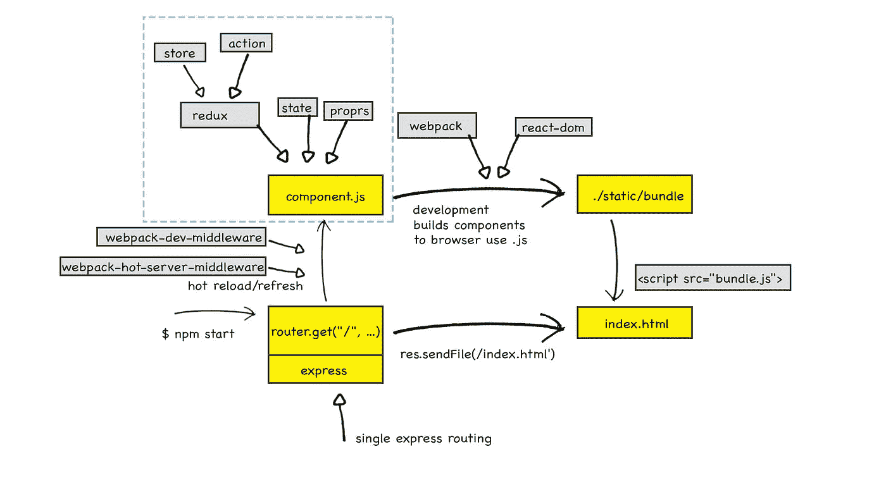
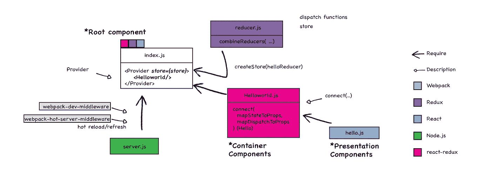
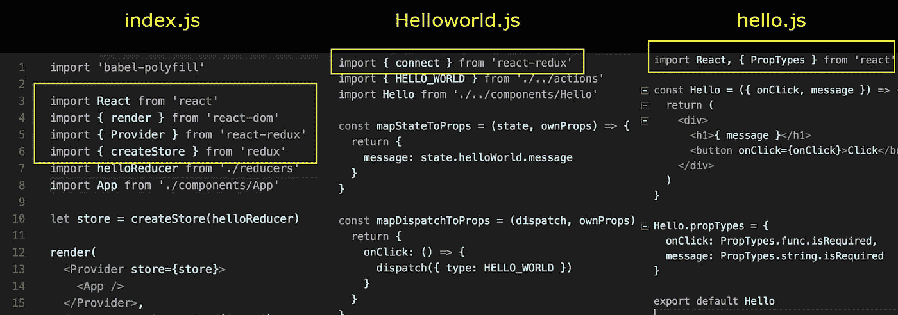

# 打破同构和通用样板:React-Redux 服务器渲染

> 原文：<https://medium.com/hackernoon/isomorphic-universal-boilerplate-react-redux-server-rendering-tutorial-example-webpack-compenent-6e22106ae285>



React Redux server rendering structure

> 寻找一个 React-Redux 样板？如果你是，你可能很容易找到一个。事实上，你可能会发现很多这样的例子。

## 你也喜欢

*   [同构应用:最佳实践](https://hackernoon.com/react-redux-isomorphic-boilerplate-best-practice-example-tutorial-learning-rendering-reducer-action-8a448d0dbddb)
*   [同构边做边学:添加新页面](https://hackernoon.com/node-javascript-react-redux-isomorphic-boilerplate-tutorial-example-adding-new-page-component-router-match-f0347ad42c67)

自从 React 和 Redux 诞生以来，我就迷上了 **1)React 同构**的天堂，其中我们获得了在服务器上呈现的*速度*和 *SEO* 好处，并且您仍然可以在页面加载到客户端后呈现共享组件，以及**2)**[**通量**](http://facebook.github.io/flux/) **架构**的思想，它通过利用单向数据流来补充 React 的可组合视图组件。

在我找出数以千计的同构和易变的样板文件后，我泡了一杯茶来安慰自己，因为它们都不短，学习曲线都非常陡峭，这意味着没有捷径可走，我需要从头开始。本文是一篇笔记，记录了样板文件是如何被一点一点分解成可理解的片段的过程。最后，我总结了 5 个大问题(功能或标签)，它们是创建如此多同构样板文件的原因:

1.  **Dev-Server&Build Bundle:** Setup 开发和生产环境，主要解决 ***热重装、自动观察、bundle build*** 等问题。流行工具:webpack、gulp、nodenpm、browserify 和 grunt。
2.  ***React-Redux 组件和数据流**
3.  为了决定使用什么样的路由层次结构，我们应该问自己几个问题:这是一个单页网站吗？API 服务器支持跨来源吗？快递服务器内部包装比客户端好吗？
4.  **共享缩减器/动作创建器** 与路由有关
5.  **测试**

在这里，我们要谈的是第二点，这是唯一的一个共同的部分数量的一千个样板，其余的四个是不同的变化，由不同的喜好的开发人员。**服务器端渲染**、**共享组件**和 **Redux 模块**是同构和 flux 架构的核心，这也是为什么每个样板文件都使用‘react’、‘Redux’和‘react-Redux’模块的原因。

从基于 React-Redux 的 hellowWorld 示例 Github 中克隆出 [*存储库*](https://github.com/wahengchang/react-redux-boilerplate) ，我们将把它分解成几个部分来理解每个文件是如何工作的:


React Redux server rendering structure

以上是整个应用程序的工作结构，该应用程序基于 Express web 框架，它只服务于一条路线，具有 **res.sendFile** 函数将 index.html 放入浏览器。在这个结构的勺子里面，我们感兴趣的是蓝盒子，react 组件、redux、root 组件、store 和 reducer 之间的交互。



React Redux Structure of data, store, props, state and component

这是一个遵循[官方文档](http://redux.js.org/docs/basics/UsageWithReact.html)的例子，脸书团队对组件的层次结构提出了几个建议和设计原则，例如:分离容器和表示组件，使用 **connect()** 而不是 **store.subscribe()** 等。

**index.js** ，作为入口文件和高层根组件，它集合了所有子组件作为虚拟 DOM 的子树，也是唯一一个与多个独立模块纠缠在一起的文件。除此之外，不同的文件需要独立的模块，这使得干净的代码和独立工作。

到这里，我真的觉得脸书为我们开发商做了很多。



Different file response for independent work

*以下是在 react-redux 组件中起重要作用的函数:*

它[神奇地](https://facebook.github.io/react/docs/context.html)使 ***存储*** 对应用程序中的 ***所有容器*** 组件可用，而无需显式传递它。渲染根组件时，只需使用一次:

```
import { Provider } from 'react-redux'
let store = createStore(todoApp)render(
 **<Provider store={store}>**    <App />
 **</Provider>,**
  document.getElementById('root')
)
```

## 连接(…)

***将 React 组件连接到 Redux*** 允许组件使用顶级存储，而不必通过其父组件将存储作为道具向下传递(来自[*)。*](/@firasd/quick-start-tutorial-using-redux-in-react-apps-89b142d6c5c1)

1.  ***注入存储到根组件***

要开始连接组件，我们必须将我们的根组件包装在 ***Provider、*** 中，并将其传递给 *store* 变量:

```
import helloReducer from './reducers'
import { Provider } from 'react-redux'
import { createStore } from 'redux'
let store = createStore(helloReducer)render(
 **<Provider store={store}>**    <App />
 **</Provider>,** document.getElementById('root')
)
```

**2*2。将商店连接到演示组件***

[React Redux 文档](https://github.com/reactjs/react-redux/blob/master/docs/api.md)描述了使用 c*connect*的多种方式。就我的目的而言，只需要 **mapStateToProps** 和**mapdispatctoprops**来实现该功能。

—状态到道具的映射将提供 *Hello* 组件 *this.props.* ***消息*** 来自 **Redux store**

——将 ***HELLO_WORLD*** 动作的调度函数映射到 props 将使*this .****onClick***作为组件 **Hello** 中的函数可用。

```
const **mapStateToProps** = (state, ownProps) => {
   return {
      **message**: state.helloWorld.message
   }
}const **mapDispatchToProps** = (dispatch, ownProps) => {
   return {
      onClick: () => {
         dispatch({ type: HELLO_WORLD })
      }
   }
}const HelloWorld = connect(
   **mapStateToProps**,
   **mapDispatchToProps**
)(Hello)
```

# 必须知道 NPM 模块

*下面是一些很多人可能不知道的 NPM 模块:*

## 反应还原

默认情况下，Redux 中不包含 Redux&React 绑定。你需要显式安装 npm 包 ***react-redux*** 。
这里假设您使用 npm 软件包管理器和模块捆绑器，如 **Webpack** 或**browser verify**来使用 CommonJS 模块。

## web pack-开发-中间件

这是一个简单的 webpack 包装中间件。它通过连接服务器提供从 webpack 发出的文件。这个应该只用于**开发(** [***更多***](https://www.npmjs.com/package/webpack-dev-middleware) **)** 。
**没有文件被写入磁盘，它处理内存中的文件*

## web pack-热服务器-中间件

它被设计为与服务器上的`[webpack-dev-middleware](https://github.com/webpack/webpack-dev-middleware/),` 到 ***热更新*** Webpack 捆绑包一起使用( [***更多***](https://www.npmjs.com/package/webpack-hot-server-middleware) )。

# 注意

下面是一些概念和术语

## HMR

代表'*热模块更换*，有时也称为'*热模块交换*。这是一个 Webpack 特性，它可以在不刷新浏览器的情况下就地更新您的 JavaScript。

## `combineReducers( ... )`

它将一个值不同的减函数的对象变成一个你可以传递给 ***createStore*** 的单个减函数。

## 创建商店`(reducer, [preloadedState], [enhancer])`

1.  创建一个 Redux [store](http://redux.js.org/docs/api/Store.html) 来保存你的应用程序的完整状态树。
2.  **createStore(reducer，[initialState]，[enhancer])** 将在 **< Provider > :** 中传递

```
import { createStore, combineReducers } from 'redux'function **todos**(state = [], action) {
   switch (action.type) {
      case 'ADD_TODO':
      return state.concat([ action.text ])
   default:
      return state
   }
}function **prefixTodos**(state = [], action) {
   switch (action.type) {
      case 'PRE_ADD_TODO':
      return state.concat([ 'pre_'+action.text ])
   default:
      return state
   }
}const **mixReducers**= combineReducers({**todos**, **prefixTodos**})let store = createStore(**mixReducers**, [ 'Use Redux' ])
```

## 订阅(…)与连接(…)

他们在 Redux 中做着同样的事情，但是 React 官方宣布 ***不是*** 建议你使用 **store.subscribe()** ，原因是React Redux 做了很多手工很难做到的性能优化。

***connect()*** ，一般我们用`connect()`生成*容器组件*连接到 *Redux* 存储。

## 容器组件与表示组件

***组件分为两类****我也听说过*胖*和*瘦**聪明*和*哑*有状态和*纯*，*屏幕*和*组件* [*来自*](/@dan_abramov/smart-and-dumb-components-7ca2f9a7c7d0)*

*   ***容器组件**:向表示层或其他容器组件提供数据和行为。*
*   *表现组件:1)不依赖于应用程序的其他部分，2)关注事物的外观。*

*喜欢这个故事？对别人有帮助吗？这有助于我知道你是否想看到更多关于他的主题，并帮助人们看到这个故事， ***当点击下面的心*** 。*

# *参考:*

*[https://www.npmjs.com/package/redux](https://www.npmjs.com/package/redux)*

*[http://redux.js.org/docs/introduction/Examples.html](http://redux.js.org/docs/introduction/Examples.html)*

*[https://medium . com/@ FIRA SD/quick-start-tutorial-using-redux-in-react-apps-89b 142 D6 C5 c 1](/@firasd/quick-start-tutorial-using-redux-in-react-apps-89b142d6c5c1)*

*【http://andrewhfarmer.com/starter-project/ *

*[https://www . code mentor . io/react js/tutorial/redux-server-rendering-react-router-universal-we B- app](https://www.codementor.io/reactjs/tutorial/redux-server-rendering-react-router-universal-web-app)*

*[https://github . com/WilberTian/stepby step-Redux/blob/master/06 . react-Redux . MD](https://github.com/WilberTian/StepByStep-Redux/blob/master/06.react-redux.md)*

*[](http://bit.ly/HackernoonFB)**[](https://goo.gl/k7XYbx)**[](https://goo.gl/4ofytp)*

> *[黑客中午](http://bit.ly/Hackernoon)是黑客如何开始他们的下午。我们是阿妹家庭的一员。我们现在[接受投稿](http://bit.ly/hackernoonsubmission)并乐意[讨论广告&赞助](mailto:partners@amipublications.com)机会。*
> 
> *如果你喜欢这个故事，我们推荐你阅读我们的[最新科技故事](http://bit.ly/hackernoonlatestt)和[趋势科技故事](https://hackernoon.com/trending)。直到下一次，不要把世界的现实想当然！*

**