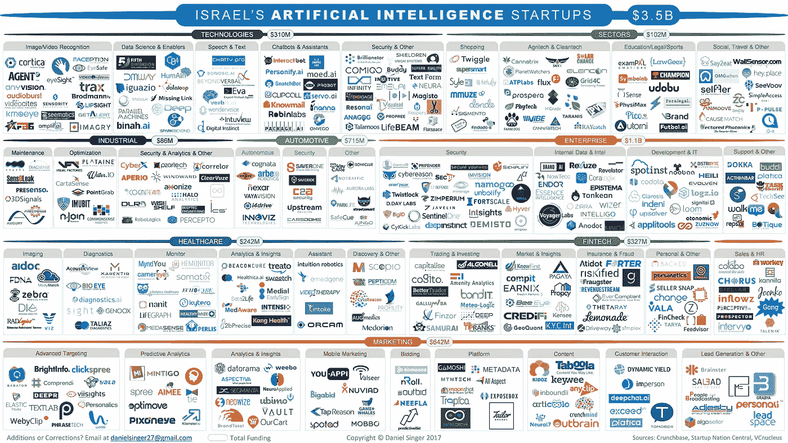

# 以色列的人工智能初创公司

> 原文：<https://medium.com/hackernoon/israels-artificial-intelligence-startups-a4957f92f5ed>

到 2025 年，人工智能产业的价值预计将达到[598 亿美元，人工智能一词已经在世界范围内无处不在；许多技术爱好者的狂热，或者餐桌上讨论的话题。但是宣传实际上名副其实。人工智能初创公司拥有大量风险投资资金，甚至关键的企业领导者也在积极利用这项技术来增加价值和获得竞争优势。](https://www.tractica.com/newsroom/press-releases/artificial-intelligence-software-revenue-to-reach-59-8-billion-worldwide-by-2025/)

受到全世界的敬畏和赞扬——科技巨头[埃隆·马斯克](https://www.inc.com/kevin-j-ryan/elon-musk-artificial-intelligence-world-war-3.html)认为人工智能将成为下一场世界大战的催化剂，人工智能大师[吴恩达](https://m-gadgets-ndtv-com.cdn.ampproject.org/c/m.gadgets.ndtv.com/internet/features/ai-electricity-andrew-ng-google-baidu-coursera-deep-learning-1741698?amp=1&akamai-rum=off)将人工智能比作电力在经济发展中的变革作用——它有望引发一场技术革命。不足为奇的是，以色列处于世界领先地位，是一个驱动引擎。

为了跟踪以色列的人工智能状况，我研究并分析了正在采用人工智能技术的以色列初创公司。下面的信息图显示了超过 430 家以色列初创公司使用人工智能技术作为其产品的核心部分，从早期到晚期的受资助公司。创业公司分为八类:技术、行业、工业、汽车、企业、医疗保健、金融科技和营销，而技术正被用于无数目的。

**见解**

在下面的帖子中，我将深入分析以色列的人工智能创业生态系统。现在，这里是我的发现的十大总结:

1.**对以色列人工智能初创公司的资助正在升温。**2017 年迄今，以色列人工智能初创公司已经筹集了 8.37 亿美元，这已经超过了 2016 年的总额，在过去五年中增长了 15 倍。

2.**自 2014 年**以来，使用人工智能技术的创业公司数量增长了近两倍，根据三年的平均增长率，以色列每年有 95 家新的人工智能创业公司成立。从 2014 年到今天，几乎有 300 家创业公司成立，占以色列所有人工智能创业公司的 60%以上。

3.**自 2014 年以来，大多数新成立的人工智能创业公司都在营销和企业领域**。企业人工智能市场[价值 310 亿美元](https://www.tractica.com/research/artificial-intelligence-for-enterprise-applications/)，每年增长 64%。到 2020 年，预计超过 [40%的新 IT 支出](https://www.enterpriseinnovation.net/article/u-s-banks-spend-us20-billion-digital-transformation-1614022721)将用于人工智能解决方案。去年，一项调查发现 38%的企业已经在使用人工智能，到 2018 年将增长到 62%。

4.**大多数创业公司都是面向企业的** — 85%被归类为 B2B，而 15%是 B2C。

5.**在使用的人工智能技术中，57%使用机器学习技术**，15%使用深度学习[技术](https://hackernoon.com/tagged/learning)，7%使用自然语言处理，4%使用计算机视觉。

6.**迄今为止，以色列人工智能领域最活跃的 10 大投资者是:**微软加速器、以色列首席科学家办公室、JVP、尼尔森创新、OurCrowd、Magma Venture Partners、UpWest Labs、Aleph、Glilot Capital Partners 和 Horizons Ventures。

7.**超过一半的活跃初创公司已经筹集了 50 万美元或更少的总资金**，平均年龄为自成立以来的 2.8 年。

8.**市场营销、企业、医疗保健和金融科技领域是成长型/后期创业公司最集中的领域。**专注于欺诈和保险的[初创公司](https://hackernoon.com/tagged/startup)在金融科技领域占据主导地位，合计占总数的 63%。对于成长阶段的初创公司，企业部门获得了大部分资金(7.6 亿美元)，主要由网络安全初创公司代表。

9.**已经有 10 亿美元的总退出额，平均退出交易规模为 7200 万美元**。根据现有数据，以色列人工智能初创公司的平均退出倍数是其总资金的 8.2 倍，从 2.0 倍到 20.0 倍不等。从创立到退出的时滞平均需要 5.4 年。

10.**一半的退出发生在最近两年**，一半的退出是营销相关的创业公司。苹果、微软和谷歌等企业巨头正在积极竞争吞并人工智能初创公司，并吸引最优秀的人才。

以色列的人工智能领域当然正在发展，甚至在一些学习技术领域处于领先地位。请继续关注每个领域的深度挖掘，以及以下帖子中值得关注的初创公司的简介。

*注:分类过程有时基于个人观点，可能会有错误。该列表并不详尽。*